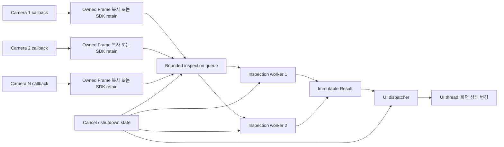

# 다중 카메라 이미지 검사 스레드 설계와 멈춤 진단

> [!summary]
> 카메라 수신, 이미지 검사, UI 갱신은 서로 요구하는 지연 시간과 스레드 규칙이 다르다. 세 단계를 한 스레드나 하나의 공유 버퍼에 묶으면 UI 정지, 프레임 손상, 간헐적 멈춤, 종료 교착이 발생하기 쉽다. 안전한 기본 구조는 **수신 콜백은 짧게**, **프레임은 명시적으로 소유**, **검사는 bounded queue 뒤의 worker에서**, **UI 갱신은 UI dispatcher로**, **취소는 협력적 protocol로** 처리하는 것이다.

## 0. 문서 범위와 기존 문서와의 관계

이 문서는 다음 다섯 질문에 집중한다.

1. 이미지 수신 스레드와 UI 스레드를 왜 분리해야 하는가?
2. 검사 중 UI가 멈추는 직접 원인은 무엇인가?
3. 여러 카메라가 같은 데이터에 접근하면 어떤 문제가 생기는가?
4. 프로그램이 가끔만 멈추고 재현되지 않는 이유는 무엇인가?
5. 실행 중인 검사 작업을 어떻게 안전하게 취소하는가?

일반 개념은 다음 문서에 이미 정리되어 있다.

- [[01.프로세스와 스레드]]: 스레드, 스케줄링, 교착 상태
- [[02.동시성과 병렬성]]: data race, happens-before, 병렬 처리
- [[03.Mutex와 Condition Variable]]: mutex, 조건 변수, 생산자-소비자
- [[05.파일·소켓·비동기 IO와 Buffer]]: 비동기 I/O와 카메라 버퍼 수명
- [[07.비동기 작업 취소와 UI 이미지 처리]]: 비동기 작업, generation, UI dispatcher

따라서 이 문서에서는 개념을 반복하기보다 **다중 카메라 검사 프로그램에서 실제로 어떻게 조합하고 진단하는지**를 다룬다.

> [!warning] PDF 근거의 범위
> 세 PDF는 스레드, 동기화, 생산자-소비자, 교착 상태, 이벤트 기반 처리의 원리를 설명한다. 특정 카메라 제조사의 callback 재진입, buffer retain, acquisition stop, frame requeue 계약은 정의하지 않는다. SDK 관련 수명과 해제 규칙은 반드시 해당 제조사 문서에서 별도로 확인해야 한다.

---

## 1. 권장 전체 구조



각 경계의 의미는 다음과 같다.

| 경계 | 입력 측 책임 | 출력 측 책임 |
|---|---|---|
| SDK callback → owned frame | callback이 유효한 동안 복사 또는 retain | 작업 완료까지 buffer 수명 유지 |
| owned frame → queue | queue가 받을 수 있는지 확인 | FIFO, latest-only, drop 정책 적용 |
| queue → worker | 대기 중 취소·종료를 predicate에 포함 | 긴 계산 중 취소 checkpoint 확인 |
| worker → result | 결과를 불변 값으로 완성 | 부분 결과를 UI와 동시에 수정하지 않음 |
| result → UI dispatcher | UI 객체를 직접 건드리지 않음 | UI thread에서 최신 generation 확인 후 반영 |

이 구조에서 “스레드 분리”는 단순히 `std::thread`를 많이 만드는 것이 아니다. **소유권, 대기, 취소, 전달 방향을 경계마다 정의하는 것**이다.

---

## 2. 이미지 수신 스레드와 UI 스레드를 분리해야 하는 이유

### 2.1 UI thread는 이벤트 루프를 계속 돌려야 한다

대부분의 GUI framework는 하나의 UI thread가 다음 작업을 순서대로 처리한다.

- 마우스와 키보드 입력
- 창 이동·크기 변경
- paint와 animation
- button callback
- timer와 UI message
- 화면 객체의 생성·수정·파괴

UI handler가 카메라 수신이나 이미지 검사에서 오래 머물면 다음 event를 처리하지 못한다. 운영체제가 창에 “응답 없음”을 표시하는 현상은 계산이 틀려서가 아니라 **UI event queue가 제때 소비되지 않기 때문**이다.

```cpp
void MainWindow::onInspectClicked() {
    auto frame = camera.wait_frame(); // blocking I/O
    auto result = inspect(frame);     // 긴 CPU 계산
    resultLabel.setText(result.text); // 여기까지 UI event loop가 정지
}
```

계산을 worker에 넣었더라도 UI에서 즉시 기다리면 동일하게 멈춘다.

```cpp
void MainWindow::onInspectClicked() {
    auto future = std::async(std::launch::async, inspect, current_frame);
    auto result = future.get(); // UI thread가 완료까지 대기하므로 여전히 정지
    show(result);
}
```

핵심은 “다른 스레드를 만들었는가”가 아니라 **UI thread가 기다리지 않고 event loop로 복귀하는가**다.

### 2.2 카메라 callback은 빠르게 반환해야 한다

카메라 SDK의 callback thread는 보통 다음 frame 수신, driver buffer 반환, 내부 acquisition pipeline과 연결된다. callback 안에서 검사나 UI 호출을 오래 수행하면:

- 다음 frame 전달이 지연된다.
- SDK 내부 buffer pool이 고갈될 수 있다.
- frame drop 또는 acquisition timeout이 발생할 수 있다.
- SDK가 내부 lock을 보유한 채 callback을 호출한다면 lock 역전 위험이 커진다.
- UI thread와 동기 호출을 주고받다가 교착 상태가 생길 수 있다.

callback에서 해야 할 일은 보통 다음으로 제한한다.

1. 최소 metadata를 읽는다.
2. SDK buffer 수명 계약에 따라 애플리케이션 소유 메모리로 복사하거나 retain한다.
3. bounded queue에 넣거나 명시적 drop 정책을 적용한다.
4. 즉시 반환한다.

### 2.3 두 스레드는 요구하는 우선순위가 다르다

| 작업 | 중요한 목표 | 오래 걸릴 때의 대응 |
|---|---|---|
| UI | 짧은 응답 지연, 공정한 event 처리 | 작업을 worker로 넘김 |
| 수신 | frame 획득 주기와 buffer 반환 기한 | callback을 짧게 유지 |
| 검사 | 처리량과 정확도 | worker 수, batch, SIMD/GPU 조정 |
| 저장 | 데이터 보존과 순서 | bounded FIFO와 backpressure 사용 |

하나의 스레드에 묶으면 가장 느린 단계가 전체 pipeline을 멈춘다. 분리하면 각 단계의 병목과 실패를 독립적으로 측정할 수 있다.

### 2.4 UI 객체는 UI thread 전용인 경우가 많다

worker가 label, bitmap, window handle을 직접 수정하는 것은 framework의 thread-affinity 계약을 위반할 수 있다. 문제는 즉시 crash로 나타나지 않을 수도 있다. 내부 상태가 우연히 맞을 때는 동작하고, paint·resize·destroy와 겹칠 때만 실패할 수 있다.

```cpp
// worker thread에서 직접 호출하면 위험하다.
imageView.setBitmap(result.bitmap);

// framework가 제공하는 post/invoke/dispatcher를 이용한다.
uiDispatcher.post([result = std::move(result)]() mutable {
    imageView.setBitmap(std::move(result.bitmap));
});
```

`post()`는 비동기 전달이어야 한다. worker가 UI callback의 완료를 기다리는 동기 `invoke()`를 사용하면 UI가 worker를 `join()`하거나 같은 mutex를 기다릴 때 교착 상태가 생길 수 있다.

---

## 3. 검사 중 UI가 멈추는 원인

UI 정지는 한 가지 원인만 있는 증상이 아니다. CPU가 높은지, 낮은지, 특정 mutex에서 기다리는지부터 구분해야 한다.

### 3.1 UI thread에서 긴 계산 수행

가장 직접적인 원인이다.

- convolution, threshold, labeling
- 큰 이미지 format 변환
- CPU와 GPU 사이의 동기 복사
- 압축·해제
- 수천 개 결과를 한 번에 widget에 추가

해결은 계산을 worker로 옮기고 UI에는 표시 가능한 최종 snapshot만 전달하는 것이다.

### 3.2 UI thread의 blocking wait

다음 호출은 UI thread에서 특히 위험하다.

- `thread.join()`
- `future.get()` 또는 `wait()`
- predicate 없는 `condition_variable::wait()`
- timeout 없는 SDK `wait_frame()`
- 동기 파일·네트워크 I/O
- semaphore나 mutex의 무기한 대기

worker 사용 자체가 UI 비동기를 보장하지 않는다. UI가 worker의 완료를 기다리면 실행 위치만 분리되었을 뿐 의존 관계는 동기다.

### 3.3 worker가 UI에 필요한 mutex를 오래 보유

```cpp
std::lock_guard lock(model_mutex);
inspect_large_image(shared_model); // lock을 잡은 채 수백 ms 계산
```

UI가 같은 mutex로 진행률이나 결과를 읽으면 화면이 멈춘다. 공유 상태는 lock 안에서 snapshot으로 복사하고, 계산은 lock 밖에서 한다.

```cpp
ModelSnapshot snapshot;
{
    std::lock_guard lock(model_mutex);
    snapshot = make_snapshot(shared_model);
}
auto result = inspect_large_image(snapshot); // lock 밖
```

### 3.4 worker → UI 동기 호출과 UI → worker 대기의 순환

다음 관계는 전형적인 종료 교착이다.

```text
UI thread:     worker.join() 완료를 기다림
worker thread: UI thread의 synchronous invoke 완료를 기다림
```

두 스레드 모두 상대가 진행해야 깨어나므로 영원히 멈춘다. worker → UI는 비동기 `post`, UI 종료는 먼저 callback 생성을 차단한 뒤 별도 종료 절차로 수행한다.

### 3.5 UI message flood

worker가 frame마다 여러 진행률 event를 보내면 UI queue가 입력 속도를 따라가지 못한다. UI thread가 살아 있어도 클릭과 paint event가 수천 개 progress event 뒤에 밀려 “멈춘 것처럼” 보인다.

대응 방법:

- 진행률은 30~100 ms 간격으로 제한한다.
- 같은 종류 update는 마지막 값만 남긴다.
- preview는 latest-only로 처리한다.
- table/log widget에는 batch로 추가한다.
- queue depth를 metric으로 기록한다.

### 3.6 무한 queue와 메모리 압력

카메라 입력률이 검사 처리율보다 빠른데 모든 frame을 무한히 쌓으면:

- queue latency가 계속 증가한다.
- 대형 buffer allocation과 해제가 반복된다.
- working set이 커져 page fault와 cache miss가 증가한다.
- UI paint와 검사 worker가 memory bandwidth를 경쟁한다.
- 결국 전체 시스템이 멈춘 것처럼 느려질 수 있다.

queue는 반드시 용량이 있어야 하며, 용도별 overflow 정책을 결정해야 한다.

| 용도 | 권장 정책 |
|---|---|
| 실시간 preview | 최신 frame 유지, 오래된 frame drop |
| 모든 제품 검사 기록 | bounded FIFO, 상위 장비에 backpressure 또는 명시적 reject |
| 통계 표시 | 일정 구간 aggregate |
| 디버그 화면 | sampling 또는 rate limit |

### 3.7 종료 handler에서 모든 thread를 즉시 join

창 닫기 handler가 무한 I/O나 긴 검사 중인 thread를 `join()`하면 종료 화면이 멈춘다. 먼저 입력을 차단하고, I/O를 깨우고, 취소를 요청해야 한다. `join()`은 thread가 종료 조건을 관찰할 수 있게 만든 뒤에 수행한다.

---

## 4. 여러 카메라가 같은 데이터에 접근할 때 생기는 문제

### 4.1 data race와 undefined behavior

서로 다른 두 thread가 같은 메모리에 접근하고, 하나 이상이 쓰며, happens-before 관계가 없으면 C++ data race다. 결과가 가끔 틀리는 정도가 아니라 undefined behavior다.

```cpp
struct SharedResult {
    int camera_id;
    std::vector<std::uint8_t> pixels;
};

SharedResult latest;

// camera 1 thread
latest.camera_id = 1;
latest.pixels.assign(cam1_data, cam1_data + size);

// camera 2 thread: 동시에 같은 객체를 변경하면 data race
latest.camera_id = 2;
latest.pixels.assign(cam2_data, cam2_data + size);
```

`std::vector`는 여러 thread가 같은 객체의 크기와 storage를 동시에 변경하도록 보장하지 않는다. reallocation과 읽기가 겹치면 iterator·pointer 무효화와 메모리 손상까지 이어질 수 있다.

### 4.2 data race가 없어도 논리적 race가 남을 수 있다

각 필드 접근에 mutex를 붙였더라도 하나의 논리적 snapshot을 여러 임계 영역으로 나누면 camera ID와 pixel이 서로 다른 frame에서 올 수 있다.

```cpp
set_camera_id(1);       // lock/unlock
set_pixels(cam1_frame); // lock/unlock 사이에 camera 2가 끼어들 수 있음
```

하나의 결과를 완성한 뒤 한 번에 교체한다.

```cpp
Frame complete{camera_id, frame_id, owned_pixels};
{
    std::lock_guard lock(latest_mutex);
    latest = std::move(complete);
}
```

더 좋은 방법은 mutable “현재 작업 중 frame”을 공유하지 않고, queue가 **완성된 값 객체의 소유권을 이동**하도록 만드는 것이다.

### 4.3 같은 SDK buffer의 재사용

callback이 받은 raw pointer를 그대로 queue에 저장하면 callback 반환 뒤 SDK가 그 buffer를 다음 frame에 재사용할 수 있다.

```text
camera callback: pointer P를 frame 100으로 전달
callback return
SDK:             P에 frame 101을 덮어씀
inspection:      P를 frame 100이라고 믿고 읽음
```

결과는 찢어진 이미지, camera 간 frame 혼합, 간헐적 검사 오판, use-after-free 형태로 나타난다.

안전한 선택은 둘 중 하나다.

1. callback 안에서 애플리케이션 소유 buffer로 복사한다.
2. SDK의 공식 retain/lock/requeue 기능으로 buffer를 보유하고 전용 deleter를 RAII에 넣는다.

SDK 계약을 모르는 상태에서 raw pointer를 비동기 worker에 넘기는 것은 안전하다고 판단할 수 없다.

### 4.4 전역 설정의 동시 변경

검사 중 threshold, ROI, calibration을 UI가 수정하면 한 frame 안에서도 서로 다른 설정이 섞일 수 있다. 설정은 작업 시작 시 immutable snapshot으로 만든다.

```cpp
auto config = std::make_shared<const InspectionConfig>(ui_config);
queue.push(Job{frame, config});
```

작업은 전달받은 `const` snapshot만 읽고, UI의 이후 변경은 다음 작업부터 적용한다.

### 4.5 ABBA 교착 상태

카메라별 mutex와 공용 결과 mutex를 반대 순서로 얻으면 교착 상태가 가능하다.

```text
camera 1 thread: camera1_mutex 획득 → result_mutex 대기
UI thread:       result_mutex 획득  → camera1_mutex 대기
```

대응:

- 여러 lock이 필요한 구조 자체를 줄인다.
- 반드시 전역 lock 순서를 문서화한다.
- 함께 필요한 lock은 `std::scoped_lock(m1, m2)`로 획득한다.
- 외부 SDK 함수나 UI callback을 lock 안에서 호출하지 않는다.
- lock을 보유한 채 `join`, `wait`, blocking I/O를 호출하지 않는다.

### 4.6 contention과 false sharing

정확성 문제가 없어도 모든 camera thread가 하나의 mutex, allocator, log sink, 결과 map을 경쟁하면 지연이 급증한다. 카메라별 독립 상태를 분리하고, 공용 aggregation은 완성된 결과만 받도록 한다.

자주 갱신되는 카메라별 counter가 같은 cache line에 붙어 있으면 false sharing이 생길 수 있다. 먼저 profiler로 확인하고 필요할 때 `alignas(std::hardware_destructive_interference_size)` 같은 분리를 검토한다. 정렬은 정확성 해결책이 아니라 성능 조정이다.

### 4.7 권장 데이터 소유 구조

```cpp
struct Frame {
    int camera_id{};
    std::uint64_t frame_id{};
    std::uint64_t generation{};
    std::chrono::steady_clock::time_point received_at;
    std::vector<std::uint8_t> pixels; // 이 frame이 독점 소유
};

struct InspectionResult {
    int camera_id{};
    std::uint64_t frame_id{};
    std::uint64_t generation{};
    bool pass{};
    double score{};
};
```

- 수신 callback은 `Frame`을 완성한다.
- queue로 `std::move(frame)`한다.
- worker는 자신의 frame만 읽는다.
- 결과는 별도의 값으로 완성한다.
- UI는 결과를 받은 뒤 화면 모델을 갱신한다.

공유 mutable buffer를 여러 단계가 돌려 쓰는 것보다 메모리 사용량은 명시적으로 보이지만, 정확성과 수명 검증은 훨씬 쉬워진다.

---

## 5. 프로그램이 가끔 멈추지만 재현되지 않는 이유

### 5.1 스케줄링 순서는 실행마다 달라진다

OS scheduler는 thread 실행 시점과 선점을 매번 동일하게 보장하지 않는다. 다음 요소가 작은 timing 차이를 만든다.

- CPU 부하와 core 배치
- camera frame 도착 간격
- cache hit/miss와 page fault
- 디버거와 log 출력
- compiler 최적화
- background process와 interrupt
- 네트워크·디스크·USB 지연

오류가 특정 수 마이크로초의 interleaving에서만 나타나면 수백 번 정상 실행한 뒤 한 번 멈출 수 있다.

### 5.2 디버깅을 시작하면 사라지는 Heisenbug

log, breakpoint, debugger는 실행 순서를 바꾼다.

- `printf` 자체가 내부 lock과 I/O를 사용한다.
- breakpoint는 다른 thread가 먼저 끝날 시간을 준다.
- Debug build는 최적화와 메모리 배치가 다르다.
- 관찰 코드가 race window를 넓히거나 줄인다.

따라서 “debugger에서 재현되지 않는다”는 동시성 문제가 아니라는 증거가 아니다.

### 5.3 멈춤 증상의 분류

| 분류 | 의미 | CPU 경향 | 대표 원인 |
|---|---|---:|---|
| deadlock | 서로 필요한 자원을 기다림 | 낮음 | ABBA lock, UI↔worker 동기 대기 |
| lost wake-up/잘못된 predicate | 상태는 변했지만 waiter가 진행하지 못함 | 낮음 | 상태와 CV를 다른 규칙으로 보호 |
| 무한 blocking I/O | 외부 event가 오지 않아 대기 | 낮음 | timeout 없는 SDK wait |
| livelock | 서로 양보·재시도하며 상태만 바꿈 | 높을 수 있음 | `try_lock` 재시도 protocol |
| starvation | 특정 thread가 자원을 계속 못 얻음 | 혼합 | lock 경쟁, 불공정 queue |
| busy loop | 종료 조건을 관찰하지 못하고 반복 | 높음 | atomic/predicate 오류 |
| data race/UB | 메모리 모델 위반으로 결과 불명 | 다양 | shared vector, non-atomic stop flag |
| overload | 입력률이 처리율보다 높음 | 높음 | unbounded queue, UI message flood |

### 5.4 condition variable 사용 오류

조건 변수는 event 저장소가 아니다. **공유 상태가 진실이고 notification은 다시 확인하라는 신호**다.

```cpp
std::unique_lock lock(mutex);
cv.wait(lock, [&] {
    return !queue.empty() || stopping;
});
```

predicate를 `while` 의미로 재검사해야 하는 이유:

- spurious wake-up이 가능하다.
- notify 뒤 mutex를 다시 얻기 전에 다른 thread가 상태를 바꿀 수 있다.
- 여러 waiter 중 다른 waiter가 먼저 데이터를 소비할 수 있다.
- 종료도 정상적인 wake 조건에 포함해야 한다.

상태는 mutex 안에서 바꾸고, waiter가 같은 mutex와 같은 predicate로 확인해야 한다.

### 5.5 종료 flag의 data race

```cpp
bool stop = false;

// UI thread
stop = true;

// worker thread
while (!stop) { /* ... */ } // 동기화가 없으면 data race
```

`volatile`로 바꾸어도 thread 동기화가 되지 않는다. 단일 독립 flag라면 `std::atomic_bool`, queue 상태와 함께 불변식을 구성한다면 같은 mutex로 보호한다. C++20에서는 `std::jthread`와 `std::stop_token`도 사용할 수 있다.

### 5.6 callback 재진입과 객체 파괴 경쟁

종료 중 camera 객체를 파괴하는데 SDK callback이 이미 진입했거나 곧 호출될 수 있다면 callback의 `this`, UI 객체, buffer pool이 먼저 사라질 수 있다. 정상 운전에서는 드물고 창을 닫는 순간에만 나타나므로 재현이 어렵다.

종료 protocol은 다음을 명시해야 한다.

- 새 callback 진입을 SDK 수준에서 어떻게 막는가?
- 이미 실행 중인 callback이 반환했음을 어떻게 확인하는가?
- callback이 참조하는 context는 언제까지 살아 있는가?
- SDK buffer가 모두 반납되었음을 어떻게 확인하는가?

### 5.7 재현보다 먼저 관측 가능성을 만든다

모든 event에 다음 correlation 정보를 기록한다.

```text
monotonic_time
thread_id
camera_id
frame_id
generation
event_name
queue_depth
wait_duration_us
processing_duration_us
result_state
```

권장 event:

- `callback_enter`, `callback_exit`
- `frame_owned`, `enqueue_ok`, `enqueue_drop`
- `dequeue`, `inspect_begin`, `cancel_seen`, `inspect_end`
- `ui_post`, `ui_commit`, `stale_drop`
- `stop_acquisition_begin/end`
- `queue_close`, `worker_exit`, `join_begin/end`

wall clock은 시간이 보정될 수 있으므로 구간 측정에는 `std::chrono::steady_clock`을 사용한다.

> [!tip]
> 멈춘 순간의 “마지막 log 한 줄”만으로 원인을 확정하지 않는다. 그 thread가 다음에 어떤 mutex, I/O, condition variable, UI 호출을 기다렸는지 wait chain과 thread stack을 함께 확보해야 한다.

---

## 6. 검사 작업을 안전하게 취소하는 방법

### 6.1 취소 요청과 취소 완료는 다르다

`cancel_requested = true`는 worker에게 요청을 전달했을 뿐이다. worker가 그 상태를 관찰하고, 부분 작업을 버리고, buffer와 임시 자원을 정리해 작업 loop를 빠져나와야 취소가 완료된다.

```text
Running → CancelRequested → cleanup → Cancelled
```

다음과 같이 상태를 구분하면 종료와 UI 처리가 명확해진다.

```text
Queued | Running | Succeeded | Failed | Cancelled
```

### 6.2 강제 thread 종료가 위험한 이유

임의 지점에서 thread를 죽이면 다음 상태가 남을 수 있다.

- mutex를 획득한 채 종료
- SDK buffer 미반납
- 파일·GPU·카메라 handle 누수
- 결과 객체가 반만 갱신된 상태
- allocator 또는 library 내부 불변식 손상

안전한 기본값은 **협력적 취소**다. 작업이 안전한 checkpoint에서 중지 요청을 확인한다.

### 6.3 취소 checkpoint 위치

```cpp
for (std::size_t y = 0; y < height; ++y) {
    if (stop.stop_requested() || generation != latest_generation.load()) {
        return Cancelled{};
    }
    process_row(y);
}
```

checkpoint 간격은 취소 지연과 검사 성능의 절충이다. 한 단계가 2초 걸리는데 단계 끝에서만 확인하면 최악의 취소 지연도 약 2초다. 요구되는 취소 latency를 정한 뒤 tile·row·batch 경계에 배치한다.

### 6.4 queued 작업과 running 작업을 따로 처리

- queued: queue에서 제거하거나 취소된 generation으로 남겨 worker가 즉시 폐기한다.
- running: token/generation을 checkpoint에서 관찰한다.
- completed but not displayed: UI commit 직전 generation을 다시 확인한다.
- blocking SDK I/O: SDK 취소 API, timeout, handle close 등 별도 해제 수단이 필요하다.

취소 flag만으로는 이미 UI queue에 들어간 오래된 결과를 막지 못한다. 결과에 generation을 넣고 UI 적용 직전에 최신 generation과 비교한다.

### 6.5 frame 소유권은 취소 완료까지 유지한다

취소 요청 직후 입력 buffer를 해제하면 worker가 아직 읽는 중일 수 있다. frame을 작업 값이 소유하게 하고 worker가 반환할 때 RAII로 해제되게 한다.

```cpp
struct Job {
    std::uint64_t generation;
    std::shared_ptr<const Frame> frame;
};
```

`shared_ptr`가 무조건 정답이라는 뜻은 아니다. queue에서 worker 하나로 소유권이 이동한다면 `unique_ptr<Frame>`이나 값 이동이 더 명확하다. 여러 비동기 단계가 같은 immutable frame을 실제로 공유할 때만 `shared_ptr<const Frame>`을 사용한다.

### 6.6 취소 중 새 작업 정책

업무 의미에 따라 정한다.

| 시나리오 | 정책 |
|---|---|
| 화면 preview | 이전 generation 취소, 최신 frame만 유지 |
| 제품별 필수 검사 | 임의 drop 금지, bounded FIFO와 설비 backpressure |
| 사용자가 검사 recipe 변경 | 이전 generation 결과 폐기, 새 config snapshot 사용 |
| 프로그램 종료 | 새 입력 금지, source 중지, running 취소 또는 drain |

### 6.7 안전한 종료 순서

일반적인 순서는 다음과 같다.

1. `accepting = false`: 새 검사 요청을 받지 않는다.
2. 카메라 acquisition을 중지해 새 callback 생성을 막는다.
3. 실행 중 callback이 모두 반환했는지 SDK 계약으로 확인한다.
4. 최신 generation을 증가시키고 queued 작업을 폐기하거나 drain 정책을 적용한다.
5. 검사 worker에 stop을 요청한다.
6. condition variable과 blocking I/O를 깨운다.
7. 수신 thread와 검사 worker를 `join()`한다.
8. UI에 대기 중인 stale callback이 결과를 반영하지 못하게 delivery state를 무효화한다.
9. frame/buffer를 반환하고 카메라·GPU·파일 자원을 파괴한다.
10. 마지막으로 관련 UI 객체를 파괴한다.

“검사 thread를 카메라보다 먼저 없앨 것인가?”라는 질문은 **카메라 객체 파괴**와 **acquisition 중지**를 구분해야 한다.

- 새 frame 생산은 먼저 중지한다.
- 생산자가 더 이상 queue에 넣지 않음을 확인한다.
- 그 다음 소비자인 검사 worker를 drain하거나 취소해 종료한다.
- SDK buffer를 worker가 참조한다면 모든 worker가 반납한 뒤 camera handle/buffer pool을 파괴한다.

---

## 7. C++20 통합 예제

다음 예제는 framework와 SDK에 독립적인 핵심 구조다.

- camera callback은 SDK buffer를 즉시 소유 복사한다.
- bounded queue가 과부하를 제한한다.
- 여러 worker는 immutable frame을 처리한다.
- generation으로 실행 중 작업과 늦게 도착한 UI 결과를 취소한다.
- UI 객체 대신 thread-safe dispatcher에 callback을 전달한다.
- 종료는 새 입력 차단 → queue close → stop request → join 순서다.

```cpp
#include <algorithm>
#include <atomic>
#include <chrono>
#include <condition_variable>
#include <cstddef>
#include <cstdint>
#include <deque>
#include <functional>
#include <iostream>
#include <memory>
#include <mutex>
#include <optional>
#include <span>
#include <stop_token>
#include <thread>
#include <utility>
#include <vector>

using namespace std::chrono_literals;

struct Frame {
    int camera_id{};
    std::uint64_t frame_id{};
    std::uint64_t generation{};
    std::chrono::steady_clock::time_point received_at;
    std::vector<std::uint8_t> pixels;
};

struct InspectionResult {
    int camera_id{};
    std::uint64_t frame_id{};
    std::uint64_t generation{};
    std::uint64_t checksum{};
};

template <class T>
class BoundedQueue {
public:
    explicit BoundedQueue(std::size_t capacity) : capacity_(capacity) {}

    bool try_push(T value) {
        {
            std::lock_guard lock(mutex_);
            if (closed_ || queue_.size() >= capacity_) {
                return false;
            }
            queue_.push_back(std::move(value));
        }
        ready_.notify_one();
        return true;
    }

    std::optional<T> pop(std::stop_token stop) {
        std::unique_lock lock(mutex_);
        const bool awakened = ready_.wait(lock, stop, [this] {
            return closed_ || !queue_.empty();
        });

        if (!awakened || queue_.empty()) {
            return std::nullopt;
        }

        T value = std::move(queue_.front());
        queue_.pop_front();
        return value;
    }

    void discard_pending() {
        std::lock_guard lock(mutex_);
        queue_.clear();
    }

    void close(bool discard) {
        {
            std::lock_guard lock(mutex_);
            closed_ = true;
            if (discard) {
                queue_.clear();
            }
        }
        ready_.notify_all();
    }

private:
    const std::size_t capacity_;
    std::mutex mutex_;
    std::condition_variable_any ready_;
    std::deque<T> queue_;
    bool closed_{false};
};

class UiDispatcher {
public:
    virtual ~UiDispatcher() = default;
    virtual void post(std::function<void()> callback) = 0;
};

struct DeliveryState {
    std::atomic_bool alive{true};
    std::atomic_uint64_t latest_generation{1};
};

class InspectionPipeline {
public:
    using ResultHandler = std::function<void(InspectionResult)>;

    InspectionPipeline(
        UiDispatcher& ui,
        ResultHandler on_result,
        std::size_t worker_count,
        std::size_t queue_capacity)
        : ui_(ui),
          on_result_(std::move(on_result)),
          queue_(queue_capacity),
          delivery_(std::make_shared<DeliveryState>()) {
        workers_.reserve(worker_count);
        for (std::size_t i = 0; i < worker_count; ++i) {
            workers_.emplace_back([this](std::stop_token stop) {
                worker_loop(stop);
            });
        }
    }

    InspectionPipeline(const InspectionPipeline&) = delete;
    InspectionPipeline& operator=(const InspectionPipeline&) = delete;

    ~InspectionPipeline() {
        stop();
    }

    // SDK callback thread에서 호출한다.
    bool on_sdk_frame(
        int camera_id,
        std::uint64_t frame_id,
        std::span<const std::uint8_t> sdk_buffer) {
        if (!accepting_.load(std::memory_order_acquire)) {
            return false;
        }

        Frame frame;
        frame.camera_id = camera_id;
        frame.frame_id = frame_id;
        frame.generation =
            delivery_->latest_generation.load(std::memory_order_acquire);
        frame.received_at = std::chrono::steady_clock::now();

        // callback 반환 뒤에도 유효하도록 애플리케이션이 소유한다.
        frame.pixels.assign(sdk_buffer.begin(), sdk_buffer.end());

        // cancel과 경쟁해 stale frame이 들어가도 worker가 generation으로 폐기한다.
        return queue_.try_push(std::move(frame));
    }

    // UI thread에서 호출해도 대기하지 않고 즉시 반환한다.
    void cancel_current() {
        delivery_->latest_generation.fetch_add(1, std::memory_order_acq_rel);
        queue_.discard_pending();
    }

    // 실제 시스템에서는 이 함수를 부르기 전에 SDK acquisition을 중지하고
    // 실행 중 callback이 모두 반환했음을 확인해야 한다.
    void stop() {
        bool expected = false;
        if (!stopped_.compare_exchange_strong(expected, true)) {
            return;
        }

        accepting_.store(false, std::memory_order_release);
        delivery_->latest_generation.fetch_add(1, std::memory_order_acq_rel);
        delivery_->alive.store(false, std::memory_order_release);
        queue_.close(true);

        for (auto& worker : workers_) {
            worker.request_stop();
        }
        for (auto& worker : workers_) {
            if (worker.joinable()) {
                worker.join();
            }
        }
    }

private:
    std::optional<InspectionResult> inspect(
        const Frame& frame,
        std::stop_token stop) const {
        std::uint64_t checksum = 0;

        constexpr std::size_t batch = 256;
        for (std::size_t begin = 0; begin < frame.pixels.size(); begin += batch) {
            if (stop.stop_requested() ||
                frame.generation !=
                    delivery_->latest_generation.load(std::memory_order_acquire)) {
                return std::nullopt;
            }

            const auto end = (std::min)(begin + batch, frame.pixels.size());
            for (std::size_t i = begin; i < end; ++i) {
                checksum += frame.pixels[i];
            }
        }

        return InspectionResult{
            frame.camera_id,
            frame.frame_id,
            frame.generation,
            checksum};
    }

    void worker_loop(std::stop_token stop) {
        while (!stop.stop_requested()) {
            auto frame = queue_.pop(stop);
            if (!frame) {
                return;
            }

            auto result = inspect(*frame, stop);
            if (!result) {
                continue;
            }

            auto delivery = delivery_;
            auto handler = on_result_;
            ui_.post([delivery,
                      handler = std::move(handler),
                      result = std::move(*result)]() mutable {
                if (!delivery->alive.load(std::memory_order_acquire)) {
                    return;
                }
                if (result.generation !=
                    delivery->latest_generation.load(std::memory_order_acquire)) {
                    return;
                }
                handler(std::move(result)); // UI thread에서 실행
            });
        }
    }

    UiDispatcher& ui_;
    ResultHandler on_result_;
    BoundedQueue<Frame> queue_;
    std::shared_ptr<DeliveryState> delivery_;
    std::vector<std::jthread> workers_;
    std::atomic_bool accepting_{true};
    std::atomic_bool stopped_{false};
};

// 실제 GUI의 post/invokeLater에 해당하는 작은 test dispatcher다.
class TestUiDispatcher final : public UiDispatcher {
public:
    void post(std::function<void()> callback) override {
        std::lock_guard lock(mutex_);
        callbacks_.push_back(std::move(callback));
    }

    void drain_on_ui_thread() {
        std::deque<std::function<void()>> local;
        {
            std::lock_guard lock(mutex_);
            local.swap(callbacks_);
        }
        for (auto& callback : local) {
            callback();
        }
    }

    std::size_t pending_count() const {
        std::lock_guard lock(mutex_);
        return callbacks_.size();
    }

private:
    mutable std::mutex mutex_;
    std::deque<std::function<void()>> callbacks_;
};

int main() {
    TestUiDispatcher ui;
    std::atomic_int committed{0};

    InspectionPipeline pipeline(
        ui,
        [&](InspectionResult result) {
            std::cout << "camera=" << result.camera_id
                      << " frame=" << result.frame_id
                      << " checksum=" << result.checksum << '\n';
            ++committed;
        },
        2,
        8);

    const std::vector<std::uint8_t> camera1(4096, 1);
    const std::vector<std::uint8_t> camera2(4096, 2);

    pipeline.on_sdk_frame(1, 100, camera1);
    pipeline.on_sdk_frame(2, 200, camera2);

    const auto first_deadline = std::chrono::steady_clock::now() + 2s;
    while (committed.load() < 2 &&
           std::chrono::steady_clock::now() < first_deadline) {
        ui.drain_on_ui_thread();
        std::this_thread::sleep_for(1ms);
    }
    if (committed.load() != 2) {
        return 1;
    }

    // 결과가 UI queue에 들어간 뒤 cancel해도 commit 직전 검사가 폐기한다.
    pipeline.on_sdk_frame(1, 101, camera1);
    const auto stale_deadline = std::chrono::steady_clock::now() + 2s;
    while (ui.pending_count() == 0 &&
           std::chrono::steady_clock::now() < stale_deadline) {
        std::this_thread::sleep_for(1ms);
    }
    if (ui.pending_count() == 0) {
        return 2;
    }
    pipeline.cancel_current();
    ui.drain_on_ui_thread();
    if (committed.load() != 2) {
        return 3;
    }

    pipeline.stop();
    ui.drain_on_ui_thread(); // stop 이전에 post된 stale callback도 폐기

    return committed.load() == 2 ? 0 : 4;
}
```

### 7.1 예제에서 보장하는 것

| 위험 | 대응 |
|---|---|
| SDK buffer 재사용 | callback 안에서 `vector`로 소유 복사 |
| 여러 camera의 shared buffer race | frame마다 독립된 값 객체 |
| queue 과부하 | `try_push`와 고정 capacity |
| wait 중 종료 불가 | `stop_token`, `close`, `notify_all` |
| 실행 중 취소 지연 | 256 byte batch checkpoint |
| 취소 후 늦은 결과 표시 | UI commit 직전 generation 재검사 |
| 파괴된 controller 캡처 | UI callback은 `DeliveryState`만 공유 |
| UI 직접 접근 | dispatcher를 통해 UI thread에서 handler 실행 |

### 7.2 예제를 제품 코드로 옮길 때 추가할 것

- SDK 전용 acquisition stop과 callback 완료 barrier
- camera별 drop counter와 queue latency metric
- frame size·stride·pixel format 검증
- exception boundary와 실패 결과 전달
- 검사 설정의 immutable snapshot
- preview와 필수 검사 queue 분리
- 메모리 pool 또는 SDK retain 기반 zero-copy 검토
- framework 객체의 weak reference 또는 lifetime token
- shutdown timeout과 thread stack dump 수집

`TestUiDispatcher`의 `sleep_for`는 제품 동기화 방식이 아니다. 테스트 예제를 짧게 유지하기 위한 시간 여유일 뿐이며, 실제 테스트에서는 latch, promise, event, predicate를 사용해 완료 조건을 기다려야 한다.

---

## 8. 멈춤을 진단하는 실전 절차

### 8.1 1단계: 정지인지 과부하인지 구분

1. UI heartbeat가 계속 증가하는가?
2. process CPU 사용률은 높은가 낮은가?
3. queue depth가 계속 증가하는가?
4. camera callback rate와 inspection completion rate는 얼마인가?
5. UI message queue 또는 dispatcher backlog가 증가하는가?

CPU가 낮고 모든 counter가 멈췄다면 wait/deadlock 가능성이 높다. CPU가 높고 queue depth가 증가한다면 overload나 busy loop를 먼저 본다.

### 8.2 2단계: 멈춘 순간의 모든 thread stack 수집

한 thread만 보지 말고 다음 관계를 찾는다.

- UI가 어떤 lock, join, future, SDK call을 기다리는가?
- 해당 자원을 가진 worker는 무엇을 기다리는가?
- callback thread가 UI 또는 공용 mutex를 기다리는가?
- 모든 worker가 같은 CV에서 자는데 queue에는 데이터가 있는가?
- SDK 내부 wait에서 timeout 없이 멈춰 있는가?

wait-for graph를 그리면 순환 대기가 보인다.

```text
UI → worker join → UI synchronous invoke
```

또는:

```text
camera callback → result mutex → UI model mutex → camera stop
```

### 8.3 3단계: 시간과 queue를 수치로 확인

권장 metric:

- callback p50/p95/p99 duration
- enqueue 성공·drop 수
- queue depth와 oldest job age
- 검사 p50/p95/p99 duration
- cancellation latency
- UI post-to-commit latency
- lock wait/hold duration
- acquisition stop-to-last-callback duration

평균만 보면 드문 tail latency를 놓친다. “가끔 멈춤”은 p99 또는 최대값에서 드러나는 경우가 많다.

### 8.4 4단계: 동시성 검사 도구 사용

- ThreadSanitizer: data race 탐지에 유용
- AddressSanitizer: use-after-free, buffer overflow
- debugger wait chain/thread view: deadlock과 blocking 위치
- profiler/trace: CPU hot path, lock contention, queue latency
- 반복·부하·종료 stress test: timing window 확대

ThreadSanitizer가 조용하다고 논리적 race, 교착 상태, SDK 계약 위반이 없다는 뜻은 아니다. 각 도구가 찾는 오류 범위를 구분한다.

### 8.5 재현 가능성을 높이는 stress 조건

- 여러 camera를 동일 시점에 시작·중지
- frame rate를 처리량보다 높게 설정
- 검사 중 recipe를 빠르게 교체
- 창 닫기와 acquisition callback을 반복 경쟁
- queue capacity를 작게 설정
- worker 수를 1, 2, core 수 이상으로 변경
- cancellation checkpoint 직전·직후에 test hook 삽입
- SDK buffer pool 크기를 최소 허용값으로 낮춤

임의 `sleep`만 추가하면 운 좋게 race를 숨길 수 있다. test hook, barrier, latch로 원하는 실행 순서를 강제로 구성하는 편이 낫다.

---

## 9. 반드시 테스트할 시나리오

### 9.1 수신과 소유권

- callback 반환 직후 SDK buffer 내용을 바꿔도 검사 frame은 변하지 않는가?
- camera 1과 camera 2가 동시에 callback해도 frame metadata가 섞이지 않는가?
- queue full일 때 drop/reject 정책이 명확하게 기록되는가?
- 잘못된 stride, size, format을 queue 전에 거부하는가?

### 9.2 UI responsiveness

- 최대 크기 이미지 처리 중 UI heartbeat p99가 요구 범위 안인가?
- worker가 결과를 초당 수천 건 post해도 coalescing이 동작하는가?
- UI thread에서 `join`, `future.get`, SDK wait가 호출되지 않는가?
- UI 객체 파괴 후 callback이 실행되어도 접근하지 않는가?

### 9.3 취소

- queued frame이 즉시 폐기되는가?
- running 검사가 정해진 latency 안에 checkpoint를 관찰하는가?
- 취소 직전 완료된 결과가 UI queue에 있어도 stale로 폐기되는가?
- 취소가 failure dialog나 error log 폭주로 처리되지 않는가?
- 취소 중 frame buffer가 너무 일찍 해제되지 않는가?

### 9.4 종료

- acquisition stop과 callback 진입이 경쟁해도 안전한가?
- worker가 CV, semaphore, SDK wait 중이어도 종료 가능한가?
- queue empty, full, 처리 중 각각에서 종료 가능한가?
- 여러 번 `stop()`해도 안전한가?
- 종료 시 모든 callback, worker, UI post의 순서를 trace로 확인할 수 있는가?

### 9.5 반복 검증

- 동일 시나리오를 수천 회 반복한다.
- Debug와 최적화 Release를 모두 실행한다.
- worker 수와 camera 수 조합을 바꾼다.
- AddressSanitizer와 ThreadSanitizer 계열 검사를 별도 구성으로 실행한다.
- timeout은 성공 조건이 아니라 test process가 영원히 멈추는 것을 막는 상한으로 사용한다.

---

## 10. 자주 하는 잘못된 해결

### 10.1 모든 곳에 하나의 전역 mutex 사용

data race 일부는 사라질 수 있지만 UI, callback, worker가 하나의 lock을 경쟁한다. lock 안에서 검사나 SDK 호출을 하면 정지와 교착 가능성이 커진다. 데이터 소유권을 분리하고 임계 영역을 작게 만든다.

### 10.2 `volatile bool stop`

`volatile`은 멀티스레드 원자성과 happens-before를 제공하지 않는다. `atomic`, mutex-protected state, `stop_token`을 사용한다.

### 10.3 thread를 강제 종료

lock, buffer, handle, 부분 결과의 정리 시점을 잃는다. 취소 가능한 I/O와 협력적 checkpoint를 설계한다.

### 10.4 camera callback에서 UI를 동기 호출

SDK 내부 lock과 UI 종료가 결합될 수 있다. callback은 소유권 확보와 enqueue만 하고 반환한다.

### 10.5 raw SDK pointer를 queue에 저장

포인터를 받았다는 사실은 소유권을 뜻하지 않는다. 복사하거나 공식 retain 계약을 RAII로 감싼다.

### 10.6 queue를 무한히 키움

drop을 피한 것이 아니라 실패 시점을 메모리 고갈까지 미룬 것이다. 용량과 overflow 정책을 명시한다.

### 10.7 취소 flag만 확인하고 UI 결과는 무조건 반영

검사가 취소 요청과 거의 동시에 끝나 UI queue에 결과를 넣을 수 있다. UI commit 시 generation과 lifetime을 다시 검사한다.

### 10.8 로그가 없으니 deadlock이라고 단정

무한 I/O, lost notification, overload, memory corruption도 비슷하게 보인다. 모든 thread stack, queue metric, wait chain으로 분류한다.

---

## 11. 설계 점검표

### 스레드 경계

- [ ] camera callback은 검사와 UI 호출을 수행하지 않는가?
- [ ] UI thread는 blocking wait를 수행하지 않는가?
- [ ] worker → UI 전달은 비동기 post인가?
- [ ] UI 객체는 UI thread에서만 변경하는가?

### 데이터와 버퍼

- [ ] frame마다 camera ID, frame ID, generation이 함께 이동하는가?
- [ ] SDK buffer의 유효 기간과 반납 함수가 문서로 확인되었는가?
- [ ] callback 이후 사용할 frame은 소유 복사 또는 retain되는가?
- [ ] 여러 camera가 같은 mutable `vector`나 bitmap을 공유하지 않는가?
- [ ] 검사 설정은 immutable snapshot인가?

### 동기화

- [ ] 모든 shared mutable state에 하나의 일관된 동기화 규칙이 있는가?
- [ ] 조건 변수 predicate에 queue data와 stop 상태가 함께 포함되는가?
- [ ] 여러 lock의 순서가 통일되어 있는가?
- [ ] lock 안에서 SDK, UI, join, blocking I/O를 호출하지 않는가?
- [ ] 긴 계산은 lock 밖에서 수행하는가?

### 부하 제어

- [ ] queue capacity가 제한되어 있는가?
- [ ] preview drop과 필수 검사 backpressure를 구분하는가?
- [ ] UI progress/result update가 rate limit 또는 coalesce되는가?
- [ ] queue depth와 oldest job age를 관측하는가?

### 취소와 종료

- [ ] 취소 요청과 취소 완료를 구분하는가?
- [ ] queued, running, UI-posted 작업을 각각 처리하는가?
- [ ] 긴 검사 단계에 취소 checkpoint가 있는가?
- [ ] blocking SDK I/O를 깨울 수 있는가?
- [ ] 새 callback 차단 → callback 종료 → worker 종료 → 자원 파괴 순서인가?
- [ ] camera handle은 SDK buffer 사용이 모두 끝난 뒤 파괴하는가?

### 진단

- [ ] monotonic timestamp, thread ID, camera/frame/generation을 기록하는가?
- [ ] 멈춤 시 모든 thread stack과 wait chain을 수집할 수 있는가?
- [ ] p95/p99 UI latency와 cancellation latency를 측정하는가?
- [ ] 반복·부하·종료 stress test가 있는가?

---

## 12. 핵심 결론

1. UI thread는 event loop를 돌려야 하므로 카메라 수신·검사·동기 대기를 맡기면 안 된다.
2. camera callback은 buffer 소유권을 확보해 bounded queue로 넘기고 빠르게 반환해야 한다.
3. 여러 camera는 완성된 독립 frame 값을 전달해야 하며 하나의 mutable buffer를 공유하지 않는다.
4. mutex로 data race를 없애도 여러 단계의 논리적 race, lock 역전, stale result는 별도로 해결해야 한다.
5. 가끔 멈추는 이유는 scheduler와 외부 I/O가 오류가 발생하는 interleaving을 매번 다르게 만들기 때문이다.
6. 재현이 어렵다면 log를 늘리는 것만으로 끝내지 말고 thread stack, wait chain, queue depth, tail latency를 확보한다.
7. 안전한 취소는 강제 종료가 아니라 checkpoint, buffer 수명, 결과 폐기까지 포함하는 협력적 protocol이다.
8. UI에 결과를 반영하는 마지막 순간에 lifetime과 generation을 다시 확인한다.
9. 종료할 때는 생산을 먼저 멈추고 callback 종료를 확인한 뒤 소비자를 drain/cancel하고 자원을 파괴한다.
10. camera SDK의 buffer retain·반납·callback 종료 계약은 일반 C++ 원칙만으로 추론하지 말고 제조사 문서로 확정한다.

---

## 13. 작성 후 검증 기록

### 13.1 Markdown과 C++ 검증 항목

- 요청한 다섯 주제가 각각 독립된 절과 통합 예제에 포함되었는지 확인한다.
- 코드 fence, 내부 링크, UTF-8 문자, 미완성 표시를 검사한다.
- C++20 예제를 warning 수준을 높여 컴파일한다.
- 여러 camera frame 제출·UI 전달·취소·종료를 반복 실행한다.

### 13.2 PDF 1차 대조

| 문서 내용 | PDF에서 확인한 근거 | 적용 범위 |
|---|---|---|
| 실행마다 thread 순서가 달라 race가 간헐적으로 드러남 | `cpp.pdf` 물리 744~748쪽 | 직접 근거 |
| mutex 임계 영역과 unlock 누락 시 진행 정지 | `cpp.pdf` 물리 749~753쪽 | 직접 근거 |
| 여러 lock은 정해진 순서로 획득 | `cpp.pdf` 물리 754~759쪽 | 직접 근거 |
| queue, mutex, CV, stop, notify, join으로 worker 관리 | `cpp.pdf` 물리 812~817쪽 | 직접 근거 |
| 생산자-소비자는 shared state와 predicate로 대기 | `ostep.pdf` 물리 348~359쪽 | 직접 근거 |
| blocking call은 event loop 전체를 멈출 수 있음 | `ostep.pdf` 물리 398~403쪽 | 직접 근거 |
| thread는 주소 공간을 공유하며 동기화 문제가 발생 | `ocs.pdf` 스레드와 병행성 장 | 직접 근거 |
| mutex·semaphore와 deadlock 조건·예방 | `ocs.pdf` 동기화와 교착 상태 장 | 직접 근거 |
| camera callback 복사, generation, UI dispatcher | 세 PDF에 특정 SDK/UI 구현 없음 | PDF 원칙을 다중 카메라 시스템에 적용한 설계 종합 |

### 13.3 2차 검증 시 확인할 경계

- PDF가 설명하는 일반 동시성 원리와 특정 camera SDK 계약을 혼동하지 않는다.
- “분리하면 무조건 빨라진다”가 아니라 응답성·격리·소유권이 좋아진다고 설명한다.
- 취소 요청이 즉시 취소 완료를 뜻하지 않음을 유지한다.
- queue full에서 frame을 버려도 되는 업무와 버리면 안 되는 업무를 구분한다.
- camera acquisition 중지와 camera object 파괴 순서를 구분한다.

### 13.4 2차 PDF·Markdown·실행 검증 결과

| 재검증 항목 | 다른 근거 페이지로 다시 확인한 내용 | 결과 |
|---|---|---|
| lock과 교착 상태 | `cpp.pdf` 물리 753쪽의 반대 lock 순서 예제 | 문서의 ABBA 설명과 일치 |
| worker 대기·종료 | `cpp.pdf` 물리 814~815쪽의 queue predicate, stop, notify, join | bounded queue 종료 설명과 일치 |
| 조건 변수 predicate | `ostep.pdf` 물리 360쪽의 `while` 재검사와 spurious wake-up 주의 | 문서 설명과 일치 |
| event 기반 처리의 한계 | `ostep.pdf` 물리 403쪽의 blocking·paging·멀티코어 문제 | UI event loop 주의와 일치 |
| 명령 재정렬과 동기화 | `ocs.pdf` 물리 235쪽의 공유 flag/data 순서 문제 | 단순 flag 공유 경고와 일치 |
| busy waiting과 semaphore | `ocs.pdf` 물리 243쪽의 spinlock·wait/signal 설명 | 대기 방식 구분과 일치 |

최종 Markdown 검사 결과:

- UTF-8 replacement character: 0개
- code fence: 48개, 짝 일치
- 내부 문서 링크: 누락 0개
- 요청한 다섯 필수 주제: 누락 0개
- 미완성 작업 표식: 0개

통합 C++ 예제는 MSVC에서 `/std:c++20 /EHsc /W4 /permissive-`로 컴파일했다. 두 camera frame의 독립 처리, UI queue에 들어간 stale 결과의 취소, worker 종료를 포함한 실행을 300회 반복해 모두 정상 종료함을 확인했다.
