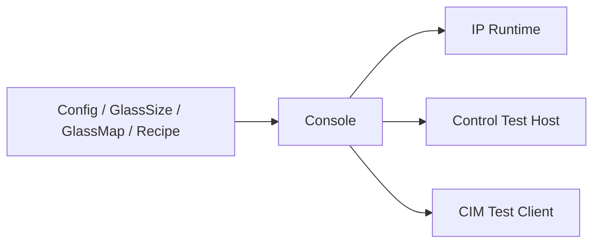
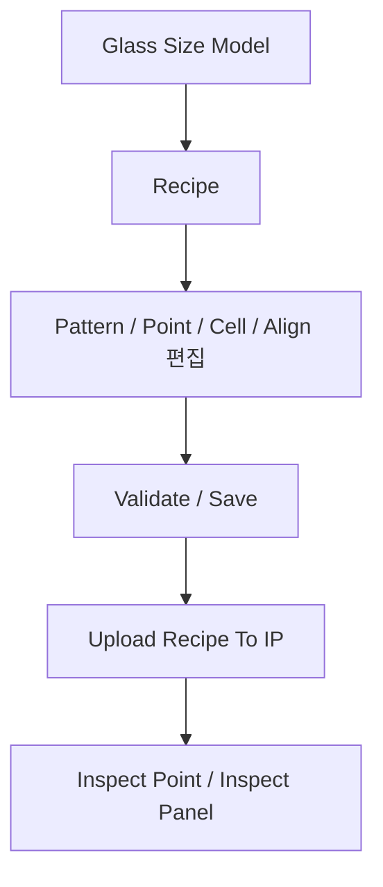

# 전체 Flow

이 문서는 현재 저장소의 실제 구현 기준으로 Console 중심 동작 흐름을 정리한다.

중요:
- 이 문서는 이상적인 최종 설비 시퀀스 문서가 아니라, 현재 코드에서 확인되는 동작 흐름 기준 문서다.
- 실제로 완성된 부분과 테스트/편집 중심인 부분을 구분해서 본다.
- 단, 메인 glass 검사 flow는 예외다.
- 메인 glass 검사 flow는 현재 코드 구조를 설명하지 않고, `docs/main-glass-inspection-flow.md`의 목표 구조를 우선한다.
- 메인 glass 검사 flow를 구현할 때 기존 provider/barrier/TCS 중심 구조에 맞추면 안 된다.
- 메인 glass 검사 flow 관련 정책 변경이나 미결정 사항은 구현 전에 반드시 사용자 확인을 받아야 한다.

## 1. 큰 그림

현재 프로젝트의 중심은 `uLedAoiConsole`이다.

Console이 담당하는 일:
- 작업 데이터 로드
- Glass Map 표시
- GlassSize/Recipe 편집
- IP 연결/업로드/검사 요청
- Control/CIM/IP 테스트 창 제공

현재 구성을 흐름으로 보면 아래와 같다.

## 2. 시작 Flow

`uLedAoiConsole/App.xaml.cs` 기준 시작 순서:

1. 설정 관리자와 로그 시스템 초기화
2. `Config`, `Variables`, `GlassMapDesign`, `GlassSize` 저장소 초기화
3. IP 런타임 레지스트리 구성
4. 기본 Recipe 스토어 준비
5. `MainWindow` 실행

자동 생성/초기화되는 기본 레시피:
- `Data/Recipes/Default/Default/recipe.json`

중요:
- 현재 앱은 시작 시 마지막으로 사용한 레시피를 자동으로 연다.
- 마지막 레시피가 없으면 `Default/Default` 레시피를 연다.

## 3. 메인 화면 Flow

`MainWindow` 기준 기본 사용 흐름:

1. 앱 실행
2. MainWindow가 현재 Recipe 기준으로 Glass Map 생성
3. IP 런타임 상태를 백그라운드로 모니터링
4. 상단 메뉴에서 필요한 편집/테스트 창을 연다

주요 메뉴:
- `Tool > Glass Map Design`
- `Tool > Glass Size Model`
- `Tool > Recipe`
- `Tool > Config`
- `Test > Load Ready`
- `Test > Unload Ready`
- `Test > Flow Test`

## 4. 레시피 준비 Flow

현재 실무 기준 흐름은 아래가 맞다.

### 4.1 Glass Size Model

목적:
- 패널 크기
- 패널 회전
- Align 마크 좌표
- Align anchor 축 좌표

를 먼저 확정한다.

이 단계가 중요한 이유:
- `PanelAngleDeg`는 Glass map 표시/회전 기준이며, `XIndex/YIndex` 계산에는 사용하지 않는다.
- Align 마크/anchor가 틀리면 이후 위치 기준이 모두 흔들린다.

### 4.2 Recipe

`RecipeWindow`에서 다루는 것:
- `ConsoleRecipeDocument`
- `IpRecipe.Patterns`
- `IpRecipe.Points`
- `GlassMap.Cells`
- `AlignPlan`
- `ControlPlan`

현재 창에서 가능한 주요 작업:
- New 기준 Glass Size 선택
- 좌표 모델 수정
- 셀 재생성
- IP 자동 분배
- 현재 위치를 Point / Align / Contact 값으로 반영
- IP 업로드 및 검사 실행

## 5. 검사 Flow

검사 flow 중 메인 glass 검사 기준은 현재 코드 구현 형태가 아니라 `docs/main-glass-inspection-flow.md`의 목표 구조를 우선한다.

핵심 실행 단위는 `Pattern x Point`다.

즉:
- Pattern은 조명/검사 조건
- Point는 스테이지 위치와 ROI
- 실제 촬영/검사는 둘의 조합으로 수행

현재 Recipe 창에서의 검사 흐름:

1. IP 선택
2. Pattern 선택
3. Point 선택
4. 필요 시 현재 위치를 Point에 반영
5. 이미지 조회 또는 검사 실행
6. 결과/이미지/Defect 확인

IP 관련 명령:
- Connect
- Refresh Status
- Upload Recipe
- Upload And Activate
- Activate Current Recipe
- Grab Selected Point
- Inspect Selected Point
- Inspect Panel
- Grab Selected Cell From Camera
- Grab Selected Cell From Folder
- Inspect Selected Cell Current Buffer
- Clear Defect

현재 명령 해석:
- `Grab Selected Point`
  - 선택된 IP / Pattern / Point 기준으로 `StartJob(source=Camera, use_buffer0=true, no_inspect=true) -> InputStep(Source=Camera) -> EndJob` 흐름을 탄다.
  - `InputStep` 응답은 촬영과 IP buffer 반영 완료 후 반환된다.
- `Inspect Selected Point`
  - 선택된 IP / Pattern / Point 기준으로 `StartJob(source=Camera, use_buffer0=true, no_inspect=false) -> InputStep(Source=Camera) -> EndJob` 흐름을 탄다.
  - 최종 결과는 `RuntimeEvent(EvtJobCompleted)` 기준으로 받는다.
- `Inspect Panel`
  - 메인 glass 검사는 batch queue 기반으로 `검사 unit 이동 -> IP target별 StartJob/InputStep 반복/EndJob ACK -> CA410 이동 -> CA410 target별 측정 -> 다음 batch 이동` 순서를 반복한다.
  - 이 기준은 현재 코드 구조를 설명하는 것이 아니라, 앞으로 구현해야 할 목표 구조다.
  - 기존 provider/barrier/TCS 중심 구조는 MainFlow 기준으로 삼지 않는다.
  - 한 batch는 같은 line에서 IP별 cell 1개씩 묶는다.
  - batch 생성 시 실제 선택된 target의 Glass cell center Y 좌표를 계산하고, `MinSafeGlassYGapUm`보다 가까운 target은 같은 batch에 넣지 않는다.
  - `MinSafeGlassYGapUm`은 장비 config 값이며 기본값은 `300000um`이다.
  - Console MainFlow는 batch 단위로 순차 진행한다.
  - batch 내부에서는 target이 있는 IP 개수만큼 IP job 함수를 동시에 실행할 수 있다.
  - 각 IP job 함수 내부는 `StartJob -> InputStep 반복 -> EndJob ACK` 순차 흐름을 유지한다.
  - 작업 대상 unit이 없는 경우 해당 unit은 이동 단계에서 config `EscapeYUm` 위치로 이동하고 IP job/CA410 측정은 실행하지 않는다.
  - Z축은 값이 작을수록 위쪽/안전쪽이며, `IdleZ <= CaptureZ <= MeasureZ` 관계를 기준으로 한다.
  - Y 목적지가 `EscapeYUm` 영역이면 XY/Y 이동 전 `IdleZ`를 보장하고, 그 외 XY/Y 이동 전에는 최소 `CaptureZ`를 보장한다.
  - Camera 입력 직전에는 `CaptureZ` 도착 확인, 정착 대기, 재확인 후 촬영/입력을 수행한다.
  - CA410 측정 직전에는 `MeasureZ` 도착 확인, 정착 대기, 재확인 후 측정한다.
- MainFlow의 pattern/point 입력 명령은 source와 무관하게 `InputStep` 하나로 통일한다.
- Camera 입력도 Console job flow에서는 `InputStep(Source=Camera)`를 사용한다.
- 2026-06-30 이후 pattern/point 입력은 `BeginInputStep` ACT/ACK와 `EVT_GRAB_END` 이벤트로 표현한다.
  - `Folder`/`CurrentBuffer`는 ACT ACK를 즉시 반환하고, 기존 적재 완료 시점에 `EVT_GRAB_END`를 보낸다.
  - `Camera`는 exposure+margin 이후 ACK를 반환하고 readout/export/buffer 반영 완료 시 `EVT_GRAB_END`를 보낸다.
  - Console은 다음 ACT 전, 그리고 `EndJob` 전 마지막 `EVT_GRAB_END`를 반드시 기다린다.
  - IP 내부 구현이 실제 카메라 grab 동작을 수행할 수는 있지만, Console job flow에 별도 grab protocol을 두지 않는다.
  - `StartJob`은 `source`, `use_buffer0`, `no_inspect`로 입력 공급자와 검사 여부를 명시한다.
  - `no_inspect=true`도 inspection/artifact/send pipeline은 동일하게 통과하고 검사 계산만 생략한다.
  - IP buffer는 fixed N개 slot을 round-robin으로 사용한다.
  - 각 slot은 단일 `ImageBuffer`와 `IsInspect`, `IsSave` flag를 가진다.
  - ready slot은 `IsInspect=false && IsSave=false`인 slot이다.
  - ready slot이 없으면 `BufferFull`로 응답한다.
  - Stop/Abort 시 `ImageBuffer[0..N-1]`는 유지하고 inspection queue/job context 및 미완료 `IsInspect`만 정리한다.
  - `Source=Camera`는 촬영 후 IP buffer에 반영하고 bufferId를 반환한다.
  - `Source=Folder`는 pattern/point 이미지를 로드해 IP buffer에 반영하고 bufferId를 반환한다.
  - `Source=CurrentBuffer`는 무조건 `bufferId=0`을 현재 입력으로 확정하고 bufferId를 반환한다.
  - CurrentBuffer 검사는 slot 0의 `IsInspect`/`IsSave` 상태 때문에 `BufferFull`로 막지 않는다.
  - CurrentBuffer 검사는 `ImageBuffer[0]`의 현재 내용을 snapshot으로 사용하며 BufferFull retry 대상이 아니다.
  - 수동 이미지 로드 또는 수동 촬영도 무조건 `BufferSlot[0]`을 사용한다.
  - pattern/point 입력 응답은 검사 완료를 기다리지 않는다.
  - Camera source의 `InputStep` 최종 실패는 해당 cell failure로 기록하고 다음 cell로 진행한다.
  - IP는 grab 실패 시 분석용 특수 영상을 생성하고 해당 cell 결과를 grab fail로 응답한다.
  - grab fail 결과 flag 이름은 `GrabFailed`로 한다.
  - InputStep 실패는 별도 job cancel 없이 최종 결과 flag로 표현한다.
  - `EndJob`은 검사 완료를 기다리지 않고 검사 queueing 후 ACK를 반환한다.
  - `EndJob` 실패는 일반 실패가 아니라 job 상태 불명으로 보고 run abort 대상으로 처리한다.
  - Console은 `EndJob ACK` 이후 CA410과 다음 moving을 진행할 수 있어야 한다.
  - CA410 실패는 해당 cell failure로 기록하고 다음 cell로 진행한다.
  - CA410 실패는 검사 실패와 구분되는 별도 cell 상태로 표시한다.
  - 검사 카메라 이동은 cell/batch 단위로 수행한다.
  - Recipe Editor의 selected cell 메뉴는 같은 job lifecycle을 사용한다.
    - `Grab Selected Cell From Camera`: `StartJob(source=Camera,use_buffer0=true,no_inspect=true) -> InputStep 반복 -> EndJob -> EvtJobCompleted`
    - `Grab Selected Cell From Folder`: `StartJob(source=Folder,use_buffer0=true,no_inspect=true) -> InputStep 반복 -> EndJob -> EvtJobCompleted`
    - `Inspect Selected Cell Current Buffer`: `StartJob(source=CurrentBuffer,use_buffer0=true,no_inspect=false) -> InputStep 반복 -> EndJob -> EvtJobCompleted`
  - CA410 촬영용 이동은 `EndJob ACK` 이후 전체 moving과 독립적으로 개별 수행할 수 있다.
  - 최종 결과는 별도 ResultReceiver가 `EvtJobCompleted(final_result)` 기준으로 받는다.

중요:
- `StartJob`은 step 전체 실행 명령이 아니다.
- `StartJob`은 셀/job 준비와 버퍼 적재 준비를 시작하는 명령이다.
- 실제 pattern/point 단위 진행은 반드시 `InputStep` 반복으로 표현해야 한다.
- Camera/Folder/CurrentBuffer 차이는 `InputStep.Source`로만 표현한다.
- 촬영/이미지 로드까지는 sync step이고, 검사는 `EndJob` 이후 async worker 작업이다.
- IP 검사는 셀별 fire-and-forget task가 아니라 단일 inspection queue/worker에서 순차 처리한다.
- 원본 이미지 저장은 검사/통신 흐름을 막지 않는 별도 save queue/worker에서 처리한다.
- 메인 flow 구현 기준은 `docs/main-glass-inspection-flow.md`를 우선한다.
- 이 flow는 2026-06-20 사용자 확인으로 확정된 기준이며, 사용자의 명시적인 변경 확인 없이 바꾸지 않는다.
- 따라서 `StartJob accepted` 직후 패턴 전체를 미리 돌리는 방식은 현재 flow 기준이 아니다.
- `InputStep`/`EndJob` 응답을 검사 완료까지 지연시키지 않는다.
- 결과 수신/저장/UI 반영 때문에 다음 셀의 motion/PG/촬영 시작을 막지 않는다.
- Console MainFlow의 retry는 `StartJob`의 `BufferFull`에 한정한다.
- 멀티 IP batch에서 `StartJob BufferFull`이 발생하면 전체 batch가 아니라 해당 IP target만 retry한다.
- `InputStep`, `EndJob`, Motion, PG, CA410은 Console MainFlow에서 임의 retry하지 않는다.
- Stop은 빠른 정지를 우선하며 IP inspection queue/job context를 clear하고, 최종 결과까지 완료된 cell만 Completed로 인정한다.
- Stop 시 모든 active IP의 inspection queue를 clear하며, 별도 Finish Current/Drain 운전은 제공하지 않는다.
- Stop/Abort 시 ImageBuffer는 유지하므로 이후 CurrentBuffer debug 검사를 수행할 수 있다.
- 저장 실패는 `SaveFailure` flag로 기록하고 MainFlow는 계속 진행한다.
- IP는 Stop/Abort cleanup 완료 후 `EvtJobCanceled`를 한 번 전송한다.
- inspect timeout 기본값은 config 기준 약 60초로 둔다.
- Stop/Abort 이후 late/orphan result는 로그만 남기고 저장/UI 반영 없이 무시한다.
- MainFlow 순서, batch 규칙, retry, stop/abort, result 처리, source 책임을 바꿔야 하면 구현을 멈추고 사용자 확인을 먼저 받는다.
- source abstraction이 `StartJob -> InputStep -> EndJob -> CA410 -> Moving` 순서를 숨기면 안 된다.
- 셀별 task 안에서 StartJob부터 결과 저장까지 모두 수행하는 방향으로 구현하지 않는다.
- batch 내부 target별 `RunIpJobSequentialAsync` 동시 실행은 허용하되, 다음 batch 시작은 현재 batch의 모든 `EndJob ACK`와 CA410 측정 이후여야 한다.
- 메인 glass 검사 flow는 수동/진단용 직접 검사 API를 사용하지 않는다.
- 금지 대상 예:
  - `TryGrabPoint`
  - `TryInspectPoint`
  - `TryInspectPanelFolder`
  - `TryEnqueueCapturedPanel`
  - `TryProcessNextBufferedPanel`

### 5.1 Align 위치 이동 Flow

생산 시퀀스에서 `Load` 이후 `Process`로 넘어가기 전에 Align을 수행하려면, Align 촬영 전에 반드시 Align camera를 기준 마크 위치로 이동해야 한다.

기준 순서:

1. `AlignPlan`과 Glass Size의 align mark 좌표를 읽는다.
2. Left Align Camera를 left align mark의 Glass 좌표로 이동한다.
3. Right Align Camera를 right align mark의 Glass 좌표로 이동한다.
4. 좌/우 align 이미지를 촬영한다.
5. align offset을 계산한다.
6. `LoadingAlignerX/Y1/Y2` 또는 UVW 보정 축으로 correction move를 수행한다.
7. 허용 오차 이내인지 검증하고, 필요 시 `MaxIteration`까지 반복한다.
8. Align 완료 후 Process/검사 step flow로 넘어간다.

중요:

- Align mark 위치 이동은 `StartJob` 또는 `InputStep`의 책임이 아니다.
- `InputStep` 전 motion 훅은 pattern/point 검사용 위치 이동에 사용한다.
- Align 위치 이동은 Process 시작 전의 별도 Control motion 단계로 취급한다.
- 고수준 의미는 `MoveLeftAlignCameraToGlass(x, y)`, `MoveRightAlignCameraToGlass(x, y)`이고, Console이 이를 `MoveRequest(InspectionUnitY, StageX)`로 변환한다.
- 테스트에서는 protocol `FlowCommand`를 추가하지 않고, Align Test 창에서 좌/우 align 위치를 하나의 `MoveRequest(InspectionUnit2Y, InspectionUnit1Y, StageX)`로 전송한다.
- UVW jog/상대 이동도 Align 검증 맥락의 기능이므로 Align Test 창에서 별도 `UVW Jog` 창으로 제공하며, 사용자는 `X/Y/T` 값을 입력하고 Console이 이를 `StageU/V/W` 상대 이동으로 변환한다.

## 6. 셀 처리 Flow

현재 코드에서 셀은 `GlassMapDesignSnapshot`으로부터 생성된다.

셀 처리 규칙:
- 셀은 `XIndex`, `YIndex`를 가진다
- `XIndex`는 Cell map 내부 관리 X/Y index 중 Unit1 기준 StageX target 평균 변화가 있는 축을 group 축으로 선택하고, 각 group의 StageX target 평균 좌표 오름차순으로 정하는 0-base 실행 index다.
- `YIndex`는 같은 `XIndex` group 안에서 남은 Cell map 내부 관리 축으로 group을 만들고, 각 group의 Unit1 기준 InspectionUnit1Y target 평균 좌표 오름차순으로 정하는 0-base 실행 index다.
- `IpNo`는 Auto Assign 또는 Split Column 기준으로 배정하며, 기준은 `YIndex`다.
- IP와 Unit은 고정 매칭이다. IP1은 Unit1Y, IP2는 Unit2Y를 사용한다.
- `XIndex/YIndex` grouping은 StageX/InspectionUnit1Y 좌표값이 아니라 Cell map 내부 관리 index 기준이다. StageX target은 실제 `XIndex` 축 선택과 group 순서 결정에만 사용하고, InspectionUnit1Y target은 `YIndex` group 순서 결정에만 사용한다.
- 충돌 방지 batch grouping은 `YIndex` 차이가 아니라 Glass cell center Y 좌표 차이로 판단한다.

의미:
- 셀 배치는 단순 표시용이 아니라, Console이 line/cell 순서를 해석하는 기본 단위다.
- 다만 현재는 완전한 생산 시퀀스보다 편집/미리보기/검사 준비 흐름이 더 많이 구현되어 있다.

## 7. Control / CIM 테스트 Flow

현재 전체 설비 흐름은 `FlowTestWindow`에서 시뮬레이션/통신 검증 중심으로 제공된다.

Control 연결/상태 동기화 원칙:

- Console은 `Control` 연결 성공 직후 `Status`를 1회 조회해 초기 상태를 동기화한다.
- 그 이후 운전 중 상태 반영은 `EventNotification` 기반으로 처리한다.
- 메인 화면이나 백그라운드 모니터가 주기 `RefreshStatus` 폴링을 수행하지 않는다.
- 반복 상태 확인이 필요하면 테스트 창에서 사용자가 명시적으로 수동 조회한다.

기본 흐름:

1. Control/CIM/IP에 연결
2. `LoadReady`
3. `LoadReadyDone` 대기
4. `LoadDone` 대기
5. `LoadGlass`
6. `Inspect`
7. `InspectDone`
8. `UnloadReady`
9. `UnloadReadyDone`
10. `UnloadDone`

즉 현재 `전체 Flow`는 두 층으로 나뉜다.

- 운영 레시피/검사 준비 Flow
  - MainWindow + RecipeWindow 중심
- 통신/상태 전이 검증 Flow
  - FlowTestWindow 중심
  - MainWindow `Test > Load Ready`, `Test > Unload Ready`는 Control flow command를 직접 호출하는 빠른 검증 경로다.

## 8. 현재 구현에서 아직 분리해서 봐야 하는 부분

아래는 문서상 큰 그림은 있으나, 현재 구현은 테스트/편집 성격이 강한 영역이다.

- 생산용 Load -> Align -> Process -> Unload 전체 자동 시퀀스
- Control 주도 실제 축/인터락 연동
- CIM 실설비 연동 상태 머신
- Recipe 선택/Job 관리 UI

따라서 현재 문서를 읽을 때는 아래처럼 해석한다.

- 이미 구현됨
  - Recipe/GlassSize/GlassMap 편집
  - IP 업로드/활성화/단건 검사
  - Flow Test 기반 Control/CIM/IP 통신 검증
- 확장 예정
  - 생산 시퀀스 자동화
  - 장비 실동작 orchestration

## 9. 실무에서 보는 권장 작업 순서

1. GlassSize 확인
2. Recipe에서 GlassSize 스냅샷 반영
3. Cells 재생성 및 IP 분배 확인
4. Pattern/Point/ROI 확인
5. Align/Control 파라미터 확인
6. Validate
7. IP Upload/Activate
8. Point 또는 Panel 검사

## 10. 관련 문서

- `docs/프로젝트 구조.md`
- `docs/기본설정.md`
- `docs/console-recipe-document.md`
- `docs/시작 가이드.md`
