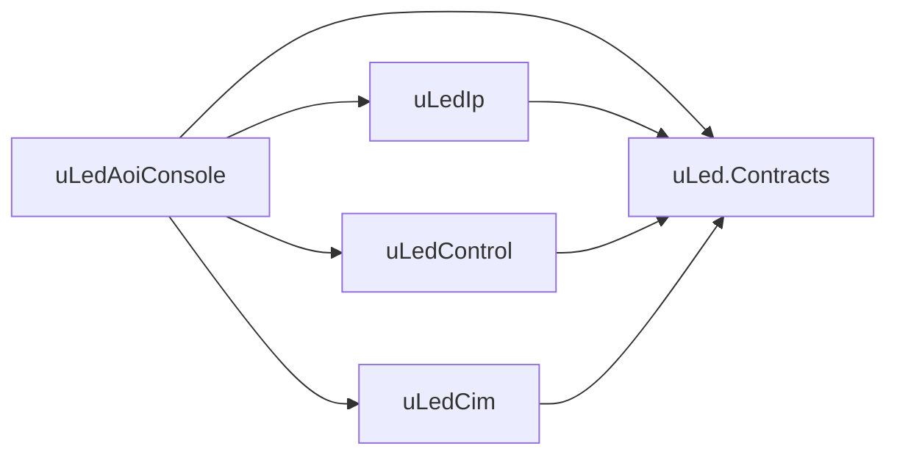
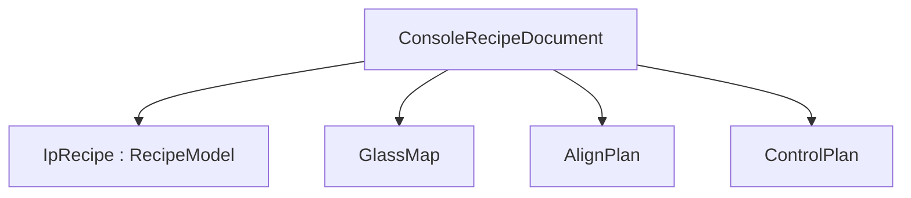

# 프로젝트 구조

이 문서는 현재 저장소의 실제 구현 기준으로 프로젝트 전체 구조를 설명한다.

가장 중요한 기준:
- 전체 오케스트레이션의 중심은 `uLedAoiConsole`
- IP 실행 레시피의 기준은 `uLed.Contracts.Models.RecipeModel`
- Console 상위 레시피의 기준은 `uLedAoiConsole.Recipes.ConsoleRecipeDocument`
- 과거 authoring 구조는 신규 기준이 아니다

## 1. 솔루션 구성

주요 프로젝트:

- `uLedAoiConsole`
  - 메인 WPF 앱
  - 레시피/글래스/맵 편집
  - IP 업로드/검사
  - 테스트 창 제공
- `uLed.Contracts`
  - Console/IP 공용 계약 모델
- `uLedIp`
  - IP 런타임 및 IP 레시피 편집 호스트
- `uLedControl`
  - 제어기 샘플
- `uLedCim`
  - CIM 통신 관련 구성
- `uLed.Common`
  - 공용 유틸 및 레시피 편집 코어
- `Ratel.WPF.Utils`
  - 로깅/뷰어 등 공용 UI 유틸

## 2. 책임 경계

### 2.1 Console

`uLedAoiConsole` 책임:
- 작업 데이터 로드/저장
- Glass Map 표시
- 상위 레시피 편집
- GlassSize 편집
- IP 연결/업로드/검사 트리거
- Control/CIM/IP 테스트 도구 제공

Console은 아래 데이터를 직접 가진다.
- `ConsoleRecipeDocument`
- `GlassMap`
- `Cells`
- `AlignPlan`
- `ControlPlan`
- GlassSize 스냅샷

### 2.2 Contracts

`uLed.Contracts` 책임:
- IP 실행 레시피
- 검사 Job/Result 계약
- 공용 enum/model

대표 모델:
- `RecipeModel`
- `PatternPlanModel`
- `CapturePointPlanModel`
- `InspectionConfigModel`
- `PanelInspectionJobModel`
- `PanelResultModel`

### 2.3 IP

`uLedIp` 책임:
- `RecipeModel` 소비
- 촬영/검사 수행
- 결과 반환
- IP 전용 레시피 편집 호스트

### 2.4 Control / CIM

현재 저장소 기준:
- 실제 생산 설비 orchestration보다는 통신/상태 전이 검증용 샘플 성격이 강하다.
- `FlowTestWindow`, `ConsoleFlowCoordinator`, `uLedControl` 샘플이 연결 포인트다.

## 3. 레시피 계층

현재 프로젝트에서 가장 중요한 구조다.

### 3.1 ConsoleRecipeDocument

위치:
- `uLedAoiConsole/Recipes/ConsoleRecipeDocument.cs`

역할:
- Console 전용 상위 레시피
- 실행용 셀/라인/분배/정렬/제어 규칙 보관

핵심 필드:
- `SchemaVersion`
- `IpRecipe`
- `GlassMap`
- `AlignPlan`
- `ControlPlan`
- `Metadata`

### 3.2 GlassMap

현재 실제 필드:
- `GlassSizeId`
- `GlassSizeSnapshot`
- `IpSplitColumn`
- `GlassMapDesignSnapshot`
- `Cells`

의미:
- `GlassMapDesignSnapshot`은 설계 원본
- `Cells`는 실행용 전개 결과
- `GlassSizeSnapshot`은 현재 레시피가 참조하는 실제 패널 기준

### 3.3 IpRecipe

위치:
- `uLed.Contracts/Models/RecipeModels.cs`

핵심 구조:
- `Descriptor`
- `DisplayPixelWidthCount`
- `DisplayPixelHeightCount`
- `DisplayPixelWidthUm`
- `DisplayPixelHeightUm`
- `Patterns`
- `Points`
- `LineRelation`
- `Metadata`

중요:
- 현재 IP 실행 단위는 `Pattern x Point`
- `Point`는 `Pattern`에 속하지 않는다

### 3.4 과거 authoring 모델과의 관계

`uLed.Contracts/Models/RecipeAuthoringModels.cs`는 저장소에 남아 있지만, 현재 상위 구조의 기준이 아니다.

즉 신규 설계 기준은 아래다.

- Console 상위 레시피: `ConsoleRecipeDocument`
- IP 실행 레시피: `RecipeModel`

아래 구조는 기준에서 제외한다.

- `Shot`
- `ShotGroup`
- `SetupLibrary`
- `Shot -> Pattern -> ROI` 중심 해석

## 4. GlassSize 계층

위치:
- `uLedAoiConsole/Models/GlassSizeConfigModels.cs`
- `uLedAoiConsole/Stores/GlassSizeStore.cs`

핵심 역할:
- 글래스 크기
- 패널 회전
- Align 마크
- affine calibration 좌표

핵심 필드:
- `GlassSizeId`
- `GlassWidthUm`
- `GlassHeightUm`
- `PanelAngleDeg`
- `AlignMarks`
- `LeftAlignCameraCalibration`
- `RightAlignCameraReference`

의미:
- GlassSize는 단순 치수 파일이 아니라 표시 회전/정렬/좌표 변환의 기준 데이터다.
- `PanelAngleDeg`는 셀 `XIndex/YIndex` 계산 기준으로 사용하지 않는다.

## 5. 셀 생성 구조

셀 생성 흐름:

1. `GlassMapDesignSnapshot.Coordinates`
2. `GlassInfoHelper.MakeCells(...)`
3. `RecipeService.BuildCellsFromGlassMapDesign(...)`
4. `ConsoleCellPlan` 리스트 생성

추가 처리:
- `XIndex`, `YIndex` 자동 계산
- `XIndex`는 Cell map 내부 관리 X/Y index 중 group 평균 StageX target 변화가 있는 축으로 묶고, group 평균 StageX target 좌표 오름차순으로 계산
- `YIndex`는 같은 `XIndex` group 안에서 남은 Cell map 내부 관리 축으로 묶고, group 평균 InspectionUnit1Y target 좌표 오름차순으로 계산
- `YIndex` 기준 IP 자동 분배
- `IpSplitColumn` 수동 적용 가능

즉 현재 셀은 수동 입력만으로 유지하는 구조가 아니라, 설계 원본에서 재생성 가능한 구조다.

## 6. UI 구조

### 6.1 MainWindow

역할:
- 메인 진입
- 현재 레시피 기준 Glass Map 표시
- IP 연결 상태 요약
- 편집/테스트 창 메뉴 진입

### 6.2 RecipeWindow

역할:
- 상위 레시피 편집기

주요 탭:
- `General`
- `Patterns`
- `Points`
- `Cells`
- `Map`
- `Align / Control`

### 6.3 GlassSizeWindow

역할:
- GlassSize 파일 편집
- 패널 회전과 affine calibration 관리

### 6.4 FlowTestWindow

역할:
- Control/CIM/IP 통신 기반 상태 전이 검증

## 7. 데이터 저장 구조

`Vars.cs` 기준 경로:

- `Config/config.yaml`
- `Variables.yaml`
- `Data/GlassMaps/glass_map_design.json`
- `Data/GlassSizes/{glassSizeId}.json`
- `Data/Recipes/{glassSizeId}/{recipeId}/recipe.json`
- `Data/Calibrations/{glassSizeId}/axis_hardware.json`
- `Data/Runtime/align_result.json`

중요:
- 신규 기본 Glass Map 경로는 `Data/GlassMaps/glass_map_design.json`

## 8. 런타임 연결 구조

### 8.1 IP 연결

`Vars.IpRuntimes`가 `EMRConfig.IpEndpoints` 기준으로 생성된다.

MainWindow는 이를 주기적으로 모니터링하여:
- 자동 연결 시도
- 상태 조회
- 연결 상태 표시

를 수행한다.

### 8.2 Flow Test 연결

`ConsoleFlowCoordinator`는 다음 클라이언트를 가진다.

- Control TCP client
- CIM TCP client
- IP TCP client

용도:
- 테스트 창에서 Load/Inspect/Unload 흐름 검증

## 9. 현재 프로젝트를 이해하는 핵심 문장

이 저장소는 현재 아래 구조로 이해하는 것이 맞다.

- `uLedAoiConsole`가 중심이다.
- Console은 상위 레시피와 셀/정렬/제어 규칙을 소유한다.
- IP는 `RecipeModel`만 소비한다.
- 현재 실구현은 편집기와 테스트 도구가 강하고, 생산용 완전 자동 orchestration은 확장 중이다.

## 10. 관련 문서

- `docs/README.md`
- `docs/기본설정.md`
- `docs/전체 flow.md`
- `docs/console-recipe-document.md`
- `docs/shared-contract-models.md`
- `docs/시작 가이드.md`
