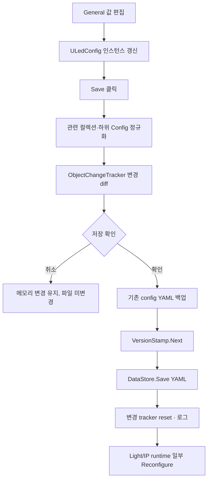
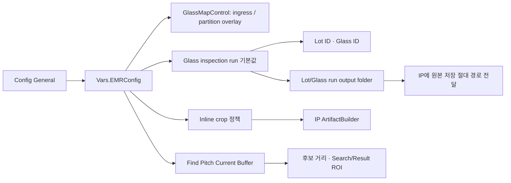

# ConfigWindow - General 탭 분석

## 1. 화면 목적

`ConfigWindow > General`은 Console 전체에서 공통으로 쓰는 표시, 검사 산출물, 기본 식별값, Find Pitch 분석 범위를 설정하는 전역 설정 탭이다.

Glass Size는 이 탭에서 설정하지 않는다. XAML에도 “Glass 크기는 Recipe의 GlassSize 모델에서 관리합니다.”라고 명시되어 있다. 따라서 제품 기하·Align mark는 GlassSize Model, 이 탭은 전역 실행 환경과 표시·저장 정책을 소유한다.

## 2. 화면 구성

|그룹|항목|역할|
|---|---|---|
|Paths|Config File, Backup Dir, Version|현재 YAML 경로·백업 경로·저장 버전을 표시한다. 모두 읽기 전용이다.|
|Glass Map View|분판 이름 Overlay, 투입 방향, Show Angle|Glass Map의 이름 표시·투입 화살표·표시 회전 기준을 정한다.|
|Inspection|Save Original Images, Lot/Glass ID, Image NAS Root, Inline Crop Max, Find Pitch 범위·margin|검사 실행 때 원본 저장, run 식별, 결과 이미지 전달량, Find Pitch 검색 조건을 정한다.|

## 3. 컨트롤 분석

### 3.1 Paths

|컨트롤|바인딩|역할|변경 방법·영향|
|---|---|---|---|
|Config File|`ConfigFilePath`|현재 Console YAML 파일의 절대 경로를 표시한다.|읽기 전용. 이 탭에서 경로를 바꾸지 않는다.|
|Backup Dir|`ConfigBackupDir`|저장 전 기존 YAML을 보관하는 폴더를 표시한다.|읽기 전용. Save마다 기존 config를 `config_yyyyMMdd_HHmmss_fff.yaml`로 복사하고 최신 30개만 유지한다.|
|Version|`Config.Version`|설정 저장 버전을 표시한다.|읽기 전용. Save 성공 시 `VersionStamp.Next`로 증가하며 Recipe의 ConfigVersion 스탬프가 참조한다.|

### 3.2 Glass Map View

|컨트롤|모델 필드|설정 방법|변경 영향|
|---|---|---|---|
|분판 이름 Overlay 표시|`ShowGlassMapPartitionNameOverlay`|체크 시 표시, 해제 시 숨김|`GlassMapControl.ShowPartitionNameOverlay`에 바인딩되어 RecipeWindow Cell Map의 분판 이름 overlay 표시 여부를 바꾼다.|
|투입 방향|`GlassIngressDirection`|열거형 선택|Glass Map의 투입 방향 화살표 표시 기준에 사용된다. Glass Size의 Panel Angle과 함께 전체 map 표시 방향에 반영된다.|
|Show Angle|`ShowGlassAngle`|정수 입력|전역 Glass Map 표시 회전값이다.|현재 제공된 XAML/직접 참조 범위에서는 이 값의 소비처를 확정하지 못했다. **[추가 확인 필요]**|

투입 방향은 제품의 Glass Size `PanelAngleDeg`를 대체하지 않는다. 공식 변경 기록은 GlassMap 전체 표시 회전이 `PanelAngleDeg`와 `GlassIngressDirection`을 함께 반영한다고 정의한다.

### 3.3 Inspection

|컨트롤|모델 필드|설정 방법|변경 영향·주의|
|---|---|---|---|
|Save Original Images|`SaveOriginalImages`|원본 보관이 필요한 run의 기본값으로 체크|원본 저장 여부는 IP Config가 아니라 Console Config General과 실행 옵션이 결정한다. 저장량·NAS 처리량에 영향을 준다. 실행 옵션이 이 값을 덮어쓸 수 있는지는 run dialog 경로에서 확인해야 한다. **[추론]**|
|Lot ID|`LotId`|기본 lot 식별자를 입력|검사 시작 시 lot 입력의 기본값으로 사용된다. 비어 있으면 `LotID` 기본 문자열을 사용한다고 UI가 안내한다.|
|Glass ID|`GlassId`|기본 glass 식별자를 입력|검사 시작 시 glass 입력의 기본값으로 사용된다. 비어 있으면 `GlassID`를 사용한다.|
|Image NAS Root|`OriginalImageOutputRootFolder`|원본 이미지 저장 root의 절대 경로를 입력|Console이 Lot/Glass run 폴더를 만들고 IP에 해당 절대 경로를 전달한다. 경로 접근 권한·공유 성능이 필요하다.|
|Inline Crop Max|`MaxInlineCropImageCount`|0~1000 정수를 입력|완료 이벤트에 포함할 crop 이미지의 최대 수다. 0이면 crop 생성/포함을 건너뛴다. 크면 payload·메모리 부담이 증가할 수 있다.|
|Find Pitch Min/Max|`FindPitch.MinDistancePx`, `MaxDistancePx`|current buffer에서 허용할 object 거리 범위를 pixel로 입력|Find Pitch가 후보 object를 선택하는 거리 범위를 바꾼다. min은 0 이상, max는 min보다 최소 0.001 커야 한다.|
|Find Pitch Margins|`SearchMarginPx`, `ResultMarginPx`|검색 영역 여유 / 결과 ROI 여유를 pixel로 입력|Find Pitch의 search ROI와 결과 ROI 경계를 바꾼다. 모두 0 이상이다.|

공식 프로젝트 규칙에 따라 thumbnail/artifact는 IP `InspectionResultArtifactBuilder`가 유일한 생성 주체다. Inline crop 수는 Console이 별도 리사이즈를 수행하는 값이 아니라 IP에 전달되는 결과 정책의 한도다.

## 4. 이벤트 분석

### 4.1 입력 및 Save



Save는 `ConfigViewModel.SaveWithChangeReport()`가 담당한다. 변경이 없으면 저장하지 않는다. 저장 전 기존 config 파일이 있을 때만 backup을 만들고, 오래된 backup은 최대 30개 기준으로 정리한다.

### 4.2 Reload와 창 종료

`Reload`는 저장하지 않은 변경이 있으면 경고한 뒤 YAML을 다시 읽고, 화면 컬렉션과 일부 runtime(EEC light, IP runtime)을 재구성한다. 창을 닫을 때도 미저장 변경이 있으면 저장/무시/취소를 선택하게 한다.

### 4.3 Inspection 실행 영향



## 5. 데이터 바인딩

|UI|바인딩|입력 반영 시점|
|---|---|---|
|Config File/Backup Dir/Version|ViewModel/Config one-way|창 열기·저장 후 모델 갱신|
|Overlay/Ingress|`Config` two-way|체크·선택 즉시 메모리 모델 반영|
|Show Angle, Lot/Glass ID, NAS Root|`Config` two-way, `LostFocus`|입력란에서 포커스를 잃을 때 반영|
|Inline Crop / Find Pitch 수치|ViewModel wrapper, `UpdateSourceTrigger=Explicit`|`CalcTextBox`의 명시적 source 갱신 시 반영|

`MaxInlineCropImageCount`는 ViewModel에서 `0..1000`으로 clamp한다. Find Pitch는 min/max 순서를 보정한다.

```text
Min 입력 ≥ 0
Min ≥ 기존 Max  → Max = Min + 1.0
Max 입력         → Max = max(Min + 0.001, 입력값)
Search/Result Margin ≥ 0
```

## 6. 사용자 입장에서

### 안전한 설정 절차

1. Paths의 Config File과 Backup Dir를 확인해 어느 운영 환경을 수정하는지 먼저 확인한다.
2. Glass Map View에서는 실제 투입 방향과 현장 표시 기준에 맞게 overlay·투입 방향을 설정한다.
3. 원본 이미지 보관 정책과 NAS 용량·권한을 확인한 뒤 Save Original Images와 Image NAS Root를 설정한다.
4. Lot/Glass ID에는 검사 시작 때 자주 쓰는 기본값만 입력한다. 실제 생산 식별값은 run 시작 전 다시 확인한다.
5. Inline Crop Max는 전송 payload 요구에 맞게 설정한다. crop이 필요 없으면 0을 사용한다.
6. Find Pitch 값은 알려진 현재 buffer 이미지로 시험해 object distance와 ROI가 맞는지 확인한다.
7. Save를 누른 뒤 변경 목록과 backup 생성 여부를 확인한다.

### 값 변경 후 확인할 것

|변경|확인 대상|
|---|---|
|분판 overlay/투입 방향|RecipeWindow Cell Map의 label·화살표·회전 표시|
|Save Original Images/NAS Root|새 glass run의 원본 저장 경로, NAS 접근 권한, 저장 지연/버퍼 상태|
|Lot/Glass ID|검사 시작 화면·생성 session/export 경로의 식별자|
|Inline Crop Max|완료 결과 payload의 crop 개수와 memory/통신 부담|
|Find Pitch 거리·margin|Find Pitch 결과 창의 검출 object, search ROI, result ROI|

## 7. 업무 로직 추론

- **[추론]** `SaveOriginalImages`를 켜면 IP의 별도 save queue가 처리할 이미지가 늘어 NAS 지연 시 IP buffer pressure와 검사 throughput에 영향을 줄 수 있다. alarm catalog도 buffer full 대응에서 원본 저장 경로 성능과 이 옵션 점검을 안내한다.
- **[추론]** `OriginalImageOutputRootFolder`는 Console이 run별 경로를 소유하고 IP에는 절대 경로를 전달하므로, IP와 Console process 모두 해당 네트워크 경로를 접근할 수 있어야 한다.
- **[추론]** Inline Crop Max를 큰 값으로 올리면 검사 판정이 아니라 완료 이벤트 payload의 이미지 양이 증가한다. 전체 결과 조립은 IP가 완료한 뒤 Console이 수신한다.
- **[추론]** Find Pitch의 min/max가 너무 좁으면 실제 pitch 후보를 버릴 수 있고, 너무 넓으면 잘못된 object 조합을 선택할 가능성이 커진다. margin이 너무 작으면 edge를 잘라낼 수 있다.

## 8. 문서작성 요약

|영역|전역 설정 책임|
|---|---|
|경로/버전|Config YAML 위치, backup, version stamp|
|Map View|분판 이름 표시, 투입 방향, 표시 각도|
|Inspection 식별|기본 Lot/Glass ID|
|원본/산출물|원본 저장 여부, NAS root, inline crop 최대 수|
|이미지 분석|Find Pitch object 거리와 ROI margin|
|저장|변경 diff 확인 → YAML backup → version 증가 → save|

## 9. 이해되지 않는 부분 / 추가 확인 필요

|확인 항목|현재 확인 결과|추가 확인 방법|
|---|---|---|
|Show Glass Angle 소비처|General UI에는 있지만 직접 참조를 확정하지 못했다.|전체 코드에서 `ShowGlassAngle`의 표시/계산 소비처를 추적한다.|
|Save Original Images와 실행 옵션 우선순위|공식 문서는 Config General과 실행 옵션이 결정한다고 설명한다.|`GlassInspectionRunOptions` 생성과 IP metadata 전달 경로를 확인한다.|
|NAS root 입력 검증|UI에는 경로 존재·쓰기 가능 여부 검증이 보이지 않는다.|run 시작 전 directory create/권한 실패 처리와 운영 NAS 접근 정책을 확인한다.|
|Find Pitch 적용 시점|General은 current buffer Find Pitch용이라고 표시한다.|FindPitch service가 config를 언제 읽는지와 이미 열린 결과 창에 대한 재적용 여부를 시험한다.|

## 10. 전체 프로젝트 연결

관련 코드:

- `uLedAoiConsole/Windows/Core/ConfigWindow.xaml`
- `uLedAoiConsole/Windows/Core/ConfigWindow.xaml.cs`
- `uLedAoiConsole/ViewModels/ConfigViewModel.cs`
- `uLedAoiConsole/Models/ULedSettings.cs`
- `uLedAoiConsole/Controls/GlassMapControl.cs`
- `uLedAoiConsole/Windows/Recipe/RecipeWindow.xaml`

우선 참조 문서:

- `docs/ip-configuration.md`
- `docs/main-glass-inspection-flow.md`
- `docs/console-recipe-document.md`
- `docs/development/change-log.md`
