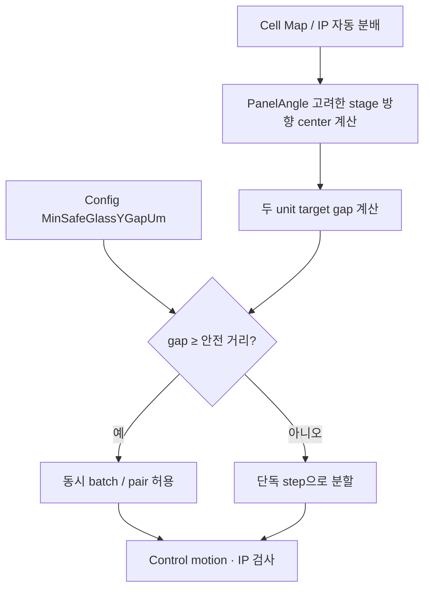
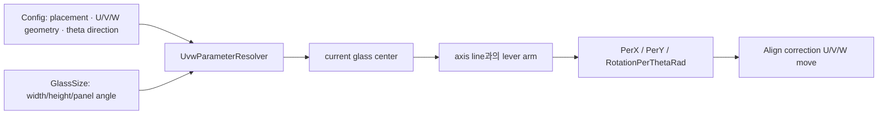
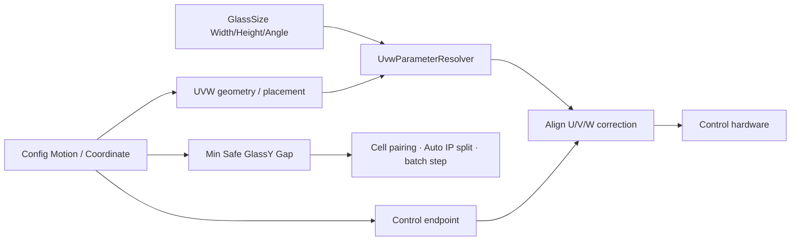

# ConfigWindow - Motion / Coordinate 탭 분석

## 1. 화면 목적

`ConfigWindow > Motion / Coordinate`는 Console이 Control에 연결하는 endpoint, 두 검사 unit의 동시 이동 안전 거리, 그리고 UVW 기구 좌표계를 설정하는 전역 탭이다.

공식 UVW 표준은 다음 책임 분리를 정의한다.

- Config: 장비 고정 geometry와 기준 글래스 배치 raw 값
- GlassSize Model: 제품별 Width/Height, Align mark 등
- 런타임: 현재 GlassSize를 사용해 `PerX`, `PerY`, `RotationPerThetaRad`를 계산

따라서 이 탭은 제품마다 매번 계산계수를 입력하는 화면이 아니라, **장비 고정 기준을 한 번 검증해 관리하는 화면**이다.

## 2. 화면 구성

|그룹|설정값|역할|
|---|---|---|
|Control|Control IP, Control Port|Console → Control runtime 통신 endpoint|
|Control|Min Safe GlassY Gap (um)|Y1/Y2 동시 batch를 허용할 최소 안전 간격|
|UVW Coordinate System|자동 계산 사용, Positive Theta|UVW 계산 경로와 회전 양의 방향|
|Glass placement|Ref Glass W/H, -X Edge StageX, Center StageY|글래스가 stage에 놓이는 장비 기준 위치|
|UVW geometry|U/V/W Dir, 각 축 Line X/Y|각 UVW 축의 병진 방향과 회전 작용선 위치|

## 3. 컨트롤 분석

### 3.1 Control endpoint 및 안전 간격

|컨트롤|모델 필드|설정 방법|변경 영향|범위·주의|
|---|---|---|---|---|
|Control IP|`Control.IpAddress`|Control host의 IP/hostname을 입력한다.|Console이 Control runtime에 연결할 대상이 바뀐다.|공백이면 ViewModel 정규화에서 `127.0.0.1`로 설정된다. 현재 연결을 즉시 바꾸는 저장 코드는 확인되지 않았다.|
|Control Port|`Control.Port`|1~65535 정수를 입력한다.|Control 통신 포트가 바뀐다.|UI 범위 1~65535, 잘못된 값은 5001로 정규화한다. Simulator 포트 5002와 혼동하지 않는다.|
|Min Safe GlassY Gap (um)|`MinSafeGlassYGapUm`|실제 Y1/Y2 기구가 동시에 이동할 때 필요한 최소 center 간격을 µm로 입력한다.|동시 batch 가능 여부, IP 자동 분배, cell pairing/step 분할에 직접 영향을 준다.|공식 기본값 300,000 µm. 옵션이 아니라 항상 적용되는 충돌 방지 규칙이다.|

공식 문서 기준으로 같은 batch의 두 target 간 간격이 `MinSafeGlassYGapUm`보다 작으면 동시에 넣지 않고 단독 step으로 분할한다. 이 기준은 recipe가 아니라 장비 Config가 소유한다.

Panel Angle 90/270도에서는 stage Y 방향이 glass X에 해당할 수 있으므로, 안전 gap 비교도 회전된 stage 방향을 기준으로 해석한다. 공식 변경 기록은 테스트를 위해 `1 µm`로 낮춘 값을 실제 장비 안전 거리로 반드시 복원해야 한다고 명시한다.

### 3.2 UVW 자동 계산 사용

|컨트롤|모델 필드|의미|영향|
|---|---|---|---|
|GlassSize 기반 UVW 자동 계산 사용|`UvwCoordinateSystem.UseAutoCalculation`|켜면 Config raw geometry와 현재 GlassSize 크기로 effective UVW parameter를 계산한다.|제품 크기·PanelAngle에 맞춰 U/V/W의 병진·회전 계수가 런타임에서 달라진다.|
|Positive Theta|`PositiveThetaDirection` (`CW`/`CCW`)|`+Theta`의 물리 회전 방향 정의|CCW 선택 시 계산된 U/V/W의 `RotationPerThetaRad` 부호를 반전한다.|

공식 UVW 표준은 자동 계산을 기본으로 하고 결과 계수(`PerX/PerY/RotationPerThetaRad`)를 사람이 직접 입력하지 않도록 정의한다.

현재 코드에서 자동 계산을 해제하면 `Config.AlignUvw`의 기존 고정 parameter를 반환한다.

|공식 문서 원칙|현재 코드|판정|
|---|---|---|
|effective UVW parameter는 런타임 계산값으로만 사용|`UseAutoCalculation=false`이면 legacy `AlignUvw` fallback 사용|**문서와 코드 차이** — 공식 원칙상 일반 운영에서 자동 계산을 끄는 사용은 권장되지 않는다.|

### 3.3 Glass placement

|컨트롤|모델 필드|설정 방법|변경 영향|
|---|---|---|---|
|Ref Glass W|`ReferenceGlassWidthUm`|장비 셋업 시 기준 글래스 폭을 µm로 입력한다.|현재 GlassSize를 얻지 못했을 때 계산 기준 폭, 기준 배치 문서화에 사용된다.|
|Ref Glass H|`ReferenceGlassHeightUm`|기준 글래스 높이를 µm로 입력한다.|위와 동일하며 90/270도 stage X footprint fallback에 관련된다.|
|-X Edge StageX|`GlassMinusXEdgeStageXUm`|글래스의 -X edge가 놓이는 StageX 절대 기준을 µm로 입력한다.|현재 글래스 center StageX 계산의 시작점이 바뀌고, 각 UVW 축의 회전 lever arm이 달라진다.|
|Center StageY|`GlassCenterStageYUm`|글래스 center가 놓이는 StageY 기준을 µm로 입력한다.|Y 방향 축 작용선과의 lever arm, 회전 보상 계수에 영향을 준다.|

공식 기본 계산식은 다음과 같다.

```text
currentCenterX = GlassMinusXEdgeStageXUm + (현재 GlassSize의 Stage-X span / 2)
currentCenterY = GlassCenterStageYUm
```

일반적인 0/180도에서 Stage-X span은 `GlassWidthUm`이고, 90/270도에서는 Glass가 sideways로 안착하므로 `GlassHeightUm`이다. 이는 Panel Angle을 무시해 270도에서 center가 50 mm 어긋났던 문제를 보정한 현재 코드 기준이다. **[추론: resolver 구현 및 공식 변경 기록을 함께 해석]**

### 3.4 U/V/W geometry

각 축은 “어느 방향으로 병진을 만드는가”와 “그 축이 stage 어디를 지나가는가”를 raw geometry로 가진다.

|컨트롤|모델 필드|설정 방법|변경 영향|
|---|---|---|---|
|U/V/W Dir|각 `TranslationAxis`|`PlusX`, `MinusX`, `PlusY`, `MinusY` 중 실제 축의 병진 방향을 선택한다.|effective parameter의 `PerX/PerY`와 회전 부호·lever arm 계산이 바뀐다.|
|U/V/W Line X|`AxisLineStageXUm`|해당 축 작용선의 StageX 좌표를 µm로 입력한다.|Y 방향 병진 축(`±Y`)의 회전 lever arm 계산에 사용된다.|
|U/V/W Line Y|`AxisLineStageYUm`|해당 축 작용선의 StageY 좌표를 µm로 입력한다.|X 방향 병진 축(`±X`)의 회전 lever arm 계산에 사용된다.|

현재 resolver의 병진 mapping은 다음과 같다.

|Dir|PerX|PerY|
|---|---:|---:|
|PlusX|+1|0|
|MinusX|-1|0|
|PlusY|0|+1|
|MinusY|0|-1|

회전 계수는 current glass center와 axis line 사이의 거리로 구한다. 예를 들어 `PlusY` axis는 `RotationPerThetaRad = centerX - AxisLineStageX`이며, `PlusX` axis는 `AxisLineStageY - centerY`를 사용한다. `Positive Theta=CCW`이면 최종 회전 계수의 부호를 뒤집는다.

## 4. 이벤트 분석

### 4.1 Config 저장과 endpoint 적용

```text
값 편집 → Config 객체 갱신 → Save 변경 diff 확인 → backup → YAML 저장
```

`ConfigViewModel.SaveWithChangeReport()`는 EEC Light, IP runtime, Light runtime을 명시적으로 reconfigure한다. Control endpoint에 대해서는 이 Save 메서드에서 `ControlRuntime.ApplyConfig`를 직접 호출하지 않는다.

프로젝트 원칙상 Control endpoint 결정은 `MainWindowViewModel.ApplyControlEndpointForCurrentMode` 단일 지점이 소유한다. 따라서 Control IP/Port 변경 뒤 현재 연결이 언제 새 endpoint로 전환되는지는 이 연결 적용 경로와 다음 연결 시점을 기준으로 확인해야 한다. **[추론: Save 코드와 endpoint 단일 소유 원칙]**

### 4.2 동시 검사 안전 판단



### 4.3 UVW effective parameter 계산



## 5. 데이터 바인딩

|UI|바인딩 대상|입력 반영 시점|
|---|---|---|
|Control IP|`ControlIpAddress` wrapper|LostFocus|
|Control Port|`ControlPort` wrapper|`CalcTextBox` explicit source update|
|Min Safe Gap|`MinSafeGlassYGapUm` wrapper|explicit source update|
|UVW toggle/direction/geometry|`Config.UvwCoordinateSystem.*` direct|체크/선택 즉시 또는 LostFocus|

`EnsureEndpointConfig()`은 Config 로드/초기화 시 Control endpoint, UVW 객체와 하위 U/V/W axis 객체를 보장한다. UI에 min/max가 없는 geometry raw 값은 코드에서 장비별 허용 범위를 검증하지 않는다.

## 6. 사용자 입장에서

### 설정 권장 순서

1. Control IP/Port는 Control host의 실제 endpoint를 확인한 경우에만 변경한다.
2. `Min Safe GlassY Gap`은 기구 간섭 검토로 확정된 안전거리(기본 300,000 µm)를 유지한다.
3. UVW 자동 계산은 켠 상태를 유지한다.
4. 장비 셋업 도면/계측에 따라 글래스 -X edge와 center Y 기준을 입력한다.
5. U/V/W 각 축의 실제 병진 방향과 작용선 좌표를 입력한다.
6. Positive Theta의 CW/CCW는 현장 +Theta jog 검증 결과와 맞춘다.
7. 저장 후 저속 +X, +Y, +Theta 검증을 수행하고 align 보정 결과를 확인한다.

### 값 변경 시 검증

|변경|반드시 확인할 것|
|---|---|
|Control IP/Port|재연결 대상·simulation 여부·Control status 수신|
|Min Safe Gap|Cell pairing, 자동 IP split, 동시 step 수, 실제 unit 간 최소 거리|
|Use Auto Calculation|effective U/V/W parameter source가 auto인지 여부. 일반 운영에서는 off 사용을 피한다.|
|Positive Theta|+Theta jog 시 U/V/W 부호와 실제 회전 방향|
|Glass placement|글래스 center 기준과 각 축 lever arm, 제품 크기 변경 시 보정값|
|U/V/W Dir·Line|+X/+Y 보정과 theta 보정 시 각 축 방향·크기|

### 주의 사항

- `Min Safe GlassY Gap`을 처리량 향상을 위해 임의로 낮추면 두 unit 동시 이동 충돌 위험이 생깁니다. 이 값은 항상 적용되는 safety rule입니다.
- UVW geometry는 화면상의 숫자 보정값이 아니라 기구 위치/방향 raw 데이터입니다. 실장비 jog 검증 없이 수정하지 마세요.
- Panel Angle은 GlassSize Model에서 관리합니다. Config geometry를 제품별 panel angle 값으로 대체하지 마세요.
- Control endpoint 변경은 Config Save만으로 연결을 즉시 변경한다고 가정하지 마세요. 현재 Control 연결 상태를 끊고 다시 연결한 뒤 status를 확인하세요.

## 7. 업무 로직 추론

- **[추론]** Min Safe Gap을 크게 하면 동시 batch가 줄어 cycle time은 증가할 수 있지만, unit 간 간섭 위험을 낮춘다. 작게 하면 반대 trade-off가 생긴다.
- **[추론]** placement의 -X edge와 center Y를 바꾸면 모든 UVW 회전 보정의 center가 이동해, +Theta 시 발생하는 U/V/W 보상량이 바뀐다.
- **[추론]** axis line은 회전축의 lever arm을 나타내므로, 값 오류는 순수 병진 검사에서는 드러나지 않고 theta 보정 시 큰 오차로 나타날 수 있다.
- **[추론]** Positive Theta를 반대로 설정하면 X/Y align correction은 정상처럼 보여도 theta correction의 U/V/W가 반대 방향으로 전달되어 수렴하지 않을 수 있다.

## 8. 문서작성 요약

|항목|소유/역할|
|---|---|
|Control endpoint|Console → Control host 연결 대상|
|MinSafeGlassYGapUm|Y1/Y2 동시 batch의 충돌 방지 기준, 기본 300,000 µm|
|UVW Config|장비 고정 geometry·기준 글래스 배치 raw 값|
|GlassSize|제품별 크기·PanelAngle을 runtime UVW 계산에 제공|
|Effective UVW|런타임의 PerX/PerY/RotationPerThetaRad|
|검증|+X, +Y, +Theta jog와 align 보정 결과|

## 9. 이해되지 않는 부분 / 추가 확인 필요

|확인 항목|현재 확인 결과|추가 확인 방법|
|---|---|---|
|Control endpoint 변경 적용 시점|Save가 Control runtime reconfigure를 직접 호출하지 않는다.|MainWindowViewModel endpoint 적용·연결 monitor의 재연결 조건을 확인한다.|
|Min Safe Gap 실제 승인값|공식 기본값은 300,000 µm이나 제품/기구 사양 근거는 이 UI에 없다.|기구 간섭 도면·안전 거리 검증 자료로 승인값을 확정한다.|
|Reference Glass W/H의 실제 사용 우선순위|auto resolver는 유효 GlassSize가 있으면 그 크기를 우선한다.|GlassSize 누락 시 fallback 동작을 production run에서 허용할지 운영 정책을 확인한다.|
|UseAutoCalculation=false|코드는 AlignUvw fallback을 사용한다.|공식 raw-geometry 원칙에 맞게 legacy 경로를 유지할지 제거할지 사용자 승인 후 결정한다.|
|Axis Line raw 측정 방법|공식 문서는 입력 의미만 정의한다.|각 U/V/W 축 작용선의 계측 fixture·허용오차 SOP를 확인한다.|

## 10. 전체 프로젝트 연결



관련 코드:

- `uLedAoiConsole/Windows/Core/ConfigWindow.xaml`
- `uLedAoiConsole/ViewModels/ConfigViewModel.cs`
- `uLedAoiConsole/Models/ULedSettings.cs`
- `uLedAoiConsole/Services/Coordinates/UvwParameterResolver.cs`
- `uLedAoiConsole/ViewModels/MainWindowViewModel.cs`

우선 참조 문서:

- `docs/uvw-coordinate-calibration-standard.md`
- `docs/main-glass-inspection-flow.md`
- `docs/console-recipe-document.md`
- `docs/development/change-log.md`
