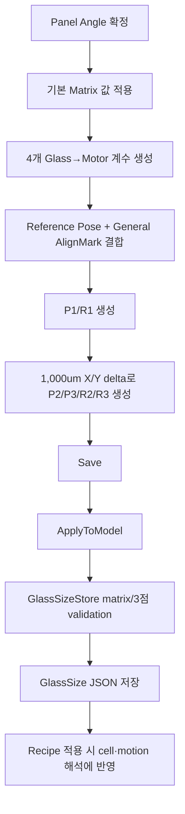
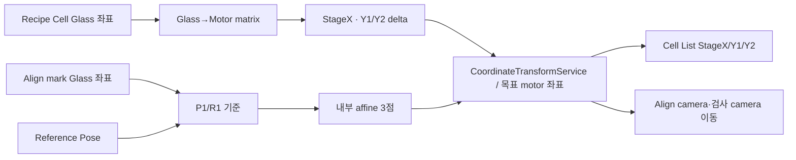
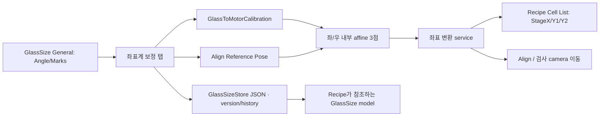

# GlassSizeWindow - 좌표계 보정 탭 분석

## 1. 화면 목적

`좌표계 보정` 탭은 글래스 좌표의 변화량(Glass X/Y)을 검사 장비의 motor 변화량(StageX/Y1/Y2)으로 해석하기 위한 기준을 설정한다.

공식 설계·변경 기록 기준으로 현재 UI는 좌/우 camera의 3점 affine 값을 직접 편집하는 방식이 아니다. 사용자는 다음 두 기준을 입력한다.

1. **Glass → Motor 2×2 matrix**: Glass X/Y delta가 StageX/Y1 delta로 얼마나 변환되는지
2. **Align Reference Pose**: General 탭의 좌/우 align mark에 카메라가 위치했을 때의 실제 장비 절대 좌표

저장 시 ViewModel이 matrix와 pose로 내부 `left_align_camera_calibration`, `right_align_camera_calibration`의 3점(P1~P3, R1~R3)을 자동 생성한다. runtime affine solver는 이 내부 3점 구조를 계속 사용한다.

## 2. 화면 구성

|영역|컨트롤|역할|
|---|---|---|
|기본값 생성|`기본 Matrix 값 적용`|현재 `PanelAngleDeg`에 맞는 Glass→Motor 기본 matrix와 파생 affine 점을 생성한다.|
|Matrix|GlassX/GlassY × StageX/UnitY1 4개 계수|글래스 delta를 motor delta로 변환하는 2×2 계수다.|
|Align Reference Pose|StageX, Left Y2, Right Y1|각 align mark를 카메라가 보는 기준 순간의 실제 축 절대 위치다.|
|현재값 읽기|`ReadCurrentAxesCommand`|Control 상태에서 StageX, InspectionUnit2Y(Y2), InspectionUnit1Y(Y1)를 읽어 pose 입력란에 채운다.|

`AxisNumberBox` 입력란은 오른쪽 클릭 메뉴의 “현재 축 값 읽기”로도 해당 축 하나를 직접 읽을 수 있다. 읽은 값은 `LostFocus`를 기다리지 않고 바인딩 source에 즉시 반영된다.

## 3. 컨트롤 분석

### 3.1 기본 Matrix 값 적용

|항목|내용|
|---|---|
|명령|`ApplyDefaultCalibrationCommand`|
|동작|`SelectedGlassSize.ApplyDefaultGlassToMotorMatrix()` 호출|
|입력 기준|현재 General 탭의 `PanelAngleDeg`|
|결과|4개 matrix 계수를 기본 preset으로 채우고 P1~P3/R1~R3 내부 affine 점을 다시 만든다.|
|주의|실측 보정값을 임의 기본값으로 대체하는 버튼이 아니다. 제품·장비 보정 절차의 시작값 또는 승인된 기본 방향값으로만 사용한다.|

XAML 안내에 명시된 0도 기본값은 다음과 같다.

```text
GlassX → (StageX=-1, UnitY1=0)
GlassY → (StageX= 0, UnitY1=1)
```

기본값은 `PanelAngleDeg`를 화면 기준 clockwise로 회전해 0/90/180/270별로 생성한다. 예를 들어 공식 변경 기록에는 270도 Y2 기준으로 `Glass X +1000 → Y2 +1000, StageX 0`, `Glass Y +1000 → Y2 0, StageX +1000`인지 확인하도록 명시되어 있다.

### 3.2 Glass → Motor Matrix

|입력 행|StageX 열|UnitY1 열|의미|
|---|---|---|---|
|GlassX|`StageXPerGlassX`|`UnitY1PerGlassX`|Glass X가 +1 µm 변할 때 StageX/Y1 변화량|
|GlassY|`StageXPerGlassY`|`UnitY1PerGlassY`|Glass Y가 +1 µm 변할 때 StageX/Y1 변화량|

현재 구현의 delta 계산식은 다음과 같다.

```text
ΔStageX = ΔGlassX × StageXPerGlassX + ΔGlassY × StageXPerGlassY
ΔY1     = ΔGlassX × UnitY1PerGlassX + ΔGlassY × UnitY1PerGlassY
ΔY2     = -ΔY1    (Y2 mirror)
```

위 식은 코드 구현에 따른 설명이다. **[추론]** Y1/Y2 mirror 관계는 양쪽 bridge의 카메라 기준 방향을 같은 방식으로 다루기 위한 설계다.

|변경한 계수|직접 영향|
|---|---|
|`StageXPerGlassX`|Glass X 방향의 목표 cell/mark 이동이 StageX에 주는 비율·부호가 바뀐다.|
|`StageXPerGlassY`|Glass Y 방향 이동이 StageX에 섞여 들어가는 회전/비직교 보정 성분이 바뀐다.|
|`UnitY1PerGlassX`|Glass X 방향 이동이 Y1/Y2 bridge에 주는 비율·부호가 바뀐다.|
|`UnitY1PerGlassY`|Glass Y 방향 이동이 Y1/Y2 bridge에 주는 비율·부호가 바뀐다.|

matrix의 determinant는 0에 가까우면 안 된다.

```text
det = StageXPerGlassX × UnitY1PerGlassY
    - StageXPerGlassY × UnitY1PerGlassX
```

저장 검증은 `|det| < 0.0000001`이면 singular matrix로 실패시킨다. 즉 두 Glass 방향이 동일한 motor 방향으로 찌그러져, 좌표 변환을 구분할 수 없는 matrix는 저장할 수 없다.

### 3.3 Align Reference Pose

|입력|모델 필드|어떻게 측정·입력하는가|변경 영향|
|---|---|---|---|
|StageX|`AlignStageSharedPose.StageX`|각 General align mark 위치에서 align camera가 정상 시야일 때의 공통 StageX 절대값을 입력하거나 현재값 읽기를 사용한다.|P1/R1의 공통 StageX 기준이 바뀌며, 파생 3점 전체의 StageX 절대 기준도 이동한다.|
|Left Y2|`AlignBridgeReferencePose.LeftAlignUnitY`|좌측 align mark에 **Y2 camera**가 위치했을 때 `InspectionUnit2Y` 절대값을 입력한다.|P1의 Y2 기준과 left 3점의 절대 Y축 기준이 바뀐다.|
|Right Y1|`AlignBridgeReferencePose.RightAlignUnitY`|우측 align mark에 **Y1 camera**가 위치했을 때 `InspectionUnit1Y` 절대값을 입력한다.|R1의 Y1 기준과 right 3점의 절대 Y축 기준이 바뀐다.|

이 세 값은 General 탭의 align mark **글래스 좌표**와 짝을 이룬다.

```text
P1 = Left Align mark Glass(X,Y)  ↔  StageX, Left Y2
R1 = Right Align mark Glass(X,Y) ↔  StageX, Right Y1
```

P1/R1을 기준으로 matrix의 기본 1,000 µm delta를 적용하여 P2/P3/R2/R3가 자동 생성된다. UI에서는 이 파생 행을 보여 주거나 직접 수정하지 않는다.

### 3.4 현재값 읽기

```text
현재값 읽기
  → Vars.ControlRuntime 존재 확인
  → EnsureConnectedAsync
  → RefreshStatusAsync
  → StageX, InspectionUnit2Y, InspectionUnit1Y 위치 추출
  → StageX / Left Y2 / Right Y1 입력값 갱신
  → 상태 메시지에 GlassPresent, Contacted 표시
```

이 버튼은 축을 이동시키지 않는다. Control이 보고한 현재 상태값을 읽기만 한다. 단, 올바른 align mark 위치로 장비를 이동시켜 놓았는지는 사용자가 보장해야 한다.

## 4. 이벤트 분석

### 4.1 기본값 생성과 저장



`ApplyToModel()`은 저장 직전에 `RebuildDerivedCalibrationPoints()`를 호출한다. 따라서 General의 align mark, Reference Pose, Matrix를 수정한 뒤 저장하면 내부 3점은 다시 생성된다.

### 4.2 실제 좌표 사용 흐름



정확한 runtime에는 내부 affine solver가 사용된다. matrix 입력은 그 solver가 요구하는 3점 calibration을 자동 구성하는 상위 설정이다.

## 5. 데이터 바인딩

|UI|ViewModel|`GlassSizeModel` 저장 위치|
|---|---|---|
|GlassX→StageX|`StageXPerGlassX`|`GlassToMotorCalibration.StageXPerGlassX`|
|GlassX→Y1|`UnitY1PerGlassX`|`GlassToMotorCalibration.UnitY1PerGlassX`|
|GlassY→StageX|`StageXPerGlassY`|`GlassToMotorCalibration.StageXPerGlassY`|
|GlassY→Y1|`UnitY1PerGlassY`|`GlassToMotorCalibration.UnitY1PerGlassY`|
|StageX|`ReferenceLeftAlignStageX`|`AlignStageSharedPose.StageX`|
|Left Y2|`ReferenceLeftAlignUnitY`|`AlignBridgeReferencePose.LeftAlignUnitY`|
|Right Y1|`ReferenceRightAlignUnitY`|`AlignBridgeReferencePose.RightAlignUnitY`|

저장 시 matrix 계수는 소수점 여섯 자리, 파생 축 좌표는 소수점 셋째 자리로 반올림된다. **[추론: `RoundMatrixValue`, `RoundAxisValue` 구현 기준]**

## 6. 사용자 입장에서

### 권장 설정 절차

1. General 탭에서 Glass Width/Height, Panel Angle, Left/Right Align mark 좌표를 먼저 확정한다.
2. 실제 장비에 글래스를 정해진 방향으로 안착한다.
3. 왼쪽 mark가 Y2 align camera 시야에, 오른쪽 mark가 Y1 align camera 시야에 정확히 오도록 장비를 이동한다.
4. `현재값 읽기`를 눌러 StageX, Left Y2, Right Y1을 가져온다. 필요하면 각 입력란에서 오른쪽 클릭 `현재 축 값 읽기`로 개별 갱신한다.
5. 기본 기구 방향에서 시작한다면 `기본 Matrix 값 적용`을 눌러 현재 Panel Angle 기준 preset을 만든다.
6. 승인된 계측/보정 결과가 있으면 4개 matrix 계수를 그 값으로 입력한다.
7. Save의 변경 목록을 확인해 저장한다.
8. 현재 Recipe 적용 후, 알려진 Glass 좌표의 목표 StageX/Y1/Y2와 실제 이동 결과를 저속·안전 조건에서 검증한다.

### 버튼 사용 기준

|상황|권장 동작|
|---|---|
|Panel Angle을 변경함|matrix가 자동으로 바뀌지 않으므로 `기본 Matrix 값 적용` 또는 승인된 matrix 재입력을 수행한다.|
|새 모델을 처음 만듦|기본 matrix/preset을 출발점으로 만들고 실제 보정·이동 검증을 완료한다.|
|장비 기준 위치를 다시 teach함|align mark에 실제 카메라를 맞춘 뒤 `현재값 읽기`를 사용한다.|
|실측상 축 scaling/cross-axis 오차가 있음|공인된 calibration 결과로 matrix 4개 값을 수정하고 determinant·이동 검증을 수행한다.|

### 주의 사항

- `현재값 읽기`는 카메라가 mark에 맞았는지 검증하지 않습니다. 잘못된 위치에서 읽으면 그 오차가 기준 pose로 저장됩니다.
- matrix 계수의 부호 하나가 틀려도 반대 방향 이동 또는 cross-axis 오차가 발생할 수 있습니다. 생산 중 임의 수정하지 마세요.
- matrix와 General의 Panel Angle은 함께 검증해야 합니다. 서로 다른 방향 기준을 섞으면 표시와 실제 motor 이동이 불일치할 수 있습니다.
- 시뮬레이션 모드에서는 실제 장치 pose를 성공처럼 만들지 않습니다. 실제 축 값 확인이 필요한 보정은 실장비·안전 절차에서 수행해야 합니다.

## 7. 업무 로직 추론

- **[추론]** matrix는 “글래스 기준 길이·방향”을 “장비가 실제 움직여야 할 축 길이·방향”으로 옮기는 선형 근사이며, off-diagonal 계수는 글래스 회전 또는 축 비직교 보정에 사용된다.
- **[추론]** P1/R1 절대 pose와 matrix delta를 분리한 구조는 기준 위치를 다시 teach할 때 scale/방향 계수를 다시 측정하지 않고, 기준 위치만 옮길 수 있게 한다.
- **[추론]** Y2 mirror는 동일 Glass delta에 대해 좌/우 bridge의 motor 증가 방향이 반대인 물리 구조를 모델링한다.
- **[추론]** 화면에서 3점 UI를 제거한 것은 독립 3점 수동 입력 간의 불일치를 줄이고, matrix 한 벌로 좌/우 파생점을 일관되게 생성하려는 구조다.

## 8. 문서작성 요약

|항목|정의|
|---|---|
|Matrix 입력|Glass X/Y delta → StageX/Y1 delta 2×2 계수|
|Y2 처리|Y1 delta의 mirror 관계로 내부 3점 생성|
|Reference Pose|align mark 위치에서의 StageX, Left Y2, Right Y1 절대값|
|기본값 버튼|Panel Angle 0/90/180/270 기반 preset 생성|
|현재값 읽기|Control의 StageX/InspectionUnit2Y/InspectionUnit1Y read-only 조회|
|저장 검증|matrix non-singular, left/right calibration 각각 정확히 3점|
|하류 영향|목표 motor 좌표, Align/검사 camera 이동, Cell List 축값|

## 9. 이해되지 않는 부분 / 추가 확인 필요

|확인 항목|현재 확인 결과|추가 확인 방법|
|---|---|---|
|matrix 실측 산출 절차|UI는 입력·기본 preset만 제공한다.|계측 fixture, 표준 point, 허용 오차를 포함한 현장 calibration SOP를 확인한다.|
|좌표계 보정값의 허용 범위|계수 및 pose에는 UI min/max가 없다.|Control soft limit, 기구 사양, 제품별 승인값으로 범위를 확정한다.|
|runtime solver의 최종 식|모델은 내부 3점으로 변환하고 runtime affine solver 사용 기록이 있다.|`CoordinateTransformService`의 실제 solver·tool offset 적용을 별도 분석한다.|
|기본 matrix의 충분성|Panel angle 기반 기하 preset이다.|실장비의 scale/skew/offset 오차를 보정해야 하는지 이동 반복성 측정으로 확인한다.|

## 10. 전체 프로젝트 연결



관련 코드:

- `uLedAoiConsole/Windows/Recipe/GlassSizeWindow.xaml`
- `uLedAoiConsole/ViewModels/GlassSizeViewModel.cs`
- `uLedAoiConsole/Controls/AxisNumberBox.cs`
- `uLedAoiConsole/Models/GlassSizeConfigModels.cs`
- `uLedAoiConsole/Stores/GlassSizeStore.cs`

우선 참조 문서:

- `docs/glass-axis-affine-transform-design.md`
- `docs/stage-glass-coordinate-system.md`
- `docs/development/change-log.md`
