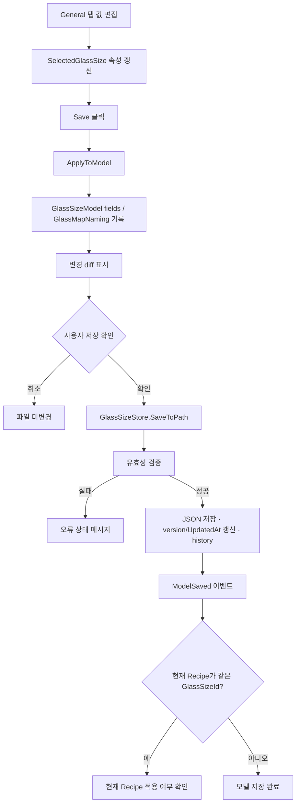
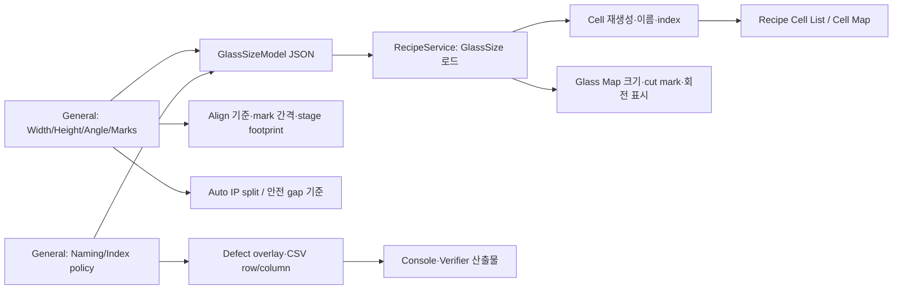

# GlassSizeWindow - General 탭 분석

## 1. 화면 목적

`GlassSizeWindow > General`은 Glass Size Model의 기초 기하 정보와 Glass Map 명명·결과 좌표 표기 정책을 설정하는 탭이다.

공식 문서 기준에서 Glass Size Model은 제품/글래스별 기준 데이터의 운영 정본이다. General 탭의 값은 다음 영역에 연결된다.

```text
Glass 크기·회전·Align mark
  → Cell 배치/재생성, Glass Map 표시, Align 기준, Motion 좌표 해석

Glass Map Naming 정책
  → Cell 이름, cutting mark 표시, raw/dot index 변환
  → defect overlay, CSV·검증 산출물의 row/column 표기
```

이 탭에는 motor matrix·align reference pose의 직접 입력 항목이 없다. 이들은 별도 `좌표계 보정` 탭의 책임이다.

## 2. 화면 구성

|영역|설정값|
|---|---|
|기본 정보|Description, Glass Width/Height, Panel Angle, Left/Right Align mark의 Glass X/Y 좌표|
|Glass Map Naming|Cutting Mark, First Cell Pos, 분판 이름 사용, X/Y Rule, Name Order, 사용자 정의 labels|
|결과 index 정책|Raw Index Origin, Dot Index Origin, Dot Index Base, XY Swap|

모든 값은 `SelectedGlassSize`(`GlassSizeItemViewModel`)에 바인딩된다. 수치 `TextBox`는 포커스를 잃을 때(`UpdateSourceTrigger=LostFocus`) ViewModel로 반영되고, Panel Angle은 ComboBox 선택 즉시 반영된다.

## 3. 컨트롤 분석

### 3.1 기본 정보

|컨트롤|모델 필드|설정 방법|변경 영향|검증·범위|
|---|---|---|---|---|
|Description|`GlassSizeModel.Description`|제품/규격/용도를 기록한다.|목록 표시와 운영 식별 보조 정보에 반영된다.|선택 입력. `GlassSizeId`를 바꾸는 항목이 아니다.|
|Glass Width (um)|`GlassWidthUm`|실제 글래스 폭을 µm 단위 정수로 입력한다.|Glass 외곽 크기, cell 배치 좌표·중심, stage footprint, map 표시, 일부 UVW 중심 계산에 영향을 준다.|저장 시 `> 0` 필수.|
|Glass Height (um)|`GlassHeightUm`|실제 글래스 높이를 µm 단위 정수로 입력한다.|Glass 외곽 크기, cell 배치 좌표·중심, map 표시 및 회전 footprint에 영향을 준다.|저장 시 `> 0` 필수.|
|Panel Angle (deg)|`PanelAngleDeg`|0/90/180/270 중 실제 장비 안착 방향을 선택한다.|Glass Map 회전 표시, Stage 방향 해석, 안전 gap·동시 검사 pairing, auto IP split, 기본 Glass→Motor matrix 생성에 영향을 준다.|UI 선택값은 4개뿐이며 저장 시 90도 배수만 허용한다. `XIndex/YIndex` 계산에는 사용하지 않는 것이 공식 문서 기준이다.|
|Left Align (Y2) X/Y|`AlignMarks.LeftAlignUm`|좌측(Y2) align mark의 **글래스 좌표**를 µm로 입력한다.|Align의 기준 mark 위치·좌우 mark 간격 검증에 사용된다.|현재 UI에는 좌표 범위 검증이 없다. 실제 글래스 좌표계/마크 도면 기준을 사용한다.|
|Right Align (Y1) X/Y|`AlignMarks.RightAlignUm`|우측(Y1) align mark의 **글래스 좌표**를 µm로 입력한다.|위와 동일하며 좌·우 두 mark의 상대 위치가 Align theta/보정의 기준이 된다.|현재 UI에는 좌표 범위 검증이 없다.|

`Left Align (Y2)`, `Right Align (Y1)`의 Y1/Y2 표기는 현재 프로젝트의 bridge/align camera 배치 기준이다. mark X/Y는 motor 축값이 아니라 GlassSize의 글래스 좌표다. motor 기준값은 `좌표계 보정` 탭의 reference pose·matrix와 혼동하면 안 된다.

### 3.2 Glass Map Naming

|컨트롤|모델 필드|설정 방법|변경 영향|
|---|---|---|---|
|Cutting Mark|`CuttingMarkPosition`|실제 절단 mark가 있는 glass corner를 TopLeft/TopRight/BottomLeft/BottomRight에서 선택한다.|GlassMap 외곽의 cutting mark 표시와 map의 기준 corner에 반영된다.|
|First Cell Pos|`FirstCellPosition`|셀 이름·순번을 시작할 물리 corner를 선택한다.|셀 이름 생성 방향과 첫 셀의 label이 바뀐다. cell의 물리 rect 자체를 이동시키는 값은 아니다.|
|분판 이름 사용|`UsePartitionName`|체크하면 cell name token 앞에 partition을 포함한다.|Cell 이름, 화면 표시, 산출물의 cell 식별자가 달라질 수 있다.|
|X Rule|`XRule`|X label 형식을 선택한다: `01`, `1`, `A`, 사용자 정의.|cell name의 X token 표기가 바뀐다. `User Defined` 선택 시 X Labels를 입력한다.|
|Y Rule|`YRule`|Y label 형식을 선택한다.|cell name의 Y token 표기가 바뀐다. `User Defined` 선택 시 Y Labels를 입력한다.|
|Name Order|`TokenOrder`|`X then Y` 또는 `Y then X`를 선택한다.|예: `1A`와 `A1`처럼 X/Y token 순서가 바뀐다. 분판 사용 시 partition token은 앞에 추가된다.|
|X Labels|`UserDefinedXLabels`|쉼표, 세미콜론, 공백 줄 등으로 label을 구분해 입력한다.|X Rule이 User Defined일 때 해당 label 목록을 cell naming에 사용한다.|
|Y Labels|`UserDefinedYLabels`|위와 동일하다.|Y Rule이 User Defined일 때 사용한다.|

X 또는 Y Rule을 `User Defined`로 처음 바꾸면 ViewModel은 빈 label 입력란에 기본값을 채운다. X는 `A`~`Z`, Y는 `01`~`30`이다. 이는 편의를 위한 초기값일 뿐 실제 제품 naming 기준을 대체하지 않는다. **[추론: ViewModel 자동 채움 코드 기준]**

### 3.3 Raw/Dot index 표기 정책

프로젝트 용어 기준에서 `pixel`은 카메라 물리 pixel, `dot`은 R/G/B sub dot을 포함한 논리 dot, `ip index`는 IP/algorithm 내부 index다. General 탭의 아래 설정은 IP 내부 값을 바꾸지 않고 Console/Verifier의 표시·CSV 변환 기준을 정한다.

|컨트롤|모델 필드|설정 방법|변경 영향|
|---|---|---|---|
|Raw Index Origin|`RawIndexOrigin`|IP raw `(0,0)`이 실제 glass의 어느 corner인지 선택한다.|raw mapping image와 물리 위치의 기준 corner를 해석하는 정책에 반영된다.|
|Dot Index Origin|`DotIndexOrigin`|최종 dot row/column의 `(0,0)` 또는 기준 시작 corner를 선택한다.|defect/WD 결과의 표시 row·column 방향이 바뀐다.|
|Dot Index Base|`DotIndexBase`|0 base 또는 1 base 선택.|최종 표시·CSV의 dot row/column 시작 번호가 0 또는 1이 된다.|
|XY Swap|`DotIndexSwapXY`|필요한 경우 체크.|IP index의 X/Y 해석 축을 교환하여 최종 row/column 변환에 반영한다.|

공식 기준상 최종 row는 `ry`, column은 `rx * 3 + phase`로 계산된다. phase는 R/G/B sub dot 순서다. 따라서 origin/base/swap을 바꾸면 같은 defect라도 최종 산출물의 row/column 표기가 바뀔 수 있다. IP/algorithm이 전송한 원래 ip index와 검사 판정 자체를 변경하는 설정은 아니다.

## 4. 이벤트 분석

### 4.1 화면 편집부터 저장까지



`ApplyToModel()`은 General 탭의 ViewModel 값을 `GlassSizeModel`과 `GlassMapNamingPolicy`로 옮긴다. User labels 텍스트는 `, ; 줄바꿈 탭`을 구분자로 분리하고 빈 항목을 제거한다.

### 4.2 현재 Recipe에 미치는 시점

모델을 저장했다고 현재 Recipe가 무조건 즉시 변경되는 것은 아니다. `GlassSizeWindow.OnModelSaved()`는 현재 작업 중 Recipe의 `GlassSizeId`가 저장 모델 ID와 같은 경우에만 “현재 작업 중인 레시피에 적용” 확인을 표시한다.

사용자가 적용을 승인하면 편집기가 열린 경우 `ApplyGlassSizeModelFromExternal(model, save: true)`를 사용하고, 그렇지 않으면 recipe의 `GlassSizeId` 설정·cell 재생성·recipe 저장·history 기록을 수행한다. **[추론: code-behind 호출 흐름]** 이 과정은 모델 파일 저장과 Recipe 변경을 의도적으로 분리한다.

### 4.3 영향 흐름



## 5. 데이터 바인딩

|UI 그룹|ViewModel 속성|모델 저장 대상|
|---|---|---|
|Description|`SelectedGlassSize.Description`|`GlassSizeModel.Description`|
|치수/각도|`GlassWidthUm`, `GlassHeightUm`, `PanelAngleDeg`|동명 `GlassSizeModel` 필드|
|Align mark|`LeftAlignX/Y`, `RightAlignX/Y`|`AlignMarks.LeftAlignUm`, `AlignMarks.RightAlignUm`|
|Naming|`CuttingMarkPosition`, `FirstCellPosition`, `UsePartitionName`, `XRule`, `YRule`, `CellNameOrder`, labels|`GlassMapNamingPolicy`|
|Index 정책|`RawIndexOrigin`, `DotIndexOrigin`, `DotIndexBase`, `DotIndexSwapXY`|`GlassMapNamingPolicy`|

`CellNameOrder`는 모델의 단일 필드가 아니라 `TokenOrder` 목록으로 저장된다. 분판 이름 사용 여부에 따라 `Partition` token을 먼저 넣고, 이어 `X,Y` 또는 `Y,X` 순서를 구성한다.

## 6. 사용자 입장에서

### 설정 권장 순서

1. 제품 도면과 설치 방향을 준비한다.
2. `Glass Width`, `Glass Height`에 실측/승인된 외곽 치수를 µm로 입력한다.
3. 실제 안착 방향에 맞게 `Panel Angle`을 0/90/180/270 중 선택한다.
4. 도면의 좌/우 align mark를 글래스 좌표로 확인하여 `Left Align (Y2)`, `Right Align (Y1)`에 입력한다.
5. 실제 cutting mark corner를 선택한다.
6. 생산에서 사용하는 첫 cell 기준 corner, 분판 이름 포함 여부, X/Y label 규칙과 순서를 설정한다.
7. IP raw index와 고객/생산 산출물의 dot row/column 기준을 확인하여 origin/base/swap을 설정한다.
8. Save의 변경 목록을 확인하여 저장한다.
9. 현재 Recipe 적용 여부를 확인한 뒤, Cell Map·Cell List·Align·결과 CSV를 검증한다.

### 값 변경 후 반드시 확인할 것

|변경한 값|반드시 확인할 결과|
|---|---|
|Width/Height|glass 외곽, cell rect/center, stage footprint와 재생성된 cell 수·위치|
|Panel Angle|Glass Map 회전, Y1/Y2 방향, auto IP split/safety gap, 기본 matrix 필요 여부|
|Align marks|Align mark 간격, camera target, align 실행 전 유효성|
|First Cell/Name rule/labels|Cell List·Cell Map의 이름 및 export cell 폴더명|
|Cutting Mark|Glass Map의 cutting mark 방향과 현물 방향|
|Raw/Dot origin/base/swap|동일 defect의 overlay 좌표, CSV row/column, 0/1-base 표기|

## 7. 업무 로직 추론

- **[추론]** General 탭의 치수·회전 설정은 제품을 stage 위에 어떻게 해석할지 정의하고, 좌표계 보정 탭의 matrix는 그 해석을 실제 motor 축으로 변환하는 역할을 분리한다.
- **[추론]** `First Cell Pos`는 생산자가 부르는 cell 순서만 바꾸고 물리 cell design 자체를 재배치하지 않도록 분리된 naming 정책이다.
- **[추론]** origin/base/swap은 이미 검사된 defect의 합불을 바꾸기보다, IP 결과를 현장·고객이 사용하는 좌표 체계로 번역하는 출력 계약이다.
- **[추론]** Panel Angle을 바꾸고 기본 matrix를 다시 적용하지 않으면, 표시/배치 해석과 Glass→Motor 변환이 서로 다른 방향을 가리킬 수 있다. 실제 변경 절차는 좌표계 보정 검증과 함께 수행해야 한다.

## 8. 문서작성 요약

|항목|정본/역할|
|---|---|
|Glass ID|파일명 = `GlassSizeId` (이 탭에는 직접 편집란 없음)|
|설명|`Description`|
|기하|Width/Height, PanelAngle, AlignMarks|
|명명|`GlassMapNamingPolicy`: cutting/first cell/labels/token order|
|결과 좌표|`RawIndexOrigin`, `DotIndexOrigin`, `DotIndexBase`, `DotIndexSwapXY`|
|저장 검증|치수 양수, angle 90도 배수, axis/calibration/align mark 구성|
|영향 대상|Cell Map/List, Align, motion 해석, IP split, overlay/CSV/Verifier|

## 9. 이해되지 않는 부분 / 추가 확인 필요

|항목|현재 확인 결과|추가 확인 필요|
|---|---|---|
|Align mark 입력 좌표의 기준 원점·방향|UI는 Glass X/Y(µm)로만 표시한다.|제품 도면과 stage-glass-coordinate-system 문서 기준으로 현장 입력 표준을 확정한다.|
|사용자 정의 labels 개수 부족/중복|텍스트를 목록으로 파싱하지만 General 탭에서 개수·중복 검증은 보이지 않는다.|셀 수보다 적거나 중복된 labels일 때 cell naming 결과와 저장 검증을 실행 확인한다.|
|Raw Index Origin의 정확한 모든 소비처|공식 변경 기록은 raw `(0,0)`의 물리 corner 설정이라고 정의한다.|mapping image/replay 변환 코드별 적용 범위를 테스트한다.|
|Width/Height 변경 후 기존 Recipe 적용 방식|현재 Recipe 적용 시 cell 재생성 호출이 존재한다.|기존 cell의 use/IP/manual 수정값이 어느 수준까지 보존되는지 제품 전환 시험으로 확인한다.|

## 10. 전체 프로젝트 연결

관련 코드:

- `uLedAoiConsole/Windows/Recipe/GlassSizeWindow.xaml` — General 탭 UI/binding
- `uLedAoiConsole/ViewModels/GlassSizeViewModel.cs` — `GlassSizeItemViewModel`, `ApplyToModel`, 저장·변경 확인
- `uLedAoiConsole/Models/GlassSizeConfigModels.cs` — `GlassSizeModel`, `GlassMapNamingPolicy`
- `uLedAoiConsole/Stores/GlassSizeStore.cs` — JSON 검증·저장
- `uLedAoiConsole/Recipes/RecipeService.cs` — GlassSize 로드, cell/map naming 적용

우선 참조 문서:

- `docs/console-recipe-document.md`
- `docs/glass-map.md`
- `docs/rgb-level-inspection-algorithm.md`
- `docs/stage-glass-coordinate-system.md`
- `docs/development/architecture-decisions.md`
- `docs/development/change-log.md`
