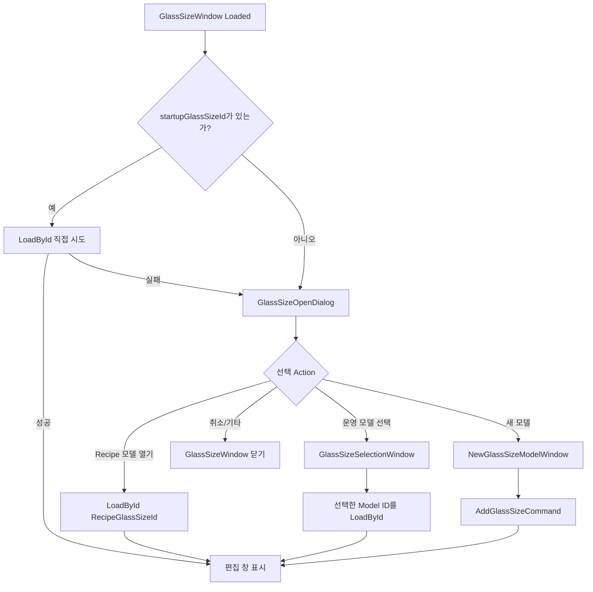
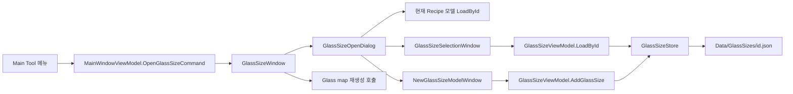

# Glass Size Model - GlassSizeOpenDialog 분석

## 1. 화면 목적

`GlassSizeOpenDialog`는 Main 화면의 `Tool > Glass Size Model`을 선택했을 때, 본 편집 창(`GlassSizeWindow`)이 열리기 전에 **어떤 Glass Size Model을 작업 대상으로 할지 결정하는 시작 다이얼로그**다.

공식 문서 기준에서 Glass Size Model은 제품/글래스의 크기·각도·Align 기준·좌표 정책 등 여러 레시피와 검사 좌표 계산에 영향을 주는 운영 기준 데이터다. 모델의 파일명과 `GlassSizeId`는 같은 식별자를 사용하며, `Name` 대신 `Description`이 설명을 담당한다.

따라서 이 다이얼로그는 현재 Recipe가 이미 참조하는 모델을 우선 열 수 있게 하되, 다른 운영 모델 편집 또는 새 모델 생성을 사용자가 **명시적으로** 선택하도록 분리한다.

## 2. 진입 및 화면 구성

```text
MainWindow XAML
  Tool > Glass Size Model
  → OpenGlassSizeCommand
  → MainWindowViewModel.OpenGlassSize()
  → MainWindow.OpenGlassSizeWindow()
  → GlassSizeWindow.ShowDialog()
  → Loaded: ResolveStartupSelection()
  → GlassSizeOpenDialog.ShowDialog()
```

`MainWindowViewModel.OpenGlassSize()`는 Glass Size 창이 닫힌 뒤 `GenerateGlassMap()`도 호출한다. **[추론]** 모델 편집 결과로 현재 표시 중인 glass map을 다시 계산·갱신하려는 후처리로 보인다. 실제 레시피 적용 여부는 편집 창의 저장 후 확인 절차에 따라 달라진다.

|영역|컨트롤|표시 내용|
|---|---|---|
|제목|`Glass Size Model 작업 대상 확인`|작업 대상 선택 단계임을 표시한다.|
|안내문|`messageText`|현재 Recipe 모델 파일의 존재 여부에 따라 선택 방법을 설명한다.|
|현재 Recipe 모델|`recipeModelText`|Recipe가 참조하는 `GlassSizeId`와 운영 라이브러리 파일 존재 상태를 표시한다.|
|실행 버튼|`Recipe 모델 열기`|현재 Recipe가 참조하는 운영 모델 파일을 편집 대상으로 연다.|
|실행 버튼|`운영 모델 선택`|운영 GlassSize 라이브러리의 다른 모델을 선택해 편집 대상으로 연다.|
|실행 버튼|`새 모델`|`NewGlassSizeModelWindow`를 통해 새 모델 초안을 만든다.|
|취소|`취소`|선택을 끝내지 않고 GlassSizeWindow 자체를 닫는다.|

창은 560×260, 크기 변경 불가(`NoResize`), 부모 창 중앙 배치(`CenterOwner`)다. `Recipe 모델 열기`는 기본 버튼(`IsDefault=True`), `취소`는 취소 버튼(`IsCancel=True`)이다.

## 3. 컨트롤 분석

|컨트롤|활성 조건|클릭 결과|사용자 주의 사항|
|---|---|---|---|
|Recipe Model 표시|항상 표시|`RecipeGlassSizeId`가 있으면 ID를, 파일이 없으면 “운영 라이브러리에서 찾을 수 없음”을 표시|ID가 있다고 파일이 존재하는 것은 아니다.|
|`Recipe 모델 열기`|현재 Recipe의 ID가 비어 있지 않고 `Vars.GetGlassSizePath(id)` 파일이 존재|`SelectedAction = OpenRecipeModel` 후 다이얼로그 성공 종료|현재 Recipe와 같은 모델을 수정하려는 경우에 사용한다. 파일이 없으면 비활성화된다.|
|`운영 모델 선택`|항상 활성|`SelectedAction = SelectLibraryModel` 후 성공 종료|Recipe 기준과 다른 모델을 **편집 대상으로만** 열 수 있다. Recipe 적용 여부는 후속 흐름에서 별도 확인한다.|
|`새 모델`|항상 활성|`SelectedAction = CreateNew` 후 성공 종료|새 모델은 별도 생성 창에서 파일명·설명·복사 원본을 입력한다.|
|`취소`|항상 활성|`DialogResult` 없이 닫힘|상위 `GlassSizeWindow`는 시작 선택 실패로 판단하여 함께 닫힌다.|

외부 JSON 가져오기 버튼은 이 시작 다이얼로그에 없다. 공식 변경 기록에 따라 중복 진입점을 제거했으며, 외부 JSON은 본 편집 창의 파일 메뉴에서 가져와야 한다.

## 4. 이벤트 분석

### 4.1 생성 시 상태 판정

```text
GlassSizeOpenDialog(recipeGlassSizeId)
  → 문자열 Trim, null이면 빈 값
  → hasRecipeModel = ID 존재 여부
  → recipeModelExists = ID 존재 && Vars.GetGlassSizePath(ID) 파일 존재
  → 표시문·안내문 설정
  → Recipe 모델 열기 활성/비활성 설정
```

이 다이얼로그는 모델 JSON을 읽거나 유효성 검사를 하지 않는다. 파일의 존재만 확인한다. **[추론]** 파일이 존재하지만 JSON 내용이 잘못된 경우의 오류는 후속 `LoadById()`/store load 단계에서 표시된다.

### 4.2 버튼별 상위 창 분기



`OpenRecipeButton_Click`, `SelectButton_Click`, `NewButton_Click`은 데이터를 직접 변경하지 않고, `SelectedAction` enum을 설정한 뒤 `DialogResult = true`로 상위 창에 선택 의도만 전달한다.

### 4.3 운영 모델 선택 후속 창

`운영 모델 선택`은 `GlassSizeSelectionWindow`를 연다. 이 창은 `Vars.GlassSizesDir`의 `*.json`을 읽어 ID, 설명, Width/Height, Panel Angle, Align mark, 원본 경로를 보여 준다. 선택 뒤에는 확인 대화상자로 대상 모델이 현재 Recipe와 다른지, 셀 좌표·Align·Motion 계산에 영향이 있음을 경고한다.

다만 현재 `GlassSizeWindow.SelectLibraryModel()`은 선택창의 `SelectedModel` 전체를 Recipe에 적용하지 않고 `SelectedModel.GlassSizeId`만 사용하여 `_viewModel.LoadById()`로 편집 창을 연다. 즉 이 **시작 다이얼로그 경로에서는 모델 선택이 곧바로 현재 Recipe 변경을 의미하지 않는다.**

`GlassSizeSelectionWindow`의 버튼 텍스트와 안내는 `Apply to Recipe`라고 되어 있어 위 코드 흐름과 다르게 읽힐 수 있다.

|구분|선택창 표시 문구|GlassSizeOpenDialog에서의 실제 후속 코드|판정|
|---|---|---|---|
|운영 모델 선택|“Recipe에 적용”, `Apply to Recipe`|선택 ID로 모델을 load하여 편집 대상으로 설정|**문서/화면 문구와 코드 동작 차이** — 이 진입 경로는 즉시 Recipe 적용이 아니다.|

### 4.4 새 모델 후속 창

`새 모델`은 `NewGlassSizeModelWindow`를 열며 다음을 입력받는다.

|입력|역할|검증|
|---|---|---|
|File Name|새 모델 파일명 및 `GlassSizeId`|필수, OS 파일명 금지 문자 불가, 동일 파일 존재 불가|
|Desc|모델 설명|선택 입력|
|Copy From Model|기존 운영 모델 복사 원본|선택 입력|
|Target Path|예상 저장 경로|읽기 전용 표시|

생성 요청은 `GlassSizeViewModel.AddGlassSize()`로 전달된다. 복사 원본이 있으면 모델을 deep clone한 뒤 새 ID·설명을 설정하고, 없으면 기본 align/calibration 구조를 포함한 새 모델 초안을 만든다. 이 시점은 초안을 편집기에 넣는 단계이며, 파일 저장은 본 편집 창의 Save 흐름에서 일어난다. **[추론: `AddGlassSize()`에 파일 write 호출이 없고, Save command가 별도이므로]**

## 5. 데이터 바인딩

`GlassSizeOpenDialog`는 MVVM 바인딩을 사용하지 않는 code-behind 중심 다이얼로그다.

|XAML 요소|데이터 출처|갱신 시점|
|---|---|---|
|`recipeModelText.Text`|생성자 인자 `recipeGlassSizeId`와 파일 존재 여부|생성 시 1회|
|`messageText.Text`|`recipeModelExists` 여부|생성 시 1회|
|`openRecipeButton.IsEnabled`|`recipeModelExists`|생성 시 1회|
|`SelectedAction`|각 Button Click handler|사용자 클릭 시|

상위 `GlassSizeWindow`는 직접 `DataContext = GlassSizeViewModel`을 설정하지만, 시작 다이얼로그는 그 ViewModel을 공유하거나 수정하지 않는다. 선택 결과만 `GlassSizeOpenAction`으로 반환한다.

## 6. 사용자 입장에서

### 어떤 버튼을 눌러야 하나

|상황|권장 버튼|이유|
|---|---|---|
|현재 열려 있는 Recipe가 사용하는 모델의 기준값을 수정|Recipe 모델 열기|현재 Recipe의 `GlassSizeId`가 가리키는 운영 파일을 연다.|
|다른 제품/글래스 모델을 조회 또는 편집|운영 모델 선택|현재 Recipe와 분리해 운영 라이브러리 모델을 고를 수 있다.|
|신규 제품의 모델을 처음 등록|새 모델|파일명, 설명, 기존 모델 복사 여부를 명시적으로 정한다.|
|현재 Recipe에 모델이 없거나 파일이 사라짐|운영 모델 선택 또는 새 모델|Recipe 모델 열기는 비활성화된다.|

### 안전한 사용 절차

1. 상단 `Recipe Model` 표시에서 현재 Recipe가 참조하는 ID와 파일 존재 상태를 확인한다.
2. 현재 Recipe 기준을 수정할 목적이면 `Recipe 모델 열기`를 선택한다.
3. 다른 모델을 열 때는 `운영 모델 선택`에서 ID, 치수, 각도, Align mark를 확인한다.
4. 본 편집 창에서 값을 저장할 때 현재 Recipe에 적용할지 묻는 경우, 대상 ID가 맞는지 다시 확인한다.
5. 모델 변경은 셀 좌표·Align·Motion 계산에 영향을 줄 수 있으므로, 적용 후 cell map과 관련 recipe를 검증한다.

### 주의 사항

- `Recipe 모델 열기` 비활성화는 모델 ID가 없거나 해당 운영 JSON 파일이 없다는 뜻이다. 임의 기본 모델로 대체하지 않는다.
- `운영 모델 선택` 후 선택창의 `Apply to Recipe` 문구만 보고 Recipe가 즉시 바뀌었다고 판단하지 않는다. 현재 시작 경로는 선택 모델을 편집 창에 로드한다.
- 외부 JSON 가져오기는 이 다이얼로그가 아니라 GlassSizeWindow의 파일 메뉴에서 수행한다.
- 새 모델의 File Name은 곧 `GlassSizeId` 및 운영 파일명이다. 나중에 바꾸기보다 안정적인 제품 식별자를 처음부터 사용한다.

## 7. 업무 로직 추론

- **[추론]** 현재 Recipe 모델을 기본 선택으로 제공하는 것은 작업자가 다른 제품의 좌표·Align 기준을 실수로 수정하는 위험을 줄이기 위한 UX 경계다.
- **[추론]** 파일 존재 여부만 사전 검사하고 모델 검증은 loader에 맡긴 구조는, 다이얼로그를 빠른 진입 선택 역할로 제한하고 JSON/보정 데이터 검증 책임을 `GlassSizeStore`에 모으기 위한 것이다.
- **[추론]** `startupGlassSizeId`가 주어질 때 다이얼로그를 건너뛰는 경로는 Recipe General 탭의 “모델 편집”처럼 대상 모델이 이미 확정된 호출부를 위한 것이다.
- **[추론]** 선택창이 model clone을 만들더라도 이 시작 경로에서 ID만 재사용하는 것은, 편집 대상 로드와 Recipe 적용을 한 동작으로 묶지 않으려는 현재 구현 의도다.

## 8. 문서작성 요약

|항목|내용|
|---|---|
|진입 메뉴|Main > Tool > Glass Size Model|
|시작 창|`GlassSizeOpenDialog`|
|입력 데이터|현재 `Vars.Recipe?.GlassMap?.GlassSizeId`|
|선택 결과|`GlassSizeOpenAction`: Recipe 열기 / 라이브러리 선택 / 새 모델|
|현재 Recipe 모델 열기 조건|ID 존재 + `Vars.GetGlassSizePath(id)` 파일 존재|
|운영 저장소|`Vars.GlassSizesDir`의 JSON 파일|
|식별 원칙|파일명 = `GlassSizeId`, 설명 = `Description`|
|외부 JSON|시작 창이 아닌 본 편집 창 파일 메뉴|
|관련 후속 창|`GlassSizeSelectionWindow`, `NewGlassSizeModelWindow`|

## 9. 이해되지 않는 부분 / 추가 확인 필요

|확인 항목|현재 확인 결과|추가 확인 필요|
|---|---|---|
|선택창의 “Apply to Recipe” 문구|시작 다이얼로그 경로에서는 모델을 로드만 한다.|선택창을 독립적으로 호출하는 다른 경로가 실제 Recipe 적용을 수행하는지 확인하고 문구/동작을 통일할지 결정한다.|
|`GenerateGlassMap()`의 범위|Main ViewModel은 GlassSize 창 종료 후 호출한다.|모델만 편집하고 Recipe에 적용하지 않은 경우에도 map이 어떤 데이터로 재생성되는지 실행 확인한다.|
|파일 존재·내용 유효성의 표시 시점|다이얼로그는 `File.Exists`만 확인한다.|잘못된 JSON의 오류가 사용자에게 충분히 명확한지 loader UI 검증한다.|
|새 모델의 저장 시점|초안 생성 후 Save command가 별도다.|사용자 매뉴얼/화면 상태에 “아직 저장되지 않음”이 충분히 표시되는지 확인한다.|

## 10. 전체 프로젝트 연결



관련 파일:

- `uLedAoiConsole/Windows/Core/MainWindow.xaml`
- `uLedAoiConsole/Windows/Core/MainWindow.xaml.cs`
- `uLedAoiConsole/ViewModels/MainWindowViewModel.cs`
- `uLedAoiConsole/Windows/Recipe/GlassSizeOpenDialog.xaml`
- `uLedAoiConsole/Windows/Recipe/GlassSizeOpenDialog.xaml.cs`
- `uLedAoiConsole/Windows/Recipe/GlassSizeWindow.xaml.cs`
- `uLedAoiConsole/Windows/Recipe/GlassSizeSelectionWindow.xaml(.cs)`
- `uLedAoiConsole/Windows/Recipe/NewGlassSizeModelWindow.xaml(.cs)`
- `uLedAoiConsole/ViewModels/GlassSizeViewModel.cs`
- `uLedAoiConsole/Stores/GlassSizeStore.cs`
