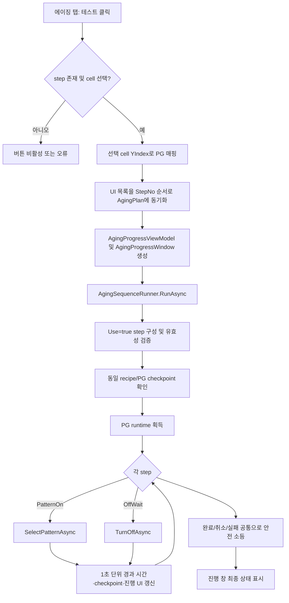

# RecipeWindow - 에이징 탭 분석

## 1. 분석 범위와 사실 기준

- 화면: `RecipeWindow`의 `<TabItem Header="에이징">`
- 연관 창: `AgingProgressWindow` (에이징 테스트를 시작할 때 표시)
- 연관 코드: `RecipeEditorViewModel`, `ConsoleRecipeDocument`, `AgingSequenceRunner`, `AgingCheckpointStore`, `AgingProgressViewModel`

우선 문서인 `docs/프로젝트 구조.md`, `docs/전체 flow.md`, `docs/console-recipe-document.md`에서 Console이 상위 recipe/실행을 소유한다는 구조는 확인했지만, **AgingPlan의 실행 순서·PG 제어·재시작 정책을 별도로 규정한 공식 문서는 확인하지 못했다.** 따라서 아래의 실제 동작, 코드 진행 및 로직 해석은 모두 코드 근거의 **[추론]** 이다. 공식 운영 기준이 추가되면 그 문서를 최우선으로 갱신해야 한다.

## 2. 화면의 역할

에이징 탭은 `ConsoleRecipeDocument.AgingPlan`에 저장할 **에이징 step 순서**를 편집하고, 선택한 cell/PG로 그 계획을 시험 실행하는 화면이다.

화면 안내문에는 `AgingPlan은 실행 여부를 결정하지 않고, Aging Run Mode에서 사용할 step sequence만 정의합니다.`라고 표시된다. 즉 계획 자체는 ‘실행 스위치’가 아니라 실행 시 사용할 순서 데이터다. **[추론: XAML의 화면 문구 및 실행 코드 기준]**

| UI 항목 | 연결 데이터/명령 | 의미 |
|---|---|---|
| Step 추가 | `AddAgingStepCommand` | 기본값을 가진 step 1건을 추가한다. |
| Step 삭제 | `RemoveAgingStepCommand` | 선택한 step을 확인 후 삭제한다. |
| 전체 Step 삭제 | `ClearAgingStepsCommand` | 모든 step을 확인 후 삭제한다. |
| Test PG | `AgingTestPgDisplay` | 현재 선택 cell의 Y index에 매핑된 PG를 읽기 전용으로 표시한다. |
| 테스트 | `TestAgingPlanCommand` | 선택 cell의 PG를 대상으로 에이징 시퀀스를 시험 실행한다. |
| Use | `ConsoleAgingStep.Use` | 체크된 step만 실행 대상으로 만든다. |
| Step | `StepNo` | 실행/정렬에 사용할 step 번호다. |
| Type | `AgingStepType` | `PatternOn` 또는 `OffWait`를 선택한다. |
| Pattern | `PgPatternIndex` | `PatternOn`에서 PG에 선택 요청할 패턴 번호다. |
| Duration (sec) | `DurationSec` | 해당 상태를 유지할 시간(초)이다. |

## 3. 에이징 레시피 데이터 구조

**[추론: 코드 기준]** `ConsoleRecipeDocument`는 `AgingPlan`을 포함하고, `AgingPlan.Steps`는 `ConsoleAgingStep` 목록이다.

| 필드 | 기본값 | 코드상 의미 |
|---|---:|---|
| `StepNo` | 새 step의 다음 번호 | 실행 전 정렬 및 중복 검증 키 |
| `Use` | `true` | `false`면 실행 목록에서 제외 |
| `Type` | `PatternOn` | 패턴 선택 또는 소등 대기 동작 |
| `Name` | `Aging {번호}` | 화면/진행 창에 표시할 이름 |
| `PgPatternIndex` | 모델 1, 새 UI step 1 | `PatternOn`에서 1~25 범위여야 함 |
| `DurationSec` | 모델 60, 새 UI step 300 | 1초 이상이어야 함 |

`AgingStepType`의 현재 열거값은 다음과 같다.

- `PatternOn`: PG 컨트롤러에 지정한 pattern 번호를 선택하도록 요청한 뒤 duration 동안 유지한다.
- `OffWait`: PG 컨트롤러에 `TurnOff`를 요청한 뒤 duration 동안 대기한다.

위 PG API의 실제 장비 효과(예: `SelectPattern`이 점등까지 보장하는지)는 공식 문서로 확인되지 않았으므로, ‘pattern 선택 요청’ 이상으로 단정하지 않는다. **[추론]**

## 4. 편집 동작

### 4.1 Step 추가/삭제

**[추론: `RecipeEditorViewModel` 기준]**

1. **Step 추가**는 현재 최대 `StepNo + 1`을 계산한다. 목록이 비어 있으면 1부터 시작한다.
2. 추가되는 값은 `Use=true`, `Type=PatternOn`, `Name=Aging n`, `PgPatternIndex=1`, `DurationSec=300`이다.
3. 추가 step은 즉시 선택된다.
4. 선택 삭제와 전체 삭제는 확인 대화상자를 거친다.
5. 변경된 목록은 저장/동기화 시 `StepNo` 오름차순으로 `Document.AgingPlan.Steps`에 반영된다.

코드에는 R → OffWait → G → OffWait → B의 기본 5-step 시퀀스를 추가하는 `AddDefaultAgingRgbCommand`도 존재한다. 그러나 현재 에이징 탭 XAML에는 이 명령을 실행하는 버튼이 없다. **[코드/UI 차이]** 따라서 현재 화면 사용자는 이 기능을 직접 실행할 수 없다.

## 5. 테스트 실행 전제와 검증

**[추론: 코드 기준]** 테스트 버튼은 다음 조건을 모두 만족할 때 활성화된다.

1. 에이징 step이 1개 이상 존재할 것
2. Recipe 편집기의 cell이 하나 선택되어 있을 것

실행 시 선택 cell의 `YIndex`를 Console recipe의 PG 매핑으로 변환한다. 현재 PG 번호를 찾을 수 없으면 실행하지 않고 오류로 처리한다. 실행 step은 `Use=true`인 항목만 `StepNo` 순으로 구성하며, 다음을 검증한다.

- 실행 step이 하나 이상인지
- `StepNo`가 중복되지 않는지
- 모든 `DurationSec`가 1 이상인지
- `PatternOn`의 `PgPatternIndex`가 1~25인지

`OffWait`의 pattern 번호는 별도 범위 검증 대상이 아니다. 기본 RGB 시퀀스 구현도 OffWait에 pattern 0을 사용한다. **[추론]**

## 6. 코드 진행 및 로직 분석

이 절은 공식 문서에 동등한 세부 실행 규정이 없어, 소스 코드의 호출 흐름을 정리한 **[추론]** 이다.

### 6.1 `TestAgingPlanAsync`의 시작 흐름

**[추론: `RecipeEditorViewModel.TestAgingPlanAsync`]**

1. 선택 cell을 기준으로 PG index를 해석한다.
2. 현재 `AgingSteps` 컬렉션을 번호순으로 `Document.AgingPlan.Steps`에 복사한다.
3. 현재 recipe 파일 경로를 확보한다. 현재 파일 경로가 없으면 recipe store 또는 마지막 recipe 경로를 차례로 사용하려 시도한다.
4. 기존 테스트 취소 토큰이 있다면 취소/해제하고, 새 linked cancellation token을 만든다.
5. `AgingProgressViewModel`을 만들고 Stop 동작이 이 취소 토큰을 취소하도록 연결한다.
6. 선택 cell/PG를 한 개의 실행 대상으로 하여 `AgingProgressWindow`를 연다.
7. `AgingSequenceRunner.RunAsync`를 await하고, 성공·취소·예외에 따라 진행 창과 상태 메시지/로그를 갱신한다.

### 6.2 `AgingSequenceRunner`의 step 실행

**[추론: `AgingSequenceRunner.RunAsync`, `RunStepAsync`]**

| 순서 | 처리 |
|---:|---|
| 1 | `Use=true` step만 실행 모델로 변환하고 유효성을 검사한다. |
| 2 | checkpoint 파일을 읽어 같은 PG index와 같은 recipe 경로인 경우에만 완료 step을 복원한다. |
| 3 | `EecP725R2LightRuntimes.AcquireForRun()`으로 현재 PG runtime을 얻는다. 일치 endpoint가 없으면 예외로 종료한다. |
| 4 | `PatternOn`이면 새 연결 범위에서 `SelectPatternAsync(PgPatternIndex)`를 호출한다. `OffWait`면 `TurnOffAsync`를 호출한다. |
| 5 | 1초마다 취소 여부를 확인하고, 경과/잔여 시간을 갱신한 뒤 checkpoint 저장과 progress 보고를 반복한다. |
| 6 | duration 종료 시 step을 `Completed`로 바꾸고 종료 시각을 기록한다. |
| 7 | 전체 완료·취소·오류 어느 경우든 `TurnOffSafeAsync`로 소등을 시도한다. |

Runtime 선택은 전역 Simulation Mode가 켜졌는지에 따라 실제 runtime 또는 simulator runtime을 사용하도록 구현되어 있다. 이는 에이징 기능만의 별도 simulator가 아니라 전역 runtime 정책을 따른다는 뜻이다. **[추론]**

### 6.3 취소, 실패, 재시작

**[추론: 코드 기준]**

- 사용자가 진행 창의 **Stop**을 누르면 ViewModel이 테스트 취소 토큰을 취소한다. runner는 실행 중/대기 중 step을 `Canceled`으로 표시하고 checkpoint를 저장한 뒤 안전 소등을 시도한다.
- 예외가 발생하면 현재 `Running` step만 `Failed`로 표시하고 checkpoint를 저장한 뒤 안전 소등을 시도한다.
- 정상 완료 시 checkpoint 파일을 삭제한다.
- checkpoint 재사용 조건은 **PG index와 recipe 경로가 모두 같은 경우**다.
- 재시작 시 완료된 step만 완료 상태로 건너뛴다. 취소/실패 당시 진행 중이던 step의 부분 경과 시간은 복원하지 않고 처음부터 다시 실행한다.
- checkpoint상 모든 step이 이미 완료된 경우에는 전체를 다시 Pending으로 초기화하여 새 run으로 실행한다.

진행 창을 닫는 동작은 컬럼 이벤트 구독을 해제하는 처리만 하며, 창 닫기 자체가 테스트 취소를 호출하지는 않는다. 따라서 창을 닫아도 백그라운드 테스트는 계속될 수 있다. **[추론: `AgingProgressWindow.OnClosing` 및 취소 연결 코드 기준]**

## 7. AgingProgressWindow 분석

`AgingProgressWindow`는 테스트 실행 전용의 진행 상태 창이다. `AgingProgressViewModel`이 snapshot을 받아 UI thread에서 상태를 반영한다. **[추론]**

| 영역 | 표시 내용 |
|---|---|
| 상단 | 제목, 대상 cell/PG, 상태 문구, 전체 진행률, Stop 버튼 |
| PG Status | PG, Cell, 현재 step, pattern, step 시간, 누적 시간, 상태, progress |
| Aging Plan | Step, Type, Pattern, Duration 및 PG별 동적 상태 열 |

PG별 동적 열은 `PgColumns` 컬렉션 변화에 따라 code-behind가 DataGrid 열을 추가/제거한다. 창 생성자에서 `DataContext`를 설정하고, Loaded/Closing/Closed에서 `WindowProcessStateMachine` 생명주기 상태를 관리한다. **[추론]**

## 8. 문서 대비 차이 및 확인 필요 사항

| 구분 | 내용 |
|---|---|
| 공식 문서 공백 | 확인한 우선 문서에는 AgingPlan의 PG 제어, duration, checkpoint, 재시작, 취소 정책이 정의되어 있지 않다. 이 문서의 해당 내용은 모두 **[추론]** 이다. |
| 코드/UI 차이 | `AddDefaultAgingRgbCommand`는 구현되어 있으나 현재 에이징 탭에 노출되지 않는다. |
| 코드 동작 주의 | 진행 창 닫기는 테스트 중단 명령이 아니다. Stop 버튼 또는 상위 종료 처리로 취소해야 한다. **[추론]** |
| 운영 확인 필요 | PatternOn의 ‘선택’이 장비에서 실제 점등을 어느 수준까지 보장하는지, checkpoint를 운영에서 재사용할지에 대한 공식 기준이 필요하다. |

## 9. 주요 소스 위치

- `uLedAoiConsole/Windows/Recipe/RecipeWindow.xaml` — 에이징 탭 UI
- `uLedAoiConsole/ViewModels/RecipeEditorViewModel.cs` — 편집 명령 및 테스트 시작
- `uLedAoiConsole/Recipes/ConsoleRecipeDocument.cs` — AgingPlan/Step 모델
- `uLedAoiConsole/Services/Aging/AgingSequenceRunner.cs` — 실행, 검증, 취소, checkpoint
- `uLedAoiConsole/Services/Aging/AgingCheckpointStore.cs` — checkpoint 파일 저장/삭제
- `uLedAoiConsole/ViewModels/AgingProgressViewModel.cs` — progress snapshot → UI 상태
- `uLedAoiConsole/Windows/Core/AgingProgressWindow.xaml(.cs)` — 진행 창 UI 및 동적 열
