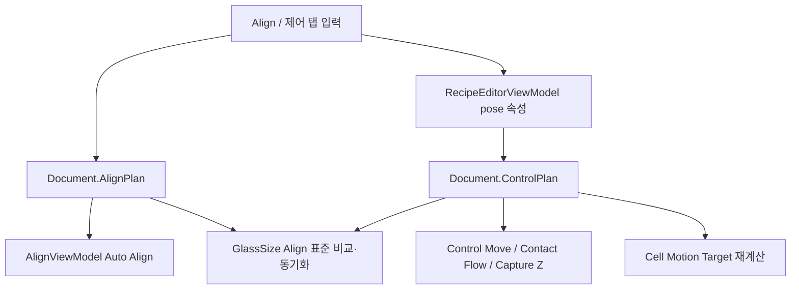
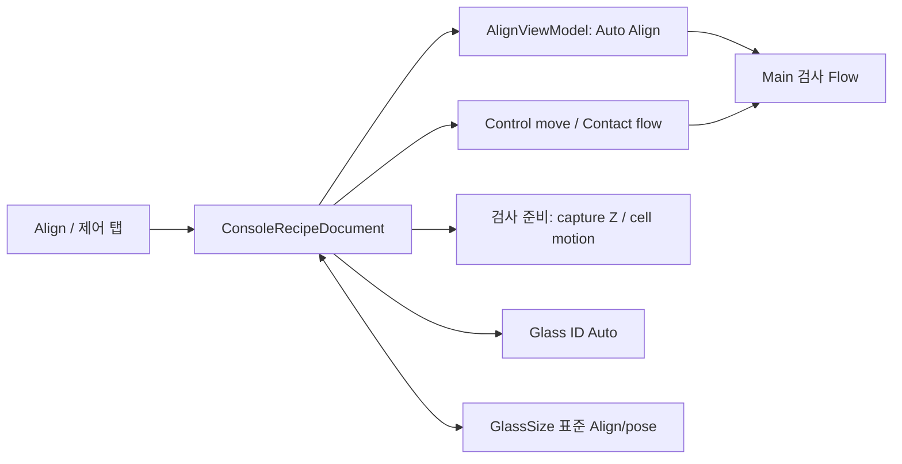

# RecipeWindow - Align / 제어 탭 분석

## 1. 화면 목적

이 탭은 recipe의 **Align 조건**과 실제 설비의 **Align 기준 위치·Contact 위치·촬영 Z·Glass ID 판독 위치**를 함께 관리한다.

공식 `docs/console-recipe-document.md` 기준으로 `AlignPlan`은 Console 상위 recipe의 Align 규칙이고, `ControlPlan`은 제어 규칙을 가진다. 또한 `ForbidStageXMoveWhileContact=true`는 반드시 유지해야 하는 운영 규칙이다.

이 탭에서 변경한 값은 recipe에 저장되며, Align 실행 수렴 판단, template matching, Control 축 이동, 촬영 높이, Contact flow, Glass ID 자동 판독 위치에 연결될 수 있다. 구체적인 호출 흐름은 코드 근거의 **[추론]** 이다.

## 2. 화면 구성

| 영역 | WPF 구조 | 구성 | 역할 |
|---|---|---|---|
| 탭 헤더 | `TabItem.Header`의 `StackPanel` | `Align / 제어`, 동기화 경고 `⚠` | GlassSize 표준과 recipe Align/Glass ID 위치가 다르면 경고를 표시한다. **[추론]** |
| 좌측 | `GroupBox Header="Align"` + `ScrollViewer` | 반복/오차, matching, template/search rect, Align 기준 pose, 표준 동기화 버튼 | Align 알고리즘 조건과 기준 축 위치를 관리한다. |
| 우측 상단 | `GroupBox Header="컨택 위치"` | ContactX, OD, Capture Z | contact 이동·contact flow·검사 camera capture Z override를 관리한다. |
| 우측 하단 | 같은 GroupBox 내부 | Glass ID 판독 unit, StageX/UnitY, 표준 동기화 버튼 | Glass ID 자동 판독 전 이동 위치를 관리한다. **[추론]** |

## 3. 컨트롤 분석

### 3.1 Align 알고리즘 파라미터

| 표시명 | 종류/바인딩 | 저장 위치 | 값 기준·범위 | 프로그램 영향 |
|---|---|---|---|---|
| 최대 반복 횟수 | TextBox → `Document.AlignPlan.MaxIteration` | `AlignPlan.MaxIteration` | **필수:** 정수 `>= 1` | Auto Align의 최대 촬영·보정 반복 횟수다. 초과 시 Align 실패 처리된다. **[추론]** |
| 허용 오차 X / Y / θ | CalcTextBox → `ToleranceXUm/YUm/ThetaDeg` | `AlignPlan` | **필수:** 세 값 모두 `> 0`; X/Y 단위 µm, θ 단위 deg | X/Y/회전 오차가 모두 이 범위 이하면 Align 성공이다. 값이 작을수록 엄격, 클수록 통과가 쉬워진다. **[추론]** |
| 매칭 임계값 2 / 1 | CalcTextBox → `Left/RightMatchThreshold` | `AlignPlan` | 이미지 매칭 ViewModel은 `0.0~1.0`으로 clamp한다. 이 직접 입력 탭의 별도 validation은 확인되지 않았다. | Align2/Align1 template score 통과 기준이다. 높이면 오검출 감소·실패 증가, 낮추면 검출 증가·오매칭 위험 증가. **[추론]** |
| Align2 템플릿 X/Y/W/H | TextBox → `LeftTemplateRect` | `AlignPlan` | pixel rect. 전역 recipe validation의 범위 검사는 확인되지 않았다. | Align2 기준 이미지에서 비교할 template 영역이다. |
| Align1 템플릿 X/Y/W/H | TextBox → `RightTemplateRect` | `AlignPlan` | pixel rect. 전역 recipe validation의 범위 검사는 확인되지 않았다. | Align1 기준 이미지에서 비교할 template 영역이다. |
| Align2 탐색 영역 X/Y/W/H | TextBox → `LeftSearchAreaRect` | `AlignPlan` | pixel rect. template을 포함하고 이미지 경계를 벗어나지 않아야 한다는 것이 안전 기준이다. **[추론]** | Align2 현재 이미지에서 template을 찾는 후보 영역이다. |
| Align1 탐색 영역 X/Y/W/H | TextBox → `RightSearchAreaRect` | `AlignPlan` | pixel rect. template을 포함하고 이미지 경계를 벗어나지 않아야 한다는 것이 안전 기준이다. **[추론]** | Align1 현재 이미지에서 template을 찾는 후보 영역이다. |

### 3.2 Align 기준 위치 (recipe ControlPlan)

| 표시명 | 종류/바인딩 | 저장 위치 | 값 기준·범위 | 프로그램 영향 |
|---|---|---|---|---|
| StageX | AxisNumberBox → `AlignReferenceStageX` | `ControlPlan.AlignReferenceStageX` | nullable 축 절대 위치; 코드상 숫자 범위 검증 없음 | Align 위치 이동 시 StageX move에 포함된다. 변경 시 Cell 모션 목표도 재계산한다. **[추론]** |
| Align2 / Align1 UnitY | AxisNumberBox → `AlignReferenceLeft/RightUnitY` | `ControlPlan` | nullable 축 절대 위치; 코드상 숫자 범위 검증 없음 | Align 위치 이동 시 각각 `InspectionUnit2Y`/`InspectionUnit1Y` move에 포함된다. |
| U / V / W | AxisNumberBox → `AlignReferenceStageU/V/W` | `ControlPlan` | nullable 축 절대 위치; 코드상 숫자 범위 검증 없음 | Align 위치 이동 시 StageU/V/W 회전/자세 축 move에 포함된다. **[추론]** |
| 현재값 읽기 | Button → `ApplyCurrentPositionToAlignCommand` | 위 6개 값 | Control status를 읽을 수 있어야 함 | 현재 설비 축값을 recipe override로 복사한다. |
| Align 위치 이동 | Button → `MoveAlignReferencePositionCommand` | 위 6개 값 사용 | 하나 이상의 값이 있어야 함 | 값이 있는 축만 모아 실제 Control 이동 명령을 전송한다. |
| 표준으로 내보내기 | Button → `ExportAlignPlanToGlassSizeCommand` | GlassSize 표준에 기록 | GlassSize/폴더 접근 필요 | 현재 recipe AlignPlan·pose·기준 이미지를 표준으로 저장한다. **[추론]** |
| 표준 가져오기 | Button → `ImportAlignPlanFromGlassSizeCommand` | recipe를 덮어씀 | 사용자 확인/저장 필요 | GlassSize 표준 AlignPlan·pose로 현재 recipe를 갱신한다. **[추론]** |
| 표준과 비교 | Button → `CompareAlignPlanWithGlassSizeCommand` | 비교만 수행 | GlassSize 표준 필요 | 항목별 차이 보고 및 경고 상태 갱신 |

### 3.3 Contact / 촬영 Z / Glass ID 제어 파라미터

| 표시명 | 저장 위치 | 값 기준·범위 | 프로그램 영향 |
|---|---|---|---|
| ContactX | `ControlPlan.ContactX` | nullable Control 축 절대 위치; 별도 범위 검증 없음 | `컨택 위치로 이동`은 `ContactorX` 축을 이 값으로 이동한다. Main 검사 flow의 contact move에도 사용될 수 있다. **[추론]** |
| OD (um) | `ControlPlan.ContactOdUm` | nullable, 기본 0.0; 별도 범위 검증 없음 | contact flow request의 `od_um` 파라미터로 전달된다. **[추론]** |
| Y1 / Y2 촬영 Z | `Y1CameraCaptureZUm`, `Y2CameraCaptureZUm` | 실제 사용 시 `> 0`이어야 한다. 없으면 head module config의 CaptureZ로 대체를 시도하고, 유효값이 없으면 오류다. **[추론]** | 각 Unit의 검사 camera 촬영 전 Z 목표를 override한다. |
| Glass ID Unit | `GlassIdReaderUnitIndex` → `GlassIdReaderUnitNo` | UI 선택지는 Unit1 또는 Unit2만 제공 | ID reader가 사용할 camera/unit과 UnitY 축을 결정한다. **[추론]** |
| Glass ID StageX / UnitY | `GlassIdReaderStageX/UnitY` | nullable 축 절대 위치; 별도 범위 검증 없음 | ID 위치 이동 및 Glass ID Auto 판독 전에 선택 unit camera를 이동시키는 pose다. **[추론]** |
| Glass ID 현재값 읽기 / 이동 | 관련 AsyncCommand | 위 pose 사용 | Control 통신 가능 필요 | 현재 축값 저장 또는 선택 unit의 ID pose로 실장비 이동 |
| Glass ID 표준 내보내기/가져오기/비교 | 관련 Command | GlassSize 표준 | 표준과 현재 recipe pose를 동기화/비교 | 

## 4. 이벤트 및 Command 분석

이 탭의 입력 컨트롤은 대부분 `UpdateSourceTrigger=LostFocus`다. 즉 숫자를 입력한 뒤 다른 컨트롤로 포커스를 옮길 때 recipe 값이 확정되는 UI가 많다. 반면 MaxIteration, Tolerance, MatchThreshold는 `PropertyChanged`로 매 타이핑마다 모델에 반영된다.

| 이벤트/명령 | 코드 진행 | 즉시 영향 |
|---|---|---|
| Align pose 속성 변경 | `NotifyControlPlanValueChanged(..., refreshMotionTargets:true)` | PropertyChanged 알림 → Cell motion target 재계산 → GlassSize 표준과의 차이 상태 갱신 **[추론]** |
| Contact/Z 속성 변경 | `NotifyControlPlanValueChanged(..., false)` | summary/UI 갱신·표준 상태 갱신. Cell motion target은 재계산하지 않는다. **[추론]** |
| 현재 Align 값 읽기 | Control status → 6축 값 획득 → ControlPlan 저장 | 현재 설비 pose가 recipe 기준 pose가 된다. |
| Align 위치 이동 | null이 아닌 pose 항목만 `ControlAxisMove` 목록으로 생성 → Control move | 실제 장비가 이동한다. |
| Contact 위치 이동 | `ContactX`만 `ContactorX` 절대 이동 | 실제 contactor 축이 이동하고 도착을 확인한다. **[추론]** |
| Y1/Y2 Z 읽기 | 현재 지정 Z축 값을 Control status에서 읽어 recipe에 저장 | capture Z override 갱신 |

## 5. 데이터 바인딩 및 호출 흐름

### 5.1 Align 실행으로의 연결

**[추론: `AlignViewModel`]** Auto Align은 `MaxIteration` 횟수까지 양쪽 Align 이미지를 획득하고, X/Y/θ 오차가 각 tolerance 안에 들어오는지 확인한다. θ가 기준을 넘으면 UVW 회전 보정을 먼저 적용하고, 이후 XY 보정을 수행하는 `ThetaThenXY` 흐름이다. 최대 반복 안에 수렴하지 않으면 실패한다.

`CorrectionMode`는 UI에 노출되지 않지만 recipe validation은 `ThetaThenXY`만 허용한다. `Simultaneous` 값은 모델 enum에 존재해도 현재 유효 recipe로 통과하지 못한다. **[코드 기준]**

### 5.2 Template/Search 영역의 연결

**[추론: `AlignViewModel`]** 각 side는 기준 align image의 template rect와 search rect, 현재 image의 search rect를 사용해 template matching 한다. score가 match threshold 이상이면 그 side의 매칭은 통과한다. AlignViewModel 편집 경로는 match threshold를 0~1로 clamp하고, 비어 있거나 범위를 벗어난 rect는 이미지 크기 기준으로 normalize한다. 이 탭의 직접 binding은 이러한 clamp/normalize를 즉시 보장하지 않으므로, 저장/실행 전 Align 화면에서 검증하는 것이 안전하다.

### 5.3 ControlPlan pose의 연결

**[추론]** Align 기준 pose는 `ResolveEffectiveAlignReferencePose`가 `ControlPlan` 값만 사용한다. GlassSize pose를 자동 fallback하지 않는다. 값 변경 시 Cell motion target 재계산을 호출하며, Align 위치 이동에서는 값이 있는 축만 실제 move request에 포함한다.

## 6. 사용자 입장에서 설명

1. 먼저 GlassSize 표준과 탭 헤더의 `⚠` 상태를 확인한다.
2. 표준 recipe를 사용해야 하면 **표준 가져오기**를 먼저 수행하고 recipe 저장 필요 여부를 확인한다.
3. Align template/search 영역과 match threshold는 Align 이미지에서 검증한 뒤 수정한다.
4. 허용 오차와 최대 반복은 현장 수렴 성능을 검증한 값만 사용한다.
5. Align 기준 위치를 새로 teach할 때는 장비를 안전한 Align 위치에 수동 이동한 뒤 **현재값 읽기**를 누른다.
6. 입력값으로 이동을 검증해야 할 때만 **Align 위치 이동**을 실행한다.
7. ContactX/OD, Y1/Y2 capture Z, Glass ID pose는 각각 실제 이동/촬영/ID 판독에 영향을 주므로 별도 장비 안전 확인 후 teach한다.
8. 변경한 recipe 값을 공통 표준으로 확정할 권한이 있을 때만 **표준으로 내보내기**를 사용한다.

## 7. 업무 로직 추론

### 파라미터 변경 영향 요약

| 변경 항목 | 즉시 UI 영향 | 다음 실행 영향 | 전체 프로젝트 영향 |
|---|---|---|---|
| Tolerance/MaxIteration | recipe 메모리 값 변경 | Align 성공 판정/반복 횟수 변경 | Align 실패율·cycle time에 영향 **[추론]** |
| Match/Template/Search | recipe 메모리 값 변경 | Align image matching 후보·통과 기준 변경 | Align 오매칭/미검출 위험에 영향 **[추론]** |
| Align reference pose | summary/경고/Cell motion target 갱신 | Align 기준 위치 이동/표준 동기화에 사용 | 선택 Cell 모션 계산에도 영향 **[추론]** |
| ContactX/OD | summary/경고 갱신 | contactor 이동·FlowContact OD 전달 | contact 품질·장비 안전에 영향 **[추론]** |
| Capture Z | summary/경고 갱신 | 검사 camera의 Z 목표 선택 | focus/충돌/촬영 품질에 영향 **[추론]** |
| Glass ID pose/unit | summary/경고 갱신 | Glass ID Auto 판독 전 camera 이동 | ID 판독 성공/오판독에 영향 **[추론]** |

## 8. 문서 작성용 요약

| 항목 | 요약 |
|---|---|
| 화면 목적 | Align 알고리즘 조건과 설비 기준 위치·Contact·Capture Z·Glass ID pose를 recipe 단위로 관리한다. |
| 주요 기능 | Align 수렴 조건 설정, template/search 설정, Control 축 teach/move, GlassSize 표준 동기화 |
| 사용 순서 | 표준 확인 → Align 이미지 조건 확인 → pose teach → 실제 이동 검증 → recipe 저장 |
| 주의사항 | 축 위치와 Z/Contact 값은 실제 장비 이동에 영향을 준다. 값 범위가 UI에서 제한되지 않는 항목은 장비 한계와 표준값을 반드시 확인한다. |

## 9. 이해되지 않는 부분 및 추가 확인 대상

| 확인 대상 | 이유 |
|---|---|
| `AlignViewModel` 및 Align Window | template image 작성, matching 검증, 실제 UVW/XY 보정의 상세 흐름 확인 |
| `AlignPlanSyncService` | 표준 내보내기/가져오기에서 파일·이미지·pose가 복사되는 정확한 범위 확인 |
| `ControlApi` 및 축 limit config | StageX/UnitY/U/V/W/ContactX의 물리 허용 범위 확인 |
| `ULedConfig.HeadOffsets` | CaptureZ fallback과 unit 좌우 매핑 확인 |
| `GlassInspectionStepPreparationService` | Contact flow, camera capture Z, Glass ID Auto의 실제 main flow 적용 시점 확인 |
| 공식 장비 운영 절차 | template threshold, OD, Z, axis pose의 현장 승인 범위 확인 |

## 10. 전체 프로젝트와 연결

공식 문서상 Console은 전체 flow를 오케스트레이션하고 AlignPlan/ControlPlan을 소유한다. 따라서 이 탭의 변경은 IP recipe 내부 검사 조건이 아니라 Console의 Align·motion·contact·ID 판독 준비 단계에 주로 영향을 준다. 세부 연결은 **[추론]** 이다.

## 관련 소스

- `uLedAoiConsole/Windows/Recipe/RecipeWindow.xaml`
- `uLedAoiConsole/ViewModels/RecipeEditorViewModel.cs`
- `uLedAoiConsole/ViewModels/AlignViewModel.cs`
- `uLedAoiConsole/Recipes/ConsoleRecipeDocument.cs`
- `uLedAoiConsole/Recipes/RecipeService.cs`
- `uLedAoiConsole/Recipes/AlignPlanSyncService.cs`
- `uLedAoiConsole/Services/InspectionReplay/GlassInspectionStepPreparationService.cs`
