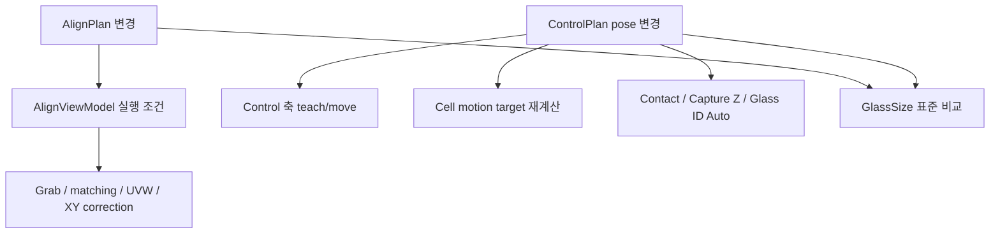

# RecipeWindow - Align / 제어 탭 인수인계 노트

## 1. 의존 구조

| 영역 | 핵심 클래스 | 역할 |
|---|---|---|
| UI/편집 | `RecipeWindow.xaml`, `RecipeEditorViewModel` | recipe property binding, teach/move command, 표준 동기화 상태 |
| Align 실행 | `AlignViewModel` | 양쪽 image matching, θ→XY 보정, 수렴 판정 |
| recipe 모델 | `ConsoleAlignPlan`, `ConsoleControlPlan` | 알고리즘/pose/contact/Z/ID 값 저장 |
| 표준 동기화 | `AlignPlanSyncService` | recipe AlignPlan/pose와 GlassSize 표준의 export/import/compare |
| 검사 준비 | `GlassInspectionStepPreparationService` | capture Z, contact OD, cell motion 적용 |
| 설비 통신 | Control API / `ControlAxisMove` | 실제 축 read/move |

## 2. 강제 검증과 미검증 영역

| 항목 | 코드상 검증 | 비고 |
|---|---|---|
| MaxIteration | `>= 1` | save/validate 실패 조건 |
| Tolerance X/Y/θ | 모두 `> 0` | save/validate 실패 조건 |
| CorrectionMode | `ThetaThenXY`만 허용 | enum의 `Simultaneous`는 현재 validation 실패 |
| MatchThreshold | Align image editor 경로에서 0~1 clamp | 이 탭 직접 binding의 공통 validation은 없음 |
| Template/Search rect | 전역 recipe validation 없음 | AlignViewModel matching 시 이미지 크기 기준 normalize 경로 존재 |
| Axis pose/ContactX/OD | 범위 validation 없음 | Control 축 limit 및 운영 표준이 실질 기준 |
| Capture Z | 실제 사용 시 유효값 `>0` 필요 | recipe 값 없으면 module config fallback, 둘 다 무효면 실패 |

## 3. 값 변경 영향 및 호출 관계

**[추론]** `AlignReference*` property setter는 `NotifyControlPlanValueChanged(... true)`를 호출하므로 Cell motion target을 즉시 재계산한다. `Contact*`, CaptureZ, Glass ID pose setter는 `false` 경로여서 motion target 재계산을 직접 요청하지 않는다.

## 4. 실제 Align 알고리즘 연결

**[추론: `AlignViewModel`]**

- `for (iteration=1..MaxIteration)`에서 양쪽 Align 이미지를 획득한다.
- 각 side template matching score가 threshold 이상인지 확인한다.
- X/Y/θ가 모두 tolerance 이하이면 성공한다.
- θ가 tolerance를 넘으면 UVW 회전을 먼저 보정하고, 이후 XY를 보정하는 `ThetaThenXY` 순서다.
- 마지막 반복까지 수렴하지 않으면 예외/실패다.

template/search rect는 `RectPx`이며 pixel 기준이다. `Left`는 UI에서 Align2, `Right`는 Align1이라는 명명 불일치가 있으므로 신규 코드에서 left/right를 unit 번호와 혼동하지 않는다.

## 5. ControlPlan pose 주의사항

**[추론]** `ResolveEffectiveAlignReferencePose`는 `ControlPlan`만 정본으로 사용하며 GlassSize pose를 fallback하지 않는다. `MoveAlignReferencePositionOrThrowAsync`는 nullable 값 중 존재하는 축만 move list에 넣는다. 일부 축만 입력된 pose도 이동 명령이 가능하므로, pose의 완전성은 UI/운영 절차에서 별도로 검증해야 한다.

Align 기준 pose는 `AlignPlanSyncService`를 통해 GlassSize 표준에 export/import/compare할 수 있다. export는 matching 설정, pose, 기준 이미지까지 표준으로 기록하는 UX로 안내되어 있다.

## 6. 공식 문서와 코드 차이

| 항목 | 공식 문서 | 현 코드 |
|---|---|---|
| AlignPlan 모델 예시 | template 파일명·mark override 중심 | match threshold, pixel template/search rect, `CorrectionMode` 추가 |
| ControlPlan 모델 예시 | profile id 중심 | PG mapping, Align pose, Contact, CaptureZ, Glass ID pose 추가 |
| StageX contact 금지 | `ForbidStageXMoveWhileContact=true` 유지 필수 | 모델에 존재하나 이 탭에서 직접 편집 UI 없음 |

문서의 상위 원칙을 우선하고, 세부 모델/실행 영향은 **[추론]** 으로 다룬다.

## 7. 추가 확인 항목

1. Control API의 축별 software/hardware limit와 unit을 확인한다.
2. `ForbidStageXMoveWhileContact`가 실제 main flow에서 강제되는 지점을 확인한다.
3. Align image editor가 template/search rect를 저장한 뒤 이 탭의 direct binding과 어떤 동기화 관계인지 확인한다.
4. GlassSize 표준 export가 기준 image 파일을 어디에 어떤 이름으로 저장하는지 확인한다.
5. Capture Z가 recipe override와 `HeadOffsets` fallback 중 어느 값을 쓰는지 실제 장비 로그로 검증한다.
6. Contact OD의 부호/허용 범위는 코드가 아닌 Control protocol 및 장비 운영 문서로 확인한다.
