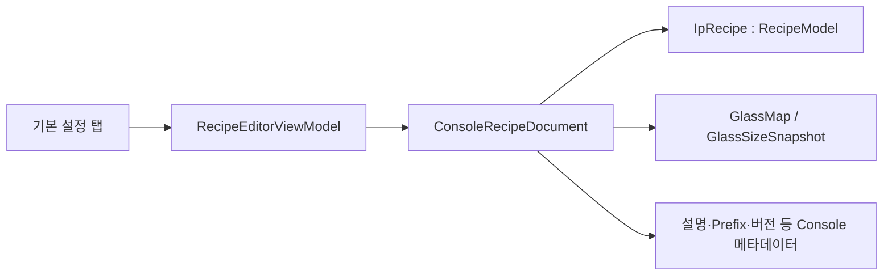

# RecipeWindow / 기본 설정 탭 분석

## 1. 화면 목적

### 공식 문서 기준

`RecipeWindow`는 Console 상위 레시피인 `ConsoleRecipeDocument`의 편집기다. 이 문서는 IP 실행 계약인 `RecipeModel`을 포함하면서 GlassSize 스냅샷, Glass Map, 실행용 셀, Align 규칙, Control 규칙을 함께 저장한다.

공식 권장 작업 순서는 GlassSize 스냅샷 로드 → 좌표 모델 확인 → 셀 재생성 → IP 분배 → Pattern/Point/ROI → Align/Control → Validate/Save → Upload/Activate다. 기본 설정 탭은 이 순서에서 레시피 자체의 식별·GlassSize·IP 실행 기본값을 확인하는 출발점이다.

근거: `docs/console-recipe-document.md`, `docs/recipe-editor-requirements.md`, `docs/recipe-folder-structure.md`, `docs/시작 가이드.md`.

## 2. RecipeWindow 전체 구성

| 영역 | 구성 | 역할 |
|---|---|---|
| 상단 메뉴 | 파일 / 창 / 도구 / 제어(Control) / IP | 레시피 파일 관리, 보조 창 열기, 수동 장비 조작, IP 연결·업로드·선택 셀 검사 |
| 도구 모음 | 새로 만들기, 불러오기, 저장, 유효성 검사, 미리보기 갱신 등 | 자주 쓰는 메뉴 명령의 바로가기 |
| 좌측 패널 | 작업 중인 레시피, 선택된 셀, 수동 조작 | 현재 파일·선택 IP/셀/패턴/포인트를 확인하고, 점등·컨택·축·CA410 조작 |
| 우측 탭 | 기본 설정, 명점 검사(WD), 검사 패턴, CA410, 에이징, PG 매핑, 셀 목록, 셀 맵, CellMap 보정, Align/Control 계열 탭 | 레시피 구성 요소를 탭 단위로 편집 |
| 선택형 로그 패널 | `LogViewer` | 창 메뉴의 로그 표시를 켰을 때 표시 |

### [추론] 탭 구조 해석

XAML상 탭은 레시피 데이터의 하위 도메인별 편집 영역이며, 좌측 패널의 선택 IP/셀/패턴은 여러 탭과 IP·Control 명령이 공유하는 작업 문맥으로 보인다.

## 3. 기본 설정 탭 구성

기본 설정 탭은 `ScrollViewer` 안의 2열 `Grid`로 구성된다. 탭 제목 옆 경고 표시는 현재 GlassSize model 파일과 레시피 스냅샷이 불일치할 때 나타난다.

| 항목 | 종류 | 바인딩/명령 | 기능 |
|---|---|---|---|
| 버전 | 읽기 전용 TextBox | `Document.Version` | 저장 시 갱신되는 레시피 버전 표시 |
| Model / Config 버전 | TextBlock | `GlassSizeModelVersion`, `Document.ConfigVersion` | 참조 model 및 저장 당시 Config 버전 표시 |
| 고급 설정 | Button | Code-behind `OpenAdvancedRecipeSettings_Click` | 레시피 스칼라 값을 별도 property-grid 창에서 편집 |
| 레시피 이름 | 읽기 전용 TextBox | `RecipeName` | 현재 레시피 이름 표시 |
| Glass Size ID | TextBox | `Document.GlassMap.GlassSizeId` | 레시피가 참조하는 GlassSize 식별자 |
| 모델 편집 | Button | `EditGlassSizeModelCommand` | 현재 참조 GlassSize model을 바로 편집 |
| 모델 적용 | Button | `ApplyGlassSizeModelCommand` | model 파일 기준으로 레시피의 GlassSize 스냅샷을 적용 |
| 모델 복원 | Button | `RestoreGlassSizeModelCommand` | 레시피에 저장된 스냅샷으로 유실된 model 파일을 재생성 |
| 패턴 번호(PG) | CalcTextBox | `Document.PatternNo` | PG에 전달할 패턴 번호(툴팁: 1~25) |
| 촬영 회전(도) | CalcTextBox | `Document.GrabRotationDeg` | IP grab 후 검사 입력 이미지에 적용할 시계방향 회전(0/90/180/270) |
| 썸네일 폭(px) | CalcTextBox | `Document.IpRecipe.ThumbnailWidth` | IP 결과 artifact thumbnail 폭 |
| Export Prefix | TextBox | `Document.ExportRecipePrefix` | export 파일명에 쓰는 레시피 식별 접두어 |
| Model 상태 | 읽기 전용 TextBox | `GlassSizeSyncInfo` | model 파일과 레시피 스냅샷의 동기화 상태·설명 |
| 화소 수 | CalcTextBox 2개 | `DisplayPixelWidthCount`, `DisplayPixelHeightCount` | 가로/세로 표시 화소 수 |
| 화소 크기(um) | CalcTextBox 2개 | `DisplayPixelWidthUm`, `DisplayPixelHeightUm` | 가로/세로 물리 화소 크기 |
| 화소 Pitch(카메라 px) | CalcTextBox 2개 | `DisplayPixelPitchCameraPixelX/Y` | 카메라 이미지 기준 가로/세로 Pitch |
| 화소 맵 | 상태 TextBox + Button | `DisplayPixelMapStatus`, Import/Generate/Normalize Command | recipe 폴더의 `map.txt` 관리 |
| 현재 ROI | 읽기 전용 TextBox | `SelectedPointDisplay` | 현재 선택 Point/ROI 정보 표시 |
| 등급별 불량 종류 | DataGrid | `GradeTypeMappings` | 각 등급에 연결할 불량 종류 편집 |
| 불량으로 취급할 종류 | CheckBox 목록 | `DefectTypeOptions` | 해당 종류를 불량으로 판정할지 선택 |
| 설명 | 여러 줄 TextBox | `Document.Description` | 레시피 설명 입력 |

## 4. 데이터 바인딩과 저장 관계

`RecipeEditorViewModel`이 `RecipeWindow`의 DataContext이며, 기본 설정은 주로 `Document`(`ConsoleRecipeDocument`) 또는 `Document.IpRecipe`에 직접 바인딩된다.

- `GlassSizeId`는 참조 식별자이고, 실제 레시피에는 `GlassSizeSnapshot`도 저장된다.
- `IpRecipe`의 Pattern과 Point는 IP가 소비하는 실행 레시피다. 실행 단위는 `Pattern × Point`다.
- `map.txt`는 레시피 폴더의 부속 파일이며, ViewModel은 가져오기/생성/정리 시 이를 recipe 폴더로 복사하고 참조를 고정 파일명으로 관리한다.

## 5. 명령과 이벤트

| 분류 | 처리 | 동작 |
|---|---|---|
| File 명령 | `NewCommand`, `LoadCommand`, `ReloadCommand`, `SaveCommand`, `SaveAsCommand`, `ValidateCommand` | 새 레시피, Recipe Browser 불러오기, 디스크 재적재, 저장/다른 이름 저장, 최소 규칙 검증 |
| GlassSize | `EditGlassSizeModelCommand`, `ApplyGlassSizeModelCommand`, `RestoreGlassSizeModelCommand` | model 편집, model→레시피 스냅샷 반영, 스냅샷→model 파일 복원 |
| Pixel Map | `ImportDisplayPixelMapCommand`, `GenerateDisplayPixelMapCommand`, `NormalizeDisplayPixelMapCommand` | 외부 map 가져오기, 전체 dot 사각형 map 생성, 이전 경로 형식을 `map.txt`로 정리 |
| 고급 설정 | `OpenAdvancedRecipeSettings_Click` | 선택 레시피와 Document를 고급 설정 창으로 전달 |
| Window lifecycle | `OnLoaded`, `OnClosing`, `OnClosed` | WindowProcess 상태 전이, 미저장 변경 확인, 자식 창 정리, ViewModel 종료 |

저장 전 `RecipeService.ValidateOrThrow(...)`가 호출되며, 최소한 IP Recipe, Recipe ID, GlassSize ID, 1개 이상의 Cell/Pattern/Point, 유효한 GlassSize와 ROI, Align/ControlPlan을 요구한다.

## 6. 공식 문서와 코드의 차이

| 항목 | 공식 문서 | 현재 코드 |
|---|---|---|
| 주요 탭 명칭 | General, Patterns, Points, Cells, Map, Align/Control | 실제 XAML에는 기본 설정, 명점 검사(WD), 검사 패턴, CA410, 에이징, PG 매핑, 셀 목록, 셀 맵, CellMap 보정, Align/Control 계열이 보임 |
| 기본 설정 상세 | 공식 문서는 ConsoleRecipeDocument 구조와 편집 순서를 중심으로 설명 | 현재 탭은 Display Pixel Map, defect-grade mapping, Export Prefix, grab 회전 등 세부 운영 설정까지 노출 |
| 저장 파일 | 레시피 폴더의 `recipe.json`이 필수 | 코드에는 `map.txt` 등 recipe sidecar 파일 복사·정리도 구현됨 |

공식 문서의 레시피 계층과 책임 정의를 우선 사실로 사용하며, 위의 세부 UI 기능은 코드로 확인한 현재 구현이다.

## 7. 추가 확인 필요

- [추론] `Document.PatternNo`와 Pattern 탭의 개별 Pattern/PG mapping이 어떤 우선순위로 PG에 전달되는지는 PG 매핑 탭과 IP 전달 코드를 함께 대조해야 한다.
- [추론] `GradeTypeMappings`와 `DefectTypeOptions`의 최종 판정 적용 방식은 검사 결과 조립/판정 서비스 확인이 필요하다.
- 공식 문서의 탭 명칭과 실제 XAML 탭 구성이 달라, 이후 각 탭 분석에서 문서 기준 명칭과 현 UI 명칭을 함께 표기해야 한다.

## 근거 파일

- `D:\ELP\Project\01.SDC\A1\uLED\Source\uLED_Develop_최신\docs\console-recipe-document.md`
- `D:\ELP\Project\01.SDC\A1\uLED\Source\uLED_Develop_최신\docs\recipe-editor-requirements.md`
- `D:\ELP\Project\01.SDC\A1\uLED\Source\uLED_Develop_최신\docs\recipe-folder-structure.md`
- `D:\ELP\Project\01.SDC\A1\uLED\Source\uLED_Develop_최신\uLedAoiConsole\Windows\Recipe\RecipeWindow.xaml`
- `D:\ELP\Project\01.SDC\A1\uLED\Source\uLED_Develop_최신\uLedAoiConsole\Windows\Recipe\RecipeWindow.xaml.cs`
- `D:\ELP\Project\01.SDC\A1\uLED\Source\uLED_Develop_최신\uLedAoiConsole\ViewModels\RecipeEditorViewModel.cs`
