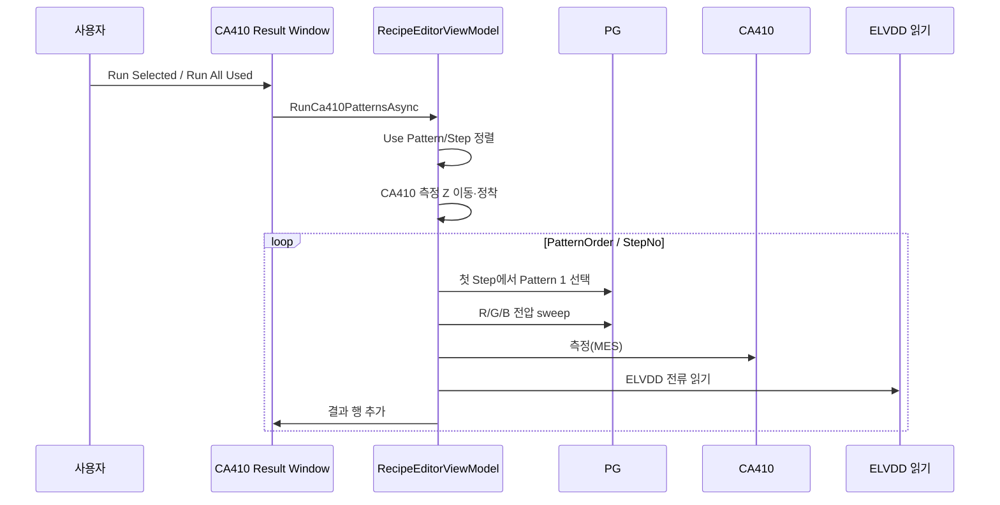

# RecipeWindow / CA410 탭 분석

## 1. 화면 목적과 책임 경계

### 공식 문서 기준

CA410 측정 조건은 IP 이미지 검사 Pattern(`IpRecipe.Patterns`)이 아니라 Console recipe의 `Ca410Plan.Patterns`에서 별도로 관리한다. 따라서 CA410 탭은 이미지 검사 조건을 편집하는 화면이 아니라, **PG 전압 sweep과 CA410 광학 측정 조건을 정의·시험하는 Console 전용 화면**이다.

CA410 패턴은 `PatternOrder`, `Name`, `Use`, `Steps`를 가지며, 각 전압 Step은 `StepNo`, `Use`, `RedVoltage`, `GreenVoltage`, `BlueVoltage`를 가진다. Step 번호는 1~30만 허용한다.

IP runtime recipe는 이미지 검사 실행 계약으로 유지하고, CA410 조건은 IP 계약에 넣지 않는다. 기존 레시피에 남아 있는 IP Pattern별 CA410 값도 자동 migration/fallback 기준으로 쓰지 않는다.

근거: `docs/ca410-inspection-flow.md`, `docs/console-recipe-document.md`, `docs/프로젝트 구조.md`.

## 2. 화면 구조

| 영역 | 구성 | 역할 |
|---|---|---|
| 상단 패턴 관리 | 패턴 추가 / 삭제 / 기본 RGB 추가 / 결과 창 | CA410 측정 조건 묶음을 관리하고 결과 창을 연다. |
| 상단 Step 자동 생성 | R/G/B 시작·증가 값, 개수, `Step 자동 채우기` | 선택 Pattern의 전압 sweep Step을 일괄 생성한다. |
| 상단 단발 시험 | `Step 점등`, `Step 측정` | 선택한 Step만 PG에 적용하거나 적용 후 CA410을 한 번 측정한다. |
| 좌측 표 | CA410 패턴 목록 DataGrid | 자동 실행 여부, 순서, 이름, Step 수를 관리한다. |
| 우측 표 | 전압 Step 목록 DataGrid | 선택 Pattern의 Step별 사용 여부·번호·R/G/B 전압을 관리한다. |

CA410 탭의 화면 모델은 `RecipeEditorViewModel`이며, 저장 시 `Ca410InspectionPatterns` 컬렉션을 `Document.Ca410Plan.Patterns`에 반영한다.

## 3. CA410 패턴과 Step 데이터

### CA410 패턴 목록

| 열 | 바인딩 | 의미 |
|---|---|---|
| 사용 | `Use` | 자동/전체 실행에서 이 Pattern을 포함할지 여부 |
| 순서 | `PatternOrder` | CA410 Pattern 실행 순서 |
| 이름 | `Name` | 측정 조건 이름 |
| Step 수 | `StepCount` | Pattern 안의 전압 Step 개수, 읽기 전용 |

공식 규칙상 `PatternOrder`는 목록 안에서 중복될 수 없다.

### 전압 Step 목록

| 열 | 바인딩 | 의미 |
|---|---|---|
| 사용 | `Use` | 해당 Step을 반복 측정에 포함할지 여부 |
| Step | `StepNo` | Pattern 내부 실행 순서, 1~30 |
| R/G/B 전압 | `Red/Green/BlueVoltage` | PG 각 채널에 적용할 입력 전압 |

공식 규칙상 같은 Pattern 내부에서 `StepNo`는 중복될 수 없고, 전압은 PG signed 2-byte millivolt 범위 안에 있어야 한다.

## 4. 버튼·명령 상세

| UI | Command/처리 | 현재 구현 동작 |
|---|---|---|
| 패턴 추가 | `AddCa410InspectionPatternCommand` | 다음 `PatternOrder`를 만들고 `CA410 {순서}` 이름, `Use=true`, 빈 Step 목록으로 추가 |
| 패턴 삭제 | `RemoveCa410InspectionPatternCommand` | 확인 후 선택 Pattern 삭제 |
| 기본 RGB 추가 | `AddDefaultCa410RgbCommand` | 이름이 없는 R/G/B Pattern만 추가하고 기존 Pattern은 유지 |
| Step 자동 채우기 | `FillCa410VoltageStepsCommand` | 선택 Pattern의 Step 1..Count를 새로 생성 |
| Step 점등 | `TurnCa410StepOnCommand` | 확인 후 선택 Step의 R/G/B 전압을 PG에 적용 |
| Step 측정 | `MeasureCa410StepCommand` | Step 점등 후 CA410 단발 측정 |
| 결과 창 | `OpenCa410ResultWindow_Click` | 반복 실행·결과 확인·CSV export 창 열기 |

### Step 자동 채우기 계산

각 채널의 i번째 Step 전압은 아래처럼 생성된다. 첫 Step의 `i`는 1이다.

```text
offset = i - 1
R = R 시작 + offset × R 증가
G = G 시작 + offset × G 증가
B = B 시작 + offset × B 증가
```

- 개수는 코드에서 0~30 범위로 제한한다.
- `개수 = 0`이면 선택 Pattern의 Step 목록을 비운다.
- 입력값을 숫자로 해석하지 못하면 현재 구현은 다음 기본값을 쓴다.
  - 시작값: `PgVoltagePlan.BlackVoltage`, 없으면 `4.5`
  - 증가값: `-0.1`

이 기본값 대체는 코드 확인 사항이다. 입력 오류를 사용자가 명확히 알아차릴 수 있는 UI 메시지가 있는지는 별도 검증이 필요하다.

## 5. 실행 순서

### 공식 자동 검사 기준

CA410 옵션이 켜진 자동 검사에서는 셀의 IP 검사 입력과 별개로 다음을 수행한다.

1. CA410 헤드를 대상 셀 중심으로 이동한다.
2. CA410 Z축을 측정 위치로 이동한다.
3. `Use=true`인 CA410 Pattern을 `PatternOrder` 순으로 선택한다.
4. 각 Pattern의 `Use=true` Step을 `StepNo` 순으로 실행한다.
5. PG Pattern `1`을 켠 상태로 유지한다.
6. 각 Step에서 R/G/B 전압을 한 packet으로 sweep하고 `PatternOnDelayMs`만큼 기다린다.
7. CA410 측정과 ELVDD 전류 읽기를 수행하고 결과를 기록한다.

### Result Window의 현재 코드 흐름

`Run Selected Pattern` 또는 `Run All Used`는 실행할 Step 목록을 PatternOrder → StepNo 오름차순으로 만든다. 실행 시작 시 CA410 Z축을 measurement 위치로 이동하고 안정화한다.



코드상 Pattern `1`은 첫 Step에서만 선택하고 이후 Step은 같은 점등 상태에서 전압만 바꾼다. 이는 공식 문서의 전압 sweep 규칙과 일치한다.

## 6. CA410 통신 및 측정 결과

### 통신 제약

공식 Ethernet 프로토콜 기준 CA410은 TCP/IP 서버이며 기본 포트는 `49152`다. 장비는 이전 명령 응답이 끝나기 전에 다음 명령을 정상 처리하지 못하므로, 요청 1건 → 응답 완료 → 다음 요청 순서를 지켜야 한다. 현재 TCP/Serial 구현은 요청을 직렬화한다.

`MES` 측정 응답은 display mode에 따라 값의 뜻이 달라진다. 현재 결과 처리 코드는 `XyLv` mode일 때만 `Value1/2/3`을 `ca_x`, `ca_y`, `Lv`로 기록한다.

### 결과 행

`Ca410TestResultViewModel`은 다음을 결과 창과 CSV에 제공한다.

| 구분 | 값 |
|---|---|
| 실행 식별 | 측정 시각, PatternOrder, PatternName, StepNo, PG Pattern index |
| 입력 조건 | R/G/B 전압 |
| CA410 결과 | 장비명, probe 번호, display mode, ca_x, ca_y, Lv, Flicker, X/Y/Z |
| PG 전류 | ELVDD channel/type/raw/mA |
| 상태 | Error, Message |

측정 실패와 ELVDD 읽기 실패는 각각 잡아 결과의 `Error`에 합친다. 한 부분이 실패해도 다른 부분에서 읽은 값은 결과 행에 남길 수 있다. 결과 Message는 `Partial failure` 또는 `OK`로 표현된다.

## 7. Result Window 분석

### 화면 구성

`Ca410ResultWindow`는 RecipeWindow와 같은 ViewModel을 DataContext로 사용한다.

| 버튼 | Command | 기능 |
|---|---|---|
| Run Selected Pattern | `RunSelectedCa410PatternCommand` | 선택 Pattern의 사용 Step 반복 측정 |
| Run All Used | `RunAllCa410PatternsCommand` | 사용 중 Pattern·Step 전체 반복 측정 |
| Stop | `StopCa410TestCommand` | CancellationToken 취소 요청 |
| Export CSV | `ExportCa410ResultsCommand` | 결과 컬렉션을 CSV로 저장 |
| Clear | `ClearCa410ResultsCommand` | 실행 중이 아닐 때 결과 목록 초기화 |

결과 표는 시간, Pattern/Step/PG, R/G/B 전압, `ca_x`, `ca_y`, `Lv`, Flicker, ELVDD mA/raw, Error, Message를 읽기 전용으로 표시한다.

### CSV export

코드는 사용자가 저장 위치를 고른 뒤 `ca410_measurements.csv` 기본 파일명으로 아래 정보를 CSV에 기록한다.

- CA410 측정·입력 전압·probe/display mode·광학 값·ELVDD 값·오류/메시지
- 행 정렬: `PatternOrder` → `StepNo` → `MeasuredAt`

공식 자동 검사 산출물 규칙도 셀당 `ca410_measurements.csv`에 Pattern/Step별 측정 row와 `ca_x`, `ca_y`, `lv`, ELVDD 전류를 저장하도록 정의한다.

### 창 생명주기

`Ca410ResultWindow`는 `WindowProcessStateMachine`으로 Initializing → Ready → Closing → Closed 상태를 관리한다. 창을 닫아도 실행 중인 CA410 test를 자동 중지하는 코드가 이 창에 직접 구현되어 있지는 않다. 중지는 `Stop` 명령으로 요청한다.

## 8. 문서와 코드의 일치/차이

| 항목 | 공식 문서 | 현재 코드 |
|---|---|---|
| CA410 소유 | Console `Ca410Plan`, IP Pattern과 분리 | `Document.Ca410Plan.Patterns`에 저장 |
| Pattern 선택 | PG Pattern 1을 켜고 전압 sweep | `ResolveRecipePatternNo()`로 실제 recipe PatternNo를 구해 선택. 기본 설명은 Pattern 1이나 recipe 값으로 바뀔 수 있음 |
| Result Window | 선택/전체 Pattern 반복, 결과 grid/CSV 지원 | 해당 기능 구현됨 |
| 자동 검사 | 셀 중심 이동과 Z 측정 위치 이동 | Result Window 반복 실행 코드는 Z 이동을 수행하나, 선택 셀 중심의 XY 이동은 별도 `CA410 이동` 명령/상위 flow와 연결됨 |

문서와 코드가 달라 보이는 PG Pattern 번호는, 공식 문서의 `1` 고정 설명과 코드의 `ResolveRecipePatternNo()` 사용 차이다. 운영 기준은 공식 문서를 우선 설명하되, 현재 구현이 recipe 값으로 해석할 가능성을 코드 차이로 관리해야 한다.

## 9. 사용자/개발자 주의 사항

- CA410 Pattern과 IP 이미지 검사 Pattern을 같은 항목으로 취급하지 않는다.
- `Use`가 꺼진 Pattern/Step은 `Run All Used`에 포함되지 않는다.
- CA410 장비는 명령을 병렬로 보내면 안 된다.
- 측정 전 zero calibration 미실행 시 `ER10` 등 오류가 발생할 수 있다.
- CA410 Simulation Mode는 실장비가 필요한 성공을 흉내내지 않는 정책이다.
- [추론] Result Window에서 Run을 시작하기 전 대상 셀의 XY 이동을 자동 보장하지 않을 수 있으므로, 사용자는 `CA410 이동` 또는 상위 자동 flow의 위치 상태를 확인해야 한다.

## 근거 파일

- 최신 공식 문서: `docs/ca410-inspection-flow.md`, `docs/ca410-ethernet-protocol.md`
- `D:\ELP\Project\01.SDC\A1\uLED\Source\uLED_Develop_최신\uLedAoiConsole\Windows\Recipe\RecipeWindow.xaml`
- `D:\ELP\Project\01.SDC\A1\uLED\Source\uLED_Develop_최신\uLedAoiConsole\Windows\Recipe\RecipeWindow.xaml.cs`
- `D:\ELP\Project\01.SDC\A1\uLED\Source\uLED_Develop_최신\uLedAoiConsole\Windows\Recipe\Ca410ResultWindow.xaml`
- `D:\ELP\Project\01.SDC\A1\uLED\Source\uLED_Develop_최신\uLedAoiConsole\Windows\Recipe\Ca410ResultWindow.xaml.cs`
- `D:\ELP\Project\01.SDC\A1\uLED\Source\uLED_Develop_최신\uLedAoiConsole\ViewModels\RecipeEditorViewModel.cs`
