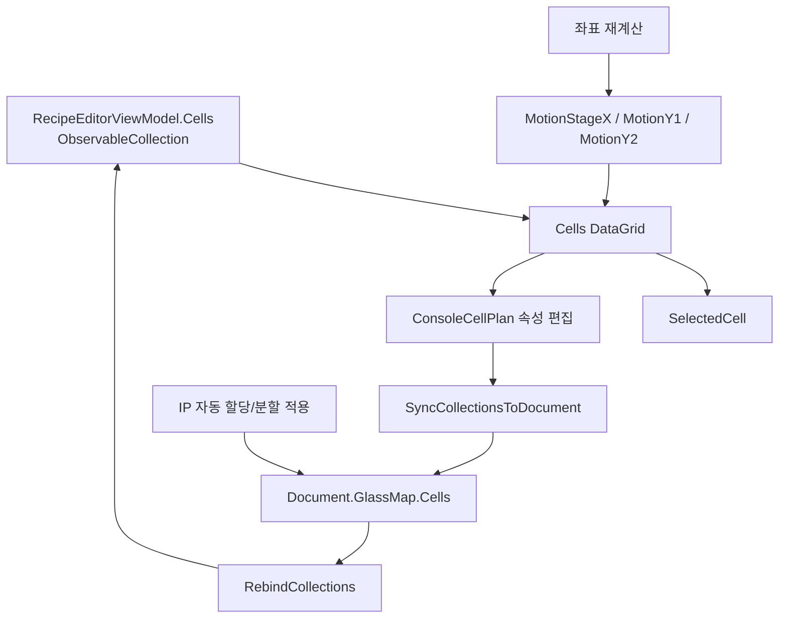
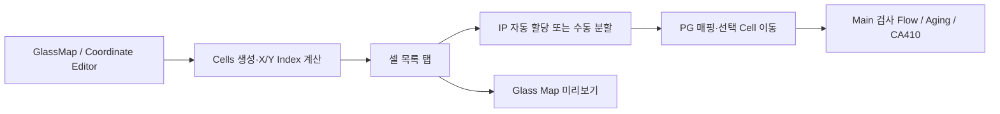

# RecipeWindow - 셀 목록 탭 분석

## 1. 화면 목적

셀 목록 탭은 Glass Map에서 만들어진 **실행용 Cell 목록**을 확인하고, 각 Cell의 사용 여부·담당 IP·실행 index·글래스 좌표·계산된 모션 목표를 관리하는 화면이다.

공식 `docs/console-recipe-document.md`에 따르면 `Cells`는 실제 실행용 cell 리스트이며, `YIndex`는 IP 자동 분배와 수동 Split 적용, PG mapping의 기준이다. `IpNo`는 담당 IP이고, IP1은 Unit1Y·IP2는 Unit2Y와 고정 매칭된다.

사용자는 Cell map을 만들거나 변경한 뒤 이 화면에서 IP 분배와 좌표 결과를 점검하고, 검사 대상 제외/복구 또는 필요한 수동 조정을 수행한다.

## 2. 화면 구성

| 영역 | WPF 구조 | 구성 요소 | 역할 |
|---|---|---|---|
| 상단 작업 영역 | `WrapPanel` | Cell 추가/삭제, 선택 IP 이동, 전체 사용/해제, IP 자동 할당, 분할 Y, 분할 적용, 좌표 재계산, 표준맵 사용 | Cell 목록과 배정 상태를 변경하거나 모션 목표를 갱신한다. |
| 목록 영역 | `DataGrid` | `ItemsSource=Cells`, `SelectedItem=SelectedCell` | 각 Cell의 편집값과 계산 결과를 표 형태로 표시한다. |

`Grid`는 두 행으로 구성된다. 첫 행은 높이가 내용에 맞춰지는 `Auto` 작업 영역이고, 둘째 행은 남은 공간 전체를 차지하는 `*` DataGrid다.

## 3. 컨트롤 분석

### 3.1 상단 컨트롤

| 컨트롤명/표시명 | 종류 | 기능 | 예상 동작 | 비고 |
|---|---|---|---|---|
| 셀 추가 | Button | 수동 Cell 행 추가 | `AddCellCommand`가 새 `ConsoleCellPlan`을 만들고 선택한다. **[추론]** | 기본 사각형 크기는 1000×1000µm다. **[추론]** |
| 셀 삭제 | Button | 선택 Cell 삭제 | `RemoveCellCommand`가 확인 창 후 선택 행을 제거한다. **[추론]** | 선택 행이 있어야 실행 가능하다. |
| 선택 IP를 셀로 이동 | Button | 현재 선택 IP의 설비를 선택 Cell 위치로 이동 | `MoveSelectedIpToSelectedCellCommand`가 비동기로 모션 이동을 시도한다. **[추론]** | Cell의 IP 배정과 선택 IP가 일치해야 한다. **[추론]** |
| 전체 사용/해제 | Button | 모든 Cell의 `Use` 일괄 전환 | 모두 Use가 아니면 전체 Use, 모두 Use면 전체 Unuse로 전환한다. **[추론]** | 확인 창을 표시한다. **[추론]** |
| IP 자동 할당 | Button | YIndex 그룹 단위 자동 IP1/IP2 분배 | `AutoAssignIpToCellsCommand` → `RecipeService.AutoAssignIpNumbers` | 공식 문서의 안전거리 규칙을 반영한다. |
| 분할 Y | TextBox | 수동 분할 기준 입력 | `Document.GlassMap.IpSplitColumn`에 즉시 바인딩 | 값의 의미는 ‘YIndex 값’이 아니라 정렬된 YIndex 그룹 중 IP1에 배정할 앞쪽 그룹 수다. **[추론]** |
| 분할 적용 | Button | 입력한 분할 Y 기준으로 IP 재배정 | `ApplyIpSplitColumnCommand` → `AssignIpNumbersBySplitColumn` | 안전거리 판단 없이 수동 분할한다. **[추론]** |
| 좌표 재계산 | Button | 각 Cell의 모션 목표 재계산 | `RefreshCellMotionTargetsCommand` | XIndex/YIndex 또는 Cell 원본 좌표를 재생성하지 않는다. **[추론]** |
| 표준맵 사용 | CheckBox | 표준 dense map 사용 여부 설정 | `Document.StandardMapPlan.UseStandardDenseMap`에 즉시 바인딩 | Tooltip상 업로드 시 IP로 함께 전달된다. |

### 3.2 Cells DataGrid 열

| 열 | 바인딩 | 편집 | 기능 | 비고 |
|---|---|---|---|---|
| CellId | `CellId` | 가능 | Cell 식별 번호 | 수동 추가 시 최대 ID+1로 만든다. **[추론]** |
| 자동명 | `Name` | 가능 | GlassMapDesign에서 생성/복원되는 내부 이름 | 공식 문서 기준 내부 관리 이름이다. |
| 사용자명 | `UserDefinedName` | 가능 | 실제 장비 cell명이 다를 때 사용하는 이름 | 값이 있으면 `DisplayName`에 우선한다. 공식 문서 기준 IP Job/파일/로그 표시에 사용된다. |
| 사용 | `Use` | 가능 | 검사 대상 포함 여부 | `false`면 해당 Cell을 검사 대상에서 제외한다. |
| IpNo | `IpNo` | 가능 | 담당 IP 번호 | 공식 문서 기준 IP1=Unit1Y, IP2=Unit2Y다. |
| XIndex | `XIndex` | 읽기 전용 | X 방향 실행 group index | 0-base이며 Cell map 구조와 Unit1 StageX 기준으로 계산된다. |
| YIndex | `YIndex` | 읽기 전용 | X group 안의 Y 방향 실행 group index | IP/PG mapping의 기준이다. |
| X | `CellRectGlassUm.X` | 가능 | 글래스 중심(0,0), +Y 위 좌표계의 Cell 좌상단 X | 단위는 µm이다. `X = cornerX - GlassWidth/2`로 변환된다. |
| Y | `CellRectGlassUm.Y` | 가능 | 글래스 중심(0,0), +Y 위 좌표계의 Cell 좌상단 Y | 단위는 µm이다. `Y = GlassHeight/2 - cornerY`로 변환된다. |
| StageX | `MotionStageX` | 읽기 전용 | 계산된 StageX 이동 목표 | 좌표 재계산 결과다. **[추론]** |
| Y1 | `MotionY1` | 읽기 전용 | Unit1Y 축 이동 목표 | 좌표 재계산 결과다. **[추론]** |
| Y2 | `MotionY2` | 읽기 전용 | Unit2Y 축 이동 목표 | 좌표 재계산 결과다. **[추론]** |

`SelectedItem="{Binding SelectedCell}"`이므로 DataGrid에서 행을 고르면 `SelectedCell`이 변경되고, 선택 IP 이동·CA410 이동·에이징 테스트 등 선택 Cell 기반 기능의 대상이 된다. **[추론]**

## 4. 이벤트 및 Command 분석

이 탭 XAML은 click event handler를 직접 연결하지 않고 MVVM `Command`를 사용한다. 따라서 별도 code-behind 이벤트가 아니라 `RecipeEditorViewModel` 명령이 주 동작을 담당한다.

| UI 동작 | Command | ViewModel 메서드 | 후속 처리 |
|---|---|---|---|
| IP 자동 할당 | `AutoAssignIpToCellsCommand` | `AutoAssignIpToCells` | 확인 → UI collection 동기화 → service 자동 분배 → 재바인딩 → map preview 갱신 |
| 분할 적용 | `ApplyIpSplitColumnCommand` | `ApplyIpSplitColumn` | 확인 → UI collection 동기화 → service 수동 분배 → 재바인딩 → map preview 갱신 |
| 좌표 재계산 | `RefreshCellMotionTargetsCommand` | `RefreshCellMotionTargets` | 보정 행 동기화 → calibration 생성 → 각 Cell의 StageX/Y1/Y2 갱신 |
| 행 선택 | `SelectedItem` Binding | `SelectedCell` 변경 | 다른 선택 Cell 기반 명령의 대상 변경 **[추론]** |
| Use 체크 | `DataGridCheckBoxColumn` Binding | `ConsoleCellPlan.Use` 변경 | collection item 속성에 즉시 반영 **[추론]** |
| 분할 Y 입력 | Text Binding | `Document.GlassMap.IpSplitColumn` 변경 | `PropertyChanged` 시점에 document 값 갱신 |

## 5. 데이터 바인딩 분석



**[추론: 코드 기준]**

- `Cells`는 `ObservableCollection<ConsoleCellPlan>`이므로 행 추가/삭제와 재바인딩 결과가 DataGrid에 반영된다.
- `SelectedCell`은 DataGrid의 선택 행을 ViewModel에 전달한다.
- 셀 목록을 service가 직접 변경하는 작업은 `SyncCollectionsToDocument()`로 document에 먼저 반영한 뒤 실행하고, 결과는 `RebindCollections()`로 UI collection에 다시 연결한다.
- `RefreshPreview()`는 document 동기화와 모션 좌표 재계산을 수행한 뒤 Glass Map preview를 새로 만든다.
- `XIndex/YIndex`, `StageX/Y1/Y2` 열은 읽기 전용이므로 사용자가 목록에서 직접 바꾸는 값이 아니라 계산/재생성 결과를 확인하는 값이다.

## 6. 사용자 입장에서 설명

1. Cell map 생성 또는 변경 후 셀 목록을 열어 Cell 행과 `XIndex/YIndex`가 정상인지 확인한다.
2. `YIndex` 그룹별 IP 배정이 필요하면 먼저 **IP 자동 할당**을 실행한다.
3. 자동 배정 결과가 현장 운영 계획과 달라 수동 기준이 필요할 때만 **분할 Y**에 기준값을 입력하고 **분할 적용**을 누른다.
4. 각 행의 `IpNo`가 의도한 IP1/IP2로 바뀌었는지 확인한다.
5. GlassSize, 보정값, 이동 대상 도구를 바꿨거나 `StageX/Y1/Y2`를 다시 확인해야 하면 **좌표 재계산**을 누른다.
6. 사용하지 않을 Cell은 `사용` 체크를 해제한다. 실제 장비 cell명이 내부 자동명과 다르면 `사용자명`을 입력한다.
7. 변경 결과를 확인한 뒤 recipe를 저장한다.

## 7. 업무 로직 추론

### 7.1 IP 자동 할당

공식 문서상 자동 분배는 `YIndex`와 `MinSafeGlassYGapUm` 안전거리를 사용하며, 균등 split을 우선하되 안전한 2-IP split이 없으면 단일 IP 할당으로 둔다.

**[추론: `RecipeService.AutoAssignIpNumbers`]** 코드 동작은 다음과 같다.

1. 모든 Cell을 `YIndex`로 그룹화한다.
2. 각 그룹의 stage Y 방향 글래스 중심 평균 좌표를 계산한다. PanelAngle이 90/270도면 글래스 X 중심을, 그 외에는 글래스 Y 중심을 사용한다.
3. 전체 그룹 수의 절반에 가까운 split을 우선 후보로 삼는다.
4. IP1 후보 그룹과 IP2 후보 그룹의 대응 위치 간 간격이 `MinSafeGlassYGapUm` 이상인지 검사한다.
5. 안전한 split을 찾으면 앞쪽 YIndex 그룹은 IP1, 나머지는 IP2로 배정한다.
6. 안전한 split이 없으면 모든 YIndex 그룹을 IP1에 배정한다.
7. 선택된 split 개수를 `GlassMap.IpSplitColumn`에 저장한다.

### 7.2 분할 적용

**[추론: `AssignIpNumbersBySplitColumn`]** 수동 분할은 안전거리/글래스 중심 좌표를 다시 평가하지 않는다.

- 고유 YIndex를 오름차순으로 정렬한다.
- 앞에서 `IpSplitColumn`개 그룹은 IP1, 나머지는 IP2로 배정한다.
- 음수 split은 0으로 보정된다.

따라서 ‘분할 Y’의 값은 예를 들어 YIndex=2부터 IP2라는 **YIndex 숫자 비교 기준이 아니라**, 정렬된 고유 YIndex 목록에서 IP1에 포함할 그룹 수다. YIndex가 0, 2, 4이면 split 2는 0·2 그룹이 IP1, 4 그룹이 IP2다. **[추론]**

### 7.3 좌표 재계산

**[추론: `RefreshCellMotionTargets`]** 좌표 재계산은 각 Cell의 글래스 중심을 출발점으로 다음을 계산해 읽기 전용 열에 표시한다.

1. GlassSize model을 불러오고 유효성을 확인한다.
2. Bridge calibration을 만든다.
3. Cell의 `IpNo`에 따라 좌/우 bridge 및 선택된 이동 도구의 offset을 고른다.
4. 글래스 중심 좌표를 설비 축 목표로 변환한다.
5. CellMap 보정값을 적용한다. YIndex 보정은 UnitY 축에, XIndex 보정은 StageX 축에 더한다.
6. 담당하지 않는 반대편 Y 축에는 EscapeY를 적용한다.
7. 결과를 `MotionStageX`, `MotionY1`, `MotionY2`에 표시한다.

GlassSize model 또는 calibration을 만들 수 없으면 모든 Cell의 StageX/Y1/Y2는 0으로 표시된다. 이는 실제 설비 좌표가 0이라는 뜻이 아니라 계산 실패 시의 UI 표시 결과다. **[추론]**

### 7.4 값별 계산식

`CoordinateTransformService`의 구현으로 다음 값은 코드에서 직접 확인된다. 여기서 `GW/GH`는 GlassSize의 폭/높이, `cornerX/cornerY`는 GlassMap 원본의 좌상단 기준 Cell 좌표다.

| 값 | 계산/결정 방식 |
|---|---|
| X | `cornerX - GW / 2` |
| Y | `GH / 2 - cornerY` |
| Cell 중심 GlassX | `X + Width / 2` |
| Cell 중심 GlassY | `Y - Height / 2` |
| XIndex | Cell map의 Column/Row 중 Unit1 기준 StageX 평균 변화폭이 더 큰 축을 X group으로 선택하고, 각 group의 평균 StageX 오름차순으로 0부터 부여 |
| YIndex | X group 안에서 남은 Cell map 축을 Y group으로 선택하고, 각 group의 평균 Unit1Y 오름차순으로 0부터 부여 |

`StageX/Y1/Y2`는 선택된 이동 도구의 offset과 IP별 affine calibration을 사용한다. Glass 중심을 `(gx, gy)`라 하면, 선택된 bridge의 계수로 먼저 다음 값이 계산된다.

```text
unitYBase = AxisXCoeffX × gx + AxisXCoeffY × gy + AxisXOffset
stageXBase = AxisYCoeffX × gx + AxisYCoeffY × gy + AxisYOffset

unitY = unitYBase - ToolOffset.Y + UnitYCorrection(YIndex)
stageX = stageXBase - ToolOffset.X + StageXCorrection(XIndex)
```

IP1이면 `Y1=unitY`, `Y2=EscapeY`이고, IP2이면 `Y1=EscapeY`, `Y2=unitY`다. `StageX=stageX`이다. **[추론: 화면 표시값을 구성하는 코드 경로 기준]**

좌표 재계산은 `SelectedCellMoveToolIndex`의 현재 값으로 offset을 고른다. 0은 검사 카메라, 1은 CA410, 2는 Align 카메라다. 그러므로 같은 Cell이라도 선택 도구가 바뀌면 `StageX/Y1/Y2` 표시값이 달라질 수 있다. **[추론]**

## 8. 문서 작성용 요약

| 항목 | 요약 |
|---|---|
| 화면 목적 | 실행 Cell의 검사 대상 여부, IP 담당, index, 글래스 위치와 모션 계산 결과를 관리한다. |
| 주요 기능 | IP 자동 할당, 수동 분할, 모션 좌표 재계산, Cell 사용/이름/위치 관리 |
| 사용 순서 | Cell map 확인 → IP 자동 할당 → 필요 시 수동 분할 → 좌표 재계산 → 행별 결과 확인 → 저장 |
| 주의사항 | 수동 분할은 안전거리를 다시 검사하지 않으며, 좌표 재계산은 Cell/XIndex/YIndex를 재생성하지 않는다. |

## 9. 이해되지 않는 부분 및 추가 확인 대상

| 확인 대상 | 이유 |
|---|---|
| `GlassMapDesign` 및 Coordinate Editor | Cell 원본 좌표가 어떻게 생성/수정되는지 확인하려면 필요하다. |
| `GlassInfoHelper.MakeCells` | 설계 좌표가 `ConsoleCellPlan`으로 변환되는 세부 규칙을 확인하려면 필요하다. |
| `CoordinateTransformService` / `BridgeCalibration` | StageX/Y1/Y2 축 변환과 calibration source를 정확히 이해하려면 필요하다. |
| `CellMapCorrectionPlan` | XIndex/YIndex별 보정값의 작성·저장·단위 변환을 확인하려면 필요하다. |
| `ULedConfig.MinSafeGlassYGapUm` | 자동 IP 분배의 실제 안전거리 운영값을 확인하려면 필요하다. |
| Control API / 실제 장비 매뉴얼 | IP1=Unit1Y, IP2=Unit2Y의 물리 연결과 EscapeY 안전 동작을 확정하려면 필요하다. |

## 10. 전체 프로젝트와 연결



공식 문서 기준 Cells는 Console 상위 recipe의 실행용 cell 리스트다. 그중 YIndex는 IP 분배와 PG mapping의 공통 기준이며, MainFlow는 실제 선택 target의 글래스 중심 Y 간격으로 동시 batch 가능 여부를 판단한다. 따라서 이 탭의 IP 배정은 이후 검사·에이징·PG 제어의 대상 관계에 연결된다. 세부 호출 연결은 코드 기준의 **[추론]** 이다.

## 관련 소스

- `uLedAoiConsole/Windows/Recipe/RecipeWindow.xaml`
- `uLedAoiConsole/ViewModels/RecipeEditorViewModel.cs`
- `uLedAoiConsole/Recipes/ConsoleRecipeDocument.cs`
- `uLedAoiConsole/Recipes/RecipeService.cs`
- `uLedAoiConsole/Services/CoordinateTransformService.cs` 또는 동등 좌표 변환 구현
