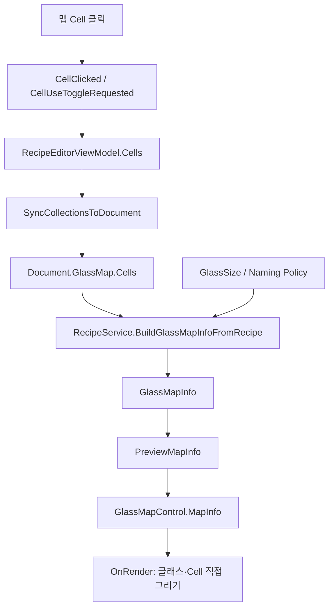
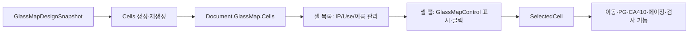

# RecipeWindow - 셀 맵 탭 분석

## 1. 화면 목적

셀 맵 탭은 recipe의 실행용 `Cells`를 글래스 형상 위에 시각화하고, 사용자가 Cell을 선택하거나 **Cell 선택 모드**에서 Use/Unuse를 직접 전환할 수 있게 하는 화면이다.

공식 `docs/console-recipe-document.md` 기준으로 `GlassMapDesignSnapshot`은 Cell 설계 원본이고, `Cells`는 실제 실행용 목록이다. 이 탭은 `Cells`의 위치·이름·Use·IpNo를 기반으로 렌더링한다. 즉 설계 원본 자체를 편집하는 화면이 아니라 현재 recipe의 실행 Cell 상태를 확인하는 미리보기다. 세부 렌더링/상호작용은 코드 근거의 **[추론]** 이다.

## 2. 화면 구성

| 영역 | WPF 구조 | 구성 | 역할 |
|---|---|---|---|
| 상단 헤더 | `Border` 안의 `Grid` | Cell 선택 모드 CheckBox, 안내 문구, 전체 사용/해제 버튼, 미리보기 새로 고침 버튼 | 조작 모드와 전체 Use 상태를 관리한다. |
| 맵 표시 영역 | `Border` 안의 `GlassMapControl` | `mapPreviewControl` | 글래스 외곽, Cell 사각형, 이름, Use/IP 상태, 선택 테두리, ingress 화살표를 직접 그린다. **[추론]** |

`Grid`는 상단 제어 영역(`Auto`)과 남은 전체 공간을 차지하는 맵 영역(`*`)으로 나뉜다.

## 3. 컨트롤 분석

| 컨트롤명 | 종류 | 기능 | 예상 동작 | 비고 |
|---|---|---|---|---|
| Cell 선택 모드 (Use 토글) | CheckBox | 맵 클릭 의미 전환 | `IsCellUseToggleMode`가 true면 Cell 클릭이 선택 대신 Use/Unuse 변경 요청이 된다. **[추론]** | false면 클릭한 Cell이 선택된다. |
| 안내 문구 | TextBlock | IP/Unit 고정 관계 및 Unuse 표시 안내 | `IP1=Unit1Y, IP2=Unit2Y / Unuse 셀은 해치 표시` | 표시 규칙 안내 |
| 전체 사용/해제 | Button | 모든 Cell의 Use 일괄 전환 | `UseAllCellsCommand` 실행 | 확인 대화상자가 표시된다. **[추론]** |
| 미리보기 새로 고침 | Button | 실행 Cell 기반 MapInfo 재생성 | `RefreshPreviewCommand` → `RefreshPreview()` | Cell/IP/좌표 수정 후 반영 확인에 사용 |
| `mapPreviewControl` | `GlassMapControl` (`FrameworkElement`) | Cell map을 직접 렌더링하고 클릭 event를 발생 | DependencyProperty 변경 또는 클릭에 반응 | 일반 WPF ItemsControl이 아닌 custom drawing 컨트롤 |

## 4. 이벤트 분석

### 4.1 XAML Command와 binding

| UI 입력 | 연결 | 동작 |
|---|---|---|
| Cell 선택 모드 CheckBox | `IsChecked="{Binding IsCellUseToggleMode}"` | ViewModel의 bool 값이 GlassMapControl의 `IsUseToggleMode`에도 바인딩된다. **[추론]** |
| 전체 사용/해제 | `UseAllCellsCommand` | 전체 Cell `Use`를 일괄 변경한 뒤 document와 preview를 갱신한다. **[추론]** |
| 미리보기 새로 고침 | `RefreshPreviewCommand` | document 동기화 → motion target 갱신 → `PreviewMapInfo`/회전각 재생성 |

### 4.2 `GlassMapControl` event → RecipeWindow code-behind

이 탭은 MVVM binding만으로 클릭 처리를 끝내지 않고, custom control의 CLR event를 `RecipeWindow.xaml.cs`에서 구독한다.

| GlassMapControl event | code-behind 처리 | 결과 |
|---|---|---|
| `CellClicked` | `MapPreviewControl_CellClicked` | 클릭 Cell의 Id로 `viewModel.Cells`를 찾아 `SelectedCell`에 설정하고 `SelectedCellId`를 갱신한다. |
| `CellUseToggleRequested` | `MapPreviewControl_CellUseToggleRequested` | `viewModel.ToggleCellUse(e.Cell.Id)`를 호출한다. |
| ViewModel `SelectedCell` PropertyChanged | `OnViewModelPropertyChanged` | DataGrid 등 다른 UI에서 선택이 바뀌어도 `mapPreviewControl.SelectedCellId`를 동일 CellId로 맞춘다. |

따라서 선택 동기화는 양방향이다. 맵 클릭은 `SelectedCell`을 변경하고, 다른 화면에서 `SelectedCell`이 바뀌면 code-behind가 map 선택 테두리를 갱신한다. **[추론]**

## 5. 데이터 바인딩 분석

### 5.1 `mapPreviewControl`에 주입되는 값

| DependencyProperty | XAML binding/값 | 데이터 출처 | 화면 출력 영향 |
|---|---|---|---|
| `MapInfo` | `PreviewMapInfo` | `RecipeService.BuildGlassMapInfoFromRecipe` 결과 | 글래스 크기, cut mark, Cell 사각형/이름/Use/IpNo의 기본 도형 |
| `RotationAngle` | `PreviewRotationAngle` | `RecipeService.GetDisplayRotationAngleDeg` 결과 | 화면상 글래스·Cell 방향을 0/90/180/270도로 회전 |
| `ZoomFactor` | `PreviewZoomFactor` | ViewModel 기본값 1.0 | **[코드 차이]** 현재 `GlassMapControl`의 렌더링 계산에서는 참조되지 않는다. 바인딩은 있으나 확대/축소 효과는 확인되지 않는다. |
| `GlassPresent` | `ControlGlassPresentState` | Control 상태 | `false`면 ‘NO GLASS’ overlay를 표시한다. **[추론]** |
| `IsUseToggleMode` | `IsCellUseToggleMode` | 상단 CheckBox | 클릭을 Cell 선택 또는 Use 토글 요청으로 전환 |
| `ShowIngressDirection` | `True` | XAML 고정값 | ingress 방향 화살표를 표시 |
| `IngressDirection` | `Vars.EMRConfig.GlassIngressDirection` | 전역 장비 config | 화살표가 들어오는 방향 |
| `ShowPartitionNameOverlay` | `Vars.EMRConfig.ShowGlassMapPartitionNameOverlay` | 전역 장비 config | Cell 이름 첫 글자 기반 partition overlay 표시 여부 **[추론]** |

이 인스턴스에는 `ReplayDefectOverlays`, `InspectionCellStates`, `SelectedCellId`의 XAML binding이 없다. `SelectedCellId`는 code-behind가 설정하며, defect/state overlay 기능은 `GlassMapControl`에 존재하지만 이 셀 맵 탭에서는 사용하지 않는다. **[추론]**

### 5.2 `PreviewMapInfo` 생성 흐름



**[추론: 코드 진행]** `RefreshPreview()`는 `SyncCollectionsToDocument()`와 `RefreshCellMotionTargets()`를 수행한 뒤 `BuildGlassMapInfoFromRecipe(Document, CurrentGlassSize, CutMarks.TopLeft)`를 호출한다. service는 실행 Cell snapshot을 보장하고 다음 `GlassMapInfo`를 만든다.

| `GlassMapInfo` 필드 | 생성 데이터 |
|---|---|
| `GlassSize` | 현재 GlassSize |
| `CutMark` | recipe naming policy의 cutting mark. policy가 없으면 호출 인자 `TopLeft` |
| `CellInfo` | 모든 `ConsoleCellPlan`을 `RoiInfo`로 변환한 목록 |

`ConsoleCellPlan → RoiInfo` 변환에서는 `CellId → Id`, `DisplayName → Name`, `Use → Use`, `IpNo → IPNo`가 전달된다. `CellRectGlassUm`은 글래스 중심 좌표계에서 기존 좌상단 corner 좌표계로 역변환되어 `RoiInfo.Rect`가 된다. **[추론]**

## 6. 사용자 입장에서 설명

1. 셀 맵 탭을 열어 글래스 외곽과 Cell 배치가 예상과 같은지 확인한다.
2. Cell 색상/해치/이름을 확인한다. Use Cell은 담당 IP에 따라 색조가 다르고, Unuse Cell은 회색 해치로 표시된다. **[추론]**
3. 특정 Cell을 선택하려면 **Cell 선택 모드**를 끈 상태에서 해당 사각형을 클릭한다. 선택 Cell은 주황색 테두리로 표시된다. **[추론]**
4. 특정 Cell을 검사 대상에서 제외/복구하려면 **Cell 선택 모드**를 켠 뒤 해당 Cell을 클릭한다.
5. 전체 Cell을 한 번에 변경하려면 **전체 사용/해제**를 사용한다.
6. Cell 좌표, IP 배정, 이름 또는 Use 상태를 다른 탭에서 수정했다면 **미리보기 새로 고침**을 눌러 최신 상태를 확인한다.

## 7. 업무 로직 추론

### 7.1 렌더링 구조

**[추론: `GlassMapControl.OnRender`]**

`GlassMapControl`은 WPF `FrameworkElement`를 상속하며, `OnRender(DrawingContext)`에서 다음 순서로 직접 그린다.

1. 20px 여백을 제외한 content 영역을 구한다.
2. 글래스 종횡비를 유지하도록 content 영역 안에 맞춘 draw rect를 계산한다.
3. 기본 map cache를 그린다: 흰 배경 → cut mark가 포함된 글래스 외곽 → 모든 Cell → partition 이름 → ingress 화살표.
4. 동적 overlay를 그린다: No Glass, inspection state, 선택 Cell 테두리.
5. replay defect overlay를 그린다.

기본 map은 `MapInfo` 참조, ActualWidth/Height, rotation, partition/ingress 옵션이 같으면 `DrawingGroup` cache를 재사용한다. 선택 Cell·설비 상태처럼 자주 달라지는 요소는 cache 밖에서 다시 그린다. **[추론]**

### 7.2 좌표 변환과 출력

**[추론: `GlassMapControl` 코드]**

Cell 원본 `RoiInfo.Rect`는 좌상단 원점, +Y 아래의 corner 좌표계다. 컨트롤은 이를 글래스 중심 `(0,0)`, +Y 위 좌표계로 바꾼 후 화면 좌표로 변환한다.

```text
GlassX = CellX - GlassWidth / 2
GlassY = GlassHeight / 2 - CellY

회전(0/90/180/270도) 적용
  → 회전된 Glass 크기에 대한 정규화
  → draw rect 크기로 scale
  → WPF 화면 좌표
```

마우스 hit test도 같은 변환 결과의 screen rectangle을 사용하므로, 회전된 화면에서도 사용자가 본 Cell을 클릭 대상으로 해석한다. **[추론]**

### 7.3 Cell의 시각 표현

**[추론: 코드 기준]**

| 조건 | 출력 |
|---|---|
| `Use=false` | 반투명 회색 채움 + 대각선 해치 |
| `Use=true`, `IPNo=1` | 반투명 붉은 계열 채움 |
| `Use=true`, `IPNo=2` | 반투명 푸른 계열 채움 |
| `Use=true`, 그 외 IP | 투명 채움 |
| 충분히 큰 Cell | 중앙에 `RoiInfo.Name` 표시 |
| `SelectedCellId` 일치 | 주황-빨강 굵은 테두리 |
| `GlassPresent=false` | 글래스 영역에 No Glass overlay |

### 7.4 클릭 흐름

**[추론]** 마우스 좌클릭 시 `HitTestCell`이 모든 `MapInfo.CellInfo`의 화면 사각형을 순회한다.

- 토글 모드: `CellUseToggleRequested`만 발생하고 선택 Cell은 바꾸지 않는다.
- 일반 모드: control 내부 `SelectedCellId`를 클릭 Cell Id로 바꾸고 `CellClicked`를 발생한다.
- 창 code-behind는 CellId로 실행 Cell을 찾아 ViewModel `SelectedCell`을 설정한다.

## 8. 문서 작성용 요약

| 항목 | 요약 |
|---|---|
| 화면 목적 | 실행 Cell 배치와 검사 대상 상태를 글래스 형상 위에서 확인하고 선택/Use 상태를 조작한다. |
| 주요 기능 | Cell 선택 동기화, Cell별 Use 토글, 전체 Use 전환, 최신 recipe 상태 미리보기 |
| 사용 순서 | 맵 확인 → 일반 모드로 Cell 선택 또는 토글 모드로 Use 변경 → 새로 고침 → 결과 확인 |
| 주의사항 | 토글 모드에서는 Cell 선택이 아닌 Use 변경이 발생한다. `ZoomFactor`는 현재 바인딩되지만 렌더링에 반영되지 않는다. **[코드 차이]** |

## 9. 이해되지 않는 부분 및 추가 확인 대상

| 확인 대상 | 이유 |
|---|---|
| `GlassMapDesign` / Coordinate Editor | Cell 원본 `RoiInfo.Rect`와 이름이 생성되는 규칙을 확인하기 위해 필요 |
| `RecipeService.BuildGlassMapInfoFromRecipe`와 `ToRoiInfo` | 실행 Cell → 표시 모델 변환을 추가 검증하기 위해 필요 |
| `Vars.EMRConfig.GlassIngressDirection` | 현장 glass 투입 방향의 실제 의미를 확인하기 위해 필요 |
| `ShowGlassMapPartitionNameOverlay` 운영 설정 | 이름 첫 글자 partition overlay가 현장 명명 규칙과 맞는지 확인하기 위해 필요 |
| `PreviewZoomFactor` 사용 요구 | 현재 control의 렌더링에 쓰이지 않으므로 확대/축소 기능 요구를 확인해야 함 |
| `GlassMapControl` defect/state overlay 호출부 | 셀 맵 탭 외의 검사 진행/replay 화면에서 overlay를 어떻게 사용하는지 확인하기 위해 필요 |

## 10. 전체 프로젝트와 연결



공식 문서 기준 Cell은 Console recipe가 소유하는 실행 단위다. 이 탭은 그 실행 상태를 시각화하고 선택 Cell을 다른 recipe 기능으로 전달하는 UI 연결점이다. 선택 동기화·Use 변경 후 document/preview 갱신 등 세부 흐름은 코드 기준의 **[추론]** 이다.

## 관련 소스

- `uLedAoiConsole/Windows/Recipe/RecipeWindow.xaml`
- `uLedAoiConsole/Windows/Recipe/RecipeWindow.xaml.cs`
- `uLedAoiConsole/Controls/GlassMapControl.cs`
- `uLedAoiConsole/ViewModels/RecipeEditorViewModel.cs`
- `uLedAoiConsole/Models/GlassMapInfo.cs`
- `uLedAoiConsole/Recipes/RecipeService.cs`
