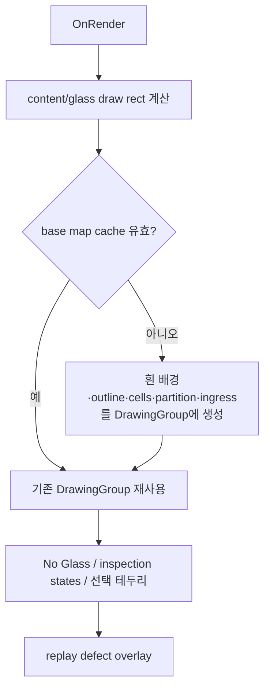

# RecipeWindow - 셀 맵 탭 인수인계 노트

## 1. 핵심 구조

`mapPreviewControl`은 `GlassMapControl : FrameworkElement`다. XAML template/ItemsControl을 사용하지 않고 `OnRender(DrawingContext)`에서 글래스와 Cell을 직접 렌더링한다.

```text
ConsoleRecipeDocument.GlassMap.Cells
  → RecipeService.BuildGlassMapInfoFromRecipe
  → GlassMapInfo / List<RoiInfo>
  → RecipeEditorViewModel.PreviewMapInfo
  → GlassMapControl.MapInfo (DependencyProperty)
  → OnRender
```

공식 문서 기준 `Cells`가 실행용 cell 리스트라는 구조와 일치한다. mapping·rendering·event의 세부 구현은 **[추론]** 이다.

## 2. 바인딩 계약

| GlassMapControl DP | 탭의 binding | 내부 처리 |
|---|---|---|
| `MapInfo` | `PreviewMapInfo` | 변화 시 base map cache를 무효화하고 다시 렌더 |
| `RotationAngle` | `PreviewRotationAngle` | 90도 단위로 정규화 후 모든 Cell/outline 좌표 변환에 적용 |
| `ZoomFactor` | `PreviewZoomFactor` | DP만 선언되어 있고 현 `GlassMapControl.cs`의 렌더 경로에서는 참조 없음 — **[코드 차이]** |
| `GlassPresent` | `ControlGlassPresentState` | false일 때 No Glass overlay |
| `IsUseToggleMode` | `IsCellUseToggleMode` | click event 종류를 전환 |
| `IngressDirection` | `Vars.EMRConfig.GlassIngressDirection` | ingress arrow 방향 |
| `ShowPartitionNameOverlay` | 전역 config | Cell name 첫 글자를 group key로 한 overlay |

`SelectedCellId`는 binding이 아니다. `RecipeWindow.xaml.cs`가 ViewModel의 `SelectedCell` 변경을 구독해 직접 설정하고, 맵 클릭도 code-behind를 거쳐 ViewModel `SelectedCell`을 바꾼다.

## 3. 데이터 변환 상세

### 3.1 실행 Cell → `RoiInfo`

**[추론: `RecipeService.BuildGlassMapInfoFromRecipe`, `ToRoiInfo`]**

| `ConsoleCellPlan` | `RoiInfo` | 설명 |
|---|---|---|
| `CellId` | `Id` | click/선택 동기화 키 |
| `DisplayName` | `Name` | 사용자명이 있으면 그 값이 표시 이름으로 사용 |
| `Use` | `Use` | 해치/채움 렌더링 기준 |
| `IpNo` | `IPNo` | IP별 색상 렌더링 기준 |
| `CellRectGlassUm` | `Rect` | Glass 중심 +Y 위 좌표에서 corner 좌상단 +Y 아래 좌표로 역변환 |

`GlassMapInfo`에는 현재 GlassSize, policy cut mark, `RoiInfo` 목록이 들어간다. `EnsureCellsSnapshot`이 실행 Cell snapshot을 확보한 후 표시 모델을 만든다.

### 3.2 screen 변환

**[추론: `GlassMapControl`]**

1. Cell corner 좌표 `(cx, cy)`를 glass 중심 좌표로 변환한다: `(cx - W/2, H/2 - cy)`.
2. `RotationAngle`을 0/90/180/270도로 정규화하고 회전한다.
3. content rect 안에 종횡비를 유지하는 glass draw rect를 계산한다.
4. 회전된 Glass size로 정규화하여 WPF screen point로 scale한다.
5. Cell 네 모서리의 bounds로 최종 screen rectangle을 만든다.

Hit test도 동일 screen rectangle으로 판단하므로 회전 표시와 click 대상이 일치한다.

## 4. 렌더링 파이프라인과 cache



**[추론]** base map cache key는 `MapInfo` 객체 참조, control 크기, rotation, partition overlay 여부, ingress 옵션/방향이다. MapInfo가 같은 객체 안에서 내용만 변경되고 DP change callback이 발생하지 않으면 cache가 갱신되지 않을 수 있으므로, 현재 구조는 `PreviewMapInfo`를 새 객체로 교체하는 `RefreshPreview()` 흐름에 의존한다.

## 5. 클릭 및 선택 흐름

| 모드 | `GlassMapControl.OnMouseLeftButtonDown` | RecipeWindow 처리 |
|---|---|---|
| 일반 | hit cell을 `SelectedCellId`로 설정하고 `CellClicked` event 발생 | Id로 `viewModel.Cells`에서 cell을 찾고 `SelectedCell`에 설정 |
| Use 토글 | `CellUseToggleRequested` event 발생, 선택 변경 없음 | `viewModel.ToggleCellUse(cellId)` → document 동기화·preview 갱신 |

Window 생성 시 두 event를 구독하고 Closing 중 해제한다. `SelectedCell` 변화도 PropertyChanged 구독을 통해 control selection으로 역방향 반영된다.

## 6. 사용하지 않는 일반 기능

`GlassMapControl`에는 replay defect overlay와 inspection cell state overlay 기능이 있으나, 이 `mapPreviewControl` 인스턴스는 `ReplayDefectOverlays`와 `InspectionCellStates`를 바인딩하지 않는다. 따라서 이 탭은 현재 Cell 구조/Use/IP/선택 상태 중심의 미리보기다. **[추론]**

## 7. 추가 확인 필요 항목

1. `PreviewZoomFactor`를 실제 확대/축소로 구현할 요구가 있는지 확인한다. 현재 binding만 있고 drawing 계산에는 적용되지 않는다.
2. MapInfo 내부 내용 변경 시 cache invalidation을 보장하는지, 새 `PreviewMapInfo` 객체 교체 외 경로를 점검한다.
3. `GlassMapNamingPolicy.CuttingMarkPosition` 및 partition 이름 첫 글자 규칙이 현장 명명 체계와 맞는지 확인한다.
4. `ControlGlassPresentState`의 provider와 null/false의 운영 의미를 확인한다.
5. defect/state overlay 기능을 이 탭에서 사용해야 하는지, 다른 replay/monitor 화면의 전용 기능인지 확인한다.
6. Cell map의 고밀도 구성에서 `HitTestCell` 선형 순회와 render cache 성능을 확인한다.

## 8. 주요 소스

- `uLedAoiConsole/Windows/Recipe/RecipeWindow.xaml`
- `uLedAoiConsole/Windows/Recipe/RecipeWindow.xaml.cs`
- `uLedAoiConsole/Controls/GlassMapControl.cs`
- `uLedAoiConsole/ViewModels/RecipeEditorViewModel.cs`
- `uLedAoiConsole/Models/GlassMapInfo.cs`
- `uLedAoiConsole/Recipes/RecipeService.cs`
