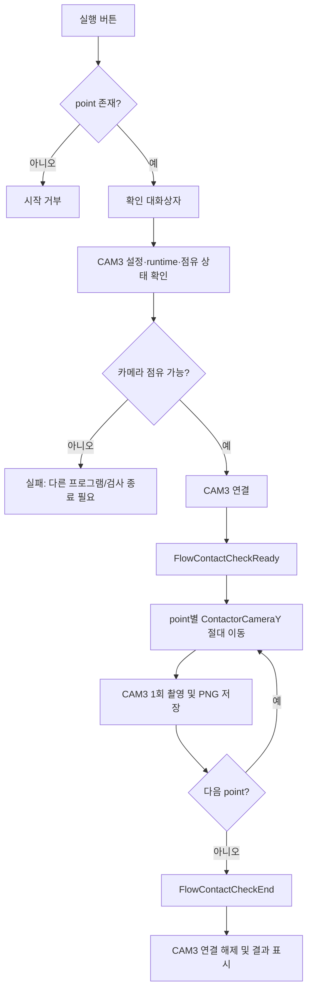
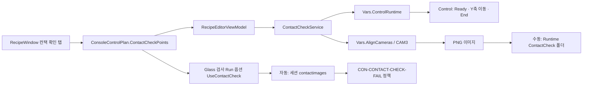

# RecipeWindow - 컨택 확인 탭 분석

## 1. 화면 목적

`컨택 확인` 탭은 **컨택이 성공한 뒤** 컨택터 카메라(CAM3)가 장착된 `ContactorCameraY` 축을 지정 위치로 이동시키며 촬영하여, 컨택 상태를 사람이 확인할 수 있도록 이미지를 남기는 설정·실행 화면이다.

공식 문서에서 확정한 검사 순서는 다음과 같다.

```text
CAM3 점유 가능 여부 확인
  → FlowContactCheckReady
  → 레시피 point별 ContactorCameraY 이동 및 촬영·저장
  → FlowContactCheckEnd
```

메인 glass 검사에서는 `Contact 확인` 옵션이 켜진 경우, 행(row)의 컨택 성공 직후 위 순서를 자동 실행한다. 이미지 확인은 자동 합격/불합격 판정이 아니라 작업자 확인용이다. 실패하면 `CON-CONTACT-CHECK-FAIL`(중대, run 중지) 정책이 적용된다.

이 탭은 컨택 위치를 만들어 내는 화면이 아니다. `ContactorZ`를 움직여 컨택/해제를 수행하는 본체 동작과, 컨택터에 장착된 카메라의 시야 위치를 바꾸는 `ContactorCameraY` 동작은 공식 축 구조 문서에서 분리되어 있다.

## 2. 화면 구성

|영역|XAML 구성|역할|
|---|---|---|
|설명|상단 안내 `TextBlock`|컨택 성공 후 CAM3가 point를 순회하여 촬영한다는 목적, 메인 검사 자동 실행 조건 및 저장 위치를 표시한다.|
|point 편집 도구|현재 위치 추가, 선택 삭제|CAM3 Y축 위치 목록을 레시피에 등록·삭제한다.|
|검증/디버그 도구|테스트 촬영, 준비 Flow 전송, 종료 Flow 전송|이동 없이 카메라만 확인하거나 Control flow만 개별 점검한다.|
|실행 도구|Contact Check 실행|점유 확인부터 ready/end flow와 point별 이동·촬영을 한 번에 수행한다.|
|point 목록|`DataGrid` (`ContactCheckPoints`)|`Name`, `Y (um)`으로 구성된 컨택 확인 위치를 편집·선택한다. 새 행 추가도 허용한다.|

이 탭의 버튼은 별도 `Window`를 열지 않는다. 실행 전 확인 대화상자와 결과 상태 메시지만 사용한다.

## 3. 컨트롤 분석

|컨트롤|바인딩/명령|역할 및 사용 방법|입력 기준·주의 사항|
|---|---|---|---|
|`현재 위치 추가`|`AddContactCheckPointCommand`|현재 `ContactorCameraY` 실제 좌표를 읽어 마지막 point 뒤에 추가한다. 기본 이름은 `P{순번}`이다.|축 좌표를 읽을 수 있어야 한다. 의도한 카메라 위치로 먼저 이동한 뒤 누른다.|
|`선택 삭제`|`RemoveContactCheckPointCommand`|선택한 한 point를 목록과 레시피에서 제거한다.|삭제 후에는 다음 항목 또는 마지막 항목이 선택된다. 메인 자동 실행에는 최소 1개 point가 필요하다.|
|`테스트 촬영`|`ContactCheckCaptureTestCommand`|CAM3를 단독 연결하여 1회 촬영 후 저장한다.|**이동·ready/end flow·컨택 수행을 하지 않는다.** CAM3가 다른 프로그램 또는 검사에서 점유 중이면 실패한다.|
|`준비 Flow 전송`|`SendContactCheckReadyCommand`|`FlowContactCheckReady`만 Control에 전송한다.|디버그용 분리 명령이다. 일반 작업에서는 단독 사용하지 말고 전체 실행을 사용한다.|
|`종료 Flow 전송`|`SendContactCheckEndCommand`|`FlowContactCheckEnd`만 Control에 전송한다.|준비 flow를 수동 전송한 뒤 정리해야 할 때 사용한다.|
|`Contact Check 실행`|`RunContactCheckCommand`|CAM3 점유 확인 → 준비 flow → 각 point 이동/촬영 → 종료 flow를 수행한다.|point가 비어 있으면 시작하지 않는다. 실행 전 현재 컨택 상태와 안전 상태를 확인한다.|
|`DataGrid.Name`|`ConsoleContactCheckPoint.Name`|촬영 위치의 식별 이름이다. 저장 파일명에도 사용된다.|공백 이름도 코드상 허용된다. 파일명에 쓸 수 없는 문자는 `_`로 치환된다.|
|`DataGrid.Y (um)`|`ConsoleContactCheckPoint.YUm`|`ContactorCameraY`의 절대 이동 목표값(µm)이다.|XAML/현재 ViewModel에는 숫자 범위 검증이 없다. 장비의 실제 축 이동 한계와 컨택 안전 범위 안에서 입력해야 한다.|

## 4. 이벤트 분석

### 4.1 point 추가·삭제·편집

```text
현재 위치 추가
  → AxisPositionReader.ReadAsync(ContactorCameraY)
  → ConsoleContactCheckPoint { Name = "P{n}", YUm = 현재값 } 생성
  → ContactCheckPoints 추가 및 선택
  → CollectionChanged
  → Document.ControlPlan.ContactCheckPoints에 목록 반영
```

`선택 삭제`도 같은 컬렉션 변경 경로를 통해 레시피에 반영한다. `DataGrid`는 행 추가를 허용하므로, 사용자가 직접 `Name`과 `Y (um)`을 입력하여 point를 만들 수도 있다.

### 4.2 테스트 촬영

```text
테스트 촬영
  → ContactCheckService.CaptureTestImageAsync
  → ContactCheckCameraName(CAM3) 설정 확인
  → AlignCameras에서 해당 카메라 runtime 조회
  → IsConnected / IsGrabbing 점유 여부 확인
  → 카메라 연결 (emulation 사용 안 함)
  → GrabOneAsync(5초)
  → RuntimeDir\ContactCheck\yyyyMMdd_HHmmss\test_capture_yyyyMMdd_HHmmss.png 저장
  → 카메라 연결 해제
```

위 저장 파일명과 5초 timeout은 현재 코드 구현 기준이다. **[추론]** 공식 문서는 수동 테스트의 세부 파일명보다, 메인 run의 세션 `contactimages` 보관을 기준으로 설명한다.

### 4.3 전체 Contact Check 실행



현재 `ContactCheckService`는 한 번에 하나의 실행만 허용하는 `SemaphoreSlim` 보호를 둔다. 이미 실행 중이면 두 번째 실행은 즉시 실패한다. **[추론]** 이는 동시 이동·카메라 접근 충돌을 방지하기 위한 구현이다.

각 point는 `AxisMove(ContactorCameraY, YUm, Abs)`를 `MoveModeCategory.ContactSafeStep`으로 Control runtime에 전송한 뒤 촬영한다. 하나라도 이동 또는 촬영에 실패하면 이후 point는 실행하지 않는다. 준비 flow가 성공한 뒤 오류가 나더라도 `finally`에서 종료 flow 전송을 시도하며, 카메라 연결도 항상 해제한다.

### 4.4 메인 검사와의 실행 차이

|구분|이 탭의 수동 실행|메인 glass 검사|
|---|---|---|
|시작 조건|사용자가 실행 버튼을 누르고 point가 존재|검사 옵션 `UseContactCheck`가 켜지고, row 컨택이 성공|
|저장 위치|`RuntimeDir\ContactCheck\{실행시각}` **[추론: 현재 코드]**|검사 세션 폴더의 `contactimages` (공식 문서)|
|실패 영향|화면에 실패 메시지·로그 표시|`CON-CONTACT-CHECK-FAIL`로 run을 중지 (공식 문서)|
|컨택 수행|수동 실행은 `Contact` 명령을 보내지 않음 **[추론: 호출 코드 기준]**|이미 완료된 row 컨택 직후 수행|

따라서 수동 실행 전에는 실제 컨택 상태 여부를 작업자가 판단해야 한다. point 이동만으로 컨택 성공을 보장하지 않는다.

## 5. 데이터 바인딩

|UI 데이터|ViewModel|레시피 모델|저장 의미|
|---|---|---|---|
|`DataGrid.ItemsSource`|`ObservableCollection<ConsoleContactCheckPoint> ContactCheckPoints`|`ConsoleControlPlan.ContactCheckPoints`|컨택 확인 촬영 위치 목록|
|선택 행|`SelectedContactCheckPoint`|없음|삭제 대상·현재 편집 대상|
|행 이름|`ConsoleContactCheckPoint.Name`|동일|점의 표시명 및 저장 파일 식별자|
|행 Y 값|`ConsoleContactCheckPoint.YUm`|동일|`ContactorCameraY` 절대 이동값(µm)|

`ContactCheckPoints.CollectionChanged`는 `EnsureControlPlan().ContactCheckPoints = ContactCheckPoints.ToList()`를 수행한다. 즉 행 추가·삭제가 발생하면 현재 목록을 Console recipe의 `ControlPlan`에 다시 기록한다.

레시피를 다시 UI에 연결할 때는 기존 목록을 먼저 snapshot한 다음 컬렉션을 비우고 복원한다. 이는 과거에 `Clear()`가 `CollectionChanged`를 발생시켜 빈 목록을 문서에 덮어쓰고 point가 사라졌던 회귀를 방지한 구현이다.

`ConsoleContactCheckPoint`의 데이터 계약은 다음과 같다.

```csharp
public sealed class ConsoleContactCheckPoint
{
    public string Name { get; set; }
    public double YUm { get; set; }
}
```

`ToList()`는 객체를 복제하지 않고 목록 컨테이너만 새로 만든다. 따라서 DataGrid가 같은 point 객체의 속성을 편집하는 구조로 보인다. **[추론]** 레시피 직렬화 직전의 동기화 경로는 별도 저장 흐름까지 함께 확인해야 한다.

## 6. 사용자 입장에서

### 레시피 설정 절차

1. CAM3를 확인하고 첫 촬영 위치로 `ContactorCameraY`를 이동한다.
2. `현재 위치 추가`를 눌러 해당 좌표를 등록한다.
3. 필요한 다른 시야 위치마다 이동 후 같은 과정을 반복한다.
4. 표의 `Name`을 사람이 구별하기 쉬운 이름으로 정리한다. 예: `LeftEdge`, `Center`, `RightEdge`.
5. `Y (um)`가 장비 안전 범위 안인지 확인한다. 이 화면은 입력 범위를 막아주지 않는다.
6. `테스트 촬영`으로 카메라 연결과 이미지 품질만 먼저 확인한다.
7. 실제 순서 검증은 `Contact Check 실행`으로 수행한다.
8. 메인 검사에 반영하려면 run 설정의 `Contact 확인` 옵션도 켠다.

### 버튼 선택 기준

|원하는 작업|사용할 버튼|사용하지 말아야 할 상황|
|---|---|---|
|현재 CAM3 위치를 레시피에 기록|현재 위치 추가|축 위치가 불확실하거나 수동 조작이 진행 중일 때|
|카메라만 살아 있는지 확인|테스트 촬영|point 이동/flow까지 검증하려는 경우|
|실제 point 순서와 촬영을 점검|Contact Check 실행|다른 프로그램이 CAM3를 사용 중일 때|
|Control flow 통신만 진단|준비/종료 Flow 전송|생산 운전 중 또는 flow 상태를 모를 때|

### 실패 시 우선 확인

1. CAM3가 외부 뷰어, 다른 검사, 다른 Console에서 열려 있지 않은지 확인한다.
2. `ContactCheckCameraName`과 `AlignCameras` 카메라 설정이 일치하는지 확인한다.
3. point의 `Y (um)`가 장비 허용 범위·컨택 안전 구간인지 확인한다.
4. Control runtime 연결과 `FlowContactCheckReady/End` 응답을 확인한다.
5. 메인 검사 실패라면 `CON-CONTACT-CHECK-FAIL` 로그와 세션 `contactimages`를 함께 확인한다.

시뮬레이션 모드에서는 실제 CAM3를 성공한 것처럼 처리하지 않는다. 실카메라가 없으면 실패하고 run이 중지되는 것이 프로젝트의 장치 의존 기능 원칙이다.

## 7. 업무 로직 추론

공식 문서는 이 기능을 “컨택 성공 후 육안 확인용 촬영”으로 정의한다. 아래는 현재 코드 호출 관계에 근거한 보완 설명이다.

- **[추론]** `FlowContactCheckReady`는 point 순회 전의 contact-safe 상태 준비를 Control에 맡기고, Console은 그 응답이 성공한 뒤에만 Y축 이동을 시작한다.
- **[추론]** `MoveModeCategory.ContactSafeStep`은 컨택 상태에서 CAM3 Y축 이동을 허용하되, 일반 stage 이동과는 다른 안전 제약을 적용하도록 Control에 의도를 전달한다.
- **[추론]** 카메라를 강제로 빼앗지 않고 `IsConnected`/`IsGrabbing`이면 실패시키는 정책은, 다른 화면의 촬영과 충돌해 잘못된 컨택 이미지를 남기는 위험을 줄인다.
- **[추론]** point별 파일명에 Y값을 포함시키는 것은 레시피 위치와 실제 촬영 산출물을 사후 대조하기 위한 것이다.
- **[추론]** 수동 실행은 컨택 명령이나 컨택 성공 센서 검증을 직접 호출하지 않으므로, 장치가 실제 컨택 상태인지의 판정 책임은 이 서비스 밖의 선행 절차에 있다.

## 8. 문서작성 요약

|항목|내용|
|---|---|
|화면 명칭|RecipeWindow / 컨택 확인|
|레시피 소유 모델|`ConsoleControlPlan.ContactCheckPoints`|
|실행 축|`ContactorCameraY`|
|카메라|설정의 `ContactCheckCameraName` (CAM3)|
|정상 순서|CAM3 점유 확인 → Ready → point별 절대 이동·촬영 → End|
|메인 연동|row 컨택 성공 뒤 `UseContactCheck`가 켜졌을 때 자동 실행|
|메인 실패 정책|`CON-CONTACT-CHECK-FAIL`, 중대(Heavy), run 중지|
|수동 저장|`RuntimeDir\ContactCheck\{timestamp}` **[추론: 코드]**|
|메인 저장|검사 세션의 `contactimages`|

## 9. 이해되지 않는 부분 / 추가 확인 필요

|확인 항목|현재 확인 결과|추가 확인 방법|
|---|---|---|
|Y축 실제 허용 범위|UI·ViewModel에는 min/max 및 단위 변환 검증이 없다.|Control 축 설정 또는 장비 사양에서 `ContactorCameraY` soft limit을 확인한다.|
|컨택 성공 판정의 원천|이 탭은 컨택 성공 신호를 직접 읽지 않는다.|컨택 flow의 sensor/IO 판정 코드와 Control API 응답을 확인한다.|
|Ready/End의 실제 장치 동작|Console은 flow command와 성공 여부만 확인한다.|Control 프로젝트의 `FlowContactCheckReady`, `FlowContactCheckEnd` 핸들러를 확인한다.|
|이미지 육안 판정 기준|공식 문서는 사람이 확인한다고만 정의한다.|생산 품질 기준서에서 정상/불량 컨택 이미지 예시와 합격 기준을 확정한다.|
|수동 실행의 컨택 상태 보장|코드상 point 이동과 촬영만 수행한다.|수동 진단 전용인지, 상태 interlock이 필요한지 운영 절차로 확정한다.|

## 10. 전체 프로젝트 연결



관련 코드:

- `uLedAoiConsole/Windows/Recipe/RecipeWindow.xaml` — 탭과 DataGrid, 명령 바인딩
- `uLedAoiConsole/ViewModels/RecipeEditorViewModel.cs` — 목록 편집·명령·레시피 동기화
- `uLedAoiConsole/Services/ContactCheckService.cs` — 카메라 점유, flow, 이동, 촬영, 저장
- `uLedAoiConsole/Models/Recipe/ConsoleControlPlan.cs` — point 데이터 모델

우선 참조 문서:

- `docs/axis-system-structure.md`
- `docs/alarm-policy.md`
- `docs/development/change-log.md` (컨택 확인 flow·레시피 데이터·메인 run 연동 확정 기록)
