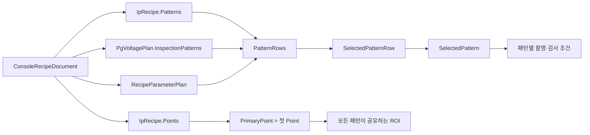
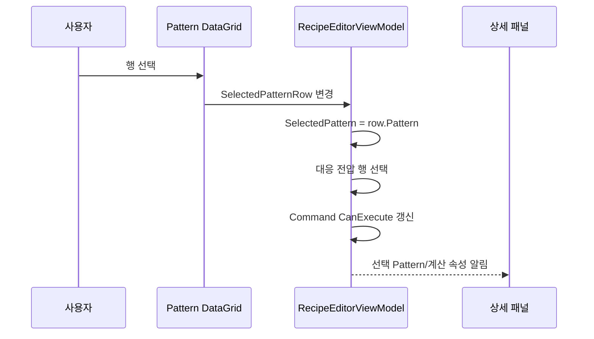
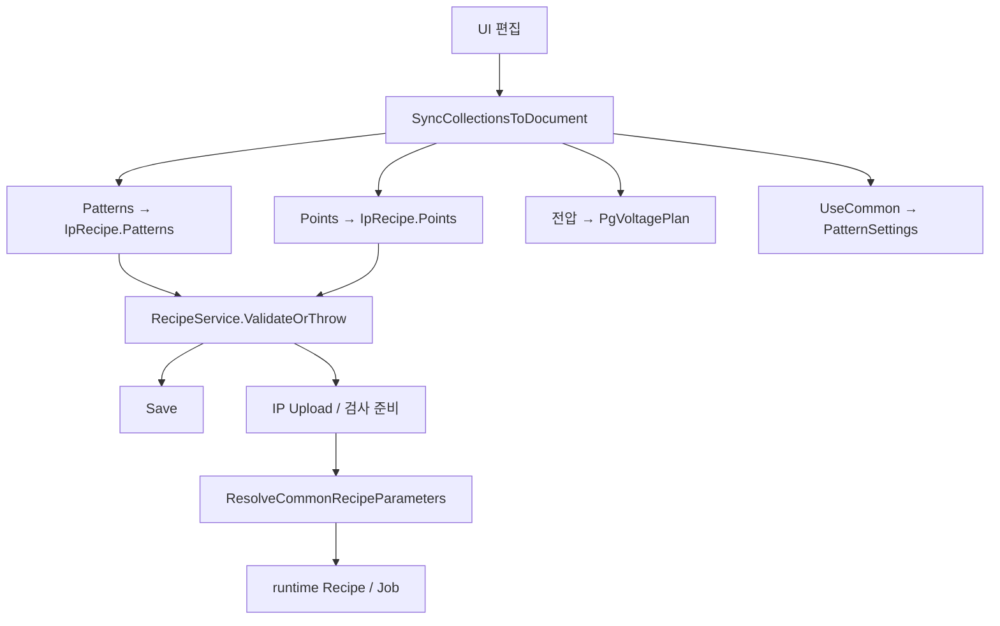

# RecipeWindow / 검사 패턴 탭 개발자 분석

> 분석 대상: `RecipeWindow.xaml`의 `<TabItem Header="검사 패턴">`  
> 검증 기준일: 2026-07-31  
> 사실 우선순위: 프로젝트 제작자 공식 Docs → 현재 코드 → `[추론]`
>
> 표기 규칙: 공식 Docs에 없는 구현 세부를 코드로 확인한 경우에도 사용자 기준에 따라 `[추론] (코드 확인)`으로 표시한다.

## 0. 결론

검사 패턴 탭은 다음 세 종류의 데이터를 한 화면에서 편집한다.

| 화면 영역 | 정본 데이터 | 책임 |
|---|---|---|
| 검사 패턴 목록 | `Document.IpRecipe.Patterns` + `Document.PgVoltagePlan.InspectionPatterns` + `Document.RecipeParameterPlan.PatternSettings` | 패턴 식별, 검사 채널, PG 전압, 노출, 검사 조건, 공통값 사용 여부 |
| 선택된 패턴 | 목록에서 선택한 `PatternPlanModel` | 선택 패턴의 촬영·검출·등급 조건 상세 편집 |
| 검사 ROI | `Document.IpRecipe.Points`의 첫 Point | 모든 패턴이 공유하는 현재 단일 검사 ROI 편집 |

가장 중요한 해석은 다음과 같다.

- 공식 Docs 기준 실행 단위는 `Pattern × Point`이다.
- ROI는 Pattern의 속성이 아니라 `CapturePointPlanModel`의 속성이다.
- 따라서 오른쪽 `검사 ROI`는 **선택 패턴 전용 ROI가 아니다.**
- 현재 운영 가이드는 Point를 사실상 한 개의 공통 ROI로 설명한다.
- 공통 파라미터는 편집 화면에서 각 Pattern에 복사되고, IP 업로드·검사 실행용 레시피를 만들 때 다시 해석된다.



## 1. 화면 목적

### 1.1 공식 Docs 기준

이 탭은 R/G/B/W 검사 Pattern의 조명·촬영·검출·등급 조건과 공통 Point의 ROI를 설정하는 Recipe 편집 화면이다.

공식 Docs에서 Pattern과 Point의 책임은 다음처럼 분리된다.

| 개념 | 공식 책임 |
|---|---|
| Pattern | 패턴 이름/종류, PG 대응, Timeout, Exposure, Gain, 검사 파라미터 |
| Point | 촬영 위치, ROI, anchor |
| 실행 단위 | 모든 Pattern과 공통 Point 집합의 조합인 `Pattern × Point` |

Recipe 작성 권장 순서는 Glass/Cell 설정 후 Pattern/Point/ROI를 조정하고, Validate와 Save를 거쳐 IP에 Upload/Activate하는 흐름이다.

### 1.2 전체 프로젝트에서의 역할

이 탭에서 작성한 값은 다음 단계에 사용된다.

1. Recipe 파일에 Pattern, Point, 전압, 공통 사용 설정을 저장한다.
2. IP 업로드 시 Pattern과 ROI를 runtime recipe/job 형태로 변환한다.
3. 각 검사 step에서 PG Pattern을 선택하고 설정 전압으로 점등한다.
4. 카메라는 Pattern의 Exposure/Gain으로 촬영한다.
5. IP 검사는 Point ROI 안에서 Pattern별 Threshold·Blob 조건을 사용한다.
6. 측정 level을 상대 비율 또는 절대 gray level로 등급화한다.

## 2. 화면 구성

| 위치 | XAML 구조 | 크기/동작 | 기능 |
|---|---|---|---|
| 상단 | `WrapPanel` | 자동 높이 | 패턴 추가, 삭제, 공통 파라미터 창 |
| 중단 | `GroupBox Header="검사 패턴 목록"` + `DataGrid` | 높이 230 | 전체 Pattern 요약·선택·직접 편집 |
| 구분선 | `GridSplitter` | 12 px | 목록과 상세 영역 높이 조절 |
| 하단 좌측 | `GroupBox Header="선택된 패턴"` | 가변 폭 | 선택 Pattern 상세 편집 |
| 하단 우측 | `GroupBox Header="검사 ROI"` | 고정 폭 380 | 첫 Point의 ROI 수치 편집 |

## 3. 컨트롤 분석

### 3.1 상단 버튼

| 표시명 | 종류 | 연결 | 동작 | 새 창 |
|---|---|---|---|---|
| 패턴 추가 | Button | `AddPatternCommand` | 새 Pattern과 전압/공통 사용 행을 생성 | 없음 |
| 패턴 삭제 | Button | `RemovePatternCommand` | 선택 Pattern 삭제 확인 후 관련 데이터를 제거 | 확인 Dialog |
| 공통 파라미터... | Button | `OpenCommonRecipeParameterWindow_Click` | 공통 검사 조건 편집창 표시 또는 기존 창 활성화 | `CommonRecipeParameterWindow` |

### 3.2 검사 패턴 목록

`ItemsSource="{Binding PatternRows}"`, `SelectedItem="{Binding SelectedPatternRow}"`이다.

| 열 | 바인딩 | 단위/선택지 | 변경 영향 |
|---|---|---|---|
| 번호 | `Pattern.PatternIndex` | 정수 | Pattern 식별과 전압/공통설정 연결 key |
| 이름 | `Pattern.PatternName` | 문자열 | 화면, 로그, runtime Pattern 이름 |
| 종류 | `Pattern.PatternType` | `R`, `G`, `B`, `W` | 검사 채널과 W 처리 방식 결정 |
| R 전압 | `Voltage.RedVoltage` | V, 소수 3자리 표시 | PG R 채널 출력 |
| G 전압 | `Voltage.GreenVoltage` | V, 소수 3자리 표시 | PG G 채널 출력 |
| B 전압 | `Voltage.BlueVoltage` | V, 소수 3자리 표시 | PG B 채널 출력 |
| 노출(us) | `Pattern.ExposureUs` | µs | 카메라 shot 노출 |
| 공통 사용 | `UseCommonRecipe` | bool | 공통 `InspectionConfig` 사용 여부 |
| 기준 상위 % | `ReferenceTopPercent` | 0~50 | 내부 `NormalLevelPercentile=100-입력값` |
| 임계값 | `InspectionConfig.ThresholdInput` | 단일/목록 | Blob 이진화 후보 |
| 최소/최대 면적 | `MinArea`, `MaxArea` | pixel area | connected component 면적 필터 |
| 최소/최대 W | `BlobMinWidth`, `BlobMaxWidth` | px | Blob bounding box 폭 필터 |
| 최소/최대 H | `BlobMinHeight`, `BlobMaxHeight` | px | Blob bounding box 높이 필터 |

`공통 사용=True`인 행은 기준 상위 %, 임계값, 면적, Blob 폭/높이 편집 TextBox가 비활성화된다. 이름·종류·전압·노출은 공통 파라미터가 덮는 대상이 아니므로 계속 편집할 수 있다.

### 3.3 선택된 패턴

| 표시명 | 바인딩 | 기본/범위 | 프로그램 영향 |
|---|---|---|---|
| 공통 파라미터 사용 | `SelectedPatternRow.UseCommonRecipe` | 기본 false | 켜는 즉시 공통 검사 조건을 이 Pattern에 복사 |
| 공통 값 복사해 오기 | `CopyCommonRecipeToSelectedPatternCommand` | 선택 필요 | 공통값을 현재 Pattern에 1회 복사 |
| 이름 | `SelectedPattern.PatternName` | 추가 시 `Pattern N` | runtime 식별/표시 |
| Timeout(ms) | `SelectedPattern.TimeoutMs` | 추가 시 3000 | Pattern step 대기 제한 |
| 노출(us) | `SelectedPattern.ExposureUs` | 추가 시 1000 | 카메라 shot 노출 |
| Gain | `SelectedPattern.Gain` | 추가 시 1.0 | 카메라 shot gain |
| 임계값 | `ThresholdInput` | 추가 시 30 | object 검출 민감도 |
| 면적 최소/최대 | `MinArea/MaxArea` | 추가 시 16/400 | 작은 노이즈·큰 병합 blob 제거 |
| Blob 폭/높이 최소/최대 | 각 Blob 속성 | 추가 시 1/1000 | 비정상 형상 제거 |
| 정상레벨 기준 상위 % | `SelectedPatternReferenceTopPercent` | UI 0~50 | 상대 등급의 normal level 산출 위치 |
| 절대값 | `SelectedPatternUseAbsoluteLevel` | 기본 false | grade 기준을 비율 대신 0~255 gray level로 해석 |
| 등급 A/B/C 기준 | `GradeSpec` | 공식/코드 기본 불일치 있음 | A/B/C/D 판정 경계 |
| 선택 표시 | `SelectedPatternDisplay` | 읽기 전용 | `이름 (Index n)` |

공통 사용 중에는 임계값, 면적, Blob, 정상레벨, 절대값, 등급 입력이 흐려지고 비활성화된다. 이름과 촬영 조건은 계속 편집 가능하다.

### 3.4 검사 ROI

| 표시명 | 바인딩 | 적용 시점 | 의미 |
|---|---|---|---|
| ROI X | `PrimaryPoint.RoiX` | 포커스를 잃을 때 | 원본 이미지 기준 ROI 좌상단 X |
| ROI Y | `PrimaryPoint.RoiY` | 포커스를 잃을 때 | 원본 이미지 기준 ROI 좌상단 Y |
| ROI 폭 | `PrimaryPoint.RoiWidth` | 포커스를 잃을 때 | ROI 가로 크기 |
| ROI 높이 | `PrimaryPoint.RoiHeight` | 포커스를 잃을 때 | ROI 세로 크기 |

`PrimaryPoint`는 `Points.FirstOrDefault()`이다. 목록에서 다른 Pattern을 선택해도 ROI 대상 Point는 바뀌지 않는다.

공식 검증 조건은 Point가 최소 1개이고 ROI 폭/높이가 0보다 커야 한다는 것까지다. 공식 Docs와 현재 `RecipeService.ValidateOrThrow()`에는 X/Y가 음수인지, ROI가 이미지 경계 안인지 검사하는 규칙이 명시되지 않는다.

탭 안의 `현재 위치 적용`, `이미지 창 열기` 버튼은 XAML 주석 안에 있어 현재 화면에는 나타나지 않는다. 이미지 기반 ROI 편집은 RecipeWindow 상단 `창 > 이미지 창`으로 `RecipeImageWindow`를 열어 수행한다.

`[추론] (코드 확인)` 다중 Point가 존재하면 두 화면의 편집 대상이 달라질 수 있다. 검사 패턴 탭은 항상 첫 Point인 `PrimaryPoint`를 편집하지만, `RecipeImageWindow`는 `SelectedPoint`의 ROI를 표시·편집한다. 공식 운영이 단일 Point이므로 일반 운전에서는 둘이 같지만, 다중 Point Recipe에서는 반드시 대상을 확인해야 한다.

## 4. 이벤트와 Command 분석

### 4.1 Pattern 선택 `[추론] (코드 확인)`



`OnSelectedPatternRowChanged()`는 선택 행의 `Pattern`을 `SelectedPattern`으로 맞춘다. 반대로 코드에서 `SelectedPattern`이 바뀌면 `OnSelectedPatternChanged()`가 같은 Pattern 인스턴스를 가진 행을 찾아 `SelectedPatternRow`와 Pattern 전압 선택을 동기화한다.

### 4.2 패턴 추가 `[추론] (코드 확인)`

`AddPattern()`의 코드 진행:

1. `max(PatternIndex)+1`을 새 index로 정한다. 목록이 비면 0이다.
2. `PatternPlanModel`을 생성한다.
3. `Patterns`에 추가한다.
4. 같은 index의 `ConsolePatternCommonRecipeSetting`을 확보한다.
5. 기본 RGB 전압 행을 생성해 `InspectionPatternVoltages`에 추가한다.
6. 세 객체를 묶은 `PatternRecipeRowViewModel`을 `PatternRows`에 추가한다.
7. 새 Pattern을 선택하고 상태 메시지를 갱신한다.

| 새 Pattern 항목 | 코드 기본값 |
|---|---:|
| `PatternIndex` | 기존 최대 + 1 |
| `PatternName` | `Pattern {index+1}` |
| `PgPatternIndex` | `index+1` |
| `TimeoutMs` | 3000 |
| `ExposureUs` | 1000 |
| `Gain` | 1.0 |
| Threshold | 30 |
| MinArea / MaxArea | 16 / 400 |
| Blob W min/max | 1 / 1000 |
| Blob H min/max | 1 / 1000 |
| R/G/B 전압 | 각 4.5 V |
| Use Common | false |

위 기본값은 공식 Docs에 모두 명시된 것이 아니므로 `[추론] (코드 확인)` 값이다. 현장 적정값을 의미하지 않는다.

### 4.3 패턴 삭제 `[추론] (코드 확인)`

삭제 버튼은 선택 Pattern이 있을 때만 활성화된다. 삭제 확인에서 `No`를 기본 선택으로 제시하며, 승인하면 다음 데이터를 같은 `PatternIndex` 기준으로 제거한다.

- `Patterns`
- `PatternRows`
- `RecipeParameterPlan.PatternSettings`
- `InspectionPatternVoltages`

마지막으로 `SelectedPattern=null`이 된다. 최소 한 Pattern 규칙은 삭제 시점이 아니라 Validate/Save 시 검출될 수 있다.

### 4.4 공통 파라미터

공통 적용은 두 단계다.

| 단계 | 코드 | 목적 |
|---|---|---|
| 편집 시 복사 | `ApplyCommonRecipeToRow()`, `ApplyCommonRecipeToCommonPatterns()` | 화면에 실제 적용값을 표시하고 개별 편집 잠금 |
| runtime 재해석 | `ULedIpConnection.ResolveCommonRecipeParameters()` | 업로드/검사 실행용 clone에 공통값을 최종 반영 |

`UseCommonRecipe`를 false→true로 바꾸면 즉시 공통 `InspectionConfig`의 deep clone이 선택 Pattern에 들어간다. 공통창을 닫으면 현재 공통 사용 중인 모든 Pattern에 다시 clone한다.

`공통 값 복사해 오기`는 Use Common을 자동으로 켜지 않는다. 현재 Pattern에 공통값을 복사하는 일회성 작업이며, 이후에는 개별 편집이 가능하다.

### 4.5 공통 파라미터 창 `[추론] (코드 확인)`

`CommonRecipeParameterWindow`는 부모 RecipeWindow와 같은 `RecipeEditorViewModel`을 공유한다.

| 창 컨트롤 | 바인딩 | 영향 |
|---|---|---|
| 임계값 | `CommonInspectionConfig.ThresholdInput` | 공통 threshold/candidates |
| 정상레벨 기준 | `CommonReferenceTopPercent` | 공통 percentile 변환 |
| 절대값 | `CommonUseAbsoluteLevel` | 공통 grade 해석 방식 |
| 등급 A/B/C | 공통 `GradeSpec` | 공통 등급 경계 |
| 불량 판정 기준 등급 | `DefectCutoffGrade` | 현재 UI에는 있으나 최신 판정 정책과 차이 있음 |
| 면적 최소/최대 | 공통 `MinArea/MaxArea` | 공통 면적 필터 |
| Blob 폭/높이 | 공통 Blob 속성 | 공통 형상 필터 |
| 닫기 | `Close_Click` | 창 닫힘 후 공통 사용 Pattern 전체 재반영 |

별도 OK/Apply/Cancel 복사본이 없다. `IsCancel=True`인 닫기 버튼이나 X로 닫아도 공유 ViewModel에 입력된 공통값 자체는 되돌아가지 않는다.

## 5. 데이터 바인딩과 저장 구조

### 5.1 PatternRows는 합성 ViewModel `[추론] (코드 확인)`

`PatternRecipeRowViewModel` 한 행은 다음 세 객체를 보유한다.

| 속성 | 실제 형식 | 저장 위치 |
|---|---|---|
| `Pattern` | `PatternPlanModel` | `Document.IpRecipe.Patterns` |
| `Voltage` | `ConsoleInspectionPatternVoltage` | `Document.PgVoltagePlan.InspectionPatterns` |
| `_setting` | `ConsolePatternCommonRecipeSetting` | `Document.RecipeParameterPlan.PatternSettings` |

즉 DataGrid 한 행이 한 JSON 객체에 그대로 저장되는 구조가 아니다.

### 5.2 Load/Rebind `[추론] (코드 확인)`

Recipe를 불러오면:

1. `Document.IpRecipe.Patterns`를 `Patterns`에 넣는다.
2. Pattern별 전압을 준비한다.
3. PatternIndex로 공통 사용 설정과 전압을 찾는다.
4. 세 객체를 묶어 `PatternRows`를 재구성한다.
5. `Document.IpRecipe.Points`를 `Points`에 넣는다.
6. `PrimaryPoint` 변경 알림을 발생시킨다.

### 5.3 Save/Validate/Upload



현재 Console `RecipeService.ValidateOrThrow()`가 검사 패턴 영역에 대해 명시적으로 확인하는 것은 다음이다.

- Pattern이 최소 1개
- `PatternIndex` 중복 없음
- Point가 최소 1개
- `PointIndex` 중복 없음
- ROI Width/Height > 0
- PG 전압 행의 `PatternIndex` 중복 없음
- 모든 Pattern에 같은 index의 PG 전압 행 존재
- Black/R/G/B 전압을 mV로 변환한 값이 signed 2-byte 범위 안에 있음

공식 문서에 기재된 세부 검사 조건과 `uLed.Common.RecipeEditing.RecipeEditorValidationService`에는 Threshold, 면적, Blob, percentile, grade 순서 등의 더 강한 검증 규칙이 있으나, 현재 `RecipeEditorViewModel.ValidateCommand`가 그 서비스를 직접 호출하는 연결은 확인되지 않는다. 이는 2차 검증의 주요 차이다.

## 6. 값의 의미·범위·변경 영향

### 6.1 Pattern 식별·촬영·점등

| 값 | 공식 기준/코드 제한 | 값을 변경했을 때 |
|---|---|---|
| PatternIndex | 운영 가이드 0-based 권장, 현재 Console은 중복만 검사 | 전압·공통설정·runtime Pattern 연결 key가 바뀜 |
| PatternName | 공식 가이드상 필수 의미, 현재 Console은 빈 문자열을 명시 검증하지 않음 | 표시/로그/runtime 이름 변경 |
| PatternType | R/G/B/W | 검사 채널 결정. W는 RGB에서 확정한 좌표로 level만 읽음 |
| PG Pattern Index | 현재 탭에 미노출 | PG 장비에서 선택할 Pattern 번호 |
| TimeoutMs | 공식 수치 범위 없음 | protocol/model에는 전달되나 현재 코드에서 실제 wait/cancel 제한 소비처는 확인되지 않음 |
| ExposureUs | 외부 카메라 Live에서 확정 후 반영 권장 | 밝기·포화·검출 안정성 변화 |
| Gain | 공식 수치 범위 없음 | 신호와 노이즈가 함께 변할 수 있음 |
| R/G/B Voltage | 장비/Config 허용 범위 확인 필요 | PG 출력과 점등 밝기/색 변화 |

`PatternIndex`를 목록에서 직접 바꾸면 이미 생성된 전압·공통 사용 설정 객체의 key가 같은 순간 자동 변경되는 setter는 없다. `[추론] (코드 확인)` 저장 동기화 시 공통 설정은 행의 현재 index로 재작성되지만, 전압 객체의 `PatternIndex`는 별도다. 운영자는 번호 직접 변경보다 Pattern 추가/삭제를 사용하는 편이 안전하다.

`[추론] (코드 확인)` `TimeoutMs`는 runtime Pattern plan까지 복사되지만, 최신 코드 검색에서는 그 값을 실제 대기 취소 시간으로 소비하는 지점을 확인하지 못했다. 따라서 “값을 늘리면 실제 검사 timeout이 반드시 늘어난다”고 단정하지 않는다.

### 6.2 Threshold와 Blob 필터

공식 검사 흐름:

1. ROI 내부 grayscale 준비
2. Threshold 이진화
3. 8-connected component labeling
4. 면적과 bounding box 폭/높이 필터
5. object 중심·level 산출
6. grid/map 대응 및 등급 판정

| 값 | 허용/권장 | 영향 |
|---|---|---|
| Threshold | 공식 최소 0, 배경 평탄화 사용 시 보수적 권장 20~30 | 높이면 어두운 점/노이즈가 줄고, 지나치면 정상점 누락 가능 |
| Threshold 후보 | 쉼표 목록. 코드 parser는 세미콜론도 허용 | 후보별 검출 후 최고 점수 결과 채택 |
| MinArea | 공식 0 이상 | 높이면 작은 노이즈 제거, 작은 정상점 누락 가능 |
| MaxArea | MinArea 이상 | 낮추면 병합/대형 blob 제거, 정상 blob 제거 가능 |
| Blob Min W/H | 0보다 큼 | 작은 형상 제거 |
| Blob Max W/H | 각각 Min 이상 | 넓거나 긴 병합 형상 제거 |

다중 Threshold의 공식 점수는 `필터 통과 개수 - 병합 감점`이며, 감점은 크기 상한 초과 blob 총면적을 pitch²로 나눈 값이다. 동점이면 더 높은 threshold를 선택한다.

`ThresholdInput` 코드 parser는 유효 숫자가 하나도 없으면 기존값을 유지하고, 하나면 단일 Threshold, 둘 이상이면 `ThresholdCandidates`에 저장한다. 첫 후보는 호환용 `Threshold`에도 저장된다.

### 6.3 정상레벨과 등급

상대 모드에서:

```text
UI 기준 상위 % = 100 - NormalLevelPercentile
normal_level = 유효 level 분포의 해당 percentile 위치 값
ratio = measured_level / normal_level × 100
ratio >= A → A
그 외 ratio >= B → B
그 외 ratio >= C → C
그 외 → D
```

`정상레벨 기준 상위 %`는 상위 N%의 평균이 아니다. 예를 들어 UI 10%는 내부 P90 위치 값을 normal level로 사용한다.

| 모드 | Normal 입력 | Grade 입력 |
|---|---|---|
| 상대 모드 | UI 0~50 ↔ 내부 percentile 100~50 | 비율(%) |
| 절대값 모드 | 사용하지 않아 UI 비활성 | 0~255 gray level |

공식 validation은 `A >= B >= C` 순서를 요구한다.

### 6.4 ROI

ROI는 `(X, Y, Width, Height)`이고 원본 이미지 좌상단 기준 pixel 좌표다. IP로 전달될 때 첫 Point는 Default ROI가 되고, 각 Pattern의 모든 Point에 같은 Point별 `RoiHint`가 포함된다.

| 변경 | 전체 영향 |
|---|---|
| X/Y 변경 | 검사 영역 시작 위치 이동 |
| Width/Height 증가 | 검사 범위와 예상 dot 수, 처리량 증가 가능 |
| Width/Height 감소 | 검사 범위와 예상 dot 수 감소, 실제 panel 일부 누락 가능 |
| ROI와 display map/pitch 불일치 | 공식 Alarm 정책상 `CON-ROI-MAP-MISMATCH(1106)` Light Alarm 가능, run은 계속 |

`[추론] (코드 확인)` Console은 이미지 경계를 검증하지 않지만 IP 실행의 `GetEffectiveRoi()`는 X/Y를 영상 안으로 clamp하고 Width/Height를 남은 경계까지 clip한다. 이 보정을 입력 검증 대신 의존해서는 안 된다.

## 7. 검사 알고리즘 및 설비 흐름 연결

### 7.1 Pattern × Point

모든 Pattern은 공통 Point 집합을 순회한다. Pattern마다 ROI를 따로 가지는 구조가 아니다.

### 7.2 R/G/B와 W

- R/G/B는 ROI 안에서 object를 검출하고 좌표/grid를 구성한다.
- W는 독립 grid를 다시 검출하지 않고 RGB에서 확정된 subpixel 좌표를 재사용해 level을 읽는다.
- W Pattern을 사용하려면 최소 한 개의 RGB Pattern이 필요하다는 공식 validation 규칙이 있다.

### 7.3 PG와 카메라

`[추론] (코드 확인)` Pattern 점등 시 `PgPatternIndex`를 선택하고 `ConsoleInspectionPatternVoltage`의 R/G/B 전압을 PG에 설정한다. 카메라 shot에는 `ExposureUs`, `Gain`, `FrameCount=1`이 들어간다.

### 7.4 IP 업로드

`[추론] (코드 확인)` IP 전송 정의에는 첫 Point ROI가 `DefaultRoi`로, 각 Point ROI가 `RoiHint`로 들어간다. 논리적으로는 `RecipeModel`을 clone하고 공통값을 resolve하지만, 실제 wire의 `RecipeDefinition`에는 Pattern/Point/Shot 구조와 `console.pattern.{index}.*` metadata를 병행한다. IP는 이 metadata에서 Threshold 후보, 면적, Blob, LevelMetric, NormalLevelPercentile, 절대값, grade 기준을 다시 `InspectionConfigModel`로 복원한다.

## 8. 사용자 관점 작업 순서

1. 검사 패턴 목록에서 대상 행을 선택한다.
2. Pattern 번호·이름·종류와 PG 전압을 확인한다.
3. 외부 카메라 Live에서 확정한 Exposure를 입력하고 Gain/Timeout을 확인한다.
4. 개별 조건이면 공통 사용을 끄고 Threshold·Blob·normal·grade를 편집한다.
5. 여러 Pattern이 같은 조건이면 공통 파라미터 창을 먼저 설정하고 대상 Pattern의 공통 사용을 켠다.
6. 실제 Preview/Original Image를 확인한다.
7. `창 > 이미지 창`에서 ROI를 그리거나 선택하거나, 이 탭에서 X/Y/W/H를 직접 입력한다.
8. `파일 > 유효성 검사`를 실행한다.
9. 저장한다.
10. IP Upload/Activate 후 수동 검사로 결과를 확인한다.

## 9. Docs ↔ 코드 ↔ 기존 MD 2차 검증

### 9.1 일치 항목

| 검증 주제 | 공식 Docs | 현재 코드 | 판정 |
|---|---|---|---|
| 실행 구조 | Pattern × Point | 모든 Pattern에 Points를 넣어 job 생성 | 일치 |
| ROI 소유 | Point 속성 | `PrimaryPoint=Points.FirstOrDefault()` | 일치 |
| 단일 ROI 운영 | 현재 UI는 단일 Point/ROI로 설명 | 탭은 첫 Point만 바인딩 | 일치 |
| 공통 사용 즉시 반영 | 체크 즉시 복사 | `UseCommonEnabled → ApplyCommonRecipeToRow` | 일치 |
| runtime 공통 해석 | 업로드/job 시 최종 resolve | `ResolveCommonRecipeParameters` | 일치 |
| Reference Top 변환 | `100-percentile` | UI 0~50 ↔ 내부 100~50 clamp | 일치 |
| 절대값 모드 | 0~255, normal 미사용 | 체크 시 normal 입력 비활성 | 일치 |
| ROI 최소 검증 | W/H 양수 | `RecipeService.ValidatePoints` | 일치 |
| PG 전압 최소 검증 | 장비 전달 가능한 값 필요 | 전압 행 필수/중복 및 signed 2-byte mV 범위 검사 | 일치 |

### 9.2 공식 Docs와 현재 코드 차이

| 항목 | 공식 Docs 우선 설명 | 현재 코드 차이 |
|---|---|---|
| Open Pattern Table | 과거 시작 가이드에 절차 존재 | 최신 change-log와 XAML에서는 제거, 전압이 목록에 통합 |
| ROI 보조 버튼 | 시작 가이드는 Apply Current Position/Open Image Window 설명 | 해당 탭 버튼은 주석 처리. 상단 `창 > 이미지 창`은 사용 가능 |
| 다중 Point ROI 대상 | 운영 가이드는 단일 ROI로 설명 | 탭은 첫 Point, 이미지 창은 SelectedPoint를 편집하여 다중 Point에서 대상이 달라짐 |
| 기본 grade | 알고리즘 문서는 A/B/C/D=90/50/30/20 | 현재 `GradeSpecModel`은 A/B/C=50/30/10이며 D 하한 속성이 없음 |
| Defect Cutoff | 알고리즘 문서는 `DefectCutoffGrade=D` | 최신 정본은 `grade → type → 선택 defect type` 정책. 공통창에는 레거시 cutoff UI가 남지만 upload metadata에는 보내지 않아 IP 기본 D가 유지됨 |
| 공통창 구성 | change-log 일부는 Unlit %, Light Fail %, Inspect White Pattern 등을 설명 | 현재 공통창에는 해당 입력이 없고 채널별 파라미터만 표시 |
| LevelMetric | 공식 Docs는 2개 metric을 설명 | 현재 검사 패턴 탭과 공통창에는 metric 선택 UI가 없음 |
| 세부 validation | 공식 validation은 Threshold/면적/Blob/percentile/grade/W 의존성을 정의 | 현재 RecipeWindow Validate는 최소 Pattern/Point, index 중복, ROI 양수만 명시 검사 |
| Threshold tooltip | 공식 최신 로직은 통과 개수-병합 감점, 동점 시 높은 값 | 선택 패턴 tooltip은 비교적 정확하나 공통창 tooltip은 “object가 가장 많은 값”으로 축약 |
| Threshold 권장 | 일부 문서는 15~30 | 최신 현장 change-log는 20~30을 보수적으로 권장 |
| Upload/Activate | 공식 사용 순서는 Upload 후 Activate를 분리해 설명 | 현재 IP `OnRecipeUploaded`가 업로드 즉시 `SetCurrentRecipe()`를 호출하여 별도 Activate 없이 current recipe가 됨 |
| 전송 표현 | 공식 Docs는 논리 `RecipeModel` 계약 중심 | 현재 wire는 `RecipeDefinition` 구조와 `console.pattern.*` metadata를 병행 |

### 9.3 기존 MD 오류 수정

| 기존 설명 | 2차 검증 결과 |
|---|---|
| 공통값은 복사 구조이므로 runtime 동적 참조가 아니라고 단정 | 오류. 편집 시 복사와 runtime resolve가 모두 존재 |
| 다중 Threshold 점수식을 `[추론]` 처리 | 오류. 최신 공식 change-log에 점수식이 기재됨 |
| ROI를 “현재 기본 Point”라고만 설명 | 보완. 모든 Pattern이 공유하는 첫 Point이며 Pattern 선택과 무관함을 명시 |
| 정상레벨 기준 상위 %를 “상위 영역”이라고 설명 | 부정확. 평균이 아닌 percentile 위치 값으로 정정 |
| 공통창을 닫기 전 runtime 반영이 안 될 수 있다고 경고 | 과도함. 화면 재복사 시점은 닫기지만 runtime 생성 시 다시 resolve |
| 전압 용도를 `[추론]`으로만 둠 | 코드 추적을 통해 PG Pattern 점등 전압 적용 경로 확인 |

## 10. 이해되지 않거나 추가 확인이 필요한 부분

| 확인 항목 | 이유 | 볼 파일/대상 |
|---|---|---|
| 공식 grade 기본값 정합 | Docs 90/50/30/20과 코드 50/30/10 충돌 | `rgb-level-inspection-algorithm.md`, `RecipeModels.cs`, 현장 Recipe |
| 최신 불량 정책과 cutoff UI | 최신 정책은 grade→type인데 공통창에 cutoff 잔존 | `GradeDefectPolicyModel`, `CommonRecipeParameterWindow.xaml` |
| 세부 validation 연결 | 공통 validation service가 RecipeWindow에서 사용되지 않음 | `RecipeEditorValidationService`, `RecipeService.ValidateOrThrow` |
| PatternIndex 직접 변경 | 전압 객체 key와 즉시 동기화 여부가 불완전 | `PatternRecipeRowViewModel`, 저장/Reload 회귀 테스트 |
| ROI 이미지 경계 | W/H 양수 외 제한이 없음 | 카메라 실제 해상도와 IP ROI 처리 |
| Timeout/Gain/전압 허용 범위 | 공식 수치 범위 미기재 | 카메라 SDK, EEC-P725R2 Config/Protocol |
| UI 미노출 계약 필드 | PG index, LevelMetric 등 탭에서 편집 불가 | General 탭/Recipe 파일/별도 편집기 |

## 11. 전체 프로젝트 연결

| 선행/후행 화면 | 연결 |
|---|---|
| 기본 설정 | PG Pattern 번호, display map/pitch 등 기반값 |
| PG 매핑 | Cell/Y line이 사용할 PG endpoint/index 연결 |
| 셀 목록/셀 맵 | 검사 대상 Cell과 IP 분배 |
| `RecipeImageWindow` | 실제 이미지 확인, ROI 그리기/선택, profile 분석 |
| 명점 검사(WD) | White defect 별도 조건 |
| CA410 | IP 검사 Pattern과 별도인 CA410 측정 plan |
| Main 검사 흐름 | 저장 Recipe를 IP에 Upload/Activate 후 Pattern × Point 검사 |

## 12. 근거 파일

### 공식 Docs

- `docs/shared-contract-models.md`
- `docs/console-recipe-document.md`
- `docs/recipe-editor-requirements.md`
- `docs/시작 가이드.md`
- `docs/전체 flow.md`
- `docs/main-glass-inspection-flow.md`
- `docs/rgb-level-inspection-algorithm.md`
- `docs/dense-local-template-grid-indexer.md`
- `docs/표준맵사용검사-technical-manual.md`
- `docs/alarm-policy.md`
- `docs/development/change-log.md`

### 현재 코드

- `uLedAoiConsole/Windows/Recipe/RecipeWindow.xaml`
- `uLedAoiConsole/Windows/Recipe/RecipeWindow.xaml.cs`
- `uLedAoiConsole/Windows/Recipe/CommonRecipeParameterWindow.xaml`
- `uLedAoiConsole/Windows/Recipe/CommonRecipeParameterWindow.xaml.cs`
- `uLedAoiConsole/Windows/Recipe/RecipeImageWindow.xaml.cs`
- `uLedAoiConsole/ViewModels/RecipeEditorViewModel.cs`
- `uLedAoiConsole/Recipes/RecipeService.cs`
- `uLedAoiConsole/Recipes/ConsoleRecipeDocument.cs`
- `uLedAoiConsole/Services/Ip/ULedIpConnection.cs`
- `uLed.Contracts/Models/RecipeModels.cs`
- `uLed.Contracts/Models/InspectionEnums.cs`
- `uLed.Common/RecipeEditing/RecipeEditorValidationService.cs`
