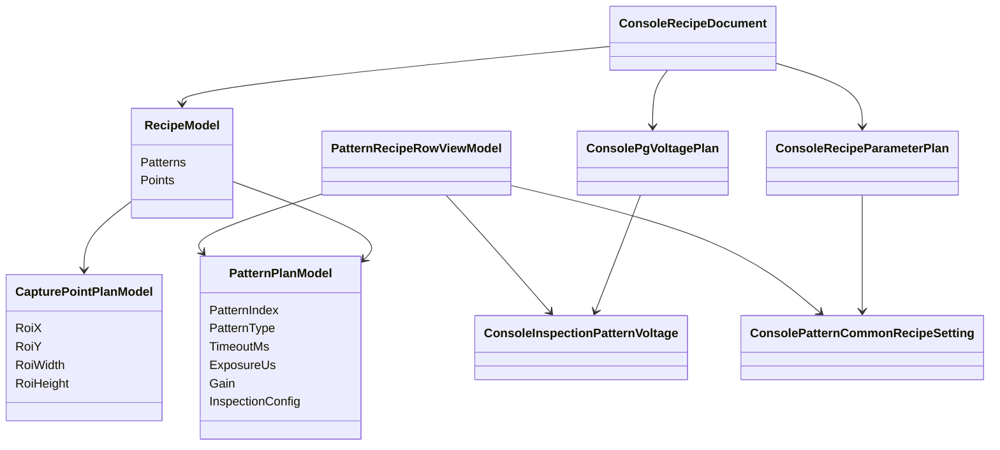
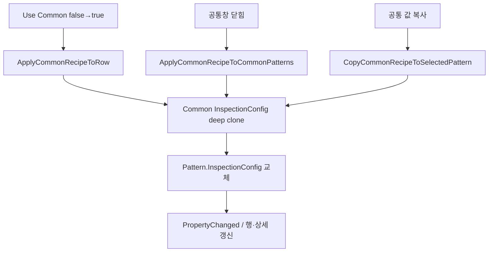

# RecipeWindow / 검사 패턴 탭 인수인계 노트

> 검증 기준일: 2026-07-31  
> 우선순위: 공식 Docs → 현재 코드 → `[추론]`
>
> 표기 규칙: 이 문서의 구현 구조·호출 순서·저장 동기화처럼 공식 Docs에 없는 코드 분석은 `[추론] (코드 확인)`이다. 공식 Docs와 코드의 일치/차이는 각 절에서 따로 구분한다.

## 1. 핵심 인수인계 요약

1. `PatternRows`는 저장 정본이 아니라 Pattern·전압·공통 사용 설정을 묶는 합성 ViewModel이다.
2. `SelectedPatternRow`와 `SelectedPattern`은 양방향으로 선택을 맞춘다.
3. ROI는 Pattern 소유가 아니며 `PrimaryPoint=Points.FirstOrDefault()`이다.
4. 공통값은 authoring 화면에서 clone하고 runtime recipe 생성 시 다시 resolve한다.
5. 기존 문서의 “runtime 동적 해석이 아니다”라는 설명은 잘못되었다.
6. 공식 grade 기본값과 현재 코드 기본값이 다르다.
7. 최신 grade→type 불량 정책과 공통창의 `DefectCutoffGrade` UI가 공존한다.
8. RecipeWindow Validate는 공식 세부 validation 전체를 호출하지 않는 것으로 보인다.

## 2. 주요 클래스

| 클래스 | 책임 |
|---|---|
| `RecipeWindow` | 탭 표시, 공통창/이미지창 열기 |
| `RecipeEditorViewModel` | Pattern/Point 컬렉션, 선택, Command, 저장/업로드 |
| `PatternRecipeRowViewModel` | Pattern + Voltage + UseCommon 합성 행 |
| `PatternPlanModel` | Pattern 식별/촬영/검사 조건 |
| `CapturePointPlanModel` | Stage/anchor/ROI |
| `InspectionConfigModel` | Threshold, Blob, metric, normal, grade |
| `ConsoleInspectionPatternVoltage` | Pattern별 R/G/B PG 전압 |
| `ConsoleRecipeParameterPlan` | 공통 InspectionConfig와 Pattern별 사용 여부 |
| `CommonRecipeParameterWindow` | 공통 검사 조건 편집 |
| `ULedIpConnection` | runtime recipe/job 변환, 공통값 최종 resolve |
| `RecipeService` | Console Recipe 최소 validation과 기본 Recipe 생성 |
| `RecipeEditorValidationService` | 더 강한 공통 편집 validation 규칙 |

## 3. 데이터 소유 관계 `[추론] (코드 확인)`



`PatternIndex`가 세 저장 영역을 논리적으로 연결한다. 코드상 외래 key 무결성을 강제하는 DB 구조가 아니므로 index 직접 편집 회귀 테스트가 필요하다.

## 4. 선택 동기화 `[추론] (코드 확인)`

```text
DataGrid.SelectedItem
  ↔ SelectedPatternRow
  ↔ SelectedPatternRow.Pattern
  ↔ SelectedPattern
  ↔ SelectedInspectionPatternVoltage
```

`OnSelectedPatternChanged()`에서:

- 같은 Pattern 인스턴스를 보유한 row를 찾는다.
- `SelectedPatternRow`를 맞춘다.
- 같은 PatternIndex의 voltage를 선택한다.
- Remove/Copy/PatternOn/AllPgOn Command 상태를 갱신한다.
- `SelectedPatternReferenceTopPercent`, `SelectedPatternUseAbsoluteLevel` 알림을 발생시킨다.

`OnSelectedPatternRowChanged()`는 `SelectedPattern=value?.Pattern`을 수행한다.

## 5. 공통 파라미터의 2단계 적용

### 5.1 Authoring 단계 `[추론] (코드 확인)`



clone은 JSON serialize/deserialize 방식이다. 공통 객체 참조를 공유하지 않는다.

### 5.2 Runtime 단계

`ULedIpConnection.ResolveCommonRecipeParameters(document, runtimeRecipe)`는:

1. PatternSettings를 PatternIndex→UseCommon map으로 만든다.
2. 모든 runtime Pattern에 공통 `InspectWhitePattern`을 반영한다.
3. UseCommon=true Pattern의 전체 `InspectionConfig`를 공통 clone으로 교체한다.

이 경로는 IP 업로드용 runtime recipe와 검사 결과 snapshot의 실제 적용값 보장에 사용된다.

### 5.3 중요한 의미

- 화면 clone은 실제 표시값 유지와 편집 잠금용이다.
- runtime resolve는 저장된 개별값이 stale해도 공통 정책을 최종 보장한다.
- `공통 값 복사해 오기`는 UseCommon flag를 바꾸지 않는다.
- 공통창은 공유 DataContext라 입력 즉시 공통 객체가 바뀐다.
- 창 닫힘은 UseCommon Pattern의 화면 clone 재생성 시점이지 공통 객체의 commit 시점이 아니다.

## 6. ROI 구조

`PrimaryPoint`는 `Points.FirstOrDefault()`다.

- 검사 패턴 선택과 독립적이다.
- ROI 입력은 첫 Point에 직접 반영된다.
- Point가 없으면 `PrimaryPoint=null`이라 입력 대상이 없다.
- 새 Recipe 기본 생성과 `EnsurePrimaryPointSelected()` 경로는 필요한 경우 Point를 추가한다.
- 현재 탭은 다중 Point 선택 UI를 제공하지 않는다.
- `RecipeImageWindow`는 `SelectedPoint`를 표시·편집하므로 다중 Point에서 탭의 대상과 다를 수 있다.

IP 전송 시:

- 첫 Point → `definition.DefaultRoi`
- 각 Point → 각 Pattern의 `CapturePointPlan.RoiHint`

## 7. ThresholdInput 세부 동작

`InspectionConfigModel.ThresholdInput`:

1. `,` 또는 `;`로 분리
2. `InvariantCulture` double parse
3. parse 실패 token 제거
4. 유효 숫자 0개면 setter 종료
5. 첫 값을 `Threshold`에 기록
6. 둘 이상이면 전체를 `ThresholdCandidates`에 기록
7. 하나면 Candidates를 빈 목록으로 만들어 단일값 모드

공식 최신 multi-threshold 점수:

```text
score = 필터 통과 object 수 - 병합 감점
병합 감점 = 크기 상한 초과 blob 총면적 / pitch²
동점 = 더 높은 threshold 우선
```

공통창 tooltip의 “object가 가장 많은 threshold”는 이 규칙을 완전히 설명하지 못한다.

## 8. Reference Top과 Grade

UI와 모델 변환:

```text
ReferenceTopPercent = clamp(100 - NormalLevelPercentile, 0, 50)
NormalLevelPercentile = 100 - clamp(ReferenceTopPercent, 0, 50)
```

normal level은 상위 평균이 아니라 분포의 percentile 위치 값이다.

판정:

```text
relative: measured / normal × 100
absolute: measured gray level

value >= A → A
else value >= B → B
else value >= C → C
else → D
```

`UseAbsoluteLevel=true`이면 normal percentile은 grade 판정에 사용하지 않는다.

## 9. 추가/삭제 불변식

### 추가

동시에 생성해야 하는 것:

- `PatternPlanModel`
- `ConsolePatternCommonRecipeSetting`
- `ConsoleInspectionPatternVoltage`
- `PatternRecipeRowViewModel`

### 삭제

동시에 제거해야 하는 것:

- `Patterns` 항목
- `PatternRows` 항목
- `RecipeParameterPlan.PatternSettings` 항목
- `InspectionPatternVoltages` 항목

index 재번호 부여는 하지 않는다. 삭제 후 빈 번호가 남는 것은 허용된다.

## 10. 저장/업로드 흐름

`SyncCollectionsToDocument()`:

- `PatternRows`의 UseCommon을 새 PatternSettings 목록으로 재작성
- `Patterns`를 `Document.IpRecipe.Patterns`에 기록
- `Points`를 `Document.IpRecipe.Points`에 기록
- `InspectionPatternVoltages`를 `PgVoltagePlan`에 기록

`ValidateCommand`, Save, Upload 모두 `SyncCollectionsToDocument()` 이후 `RecipeService.ValidateOrThrow()`를 호출한다.

검사 output의 `runtime/recipe_snapshot.json`은 `ResolveCommonRecipeParameters`를 적용한 clone을 저장하므로 실제 적용값을 확인할 수 있다.

IP 업로드 wire는 단순 `RecipeModel` 직렬화만 사용하는 구조가 아니다. `BuildIpRuntimeRecipe()`로 clone/common resolve한 뒤 protobuf `RecipeDefinition`의 Pattern/Point/Shot과 `console.pattern.{index}.*` metadata에 검사 설정을 병행하고, IP가 metadata를 `InspectionConfigModel`로 복원한다.

## 11. Validation 차이

| 규칙 | 공식/공통 Validation Service | 현재 RecipeService |
|---|---:|---:|
| Pattern 최소 1개 | O | O |
| PatternIndex 중복 금지 | O | O |
| PatternName 비어 있지 않음 | O | X |
| Threshold >= 0 | O | X |
| MinArea >= 0 | O | X |
| MaxArea >= MinArea | O | X |
| Blob Min W/H > 0 | O | X |
| Blob Max >= Min | O | X |
| 상대 percentile 50~100 | O | UI setter clamp만 존재 |
| 절대 grade 0~255 | O | X |
| A >= B >= C | O | X |
| W 사용 시 RGB 필요 | O | X |
| Point 최소 1개 | O | O |
| PointIndex 중복 금지 | O | O |
| ROI W/H > 0 | O | O |
| 전압 PatternIndex 중복 금지 | 별도 PG plan 규칙 | O |
| 모든 Pattern의 전압 행 존재 | 별도 PG plan 규칙 | O |
| 전압 signed 2-byte mV 범위 | 장비 전송 형식 | O |

`[추론] (코드 확인)` 현재 `RecipeEditorViewModel.Validate()`에서 `RecipeEditorValidationService` 호출은 검색되지 않았다. 별도 편집기용 validation일 가능성이 있으므로 통합 여부를 결정해야 한다.

## 12. 공식 Docs와 코드 차이/기술 부채

### 12.1 Grade 기본값

- 공식 `rgb-level-inspection-algorithm.md`: A/B/C/D = 90/50/30/20
- 현재 `GradeSpecModel.CreateDefault()`: A/B/C = 50/30/10
- 현재 계약에는 D 하한 속성이 없음

현장 Recipe의 실제 승인값을 확인하고 Docs 또는 코드 중 하나를 정본에 맞게 정리해야 한다.

### 12.2 DefectCutoffGrade

`InspectionConfigModel`과 공통창에는 `DefectCutoffGrade`가 남아 있다. 그러나 같은 계약 코드의 최신 주석은 defect를 `grade → type → 선택 defect type`으로 판단하도록 요구한다.

공통창의 cutoff가 현재 main run에서 실사용되는지 추적하거나 UI를 정리해야 한다.

### 12.3 공식 공통창 항목 누락

change-log에는 다음 공통 항목이 언급되지만 현재 공통창에는 없다.

- Unlit %
- Light Fail %
- Inspect White Pattern
- Lighting Fail Min Average Level

일부는 더 최신 변경에서 제거됐다는 기록도 있어 Docs 내부 이력 자체가 상충한다. 현재 UI만 보고 해당 기능을 단정하지 말고 최신 정책 확정이 필요하다.

### 12.4 UI 미노출 필드

현재 검사 패턴 탭에서 직접 편집되지 않는 주요 계약 필드:

- `PgPatternIndex`
- `LevelMetric`
- `InspectWhitePattern`
- 최신 Docs에 등장하는 과거/별도 조명 판정 항목

### 12.5 Upload/Activate 의미

공식 Docs는 Upload와 Activate를 분리한다. `[추론] (코드 확인)` 현재 IP의 `OnRecipeUploaded()`는 변환한 Recipe를 cache한 뒤 곧바로 `_runtimeService.SetCurrentRecipe(recipe)`에 전달한다. 별도 Activate 명령 없이 업로드가 current recipe 설정까지 수행되는 현재 코드와 공식 운전 절차의 의미를 정리해야 한다.

### 12.6 Timeout과 ROI 경계

- `[추론] (코드 확인)` `TimeoutMs`는 contract/runtime Pattern plan까지 전달되지만 실제 wait/cancel 소비처는 확인되지 않았다. 예약 또는 미연결 필드인지 추적이 필요하다.
- `[추론] (코드 확인)` Console은 ROI W/H 양수만 검사한다. IP `GetEffectiveRoi()`가 X/Y를 영상 범위로 clamp하고 W/H를 남은 경계로 clip하지만, 이는 authoring validation을 대체하지 않는다.

## 13. 회귀 테스트 체크리스트

### 선택/바인딩

- [ ] 목록 행 선택 시 상세 이름/조건이 같은 Pattern인지
- [ ] 코드로 SelectedPattern 변경 시 목록과 전압 선택이 따라오는지
- [ ] Pattern 변경 후 ROI 값은 그대로인지

### 추가/삭제

- [ ] 추가 시 Pattern/전압/공통설정/행 네 항목이 생기는지
- [ ] 최대 index+1과 PG index+1이 맞는지
- [ ] 삭제 취소 시 아무 데이터도 바뀌지 않는지
- [ ] 삭제 승인 시 네 저장 영역에서 같은 index가 제거되는지
- [ ] 삭제 후 Save→Reload 결과가 동일한지

### 공통 파라미터

- [ ] UseCommon 체크 즉시 값 복사와 UI 잠금이 되는지
- [ ] UseCommon 해제 후 개별 편집 가능한지
- [ ] 공통창 닫기 후 모든 공통 Pattern 표시값이 갱신되는지
- [ ] 공통 값 복사는 UseCommon flag를 켜지 않는지
- [ ] Upload runtime recipe에 공통값이 최종 반영되는지
- [ ] `runtime/recipe_snapshot.json`에 실제 적용값이 남는지

### Threshold/Grade

- [ ] 단일 Threshold 저장/Reload
- [ ] 쉼표 후보 저장/Reload
- [ ] 잘못된 token 혼합 시 동작
- [ ] 상대/절대 전환 시 normal 입력 enable 상태
- [ ] Reference Top 0/50 경계 변환
- [ ] A/B/C 경계값 판정

### ROI

- [ ] X/Y/W/H 직접 입력 후 Save/Reload
- [ ] 이미지 창에서 그린 ROI가 탭에 즉시 보이는지
- [ ] W/H 0일 때 Validate/Save 실패
- [ ] 음수 X/Y와 이미지 경계 초과 처리
- [ ] ROI-map 불일치 Alarm 1106과 run 지속

### 장비

- [ ] Pattern별 R/G/B 전압이 실제 PG 채널에 적용되는지
- [ ] Exposure/Gain이 shot에 적용되는지
- [ ] W Pattern이 RGB 좌표를 재사용하는지

## 14. 추가 확인 우선순위

1. 공식 grade 기본값과 생산 Recipe 실제값
2. 최신 grade→type 정책에서 `DefectCutoffGrade`의 잔존 의미
3. RecipeWindow에 공통 validation service를 연결할지 여부
4. PatternIndex 직접 편집 시 전압 index 동기화
5. ROI 이미지 경계 검증 책임이 Console인지 IP인지
6. 공통창 공식 항목의 제거/미구현 여부 확정

## 15. 참조 파일

- `docs/shared-contract-models.md`
- `docs/console-recipe-document.md`
- `docs/시작 가이드.md`
- `docs/전체 flow.md`
- `docs/main-glass-inspection-flow.md`
- `docs/rgb-level-inspection-algorithm.md`
- `docs/dense-local-template-grid-indexer.md`
- `docs/표준맵사용검사-technical-manual.md`
- `docs/development/change-log.md`
- `uLedAoiConsole/Windows/Recipe/RecipeWindow.xaml`
- `uLedAoiConsole/Windows/Recipe/RecipeWindow.xaml.cs`
- `uLedAoiConsole/Windows/Recipe/CommonRecipeParameterWindow.xaml`
- `uLedAoiConsole/ViewModels/RecipeEditorViewModel.cs`
- `uLedAoiConsole/Recipes/RecipeService.cs`
- `uLedAoiConsole/Services/Ip/ULedIpConnection.cs`
- `uLed.Contracts/Models/RecipeModels.cs`
- `uLed.Common/RecipeEditing/RecipeEditorValidationService.cs`
