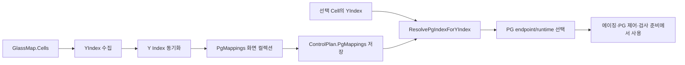

# RecipeWindow - PG 매핑 탭 분석

## 1. 분석 범위와 사실 기준

- 화면: `RecipeWindow`의 `<TabItem Header="PG 매핑">`
- 연관 모델: `ConsoleControlPlan.PgMappings`, `ConsolePgMapping`
- 연관 로직: `RecipeEditorViewModel`, `RecipeService.ResolvePgIndexForYIndex`, `RecipeService.ValidatePgMappings`

### 공식 문서 기준

공식 문서 `docs/console-recipe-document.md`는 다음을 명시한다.

- `YIndex`는 같은 `XIndex` 그룹 안의 실행 index이며 0-base다.
- `YIndex`는 IP 자동 분배, Split 적용, **PG mapping의 기준**이다.
- `ConsoleRecipeDocument`는 상위 `ControlPlan`을 가진다.

따라서 이 탭의 기준 키는 물리 좌표나 Cell ID가 아니라 **Cell의 `YIndex`**다.

다만 우선 문서에는 `PgMappings`의 저장 형식, 기본 매핑 규칙, 콤보박스 endpoint 표기, 실행 시 PG 선택 규칙이 별도로 정의되어 있지 않다. 아래의 UI 동작·저장·실행 로직은 코드 근거의 **[추론]** 이다.

## 2. 화면 역할

PG 매핑 탭은 각 `YIndex` 그룹이 어느 PG endpoint index를 사용할지 지정하는 recipe 편집 화면이다. 같은 `YIndex`를 가진 cell은 같은 PG index로 해석된다. **[추론]**

화면 상단 설명은 “Y Index별 사용할 PG Index를 설정합니다. 기본값은 Y Index와 같은 PG Index입니다.”라고 안내한다.

| 컨트롤 | 바인딩/명령 | 역할 |
|---|---|---|
| 안내 문구 | 정적 TextBlock | 매핑의 기준이 `YIndex`임과 기본값 규칙을 안내한다. |
| `Y Index 동기화` 버튼 | `SyncPgMappingsFromCellsCommand` | 현재 Cell 목록에서 유효한 YIndex를 수집하여 매핑 행을 다시 구성한다. **[추론]** |
| `Y Index` 열 | `ConsolePgMapping.YIndex` | 매핑 기준 key다. 읽기 전용이며 직접 수정할 수 없다. |
| `PG (번호 — 주소)` 콤보박스 | `ConsolePgMapping.PgIndex` | 선택한 YIndex가 사용할 PG index를 고른다. endpoint가 구성되어 있으면 번호와 host:port를 함께 보인다. **[추론]** |

## 3. 데이터 구조와 저장 위치

**[추론: `ConsoleRecipeDocument.cs` 기준]**

```csharp
public sealed class ConsoleControlPlan
{
    public List<ConsolePgMapping> PgMappings { get; set; }
}

public sealed class ConsolePgMapping
{
    public int YIndex { get; set; }
    public int PgIndex { get; set; }
}
```

편집 화면의 `PgMappings` 컬렉션은 동기화 시 `Document.ControlPlan.PgMappings`에 저장된다. 저장할 때 음수 YIndex 행은 제외하고, 같은 YIndex가 중복되면 목록에서 마지막 행 하나만 남긴 뒤 YIndex 순으로 정렬한다. **[추론]**

## 4. 코드 진행 및 로직 분석

이 절은 공식 문서에 동등한 세부 규정이 없어 **[추론: 현행 코드 기준]** 이다.



### 4.1 초기/재동기화: `BuildPgMappingsFromCells`

`Y Index 동기화` 명령은 현재 Cell 목록에서 매핑 행을 만든다.

1. 기존 `ControlPlan.PgMappings`와 화면 `PgMappings`에서 유효한 `(YIndex, PgIndex)`를 수집한다.
2. 현재 Cell의 `YIndex >= 0`만 추출하고, 중복을 제거한 뒤 오름차순으로 정렬한다.
3. Cell에서 얻은 YIndex가 하나도 없으면 기존 매핑의 YIndex를 사용한다.
4. 각 YIndex에 기존 매핑이 있으면 그 PgIndex를 보존한다.
5. 기존 매핑이 없으면 `PgIndex = YIndex`를 적용한다.
6. 새 목록으로 화면 컬렉션을 교체하고 `Document.ControlPlan.PgMappings`에 동기화한다.

즉 동기화 버튼은 무조건 ‘YIndex=PG index’로 덮어쓰지 않는다. 이미 저장/편집된 유효 매핑은 보존하고, 새로 등장한 YIndex에만 동일 번호 기본값을 준다. **[추론]**

### 4.2 콤보박스 선택지: `RefreshPgEndpointOptions`

PG endpoint runtime이 구성되어 있으면 콤보박스에는 다음 형식의 선택지가 표시된다.

```text
{PG index} — {host}:{port}
{PG index} — {host}:{port} (SIM)
```

Simulation endpoint라면 `(SIM)`이 붙는다. endpoint가 하나도 구성되지 않은 개발 환경에서는 기존 매핑에서 사용 중인 최대 index까지 `n — (PG 미구성)` 항목을 만든다. 이는 기존 recipe의 선택값을 화면에서 잃지 않게 하려는 구현이다. **[추론]**

선택지는 endpoint의 **목록 위치가 아닌 `endpoint.Index`**를 값으로 사용한다. 따라서 표시 순서보다 PG index와 endpoint configuration의 대응을 확인해야 한다. **[추론]**

### 4.3 실행 시 PG 해석: `ResolvePgIndexForYIndex`

실행 계층은 cell의 YIndex를 직접 PG로 사용하지 않고 `RecipeService.ResolvePgIndexForYIndex(recipe, yIndex)`를 호출한다.

| 조건 | 반환값 |
|---|---|
| `yIndex < 0` | 입력 yIndex를 그대로 반환 |
| 동일 YIndex의 mapping 존재 | 해당 mapping의 `PgIndex` |
| mapping 없음 | yIndex 자체 |

위의 mapping 없음 기본값은 **[추론: 코드 기본 동작]** 이며 공식 운영 규칙으로 간주하면 안 된다. recipe를 저장하기 전에는 필요한 모든 YIndex 행과 PG 연결 구성을 확인하는 것이 안전하다.

### 4.4 사용 지점

**[추론: 호출 코드 기준]** 해석된 PG index는 다음 경로에서 사용된다.

- RecipeWindow의 선택 cell PG 제어/에이징 테스트
- MainWindow의 Aging Run 대상 PG 목록 및 진행 대상 구성
- `GlassInspectionStepPreparationService`의 step 준비, pattern 선택, PG 소등
- `PGRecipeControlWindow`의 cell별 PG 제어

따라서 하나의 매핑 변경은 단순 화면 표시 변경이 아니라 해당 YIndex cell의 PG 제어 대상 변경으로 연결된다. **[추론]**

## 5. 검증과 오류 조건

**[추론: `RecipeService.ValidatePgMappings`]** recipe validation은 다음을 검사한다.

- `YIndex`는 0 이상이어야 한다.
- `PgIndex`는 0 이상이어야 한다.
- 동일한 `YIndex`의 mapping은 하나만 존재해야 한다.

편집 화면은 YIndex를 read-only로 제공하고 동기화/저장 시 중복을 정리하려 하지만, 저장된 recipe를 외부에서 수정했거나 다른 경로가 데이터를 만들면 validation에서 중복 오류가 발생할 수 있다. **[추론]**

또한 PG runtime을 실제로 얻는 경로에서는 해석된 PgIndex가 endpoint 개수 범위 안에 있는지 별도로 확인한다. 범위를 벗어나면 `Cell`, `YIndex`, `PgIndex`, `PgCount`를 포함한 오류로 실행이 중단된다. **[추론]**

## 6. 공식 문서와 코드의 차이

| 구분 | 공식 문서 | 현행 코드 | 처리 원칙 |
|---|---|---|---|
| PG 매핑의 기준 | YIndex가 PG mapping 기준이라고 명시 | YIndex → PgIndex의 실제 목록을 `ControlPlan.PgMappings`로 구현 | 기준 자체는 문서를 우선, 세부 구현은 **[추론]** |
| `ConsoleControlPlan` 예시 | 문서의 코드 예시에 `PgMappings`가 없음 | 실제 모델에는 `List<ConsolePgMapping> PgMappings`가 있음 | **[문서/코드 차이]**: 모델 최신화 여부를 공식 문서에서 확인/갱신할 필요가 있음 |
| 미매핑 YIndex | 별도 규정 없음 | `PgIndex = YIndex`로 해석 | **[추론]**; 운영 정책으로 단정하지 않음 |
| endpoint 표시 | 별도 규정 없음 | 번호와 host:port, simulation 여부를 콤보박스에 표시 | **[추론]** |

## 7. 관련 소스

- `uLedAoiConsole/Windows/Recipe/RecipeWindow.xaml` — PG 매핑 탭 UI
- `uLedAoiConsole/ViewModels/RecipeEditorViewModel.cs` — 동기화·endpoint 옵션·document 반영
- `uLedAoiConsole/ViewModels/PgEndpointOption.cs` — 콤보박스 항목 모델
- `uLedAoiConsole/Recipes/ConsoleRecipeDocument.cs` — `ConsoleControlPlan`, `ConsolePgMapping`
- `uLedAoiConsole/Recipes/RecipeService.cs` — PG index 해석 및 validation
- `uLedAoiConsole/Services/InspectionReplay/GlassInspectionStepPreparationService.cs` — 검사 step PG 사용 경로
- `uLedAoiConsole/ViewModels/MainWindowViewModel.cs` — Aging Run PG 대상 해석 경로
