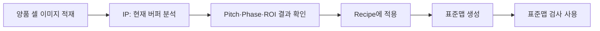

# RecipeWindow / 명점 검사(WD) 탭 분석

## 1. 화면 목적

### 공식 문서 기준

명점·명선 검사는 IP 알고리즘이 수행하고, 최종 결과의 `WdDefects`로 전달된다. IP/알고리즘은 dot 단위의 IP index와 channel/phase를 유지하며, Console 또는 Verifier가 GlassSize의 dot-index 설정에 따라 표시·CSV용 `row`와 `column`으로 변환한다.

표준맵 사용 검사는 양품 셀의 `std_map.csv`를 좌표 기준으로 사용한다. 표준맵이 있으면 고정배치 모드로 시작하고, 배치 검증에 실패했을 때만 자동정합으로 폴백한다. 표준맵이 없을 때의 맵생성검사는 표준맵 부트스트랩·자동정합 폴백·과도기 검사 용도다.

근거: `docs/표준맵사용검사-technical-manual.md`, `docs/rgb-level-inspection-algorithm.md`, 프로젝트 좌표/인덱스 규칙.

### 현재 탭의 범위

현재 `명점 검사 (WD)` 탭은 명점 검사의 전체 실행 절차나 표준맵을 관리하는 화면이 아니다. 레시피의 다음 두 입력값만 편집하는 간결한 설정 탭이다.

1. 명점 임계값(%)
2. R 기준 G/B 채널의 Dx/Dy 위상 오프셋

## 2. 화면 구성

| GroupBox | 컨트롤 | 바인딩 | 역할 |
|---|---|---|---|
| 검출 설정 | `CalcTextBox` | `Document.IpRecipe.WhiteDefect.ThresholdPercent` | 명점 임계값(%) 입력 |
| R 기준 RGB 위상 오프셋 | CalcTextBox 4개 | `RgbPhaseOffsets.GFromR.Dx/Dy`, `BFromR.Dx/Dy` | R 채널을 기준으로 G/B 채널의 상대 위치 입력 |
| 결과 데이터 형식 | 설명 TextBlock 3개 | 없음 | `wd_defects` 필드와 좌표/line ratio 표현 안내 |

숫자 입력은 `NumericTextConverter`와 `UpdateSourceTrigger=LostFocus`를 사용한다. 즉 값 입력 후 다른 컨트롤로 포커스를 이동해야 레시피 모델에 반영된다.

## 3. 입력값 분석

### 명점 임계값(%)

- 저장 위치: `IpRecipe.WhiteDefect.ThresholdPercent`
- 탭 표기: `명점 임계값 (%)`
- 역할: 명점(WD)을 검출하는 레시피 임계값이다.

[추론] 이 값이 높을수록 명점 판정에 요구되는 밝기 차이가 커져 검출이 보수적으로 변할 가능성이 있다. 정확한 비교식과 적용 채널/단계는 WhiteDefect 알고리즘 코드를 별도로 확인해야 한다.

### R 기준 RGB 위상 오프셋

- 저장 위치: `IpRecipe.WhiteDefect.RgbPhaseOffsets`
- G 기준값: `GFromR.Dx`, `GFromR.Dy`
- B 기준값: `BFromR.Dx`, `BFromR.Dy`
- 입력 단위: XAML에는 단위가 표시되지 않는다.

공식 표준맵 문서에서 G/B 채널 좌표는 R 표준맵에 recipe의 RGB phase offset을 평행이동하여 파생한다. 같은 셀의 채널별 grab 사이에는 stage가 정지하므로, 채널 간 상대 위치는 이 offset으로 다룬다.

## 4. 결과 데이터 안내

탭의 안내문은 `wd_defects`에 아래 필드가 있다고 표시한다.

| 필드 | 탭 안내의 의미 |
|---|---|
| `channel` | 검사 채널/phase |
| `type` | WD 또는 line 유형 |
| `x`, `y` | WD의 IP raw 좌상단 기준 index 좌표 |
| `level` | WD level 또는 WVL/WHL의 raw x/y line 내 WD 개수 비율(%) |

### 좌표 표기의 주의

탭의 `x/y` 설명은 IP raw index 기준이다. 사용자용 결과의 `row/column`과 같은 뜻으로 해석하면 안 된다.

- `row = ry`
- `column = rx × 3 + phase`

최종 표시/CSV 변환은 Console 또는 Verifier가 수행한다. 이는 공식 좌표/인덱스 규칙과 일치한다.

## 5. 관련 실행 흐름

이 탭 안에는 검사 실행 버튼이 없다. 현재 구현에서 관련 기능은 RecipeWindow 상단 `IP` 메뉴의 다음 명령과 연결된다.

| 메뉴 | Command | 역할 |
|---|---|---|
| 현재 버퍼 분석 (Pitch·Phase·표준맵) | `FindPitchCurrentBufferCommand` | 현재 버퍼에서 pitch, phase offset, ROI 후보를 실측하고 결과 창을 연다. |
| 선택 셀 카메라 촬영 | `GrabSelectedCellFromCameraCommand` | 선택 셀의 카메라 입력을 IP buffer에 적재한다. |
| 선택 셀 폴더 이미지 로드 | `GrabSelectedCellFromFolderCommand` | 폴더 이미지를 IP buffer에 적재한다. |
| 선택 셀 현재 버퍼 검사 | `InspectSelectedCellCurrentBufferCommand` | 현재 buffer 기준 검사 요청 |

공식 표준맵 문서상 권장 흐름은 양품 셀 이미지를 현재 buffer에 적재 → `현재 버퍼 분석` 실행 → 결과 창에서 pitch/phase/ROI를 recipe에 반영 → 표준맵 생성이다.

## 6. 공식 문서와 코드의 차이

| 항목 | 공식 문서 | 현재 XAML |
|---|---|---|
| 검사 범위 | 표준맵/맵생성, 고정배치, 자동정합, 결과 좌표 변환까지 설명 | ThresholdPercent와 G/B phase Dx/Dy 입력, 결과 필드 안내만 제공 |
| 표준맵 | `StandardMapPlan.UseStandardDenseMap`, `std_map.csv` 중심으로 설명 | 이 탭에는 표준맵 사용 여부·경로·생성 버튼이 없음 |
| 표준맵 생성 | Recipe editor의 현재 buffer 분석 결과 창에서 수행 | 해당 탭이 아닌 IP 메뉴 `현재 버퍼 분석` 명령에서 진입 |

공식 문서의 전체 업무/알고리즘 설명을 우선하며, 이 탭은 그중 일부 레시피 파라미터의 입력 UI로 해석한다.

## 7. 추가 확인 필요

- [추론] `ThresholdPercent`의 정확한 판정식, 기본값, WVL/WHL 생성 규칙은 IP의 WhiteDefect 알고리즘을 확인해야 한다.
- [추론] Dx/Dy의 실제 단위가 카메라 pixel인지 다른 좌표 단위인지는 현재 XAML에 명시되지 않았으므로, `FindPitchResult` 적용 코드와 계약 모델 확인이 필요하다.
- 공식 문서에 `StandardMapPlan`이 있으나 이 탭에는 해당 속성 바인딩이 없다. 표준맵 사용 여부와 경로는 FindPitch/결과 창 또는 별도 UI에서 관리되는 것으로 확인된다.

## 근거 파일

- `D:\ELP\Project\01.SDC\A1\uLED\Source\uLED_Develop_최신\docs\표준맵사용검사-technical-manual.md`
- `D:\ELP\Project\01.SDC\A1\uLED\Source\uLED_Develop_최신\docs\rgb-level-inspection-algorithm.md`
- `D:\ELP\Project\01.SDC\A1\uLED\Source\uLED_Develop_최신\uLedAoiConsole\Windows\Recipe\RecipeWindow.xaml`
- `D:\ELP\Project\01.SDC\A1\uLED\Source\uLED_Develop_최신\uLedAoiConsole\ViewModels\RecipeEditorViewModel.cs`
