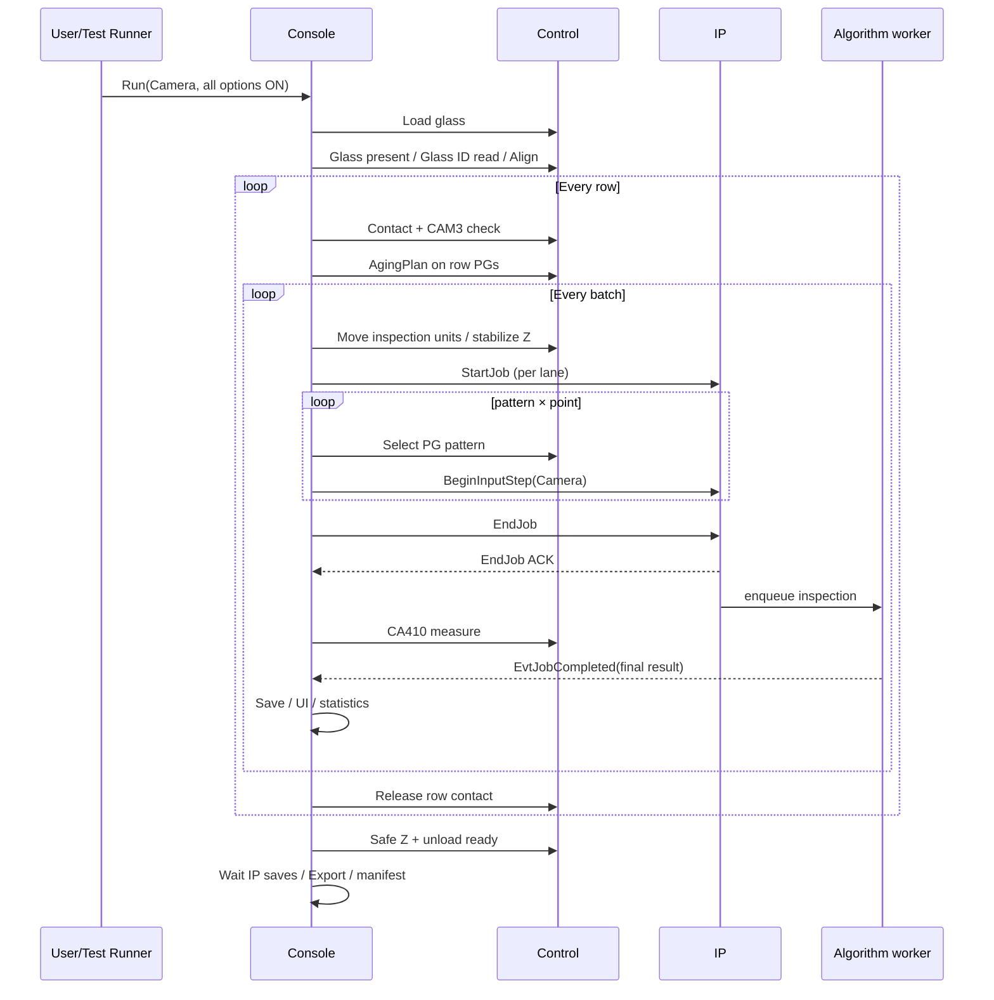

# Test Runner Camera 검사 — 전체 코드 분석과 프로젝트 이해 가이드

> 분석 대상: `Capture + Inspect` / `Camera` / Glass ID 자동 인식과 모든 표시 옵션 ON  
> 근거: Console·IP·알고리즘의 실제 호출 코드와 `docs/main-glass-inspection-flow.md`  
> 범위: 코드 전체를 한 파일씩 나열하는 문서가 아니라, 프로젝트를 이해하는 데 필요한 **실행 경로 전체**를 따라가는 분석이다.

## 1. 이 프로젝트를 한 문장으로 이해하기

이 프로젝트는 "이미지 한 장을 검사하는 WPF 프로그램"이 아니라, **Micro LED glass 한 장을 설비로 이송하고, contact·점등·카메라 촬영·IP 검사·CA410 측정·결과 저장·고객 export까지 안전한 순서로 오케스트레이션하는 Console**이다.

```text
사람 / Test Runner
  → Console (순서·상태·레시피·장비 제어)
    → Control (이송·축 이동·contact·PG·CA410)
    → IP (카메라 촬영·버퍼·검사 worker)
      → Algorithms (표준맵 좌표·레벨·결함 계산)
    ← IP event (최종 결과)
  → Console (저장·UI·통계·Export)
```

| 책임 | 주된 프로젝트 | 대표 코드 |
|---|---|---|
| 사용자 흐름과 검사 순서 | `uLedAoiConsole` | `MainWindowViewModel` |
| Test Runner 옵션 정책 | `uLedAoiConsole` | `TestRunnerPolicy` |
| Control 통신·설비 동작 | `uLedAoiConsole`, `uLedControl` | `GlassInspectionStepPreparationService` |
| IP 통신과 job lifecycle | `uLedAoiConsole`, `uLedIp` | `ULedIpConnection`, `IpNodeRuntimeService` |
| 영상 검사와 표준맵 | `uLedIp`, `uLedInspection.Algorithms` | `PointGridInspectionAlgorithm`, `CorrectedDenseMapInspector` |
| 결과·export 규격 | `uLedAoiConsole`, `uLed.Export`, `uLed.Contracts` | `GlassInspectionOutputWriter`, `CellExportPipeline` |

**핵심 요약:** Console은 검사 결과를 계산하는 곳보다, "언제 무엇을 실행하고 어떤 결과를 연결할지"를 결정하는 곳에 가깝다.

## 2. 이 분석에서 가정한 실제 실행 설정

Test Runner의 task는 `CaptureInspect`다. `TestRunnerPolicy.BuildRunOptions`가 UI 값을 아래처럼 실행 계약으로 바꾼다.

| 화면 설정 | 실행 option | 이 검사에서의 의미 |
|---|---|---|
| Source = Camera | `Source=Camera`, `WithInspect=true` | IP가 카메라로 pattern × point 이미지를 입력하고 검사한다. |
| Align | `UseAlign=true` | 검사 직전에 glass align을 수행한다. |
| Glass ID 자동 인식 | `UseGlassIdReading=true` | loading 직후, align 전에 teach 위치에서 Glass ID를 읽는다. |
| Contact / Contact Check | `UseContactFlow=true`, `UseContactCheck=true` | row 시작에 contact하고 CAM3 확인을 수행한다. |
| Aging before inspect | `UseAgingBeforeInspect=true` | row의 모든 pending cell PG에 AgingPlan을 먼저 실행한다. |
| CA410 | `UseCa410=true` | 각 cell의 `EndJob ACK` 뒤 CA410을 측정한다. |
| Save Original Images | `SaveOriginalImages=true` | IP 원본·grade 이미지를 정해진 glass export 폴더에 저장한다. |
| Export after inspect | `ExportAfterInspect=true` | cell export/manifest 및 glass export를 수행한다. |
| Unloading | `UseUnloadingFlow=true` | 정상 loop 뒤 안전 Z 이동 및 unload-ready를 수행한다. |

> NOTE: "glass 존재 확인"과 "Glass ID 자동 인식"은 별개다. 전자는 카메라로 glass 유무를 확인하는 안전 단계이고, 후자는 식별 문자열을 읽는 단계다. ID 읽기 실패 시 현재 구현은 입력한 GlassId를 유지하고 계속한다.

## 3. 실행 경로 지도 — 버튼부터 결과까지

```text
TestRunnerWindow.RunButton_Click
  → TestRunnerPolicy.BuildRunOptions
  → MainWindowViewModel.StartTestRunnerRunAsync
    → checkpoint resume/new 결정
    → ExecuteGlassInspectionAsync
      → RunGlassInspectionReplayAsync             [공통 run loop]
        → Loading / glass-present / Glass ID / Align
        → IP 연결·버퍼 초기화·결과 session 준비
        → row loop
          → BeginRowAsync                         [contact + contact check]
          → RunGlassAgingBatchAsync               [row-wide aging]
          → step/batch loop
            → PrepareBatchInspectMotionAsync
            → ProcessGlassReplayAssignmentAsync × IP lane
              → StartCellJobAsync                 [StartJob]
              → BufferCellJobAsync                [pattern × point input]
              → EndCellJobAsync                   [EndJob ACK]
              → RunCa410InspectionAsync
              → Completed event 대기
              → 결과 저장/UI 반영
          → EndRowAsync                           [release]
        → Unloading
        → IP save drain / cell export / manifest / glass export
```

### 3.1 한 장의 glass가 흐르는 시간축



**핵심 요약:** `EndJob ACK`는 촬영 입력이 끝났다는 뜻이며, 최종 검사 완료가 아니다. 최종 완료는 IP의 `EvtJobCompleted`다.

## 4. 핵심 구조와 아키텍처

### 4.1 View → ViewModel → Policy → Runtime

```text
TestRunnerWindow.xaml
  └─ TestRunnerWindow.xaml.cs
      └─ TestRunnerPolicy                    [task별 UI/option 단일 정책]
          └─ MainWindowViewModel             [glass run orchestration]
              └─ ICellInspectionDataProvider [source/실행 adapter]
                  ├─ IpLoadedBufferCellInspectionDataProvider (Camera/Folder/CurrentBuffer)
                  ├─ FolderCellInspectionDataProvider          (결과 replay)
                  └─ ControlOnlyCellInspectionDataProvider
```

`TestRunnerPolicy`는 단순 UI helper가 아니다. task별로 어떤 control을 보여 주고, 어떤 설정을 어떤 `GlassInspectionRunOptions`로 만들지 결정하는 정책 테이블이다. 이 때문에 CaptureInspect, CaptureOnly, CA410Only 등의 기능 분기가 Window code-behind 전반에 흩어지지 않는다.

### 4.2 Provider 계층의 역할

`ICellInspectionDataProvider`의 contract는 다음 순서를 강제한다.

```text
BeginRowAsync
→ StartCellJobAsync
→ BufferCellJobAsync
→ EndCellJobAsync
→ JobEvent.Completed
→ EndRowAsync
```

Camera 경로에서 실제 구현체는 `IpLoadedBufferCellInspectionDataProvider`다.

| Provider 메서드 | 내부 의미 | IP 계약과 연결 |
|---|---|---|
| `StartCellJobAsync` | cell과 buffer slot을 준비 | `StartJob` |
| `BufferCellJobAsync` | recipe의 pattern × point를 순회하며 입력 | `BeginInputStep(Camera)` 반복 |
| `EndCellJobAsync` | 더 이상 입력이 없음을 선언 | `EndJob` |
| `JobEvent.Completed` | 최종 결과를 Console에 전달 | `EvtJobCompleted(final_result)` |

> NOTE: `docs/main-glass-inspection-flow.md`는 현재 provider가 lifecycle 전체를 숨기는 형태를 향후 MainFlow의 기준으로 사용하지 말라고 한다. 따라서 provider는 **현재 동작 이해에는 반드시 읽어야 하지만**, 신규 구조의 모델 답안은 아니다.

### 4.3 Motion·Contact·PG·CA410의 분리

`GlassInspectionStepPreparationService`는 카메라 검사 바로 전후의 물리 동작을 담당한다.

```text
Console batch
  → PrepareBatchInspectMotionAsync
      → Glass/Cell 좌표를 axis target으로 변환
      → CellMap um 보정 적용
      → Z 안전 높이 / Capture Z / 정착 확인
  → InputStep 직전 PG pattern select
  → Camera capture
  → EndJob ACK 뒤 RunCa410InspectionAsync
```

여기서 CellMap 보정은 이미지 px offset이 아니라 축 target에 더하는 **um 물리 보정**이다. 표준맵의 이미지 정합과 책임이 다르다.

### 4.4 IP runtime과 알고리즘의 분리

```text
ULedIpConnection (Console 통신 client)
  → IPC/프로토콜
IpNodeRuntimeService (IP runtime)
  → StartJob: job·buffer 준비
  → BeginInputStep: Camera 촬영/버퍼 반영
  → EndJob: inspection queue 등록
  → worker: PanelInspectionService/algorithm 실행
  → EvtJobCompleted 전송

PointGridInspectionAlgorithm
  → 표준맵 검사 또는 맵생성검사 분기
CorrectedDenseMapInspector
  → 좌표 확정·레벨 샘플링
```

**핵심 요약:** 설비 동작은 Console, job/buffer와 worker 관리는 IP runtime, dot 좌표와 레벨 계산은 알고리즘으로 분리되어 있다.

## 5. 반드시 읽을 코드 — 목적별 순서

이 순서대로 읽으면 코드의 세부를 잃지 않고 전체 의도를 잡을 수 있다.

### 단계 A — 사용자 입력이 실행 옵션이 되는 과정

1. **`uLedAoiConsole/Windows/Core/TestRunnerWindow.xaml`**
   - 어떤 화면 control이 존재하는지 확인한다.
2. **`uLedAoiConsole/Windows/Core/TestRunnerWindow.xaml.cs`**
   - `RunButton_Click`, task별 설정 저장·복원을 본다.
3. **`uLedAoiConsole/Models/TestRunnerModels.cs`**
   - 가장 중요하다. `TestRunnerPolicy.BuildRunOptions`로 체크박스의 진짜 의미를 확정한다.
4. **`uLedAoiConsole/Models/GlassInspectionRunOptions.cs`**
   - run 전체에 전달되는 option 계약을 읽는다.

### 단계 B — Glass Job의 오케스트레이션

5. **`uLedAoiConsole/ViewModels/MainWindowViewModel.cs`**
   - 다음 메서드만 이 순서로 본다.

```text
StartTestRunnerRunAsync
  → ExecuteGlassInspectionAsync
  → RunGlassInspectionReplayAsync
  → ProcessGlassReplayBatchAsync
  → ProcessGlassReplayAssignmentAsync
```

이 파일은 매우 크다. 위 메서드를 먼저 따라가고, 필요할 때만 `Loading`, `Unloading`, export helper, checkpoint helper로 옆으로 확장한다.

### 단계 C — 현재 provider와 설비 준비

6. **`uLedAoiConsole/Services/InspectionReplay/CellInspectionDataProvider.cs`**
   - interface와 `IpLoadedBufferCellInspectionDataProvider`를 우선 읽는다.
   - `StartJobWithBufferRetryAsync`, `BeginInputStepAsync`, `EndJobAsync` 호출을 확인한다.
7. **`uLedAoiConsole/Services/InspectionReplay/GlassInspectionStepPreparationService.cs`**
   - `BeginRowAsync`, `PrepareBatchInspectMotionAsync`, `RunCa410InspectionAsync`를 읽는다.
   - Contact, Camera 직전 Z/PG, CellMap 보정의 실제 위치를 확인한다.
8. **`uLedAoiConsole/Services/Ip/ULedIpConnection.cs`**
   - `StartJobAsync`, `BeginInputStepAsync`, `EndJobAsync`, notification/event 수신을 읽는다.

### 단계 D — IP와 알고리즘

9. **`uLedIp/Services/IpNodeRuntimeService.cs`**
   - `TryStartJob`, 입력 step 처리, `TryEndJob` 순서로 읽는다.
10. **`uLedIp/Inspection/PointGridInspectionAlgorithm.cs`**
    - pattern × point 결과가 어떤 검사로 가는지 확인한다.
11. **`uLedInspection.Algorithms/CorrectedDenseMapInspector.cs`**
    - 표준맵 고정배치·자동정합·맵생성의 좌표 확정을 읽는다.
12. **`uLedInspection.Algorithms/StandardDenseMap.cs`** 및 **`표준맵사용검사-분석.md`**
    - `std_map.csv`, R/G/B phase, 이상화의 의미를 연결한다.

### 단계 E — 결과물과 운영 근거

13. **`uLedAoiConsole/Services/InspectionReplay/GlassInspectionOutputWriter.cs`**, `CellExportPipeline`
    - final result가 파일·UI·export로 나뉘는 지점을 확인한다.
14. **`docs/main-glass-inspection-flow.md`**
    - 현재 코드 뒤에 읽는다. 현재 구조를 그대로 확장하지 않고 목표 MainFlow를 이해하는 기준이다.

**핵심 요약:** 처음부터 `MainWindowViewModel.cs` 전체를 읽지 않는다. Policy → Run loop → Provider → IP → Algorithm 순서로 좁혀 간다.

## 6. Camera + 모든 옵션 ON의 세부 동작

### 6.1 검사 전

```text
Control ready
→ FlowLoadGlass
→ glass 존재 카메라 검사
→ Glass ID 자동 인식 (실패하면 입력 ID 유지)
→ Align (alarm severity에 따라 중단 또는 경고 후 계속)
→ IP 연결 / IP buffer reset
→ 결과 session / original image / export pipeline 준비
```

### 6.2 각 row

```text
BeginRowAsync
→ Contact
→ Contact Check (CAM3)
→ AgingPlan을 해당 row 셀 전체 PG에 동시 수행
→ step/batch 검사 반복
→ EndRowAsync / contact release
```

### 6.3 각 batch와 cell

```text
PrepareBatchInspectMotionAsync
→ lane별 StartJob
→ lane별 StartJob accepted 동기화
→ lane별 pattern × point Camera 입력
→ lane별 EndJob ACK 동기화
→ lane별 CA410
→ 다음 batch
```

Camera `InputStep`에서는 다음이 중요하다.

- `StartJob`은 촬영이나 검사를 시작하는 명령이 아니라 job/buffer 준비다.
- pattern/point마다 PG 선택과 촬영이 이루어진다.
- Camera 촬영에 필요한 재시도는 IP 내부 책임이며, Console이 같은 input step을 임의 재전송하지 않는다.
- `EndJob`은 새 입력이 없음을 뜻한다. 이후 IP worker가 검사한다.

### 6.4 결과와 종료

```text
EvtJobCompleted
→ Console Completed event
→ CellInspectionReplaySession 구성
→ UI 상태/overlay/통계 반영
→ cell 결과 저장
→ IP 이미지 SaveDone 대기
→ cell export와 manifest
→ 모든 row 종료 후 unloading
→ glass export 마무리
```

**핵심 요약:** 촬영부터 `EndJob ACK`까지는 설비 sequence, `EvtJobCompleted`부터 저장/export까지는 결과 sequence다.

## 7. 코드에서 읽히는 제작자의 설계 의도

아래는 코드와 문서의 구조로부터 도출한 해석이며, 확인된 사실과 **추정**을 구분한다.

| 관찰된 코드/문서 | 해석 |
|---|---|
| `TestRunnerPolicy`가 UI 표시와 option 변환을 한곳에서 관리 | task가 늘어나도 Window 분기 폭발을 막고, 테스트 task별 동작을 일관되게 유지하려는 의도다. |
| `GlassInspectionRunOptions`가 UI 밖의 실행 계약 | Test Runner뿐 아니라 Automation API 같은 다른 진입점도 같은 glass run을 호출하게 하려는 의도다. |
| Control, IP, Algorithms가 프로젝트로 분리 | 장비 제어·통신·영상 처리를 독립적으로 교체/검증하려는 의도다. |
| StartJob/InputStep/EndJob과 `EvtJobCompleted` 분리 | 촬영 입력과 무거운 검사 계산을 분리해 다음 cell 준비를 막지 않으려는 의도다. |
| row contact와 row-wide aging | 생산 설비의 물리 동작 단위(contact/PG)를 cell이 아니라 row 단위로 최적화하려는 의도다. |
| CellMap um 보정과 표준맵 px 정합 분리 | 장비 기하 오차와 영상 좌표 오차를 섞지 않으려는 의도다. |
| checkpoint, session snapshot, log marker, manifest | 장시간 설비 run의 재개성·추적성·사후 분석을 중요하게 본 설계다. |
| `main-glass-inspection-flow.md`가 현 provider/barrier 구조를 미래 기준으로 금지 | **추정:** 현재 구현에서 복잡해진 비동기 제어를 더 투명한 batch executor/result receiver 구조로 정리하려는 리팩터링 방향이다. |

> NOTE: 제작자의 개인적 동기는 코드로 확정할 수 없다. 위 "의도"는 책임 분리, 주석, 강제 규칙, 문서의 설계 방향에서 추론한 것이다.

## 8. 아키텍처를 이해하는 핵심 질문 8개

다음 질문에 코드 위치를 가리키며 답할 수 있으면, 프로젝트의 중심 흐름을 이해한 것이다.

1. Test Runner의 어떤 체크박스가 어떤 실행 option으로 변환되는가?
2. 자동 Glass ID 읽기는 loading/align 중 어디에 있는가? 실패 시 정책은 무엇인가?
3. contact와 aging은 cell마다인가, row마다인가?
4. batch에서 IP1/IP2는 무엇을 병렬로 하고, 무엇을 함께 기다리는가?
5. `StartJob`, Camera `InputStep`, `EndJob`, `EvtJobCompleted`의 책임 차이는 무엇인가?
6. CA410은 IP 검사 step인가, Console의 별도 물리 측정인가?
7. CellMap 보정(um)과 표준맵 정합(px)은 왜 분리돼 있는가?
8. 최종 결과가 온 뒤에만 가능한 저장/export 작업은 무엇인가?

## 9. 권장 학습 커리큘럼

| 회차 | 목표 | 산출물 |
|---|---|---|
| 1 | Test Runner 화면과 option 정책 이해 | 체크박스 → `GlassInspectionRunOptions` 표 |
| 2 | Glass Job 시작 과정 추적 | Loading → ID → Align 시퀀스 그림 |
| 3 | Row/contact/aging 이해 | row lifecycle 그림 |
| 4 | Camera cell job 추적 | StartJob → InputStep → EndJob 표 |
| 5 | IP worker와 표준맵 이해 | `EndJob ACK` → `EvtJobCompleted` 시간축 |
| 6 | 결과, export, checkpoint 이해 | session/export 파일 흐름 |
| 7 | 현재 구현과 목표 MainFlow 비교 | provider 구조와 executor/result receiver 비교표 |

처음 실행 검증을 할 때는 모든 옵션을 한꺼번에 바꾸기보다, 아래 순서로 로그를 읽는다.

```text
RUN 시작
→ Loading
→ Glass ID / Align
→ ROW_CONTACT_START
→ AGING_MODULE_START/DONE
→ STEP_START
→ MOVE_INSPECT_START/DONE
→ ACCEPT
→ BUFFER_START
→ ENDJOB_ACK
→ CA410_DONE
→ RECEIVE
→ ExportCompleted
```

Console 로그는 `c:\elp\uLed\uLedAoi\logs\yyyyMM\`, IP 로그는 `c:\elp\uLed\uLedIp\logs\yyyyMM\`에서 같은 run의 cell/job ID를 기준으로 함께 추적한다.

## 10. 최종 이해 모델

```text
UI는 "무엇을 검사할지" 선택한다.
Policy는 "그 선택이 어떤 실행 계약인지" 고정한다.
ViewModel은 "glass 전체를 어떤 순서로 운전할지" 조율한다.
Provider는 "현재 source에서 IP job을 어떻게 수행할지" 연결한다.
StepPreparationService는 "설비가 실제 촬영 가능한 상태인지" 만든다.
IP runtime은 "촬영 입력과 검사 worker"를 관리한다.
Algorithm은 "각 dot 좌표와 결함 결과"를 계산한다.
Output/Export는 "검사 사실을 재현 가능한 산출물"로 남긴다.
```

**최종 요약:** 이 프로젝트의 본질은 영상 처리 자체보다, 설비와 비동기 검사 결과를 안전한 생산 순서로 결합하는 것이다. Test Runner의 Camera + 전체 옵션 ON 경로는 그 모든 책임이 한 번에 만나는 가장 좋은 코드 읽기 출발점이다.
