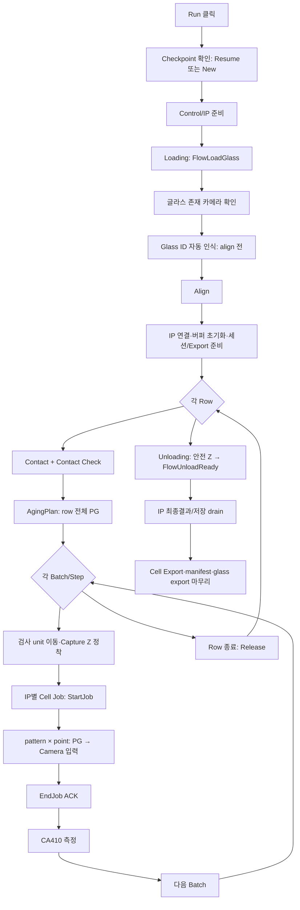

# 프로젝트 이해 커리큘럼 — Test Runner Camera 검사 중심

> 대상: WPF 초급·WinForms 경험 개발자  
> 기준: `Test Runner > Capture + Inspect`, Source=`Camera`, Glass ID 자동 인식 및 표시되는 모든 검사 옵션이 켜진 상태  
> 분석 기준: 2026-07-28 현재 소스

## 1. 먼저 잡아야 할 큰 그림

이 프로젝트에서 Console은 검사 알고리즘을 직접 수행하는 프로그램이 아니다. Console은 한 장의 glass를 검사할 순서와 장비 동작을 관리하고, IP가 촬영 이미지의 검사 계산을 수행한다.

```text
Test Runner
  → MainWindowViewModel
    → Control: Loading / Motion / Contact / PG / CA410 / Unloading
    → IP: Camera 입력 / 버퍼 / 검사 worker
      → Algorithms: dot 좌표 확정 / 레벨 측정 / 결함 계산
    ← IP 최종 결과 이벤트
  → Console: 저장 / UI / 통계 / Export
```

작업 단위는 반드시 구분한다.

| 용어 | 의미 |
|---|---|
| Lot Job | lot 전체 작업. 현재는 `LotId` 메타데이터 중심이다. |
| Glass Job | glass 한 장의 Test Runner 실행 전체. |
| Cell Job | cell 하나를 IP에 넣는 검사 단위. `StartJob → step 입력 → EndJob → 최종 결과`다. |
| Batch | 같은 row/step에서 동시에 움직일 수 있는 IP별 cell 묶음이다. |

> NOTE: 아래는 **현재 Test Runner 구현**을 이해하기 위한 흐름이다. `docs/main-glass-inspection-flow.md`는 이 구조를 향후 목표 구조와 구분해 읽어야 한다. 해당 문서는 현재의 provider/barrier/TCS 중심 구현을 신규 설계 기준으로 삼지 말라고 명시한다.

**핵심 요약:** Console은 오케스트레이터, IP는 검사 실행자, 알고리즘은 영상 판정 엔진이다.

## 2. 가정한 Test Runner 설정

`TestRunnerTask.CaptureInspect`를 선택했을 때, UI의 체크박스가 모두 `true`라고 가정한다.

| Test Runner 항목 | `GlassInspectionRunOptions` 변환값 | 의미 |
|---|---|---|
| Source: Camera | `Source=Camera` | IP가 실제 카메라 촬영으로 pattern × point 입력을 만든다. |
| Align | `UseAlign=true` | glass ID 인식 후, 검사 전 정렬을 수행한다. |
| Glass ID 자동 인식 | `UseGlassIdReading=true` | loading 직후·align 전에 teach 위치에서 ID를 읽는다. |
| Contact Flow | `UseContactFlow=true` | row 시작 전 contact, row 종료 후 release 흐름을 쓴다. |
| Contact Check | `UseContactCheck=true` | contact 직후 CAM3로 recipe point 확인 촬영을 한다. |
| Aging before Inspect | `UseAgingBeforeInspect=true` | 각 row에서 contact 후, 셀 검사 전에 row 전체 PG에 AgingPlan을 실행한다. |
| CA410 | `UseCa410=true` | 각 cell의 `EndJob ACK` 뒤 CA410 측정을 수행한다. |
| Save Original Images | `SaveOriginalImages=true` | IP가 원본/grade 이미지를 정해진 export glass 폴더에 저장하도록 준비한다. |
| Export after Inspect | `ExportAfterInspect=true` | 셀 저장/이미지 저장 완료 뒤 export와 manifest 생성을 진행한다. |
| Unloading Flow | `UseUnloadingFlow=true` | 정상 검사 loop 종료 후 안전 Z 이동 및 unload-ready 흐름을 수행한다. |

`TestRunnerPolicy.BuildRunOptions`가 이 변환의 단일 기준이다. 따라서 UI에서 체크박스가 보이는지와 실제 option이 어떻게 강제되는지를 함께 볼 수 있다.

**핵심 요약:** 학습의 시작점은 버튼 click이 아니라, UI 설정을 실행 옵션으로 확정하는 `TestRunnerPolicy`다.

## 3. Camera + 모든 옵션 ON일 때의 실제 순서



### 3.1 Run부터 검사 준비까지

1. `TestRunnerWindow.RunButton_Click`가 현재 task의 설정을 읽는다.
2. `TestRunnerPolicy.BuildRunOptions`가 `GlassInspectionRunOptions`를 만든다.
3. `MainWindowViewModel.StartTestRunnerRunAsync`가 중단된 run의 checkpoint가 있는지 확인한다.
4. 새 run이면 `RunGlassInspectionReplayAsync`가 실행된다. 이름에 Replay가 남아 있지만 Camera/Folder/CurrentBuffer 검사도 이 공통 loop를 사용한다.
5. Control 연결 확인 → `FlowLoadGlass`를 보낸다.
6. glass 존재 카메라를 확인한다.
7. 자동 Glass ID 읽기 옵션이 켜졌으면 **align 전에** teach 위치에서 읽는다.
8. Align을 수행한다.
9. IP 연결, IP buffer 초기화, 결과 session 폴더, 원본 저장 폴더, export pipeline을 준비한다.

> TIP: "글라스 존재 확인"과 "Glass ID 자동 인식"은 다르다. 전자는 glass가 있는지 확인하는 안전 검사이고, 후자는 식별 문자열을 읽어 `GlassId`를 갱신하는 단계다. ID 읽기가 실패하면 현재 구현은 입력한 GlassId를 유지하고 계속한다.

### 3.2 Row 단위 준비

glass map의 셀은 row plan과 step plan으로 나뉜다.

```text
Row 시작
  → 해당 row의 IP별 첫 cell target 준비
  → BeginRowAsync
     → Contact
     → Contact Check (CAM3, 옵션 ON)
  → AgingPlan을 row의 pending cell PG에 동시 실행
  → row의 step/batch 반복
  → EndRowAsync
     → release/row 종료 정리
```

`UseAgingBeforeInspect`는 cell마다 aging을 하는 옵션이 아니다. **contact → row 전체 Aging → cell 검사** 순서다.

### 3.3 Batch와 Cell Job

한 batch에는 IP1/IP2 같은 lane별 target이 최대 하나씩 들어갈 수 있다. `ProcessGlassReplayBatchAsync`가 batch의 검사 unit 이동을 먼저 수행하고, lane별 cell job을 동시에 시작한다.

```text
Batch motion 완료
  → [IP1 / IP2 병렬]
       StartCellJobAsync       = IP StartJob
       BufferCellJobAsync      = pattern × point 입력 반복
       EndCellJobAsync         = IP EndJob ACK
       CA410 (옵션 ON)
  → 다음 batch motion
```

각 lane 내부에서는 순서를 지켜야 한다.

```text
StartJob accepted
  → pattern/point마다
       검사 카메라 준비
       → REQ_PTN_SEL
       → PatternOnDelay
       → Camera 입력 step
  → 마지막 pattern 뒤 REQ_PTN_OFF
  → EndJob ACK
  → CA410
```

`Camera` 입력은 실제 촬영 경로다. IP는 촬영 결과를 buffer에 반영하고, Console은 마지막 입력 반영이 끝난 뒤 `EndJob`을 보낸다. 검사 계산은 `EndJob` ACK 뒤 IP worker에서 비동기로 시작된다.

### 3.4 결과·저장·Export

`EndJob ACK`는 검사 완료가 아니다.

```text
EndJob ACK
  → IP 검사 worker queue
  → EvtJobCompleted(final_result)
  → Console provider Completed event
  → cell 결과 저장 / UI 상태 갱신 / 통계 갱신
  → 원본·artifact 저장 완료 대기
  → cell export + manifest
  → glass export 마무리
```

현재 Test Runner는 batch의 `EndJob ACK`까지는 기다린 뒤 다음 batch를 진행하고, 최종 결과 처리 task는 `inFlightTasks`로 별도 보관한다. 즉 설비 입력의 진행과 최종 결과 저장은 분리하려는 의도를 갖는다.

**핵심 요약:** 카메라 촬영과 buffer 적재는 동기 단계이고, IP 검사와 최종 결과 수신은 그 뒤의 비동기 단계다.

## 4. 가장 먼저 읽을 파일 순서

| 순서 | 파일 | 읽을 이유 |
|---|---|---|
| 1 | **`uLedAoiConsole/Windows/Core/TestRunnerWindow.xaml`** | 사용자가 실제로 보는 Camera·체크박스 UI를 확인한다. |
| 2 | **`uLedAoiConsole/Windows/Core/TestRunnerWindow.xaml.cs`** | Run click이 설정을 읽어 ViewModel로 넘기는 흐름을 본다. |
| 3 | **`uLedAoiConsole/Models/TestRunnerModels.cs`** | `TestRunnerPolicy.BuildRunOptions`로 UI 옵션의 진짜 의미를 확정한다. |
| 4 | **`uLedAoiConsole/Models/GlassInspectionRunOptions.cs`** | 실행 중 전달되는 option 계약을 이해한다. |
| 5 | **`uLedAoiConsole/ViewModels/MainWindowViewModel.cs`** | `StartTestRunnerRunAsync` → `RunGlassInspectionReplayAsync` 전체 실행 진입점을 읽는다. |
| 6 | 같은 파일의 `ProcessGlassReplayBatchAsync` | batch 이동과 IP별 병렬 cell job 실행을 본다. |
| 7 | 같은 파일의 `ProcessGlassReplayAssignmentAsync` | StartJob, step 입력, EndJob, CA410, 최종 결과 수신을 한 cell 기준으로 본다. |
| 8 | **`uLedAoiConsole/Services/InspectionReplay/CellInspectionDataProvider.cs`** | ViewModel의 provider 호출이 어느 구현으로 이어지는지 확인한다. |
| 9 | **`uLedAoiConsole/Services/InspectionReplay/GlassInspectionStepPreparationService.cs`** | Motion, Contact, PG, Camera 직전 준비, CA410을 읽는다. |
| 10 | **`docs/main-glass-inspection-flow.md`** | 현재 구현을 읽은 다음, 목표 구조와 불변 조건을 비교한다. |

## 5. 6회 학습 커리큘럼

### 1회차 — 화면에서 실행 옵션까지 (1~2시간)

- 목표: Test Runner에서 무엇을 켜면 어떤 실행 option이 되는지 설명한다.
- 파일: `TestRunnerWindow.xaml`, `TestRunnerWindow.xaml.cs`, `TestRunnerModels.cs`.
- 실습: Capture + Inspect, Camera, 모든 체크박스를 선택했을 때 `BuildRunOptions`의 각 속성값을 표로 적는다.
- 확인 질문: `Capture Only`에서는 왜 Export checkbox가 없고, `Capture + Inspect`에서만 Aging-before-Inspect가 가능한가?

### 2회차 — Glass Job의 시작 (1~2시간)

- 목표: Run 버튼부터 align 직전/직후까지의 순서를 추적한다.
- 파일: `MainWindowViewModel.cs`의 `StartTestRunnerRunAsync`, `RunGlassInspectionReplayAsync`, `RunGlassInspectionLoadingFlowAsync`.
- 실습: `FlowLoadGlass`, glass present check, Glass ID reading, align의 순서를 ASCII diagram으로 다시 그린다.
- 확인 질문: Glass ID 읽기 실패 시 run이 항상 중단되는가? (아니다. 현재 입력 GlassId를 유지한다.)

### 3회차 — Row, Contact, Aging (2시간)

- 목표: row가 왜 존재하고 contact/aging이 어디에 붙는지 이해한다.
- 파일: `RunGlassInspectionReplayAsync`의 row loop, `GlassInspectionStepPreparationService.BeginRowAsync`.
- 실습: 한 row의 `contact → contact check → aging → step 반복 → release`를 로그 marker와 함께 적는다.
- 확인 질문: Aging은 cell마다 하는가, row 전체에 하는가? (모든 옵션 ON 기준 row 전체.)

### 4회차 — Camera Cell Job (2~3시간)

- 목표: Camera 검사 한 cell을 처음부터 EndJob ACK까지 설명한다.
- 파일: `ProcessGlassReplayBatchAsync`, `ProcessGlassReplayAssignmentAsync`, `CellInspectionDataProvider.cs`.
- 실습: `StartCellJobAsync`, `BufferCellJobAsync`, `EndCellJobAsync`가 각각 IP의 어느 명령에 대응하는지 표로 만든다.

| Console provider 메서드 | IP lifecycle 의미 |
|---|---|
| `StartCellJobAsync` | `StartJob`: cell job/buffer 준비 |
| `BufferCellJobAsync` | pattern × point별 camera 입력 step |
| `EndCellJobAsync` | 더 이상 input이 없다는 `EndJob` 선언 |
| `Completed` event | `EvtJobCompleted(final_result)` |

### 5회차 — IP 검사와 표준맵 (2~3시간)

- 목표: 카메라 이미지가 IP에서 어떻게 검사 결과가 되는지 이해한다.
- 파일: `uLedIp/Services/IpNodeRuntimeService.cs`, `uLedIp/Inspection/PointGridInspectionAlgorithm.cs`, `uLedInspection.Algorithms/CorrectedDenseMapInspector.cs`.
- 선행 문서: **`표준맵사용검사-분석.md`**.
- 실습: `EndJob ACK`와 `EvtJobCompleted` 사이에서 IP worker가 하는 일을 설명한다.

### 6회차 — 결과, 저장, Export와 목표 구조 비교 (2시간)

- 목표: 검사 성공의 기준이 결과 도착·저장·export까지임을 이해한다.
- 파일: `ProcessGlassReplayAssignmentAsync`의 `SaveOnFinalResultEventAsync`, `CellExportPipeline`, `docs/main-glass-inspection-flow.md`.
- 실습: `EndJob ACK` 이후의 CA410, 다음 batch, `EvtJobCompleted`, 저장/export를 시간축으로 그린다.
- 확인 질문: `EndJob ACK`가 왔는데 final result가 아직 없다면 cell은 완료인가? (아니다. worker 검사/최종 결과 대기 상태다.)

**핵심 요약:** 1~4회차로 Console의 실제 운전 흐름을 잡고, 5~6회차에서 IP 알고리즘과 결과 산출물까지 연결한다.

## 6. 디버깅·운전 관찰 포인트

Camera 검사 이해를 가장 빠르게 검증하는 방법은 run session의 로그 순서를 보는 것이다.

```text
FlowStart
→ Loading
→ GlassIdResolved (옵션 성공 시)
→ Align
→ ROW_START
→ ROW_CONTACT_START
→ AGING_MODULE_START / DONE
→ STEP_START
→ MOVE_INSPECT_START / DONE
→ REQUEST / ACCEPT
→ BUFFER_START
→ ENDJOB_START / ENDJOB_ACK
→ CA410_START / DONE
→ RECEIVE
→ ROW_END
→ Unloading
→ ExportCompleted
```

문제별 첫 확인 위치는 다음과 같다.

| 증상 | 첫 확인 지점 |
|---|---|
| Run 직후 시작 안 됨 | checkpoint, Control/IP ready, Loading 로그 |
| Glass ID가 기대값과 다름 | `GlassIdResolved`, 자동 인식 실패 로그, 입력값 유지 여부 |
| Contact 뒤 멈춤 | `ROW_CONTACT_START`, CAM3 contact check, `BeginRowAsync` |
| 촬영은 했는데 검사 결과가 늦음 | `ENDJOB_ACK` 이후 `RECEIVE`까지의 IP worker/결과 이벤트 |
| CA410 때문에 다음 cell이 늦음 | `CA410_START/DONE`, CA410 alarm severity |
| 결과는 있는데 export가 없음 | IP SaveDone, cell export pipeline, manifest, `ExportCompleted` |

> NOTE: `c:\elp\uLed\uLedIp\logs\yyyyMM\`와 `c:\elp\uLedAoi\logs\yyyyMM\`의 최신 관련 Caller 로그를 함께 봐야 한다. Console 로그만으로는 IP worker 안의 검사·저장 흐름을 완전히 알 수 없다.

## 7. 현재 구현과 목표 MainFlow를 구분하는 법

현재 코드는 `ICellInspectionDataProvider`, batch coordinator, `TaskCompletionSource` 이벤트 대기로 동작한다. 반면 **`docs/main-glass-inspection-flow.md`**는 다음과 같은 더 명시적인 목표 구조를 정의한다.

```text
InspectionBatchExecutor
  → Moving
  → StartJob
  → InputStep 반복
  → EndJob ACK
  → CA410
  → 다음 Moving

InspectionResultReceiver
  ← EvtJobCompleted
  → 저장 / UI / 통계 / orphan 처리
```

두 내용을 혼동하지 않는 규칙은 간단하다.

- "지금 버튼을 눌렀을 때 실제로 무엇이 실행되는가"는 **현재 코드**를 기준으로 답한다.
- "앞으로 MainFlow를 어떻게 변경해야 하는가"는 **`main-glass-inspection-flow.md`**를 기준으로 답한다.
- 두 기준이 충돌하는 영역의 구현 변경은 사용자의 명시 확인 없이는 진행하지 않는다.

**최종 요약:** 이 프로젝트는 Camera 한 장을 검사하는 프로그램이 아니라, glass 한 장을 안전하게 이송·접촉·점등·촬영·비동기 검사·측정·저장·export하는 생산 시퀀스다. Test Runner의 Camera + 모든 옵션 ON 흐름을 따라가면 Console 프로젝트의 중심 책임을 가장 빠르게 이해할 수 있다.
