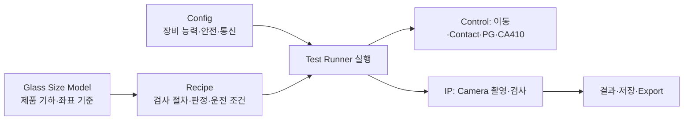
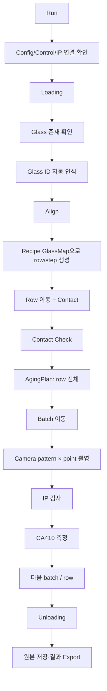

# Config · Glass Size · Recipe · Test Runner 연결 이해 가이드

> 관점: 장비 개발자  
> 기준 실행: Test Runner `Capture + Inspect`, Source=`Camera`, 모든 체크박스 ON  
> 목적: 무엇을 어디에 설정해야 하는지와, 그 값이 실제 검사 run에 어떤 영향을 주는지 이해한다.

## 1. 먼저 잡아야 할 전체 구조

이 프로젝트의 설정은 한 파일에 몰아넣지 않는다. 장비 고유 정보, 제품 고유 정보, 검사 방법을 분리한다.

```text
Config
  = 이 장비는 어떻게 연결되고, 어떤 축·카메라·안전 조건으로 움직이는가?

Glass Size Model
  = 이 제품의 glass는 어떤 크기·방향·mark·좌표계를 가지는가?

Recipe
  = 이 제품을 어떤 cell 순서·pattern·검사 기준·contact·CA410 조건으로 검사하는가?

Test Runner
  = 지금 이 recipe를 실제 장비에서 어느 범위와 옵션으로 실행할 것인가?
```



**핵심 요약:** Config는 장비를 바꾸면 바뀌고, Glass Size Model은 제품 형상이 바뀌면 바뀌고, Recipe는 검사 방법이 바뀌면 바뀐다.

## 2. 설정 책임을 섞지 않는 이유

장비 개발에서 가장 위험한 문제 중 하나는 “어떤 값이 틀렸는지”를 알 수 없게 만드는 것이다. 예를 들어 제품별 cell 위치를 장비 Config에 넣거나, 장비의 안전 Z를 Recipe에 넣으면 제품 전환과 장비 유지보수가 서로 영향을 준다.

| 구분 | 변경되는 시점 | 예시 | 잘못된 위치에 두었을 때의 문제 |
|---|---|---|---|
| Config | 장비 설치·카메라/축 교체·안전 정책 변경 | IP endpoint, CAM1/2/3 이름, Capture Z, Measure Z, 안전 간격 | 제품 Recipe를 바꿨는데 장비 충돌 위험까지 바뀔 수 있다. |
| Glass Size Model | glass 종류·판넬 크기·mark 구조 변경 | glass 크기, panel angle, align mark, 좌표 원점, cell 이름 규칙 | 다른 제품인데 이전 제품의 좌표계를 재사용할 수 있다. |
| Recipe | 검사 조건·공정 조건·고객 요구 변경 | 검사 pattern, point, threshold, 표준맵, contact 값, CA410 plan | 같은 제품에서 검사 기준을 바꿀 때 장비 기본값까지 흔들린다. |
| Test Runner | 이번 실행에서만 달라지는 운전 선택 | align 사용, contact check, CA410, export, 반복 횟수 | 임시 run 선택이 recipe 정본을 오염시킬 수 있다. |

> NOTE: Test Runner 체크박스는 “장비 능력을 정의하는 설정”이 아니라, 이미 준비된 Config·Glass Size·Recipe를 이번 run에서 사용할지 선택하는 실행 스위치다.

## 3. 1단계 — Config: 장비가 안전하게 동작할 수 있는가

Config는 제품과 무관하게 장비 자체를 설명한다. 장비 개발자는 먼저 여기서 실제 하드웨어와 소프트웨어의 연결점을 맞춘다.

### Config에서 중요한 그룹

| 그룹 | 대표 내용 | Camera 검사에 미치는 영향 |
|---|---|---|
| Control/IP 통신 | Control endpoint, IP endpoint | Control과 IP가 연결되어야 run이 시작된다. |
| 카메라 구성 | Align CAM1/CAM2, Contact Check CAM3, align camera geometry | glass 존재 확인, align, contact check가 올바른 카메라·방향·pixel scale로 동작한다. |
| Head offset | Align 기준에서 검사 카메라·CA410까지의 offset | align 후 검사/CA410 위치를 실제 장비 좌표로 변환한다. |
| Z·안전 설정 | IdleZ, CaptureZ, MeasureZ, settle delay, Escape Y | 이동 충돌을 피하고 촬영·측정 전에 적정 높이와 안정 시간을 보장한다. |
| 안전 간격 | `MinSafeGlassYGapUm` | 두 inspection unit이 동시에 움직일 때 glass 충돌을 막는다. |
| CA410 장비 설정 | 장치 연결·포트·측정 장치 정보 | CA410 checkbox ON일 때 실제 측정 가능 여부를 결정한다. |
| 원본/Export 경로 | Original Image Output Root | 원본 저장 및 export checkbox ON에서 필수 경로가 된다. |

### 장비 개발자가 Config를 먼저 검증해야 하는 이유

```text
Config 오류
  → 이동 좌표 계산이 맞아도 실제 헤드가 다른 곳으로 감
  → recipe가 맞아도 camera/CA410가 glass를 보지 못함
  → 안전 Z/escape 설정이 틀리면 충돌 또는 촬영 실패 위험
```

Config은 “검사 품질 튜닝값”보다 먼저 “장비가 물리적으로 안전하고 재현 가능하게 움직이는가”를 보장하는 층이다.

**핵심 요약:** Config은 검사 조건을 정하는 곳이 아니라, 검사 조건을 실행할 수 있는 장비 기반을 만드는 곳이다.

## 4. 2단계 — Glass Size Model: 제품의 물리 좌표 기준을 정의한다

Glass Size Model은 특정 glass 제품군의 기하 정보를 가진다. 여기서 가장 중요한 질문은 “이 제품의 어느 위치를 원점으로 보고, 어느 위치에 align mark와 cell이 있는가”다.

### Glass Size Model의 주요 내용

| 항목 | 의미 | run에서의 영향 |
|---|---|---|
| Glass width / height | glass의 물리 크기 | glass map 표시와 cell 좌표 범위의 기준이다. |
| Panel angle | stage 좌표계에 대한 glass의 물리 자세 | glass 좌표를 축 이동 좌표로 바꿀 때 반영된다. |
| Axis direction / origin | 제품 좌표의 방향과 기준점 | cell index, defect row/column 표시가 일관되게 유지된다. |
| Glass map naming | cell 이름과 X/Y index 규칙 | Test Runner의 대상 cell, 파일명, 결과 연결의 기준이 된다. |
| Align marks / pose | mark의 제품 좌표와 촬영 teach 위치 | Align checkbox ON일 때 실제 align 기준이 된다. |
| Glass ID reader pose | ID를 읽을 카메라/축 위치 | 자동 Glass ID 인식 checkbox ON에서 사용된다. |
| Glass-to-motor / camera calibration | glass 좌표→축 좌표 변환 기준 | cell 중심을 inspection unit의 이동 target으로 바꾼다. |

### 왜 Glass Size Model이 Recipe보다 먼저인가

Recipe는 “어떤 검사를 할지”를 정의하지만, 그 전에 “어느 셀을 어디에서 검사하는지”가 정해져야 한다.

```text
Glass Size Model
  → glass 좌표계와 mark/cell의 물리 기준
  → Recipe GlassMap이 검사 대상 cell을 구성
  → Control이 cell 중심을 축 target으로 변환
```

> TIP: 같은 검사 recipe라도 glass 크기, panel angle, align mark가 달라지면 그대로 사용할 수 없다. 제품 기하가 달라졌다면 먼저 적절한 Glass Size Model을 선택하거나 만들어야 한다.

**핵심 요약:** Glass Size Model은 “제품 도면을 장비가 이해하는 좌표계로 바꾼 모델”이다.

## 5. 3단계 — Recipe: 이 제품을 어떻게 검사할지 정한다

Recipe는 Glass Size Model을 참조하면서, 실제 검사 run에 필요한 검사 절차와 공정 조건을 완성한다.

```text
Glass Size Model이 정하는 것
  → 어느 위치에 cell과 mark가 있는가

Recipe가 정하는 것
  → 어떤 cell을 사용할 것인가
  → 어떤 pattern/point를 어떤 순서로 촬영할 것인가
  → 어떤 검사 기준으로 판정할 것인가
  → contact·PG·CA410을 어떻게 운전할 것인가
```

### Recipe의 주요 계획(Plan)

| Recipe 영역 | 역할 | Test Runner Camera 검사에서의 영향 |
|---|---|---|
| `IpRecipe` | pattern, point, 검사 threshold, dot map, 표준맵 등 IP 실행 계약 | 각 cell에서 Camera가 촬영할 순서와 IP 검사 결과를 결정한다. |
| `GlassMap` | 검사 대상 cell, cell 사용 여부, IP 분배, 순회 기준 | 어떤 cell을 어느 lane/IP에서 어떤 row·step으로 검사할지 결정한다. |
| `AlignPlan` | mark matching, tolerance, 기준 이미지 | Align ON일 때 허용 오차와 보정 절차를 결정한다. |
| `ControlPlan` | contact 위치/OD, PG mapping, 좌표 해석 규칙 | row contact, cell의 PG 선택, 장비 동작의 제품별 조건을 정한다. |
| `Ca410Plan` | 사용할 CA410 pattern과 voltage step | CA410 ON일 때 cell마다 무엇을 표시하고 측정할지 정한다. |
| `AgingPlan` | aging pattern/시간/순서 | Aging before inspect ON일 때 row 전체에 실행된다. |
| `StandardMapPlan` | 표준맵 사용 여부와 기준 정보 | IP가 매 셀 좌표를 새로 만들지, 표준맵으로 배치할지 결정한다. |
| CellMap 보정 | XIndex/YIndex별 미세 물리 보정 | cell 이동 축 target에 더해져 위치 편차를 줄인다. |

### Recipe를 짜는 권장 순서

1. 올바른 Glass Size Model을 연결한다.
2. GlassMap에서 실제 검사할 cell과 IP 분배를 확정한다.
3. AlignPlan과 Glass ID pose가 제품 표준과 맞는지 확인한다.
4. ControlPlan의 contact, PG mapping, 제품별 이동 조건을 정한다.
5. `IpRecipe`의 pattern, point, 검사 기준을 설정한다.
6. 양품 셀로 pitch/phase/표준맵을 준비한다.
7. CA410Plan과 AgingPlan을 제품 요구에 맞게 선택한다.
8. 저장 전 recipe validation과 Glass Size 연결 상태를 확인한다.

**핵심 요약:** Recipe는 장비의 기본 성능을 바꾸지 않고, 특정 제품을 검사하는 방법과 순서를 정의한다.

## 6. Test Runner에서 모든 체크박스를 켰을 때

Test Runner는 recipe를 새로 만들지 않는다. 준비된 Config·Glass Size Model·Recipe를 읽어 이번 Glass Job에 적용한다.

### 실제 run 흐름



### 체크박스별로 어떤 설정을 소비하는가

| Test Runner 옵션 | 주로 사용하는 설정 | 실제 영향 |
|---|---|---|
| Camera | Config의 IP/camera 연결, Recipe `IpRecipe` | 실제 Camera 입력으로 pattern × point 이미지를 만들고 IP 검사로 보낸다. |
| Glass ID 자동 인식 | Glass Size의 ID reader pose, Config 카메라/좌표 설정 | loading 뒤 align 전에 ID 읽기 위치로 이동해 GlassId를 결정한다. |
| Align | Glass Size align mark·calibration, Recipe `AlignPlan`, Config align camera geometry | mark를 촬영·매칭해 glass의 XY/각도 편차를 보정한다. |
| Contact Flow | Recipe `ControlPlan`, Config Control/축 | row 시작 시 contact 위치와 OD 조건으로 contact를 수행한다. |
| Contact Check | Config CAM3, Recipe contact check point | contact 직후 실제 접촉 상태를 camera로 확인한다. |
| Aging before Inspect | Recipe `AgingPlan`, Recipe PG mapping | 해당 row의 pending cell 전체 PG에 aging sequence를 먼저 수행한다. |
| CA410 | Config CA410 device, HeadOffset/Z, Recipe `Ca410Plan` | `EndJob ACK` 뒤 CA410 위치로 이동해 pattern·voltage별 측정을 한다. |
| Save Original Images | Config 원본 저장 root, Recipe export prefix | IP가 원본·grade 이미지를 정해진 glass 폴더에 저장한다. |
| Export after Inspect | Export 경로, Recipe prefix·pattern 정보, 최종 결과 | cell 산출물과 manifest를 만들고 glass 결과를 export한다. |
| Unloading | Config IdleZ, Control flow | 모든 검사 후 안전 Z로 이동하고 unload-ready 상태로 전환한다. |

> NOTE: `EndJob ACK` 뒤에는 IP가 비동기로 검사한다. CA410, 다음 이동, 최종 결과 저장은 서로 다른 흐름에서 이어진다. “촬영이 끝났다”와 “검사 결과가 저장됐다”는 같은 시점이 아니다.

## 7. 값이 run에 도달하는 경로

설정값을 디버깅할 때는 다음 경로를 머릿속에 두면 좋다.

```text
Config의 CaptureZ
  → Camera 입력 직전 Z 이동·정착
  → 초점/안전/촬영 안정성

Glass Size의 PanelAngle·calibration
  → cell의 glass 좌표를 axis target으로 변환
  → 검사 헤드가 실제 cell 위치로 이동

Recipe GlassMap의 cell/IP 분배
  → row·step·batch 구성
  → 어느 IP가 어느 cell을 언제 검사할지 결정

Recipe IpRecipe의 pattern/point
  → PG 선택과 Camera 촬영 반복
  → IP의 검사 입력 순서와 결과 구조 결정

Recipe StandardMapPlan
  → IP의 dot 좌표 확정 방식
  → 결함 level을 샘플링할 좌표 결정

Test Runner checkbox
  → 이미 준비된 계획을 이번 run에서 실행할지 선택
```

## 8. 장비 개발자 관점에서의 설계 의도

코드와 문서에서 보이는 설계 방향을 장비 개발 관점으로 해석하면 다음과 같다.

### 8.1 제품 전환과 장비 유지보수를 분리하려는 설계

장비의 카메라 위치, 안전 Z, 통신 endpoint는 제품이 바뀌어도 대체로 유지된다. 반대로 glass 크기, mark, cell 배치는 제품마다 달라진다. 검사 pattern·threshold는 같은 제품에서도 공정 조건에 따라 바뀔 수 있다.

그래서 다음과 같이 나눈 것으로 볼 수 있다.

```text
장비가 바뀜          → Config 수정
제품 형상이 바뀜     → Glass Size Model 수정/선택
검사 방법이 바뀜     → Recipe 수정
이번 실행만 바뀜     → Test Runner 옵션 선택
```

이 분리는 한 영역의 변경이 다른 영역을 조용히 깨뜨리는 것을 줄인다.

### 8.2 좌표 문제를 두 층으로 분리하려는 설계

장비에는 물리 좌표 문제와 이미지 좌표 문제가 동시에 있다.

- 물리 좌표 문제: 축이 셀 중심까지 정확히 움직이는가?
- 이미지 좌표 문제: 촬영된 화면에서 dot의 검사 좌표가 정확한가?

Glass Size/CellMap/Control은 첫 번째를, 표준맵/IP 알고리즘은 두 번째를 담당한다. 장비 개발자에게는 원인 분리가 매우 중요하다. 위치가 틀렸을 때 “축 보정 문제인지, 이미지 정합 문제인지”를 구분할 수 있기 때문이다.

### 8.3 검사 품질과 장비 처리량을 함께 지키려는 설계

Camera 촬영과 IP 검사는 분리돼 있다.

```text
Camera 입력 완료
→ EndJob ACK
→ IP worker 검사
→ EvtJobCompleted
```

이 구조는 검사 계산이나 이미지 저장이 다음 cell의 motion·PG·촬영을 불필요하게 막지 않게 하기 위한 것이다. 장비 개발 관점에서는 cycle time을 지키면서도 결과 저장을 놓치지 않기 위한 구조다.

### 8.4 안전과 추적성을 우선하는 설계

- 두 inspection unit의 최소 안전 간격
- CaptureZ/MeasureZ/IdleZ의 구분
- Contact Check와 alarm severity
- checkpoint, runtime snapshot, 결과 manifest, export naming

이들은 “정상 동작”만을 위한 값이 아니다. 이상 상황에서 장비를 안전하게 멈추고, 어떤 glass를 어떤 조건으로 검사했는지 나중에 추적하기 위한 장치다.

> NOTE: 위 설계 의도는 코드·문서·책임 분리에서 도출한 해석이다. 제작자의 개인적 의도를 확정하는 진술은 아니다.

## 9. 설정 작업을 실제로 진행하는 권장 순서

### 장비 설치 또는 장비 변경 시

1. Config에서 Control/IP/camera/CA410 연결을 맞춘다.
2. Head offset, Z 높이, Escape Y, 안전 간격을 검증한다.
3. Camera/Control 단독 테스트로 축 방향과 안전 동작을 확인한다.

### 새 Glass Size 도입 시

1. glass 크기, panel angle, 좌표 원점과 방향을 설정한다.
2. align mark와 Glass ID reader pose를 teach한다.
3. glass→motor/calibration을 검증한다.
4. cell naming과 dot index 규칙을 확정한다.

### 새 검사 Recipe 작성 시

1. Glass Size Model을 연결한다.
2. GlassMap과 IP 배정을 확정한다.
3. pattern/point와 검사 기준을 설정한다.
4. ControlPlan, contact, PG mapping을 설정한다.
5. 표준맵과 RGB phase를 준비한다.
6. CA410/Aging 요구가 있으면 각각의 plan을 작성한다.
7. Camera Test Runner에서 옵션을 하나씩 켜며 검증한 뒤 전체 ON run을 수행한다.

## 10. 최종 정리

```text
Config
  = 장비가 안전하게 움직이고 통신하는 방법

Glass Size Model
  = 제품 glass의 크기와 좌표 기준

Recipe
  = 그 제품을 검사하는 절차와 기준

Test Runner
  = 준비된 설정을 이번 glass run에 적용하는 운전 패널
```

**최종 요약:** 장비 개발자 관점에서 이 프로젝트는 “검사 알고리즘 프로그램”이면서 동시에 “제품·장비·운전 조건을 분리해 조합하는 검사 설비 플랫폼”이다. Config, Glass Size Model, Recipe의 책임을 섞지 않는 것이 안전한 제품 전환과 안정적인 양산 운전의 출발점이다.
