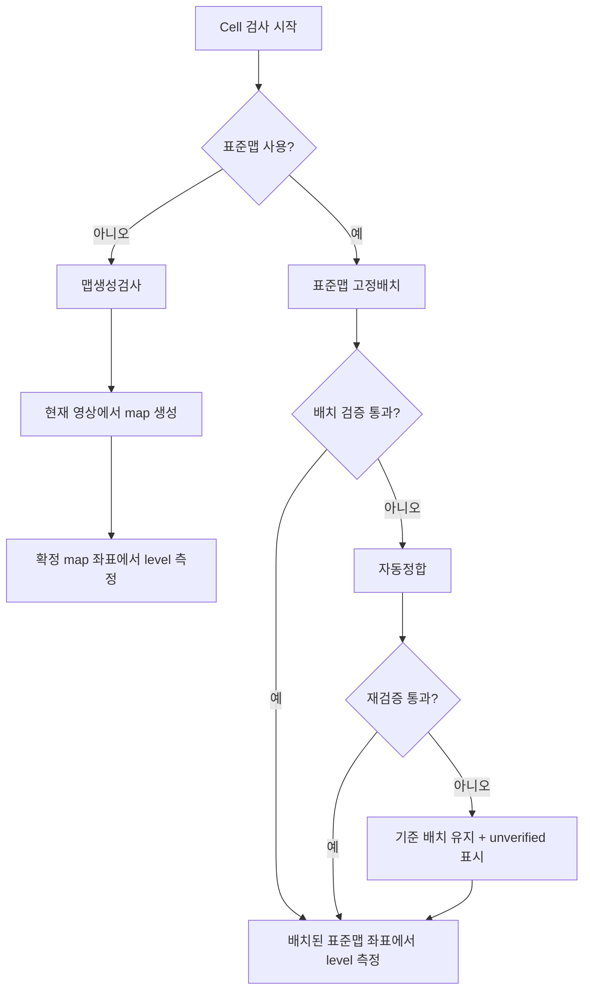

# 표준맵 사용 검사 이해 가이드

> 목적: 표준맵을 사용하는 이유와 검사 흐름을 코드보다 먼저 이해한다.  
> 범위: dot 좌표 확정과 레벨 샘플링. 명점·암점·명선의 세부 판정 규칙은 다루지 않는다.

## 1. 이 기능을 한 문장으로 이해하기

표준맵 검사는 **양품 셀에서 한 번 확정한 dot 좌표표를 기준으로, 이후 모든 셀을 같은 좌표 체계에서 검사하는 방식**이다.

즉, 매 셀에서 밝게 보이는 점들을 모두 찾아 좌표를 새로 만들기보다, 기준 좌표표를 현재 셀 영상에 맞춰 배치한 뒤 그 좌표에서 밝기(level)를 측정한다.

```text
양품 기준 셀
  → 모든 dot의 기준 좌표를 만든다
  → 표준맵으로 저장한다

검사 대상 셀
  → 표준맵을 현재 영상에 맞춰 배치한다
  → 배치된 좌표에서 밝기를 측정한다
  → 결함을 판단한다
```

**핵심 요약:** 표준맵은 “이번 영상에서 보이는 점 목록”이 아니라, 모든 셀에 공통으로 적용할 **검사 좌표 기준**이다.

## 2. 왜 표준맵이 필요한가

검출 기반 검사만 사용하면, 현재 셀에서 밝게 보이는 dot을 찾아 격자를 만든다. 이 방식은 양품에서는 잘 동작할 수 있지만 불량 셀에서는 문제가 생긴다.

| 상황 | 매 셀 검출 기반의 문제 | 표준맵 방식의 해결 |
|---|---|---|
| 암점·미점등이 많음 | 보이는 dot이 줄어 격자 자체가 흔들릴 수 있다. | 보이지 않아도 기준 좌표에서 밝기를 측정한다. |
| 일부 line이 꺼짐 | dot index가 한 칸 밀릴 위험이 있다. | 기준 index와 좌표를 유지한다. |
| 노이즈·잘못 검출된 blob | 잘못된 점이 좌표 계산을 흔들 수 있다. | 검출값은 배치 확인용으로만 주로 사용한다. |
| 검사 속도 | 모든 dot을 매번 검출해야 한다. | 소수 표본만 확인해 전체 표준맵을 배치한다. |

> NOTE: 표준맵은 결함을 숨기기 위한 보정이 아니다. 오히려 dot이 꺼져도 “원래 이 위치에 있어야 한다”는 기준을 유지해 암점·점등불량을 더 정직하게 드러낸다.

## 3. 꼭 알아야 할 용어

| 용어 | 쉬운 정의 |
|---|---|
| dot | R/G/B sub dot을 포함하는 논리 단위의 한 점이다. |
| object | 밝은 영역을 이미지에서 찾았을 때 얻는 blob 하나다. 점등된 dot 후보로 본다. |
| 실측 centroid | object의 실제 중심 좌표다. 현재 영상에서 관측된 위치다. |
| dense map | 모든 dot index에 카메라 좌표를 부여한 좌표표다. |
| 표준맵 | 양품 셀에서 만든 dense map이다. 운영 검사의 기준 좌표표다. |
| 맵생성검사 | 현재 영상의 object를 기반으로 dense map을 새로 만드는 검사다. |
| 고정배치 | 표준맵을 현재 셀에 배치하는 기본 방식이다. |
| 자동정합 | 고정배치 검증에 실패했을 때 좌표를 다시 찾는 폴백 방식이다. |
| phase offset | R 좌표에서 G/B 좌표로 이동하기 위한 채널 간 고정 상대 거리다. |
| residual | 실측 centroid와 배치된 맵 좌표의 차이다. 좌표 이탈 통계로 남긴다. |

**핵심 요약:** 실측 centroid는 “현재 보이는 위치”, 표준맵 좌표는 “검사해야 할 위치”다. 둘은 같은 역할이 아니다.

## 4. 전체 검사 경로

검사는 표준맵 사용 여부에 따라 크게 두 경로로 나뉜다.



### 4.1 맵생성검사

표준맵이 아직 없거나, 표준맵을 만들 기준 셀을 검사할 때 사용한다.

```text
이미지 전처리
→ 밝은 object 검출
→ dot 격자 생성
→ object와 격자의 일치 검증
→ 기준 채널 map 확정
→ G/B는 phase offset으로 파생
→ map 좌표에서 level 측정
```

- 기준 채널은 일반적으로 R → G → B 순서로 시도한다.
- 세 채널에서 모두 충분한 검출을 얻지 못해도, 중심 기준의 격자를 만들어 좌표와 level 측정을 계속한다.
- 이 경로의 주 용도는 표준맵 생성, 자동정합의 재료 확보, 표준맵이 없는 과도기 검사다.

### 4.2 표준맵 검사

운영 검사의 기본 경로다.

```text
표준맵의 일부 표본 dot 선택
→ 표본 주변에서만 실제 dot 검출
→ 현재 셀의 이동·회전·배율을 계산
→ 변환된 표준맵을 전체 dot에 적용
→ 배치가 맞는지 검증
→ 전체 표준맵 좌표에서 level 측정
```

전체 dot을 새로 검출하지 않는 것이 핵심이다. 표준맵은 유지하고, 현재 셀에서 달라진 배치만 맞춘다.

**핵심 요약:** 맵생성검사는 “현재 영상으로 좌표표를 만든다”, 표준맵 검사는 “기존 좌표표를 현재 영상에 올바르게 올린다”의 차이다.

## 5. 표준맵 검사의 핵심 단계

### 5.1 고정배치 — 기본 경로

표준맵 전체 중 화면에 고르게 퍼진 약 192개 표본만 사용한다.

1. 표준맵의 표본 위치 주변에서 실제 밝은 dot을 찾는다.
2. 표준맵과 실측 위치의 차이로 이동·회전·배율을 계산한다.
3. 이 변환을 표준맵 전체 dot에 적용한다.
4. 적용된 전체 좌표에서 level을 측정한다.

이 방식은 빠르고, 어두운 dot이 많아도 좌표가 사라지지 않는 장점이 있다.

### 5.2 배치 검증 — “한 칸 밀림” 방지

dot 격자는 반복 구조이므로, 점들이 한 pitch만큼 밀려도 표본 정합만으로는 맞는 것처럼 보일 수 있다. 이를 막기 위해 가장자리와 그 바깥을 검사한다.

```text
가장자리 검사
  → 표준맵의 마지막 줄에 빛이 있어야 한다

가드 검사
  → 표준맵 바깥 한 pitch 위치에는 빛이 없어야 한다
```

- 가장자리도 보이고 바깥 가드 영역도 깨끗하면 배치를 신뢰한다.
- 가드 영역에서 빛이 발견되면, 실제 점등 영역이 표준맵 밖으로 넘친 것이므로 한 칸 이상 밀렸다고 판단한다.

### 5.3 자동정합 — 고정배치 실패 시만 사용

자동정합은 독립적인 운영 모드가 아니다. 고정배치가 틀렸다고 판단됐을 때만 사용한다.

```text
현재 영상에서 map을 다시 생성
→ 표준맵과 대응되는 dot쌍 수집
→ offset 후보 계산
→ R/G/B에서 고정배치를 다시 검증
→ 통과한 후보를 채택
```

RGB를 다시 확인하는 이유는 세 채널이 같은 셀·같은 stage 위치에서 촬영되므로, 셀 전체의 이동은 공통이어야 하기 때문이다.

### 5.4 끝까지 실패한 경우

자동정합도 실패하면 검사 좌표를 없애지 않는다.

```text
기준 표준맵 배치를 유지
→ 결과 mode를 fixed-prior(unverified)로 표시
→ 해당 좌표에서 level 측정은 계속 수행
```

이는 “정합 실패라서 검사 결과 없음”보다 “좌표 신뢰도가 낮은 상태의 측정 결과”를 남기는 선택이다.

**핵심 요약:** 표준맵 검사는 빠른 배치 → 배치 검증 → 자동정합 폴백 → 신뢰도 표시라는 안전 사다리로 동작한다.

## 6. 표준맵은 어떻게 만들어지는가

표준맵 생성에는 양품 셀 하나가 필요하다.

```text
양품 셀을 현재 버퍼에 준비
→ 표준맵을 끈 상태로 맵생성검사
→ R 채널 좌표를 수집
→ 이웃과 크게 다른 좌표를 보정
→ 계단 성분과 측정 노이즈를 줄여 이상화
→ std_map.csv 저장
→ G/B-R 실측 차이로 phase offset 권장값 생성
```

### R만 저장하는 이유

- 표준맵 파일에는 R 채널 좌표를 기준으로 저장한다.
- G/B는 R 기준 좌표에 recipe의 phase offset을 더해 만든다.
- 채널별 좌표를 모두 저장하면, 상대적으로 어두운 G/B의 검출 노이즈까지 기준 자산에 남을 수 있기 때문이다.

### 이상화의 의미

기준 셀에만 있던 측정 노이즈나 스티치 계단을 그대로 표준맵에 남기지 않고, 매끄러운 기준 격자로 정리하는 과정이다.

이상화는 **표준맵 생성 시에만** 적용한다. 실제 검사 셀의 국소 변형이나 이탈은 결과의 residual로 남겨야 하기 때문이다.

**핵심 요약:** 표준맵은 “한 번 찍은 양품 사진의 좌표 복사본”이 아니라, 양품 셀에서 얻은 좌표를 검사 기준에 맞게 정리한 자산이다.

## 7. 물리 보정과 영상 보정은 다르다

표준맵과 CellMap 보정은 모두 위치를 다루지만, 해결하는 문제가 다르다.

| 구분 | CellMap 보정 | 표준맵 배치 |
|---|---|---|
| 담당 | Console | IP 검사 알고리즘 |
| 단위 | um | px |
| 대상 | 장비 축의 이동 target | 카메라 이미지 안의 dot 좌표 |
| 목적 | 셀이 카메라에 올바른 물리 위치로 오게 한다. | 촬영된 영상에서 표준맵을 정확한 위치에 배치한다. |
| 기준 | XIndex/YIndex 그룹별 물리 보정 | 표본 검출과 표준맵 좌표 |

```text
CellMap 보정
  = 카메라가 셀을 제대로 보도록 장비를 움직이는 보정

표준맵 배치
  = 카메라가 본 이미지 안에서 dot 좌표를 맞추는 보정
```

**핵심 요약:** 장비 이동 오차를 이미지 정합 값으로 덮어 쓰지 않도록, 물리 um 보정과 영상 px 보정을 분리했다.

## 8. 결과에서 봐야 할 신호

표준맵 사용 여부와 배치 품질은 결과 mode와 로그에서 확인한다.

| 결과 mode | 의미 |
|---|---|
| `fixed` | 고정배치와 배치 검증이 정상 통과했다. |
| `fixed` + `guard-clear` | 가장자리 일부는 약했지만 바깥 가드에 빛이 없어 배치를 신뢰한다. |
| `fixed(realigned)` | 자동정합으로 offset을 다시 얻은 뒤 검증에 통과했다. |
| `fixed-prior(unverified)` | 정합을 신뢰할 수 없지만 기준 배치로 level은 측정했다. |

함께 보면 좋은 값은 다음과 같다.

- `measured shift`: 기준 표준맵 대비 실측 이동량
- `theta`, `scale`: 회전과 배율 차이
- `residual p50/p95`: 실측 위치와 맵 좌표의 차이 분포
- `deviated`: 허용 범위를 크게 벗어난 dot 수

> TIP: `fixed-prior(unverified)`는 결함 판정 자체가 없다는 뜻이 아니다. 결과를 볼 때 좌표 배치의 신뢰도를 함께 확인해야 한다는 표시다.

## 9. 관련 코드는 이렇게만 보면 된다

이 문서의 개념을 이해한 뒤에만 아래 파일을 큰 흐름 확인용으로 읽으면 된다. 처음부터 모든 메서드를 따라갈 필요는 없다.

| 보고 싶은 것 | 확인할 코드 영역 |
|---|---|
| 표준맵 생성 화면 흐름 | `RecipeEditorViewModel`의 표준맵 생성 기능 |
| Pixel 결과를 표준맵으로 바꾸는 흐름 | `StandardMapBuilder` |
| 표준맵 파일 저장·채널 파생·이상화 | `StandardDenseMap` |
| Console에서 IP로 전달하는 흐름 | `ULedIpConnection`의 표준맵 metadata 처리 |
| IP가 표준맵을 job에 적용하는 흐름 | `IpNodeRuntimeService`의 표준맵 적용 처리 |
| 표준맵/맵생성 검사 경로 선택 | `PointGridInspectionAlgorithm` |
| 고정배치·검증·자동정합 | `CorrectedDenseMapInspector` |
| 물리 CellMap 보정 | `ConsoleCellMapCorrectionPlan`, `GlassInspectionStepPreparationService` |

코드 구조는 다음 정도로만 기억하면 충분하다.

```text
Console
  → 기준 셀에서 표준맵 생성·저장·전달
IP runtime
  → 검사 job에 표준맵 준비
Algorithm
  → 표준맵을 현재 영상에 배치하고 level 측정
Console
  ← 최종 결과를 표시·저장·export
```

## 10. 설계 의도 해석

코드와 문서에서 읽히는 설계 방향은 다음과 같다.

- 양품 셀의 좌표를 한 번 신뢰할 수 있는 기준 자산으로 만들고 싶다.
- 불량 셀의 “보이는 점만”으로 검사 좌표를 다시 만들지 않으려 한다.
- 검출 실패를 검사 중단으로 연결하기보다, 좌표 신뢰도를 결과에 표시하고 level 데이터는 남기려 한다.
- 물리 장비 오차와 영상 좌표 오차를 분리해 원인을 추적 가능하게 하려 한다.
- 운영 검사에서는 빠른 고정배치를 기본으로 쓰되, 한 칸 밀림 같은 위험은 검증과 자동정합으로 막으려 한다.

> NOTE: 위 내용은 코드 구조와 문서의 규칙을 바탕으로 한 설계 해석이다. 제작자의 개인적 의도를 확정하는 진술은 아니다.

## 11. 최종 정리

```text
표준맵 생성
  = 양품 셀에서 검사 좌표 기준을 만든다.

표준맵 검사
  = 기준 좌표를 현재 셀에 배치하고, 그 좌표에서 밝기를 잰다.

고정배치 검증
  = 한 pitch 밀림을 막는다.

자동정합
  = 배치가 틀렸을 때만 좌표를 다시 찾는다.

CellMap 보정
  = 장비를 올바른 물리 위치로 움직인다.
```

**최종 요약:** 표준맵 사용 검사의 본질은 “불량 셀에서도 검사 좌표를 잃지 않는 것”이다. 이 기준을 이해하면 맵생성검사, 고정배치, 자동정합, RGB phase, CellMap 보정이 각각 왜 필요한지 자연스럽게 연결된다.
