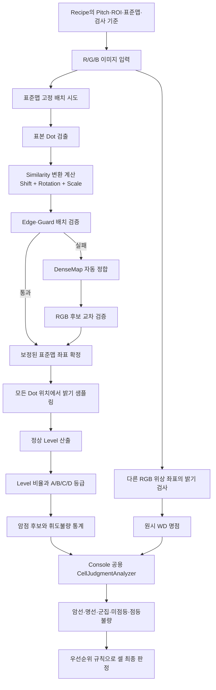

# 표준맵 Shift 보정과 Defect 검출 상세 분석

## 1. 이 문서의 결론

표준맵 검사에서 “Dot이 Shift되어도 Pitch로 찾는다”는 설명은 다음처럼 이해해야 정확하다.

1. 검사 중 Pitch를 매번 새로 계산하는 것은 아니다.
2. Recipe에 저장된 Pitch와 표준맵 좌표를 사용해 Dot이 있을 것으로 예상되는 작은 탐색창을 만든다.
3. 화면 전체에서 고르게 선택한 약 192개의 표본 Dot을 실제 영상에서 찾는다.
4. 표준맵 전체를 대상 영상에 맞추는 평행이동, 회전, 배율을 계산한다.
5. 보정된 표준맵 좌표에서 모든 Dot의 밝기를 측정한다.
6. 규칙적인 격자는 한 Pitch만큼 잘못 밀려도 겉보기에는 맞아 보일 수 있으므로, 패널 가장자리와 바깥쪽 Guard 영역을 별도로 확인한다.
7. 고정 배치가 실패하면 DenseMap 자동 정합으로 Offset 후보를 다시 찾고 RGB 영상으로 교차 검증한다.

중요한 구분은 다음과 같다.

- Glass 또는 영상 전체가 함께 밀린 전역 Shift는 표준맵 정합으로 보정한다.
- 일부 Dot만 제자리에서 벗어난 국부 Shift는 전체 표준맵을 움직여 보정하지 않는다.
- 국부 Shift Dot은 기준 위치의 밝기 저하, 위치 잔차 또는 다른 위상 위치의 비정상 발광으로 나타난다.

Defect 검출도 두 단계로 나뉜다.

- IP 검사 단계: 각 Dot의 밝기, 정상 밝기 대비 비율, A/B/C/D 등급, 원시 WD 명점 목록을 만든다.
- Console 공용 판정 단계: 암점 배열과 WD 배열을 분석해 암선, 명선, 군집성암점, 미점등, 점등불량 및 최종 셀 판정을 만든다.

즉, 모든 Defect가 단순히 “밝기 한 점이 기준보다 낮다”는 한 가지 조건으로 결정되는 구조는 아니다.

---

## 2. 전체 처리 흐름



---

## 3. Pitch는 언제 계산되는가

### 3.1 Find Pitch는 Recipe 작성 단계의 측정 기능이다

Find Pitch는 검사 영상의 R/G/B 밝은 Blob을 검출한 뒤 R 영상의 인접 Dot 간 거리를 수집한다.

개략적인 순서는 다음과 같다.

1. ROI 안의 영상을 Threshold로 이진화한다.
2. 8방향 Connected Component Labeling으로 밝은 Blob을 분리한다.
3. Area, Width, Height 조건에 맞는 Blob 중심만 남긴다.
4. 각 R Blob에서 오른쪽에 있는 가장 가까운 Blob까지의 거리를 Pitch X 표본으로 수집한다.
5. 각 R Blob에서 아래쪽에 있는 가장 가까운 Blob까지의 거리를 Pitch Y 표본으로 수집한다.
6. 거리 표본의 P10, P20, ..., P90 값을 결과창에 표시한다.
7. 선택한 값을 Recipe의 `DisplayPixelPitchCameraPixelX/Y`에 적용한다.

현재 코드의 기본 선택 Percentile은 P10이다. 하지만 결과창에서 사용자가 다른 Percentile을 선택해 적용할 수 있다.

Pitch 계산식의 의미는 단순하다.

```text
PitchX 표본 = 오른쪽 인접 Dot 중심과 현재 Dot 중심 사이의 거리
PitchY 표본 = 아래쪽 인접 Dot 중심과 현재 Dot 중심 사이의 거리
```

여기서 거리는 X 또는 Y 좌표 차이만 쓰는 것이 아니라 두 중심 사이의 유클리드 거리다.

```text
distance = sqrt((x2 - x1)^2 + (y2 - y1)^2)
```

### 3.2 실제 검사에서는 Pitch를 다시 계산하지 않는다

Test Runner에서 Run할 때는 Find Pitch를 다시 수행하지 않는다. Recipe에 확정된 Pitch를 입력값으로 사용한다.

Pitch는 주로 다음 역할을 한다.

- 표준맵 예상 위치 주변의 Dot 탐색창 크기 결정
- 배경 평탄화 Top-hat 커널 크기 결정
- 자동 정합 시 인접 Dot의 예상 위치 계산
- 격자 Index와 카메라 좌표의 관계 추정
- 한 Pitch 바깥 Guard 위치 계산 및 검증

더 중요한 점은 표준맵의 최종 좌표가 단순히 `원점 + index × Pitch`로 만들어지는 것이 아니라는 것이다.

표준맵은 양품 Cell에서 실제 측정한 각 Dot의 카메라 좌표를 보관한다. 따라서 실제 검사 좌표는 “이상적인 Pitch 격자”보다 “실측 표준맵 좌표”가 우선이다.

Pitch는 표준맵을 찾고 검증하기 위한 공간적 기준이며, 표준맵 자체를 대신하지 않는다.

---

## 4. 전역 Shift를 찾는 원리

### 4.1 첫 번째 단계: 작은 탐색창에서 표본 Dot을 찾는다

표준맵 전체를 16 × 12 구역으로 나누고, 각 구역 중심에 가장 가까운 유효 Dot을 하나씩 선택한다. 정상적인 큰 맵이면 약 192개 표본이 화면 전체와 외곽에 고르게 분포한다.

각 표본의 표준맵 좌표를 `(sx, sy)`라고 하면 최초 예상 위치는 다음과 같다.

```text
expectedX = sx + priorX
expectedY = sy + priorY
```

기본 prior는 0이다. 장비 Offset이 별도로 전달되면 그 값을 시작점으로 사용할 수 있다.

탐색창의 반폭은 다음과 같다.

```text
windowHalfX = max(3, floor(PitchX / 2 × 0.8))
windowHalfY = max(3, floor(PitchY / 2 × 0.8))
```

즉 실질적으로 약 `Pitch × 0.4` 범위를 좌우와 상하로 찾는다.

예를 들어 Pitch가 21 px이면 다음과 같다.

```text
windowHalf = floor(21 / 2 × 0.8)
           = floor(8.4)
           = 8 px
```

최초 prior에서 약 ±8 px 안에 실제 Dot이 있으면 표본 검출이 가능하다.

탐색창을 반 Pitch보다 작게 만든 이유는 이웃 Dot을 현재 Dot으로 잘못 선택하지 않기 위해서다. 한 탐색창 안에는 정상적으로 같은 위상의 참 Dot이 최대 하나만 들어오게 된다.

### 4.2 탐색창 내부의 Dot 검출

각 탐색창에는 본검사와 같은 전처리를 적용한다.

1. Pitch 기반 크기의 White Top-hat으로 완만한 배경 밝기를 제거한다.
2. Recipe의 Threshold로 이진화한다.
3. 8방향 Connected Component Labeling을 수행한다.
4. Recipe의 Area, Width, Height 범위에 맞는 Blob만 남긴다.
5. 탐색창 중심에 가장 가까운 Blob의 무게중심을 실제 Dot 중심으로 채택한다.

유효한 표본 쌍은 다음 형태가 된다.

```text
(표준맵 좌표 sx, sy) ↔ (대상 영상 실측 좌표 tx, ty)
```

유효 표본이 20개보다 적으면 보정에 실패한 것으로 보고 자동 정합 단계가 필요하다고 표시한다.

### 4.3 Shift뿐 아니라 회전과 배율도 함께 계산한다

표본 쌍이 20개 이상이면 Umeyama 계열의 Similarity 변환을 계산한다.

```text
x' = scale × (cos(theta) × x - sin(theta) × y) + shiftX
y' = scale × (sin(theta) × x + cos(theta) × y) + shiftY
```

각 항의 의미는 다음과 같다.

- `shiftX`, `shiftY`: Glass 또는 영상 전체의 평행이동
- `theta`: 카메라와 Glass 사이의 미세 회전
- `scale`: Grab 위치나 광학계에서 발생한 미세 배율 차이

단순히 X/Y Offset만 보정하지 않고 Scale까지 포함한 이유는 화면 중앙에서는 맞아도 외곽에서 수 Pixel씩 벌어지는 문제를 막기 위해서다. 코드 주석에는 Grab별 약 ±0.1% 배율 차이도 외곽에서는 약 ±5 px 오차와 명점 오검을 만들 수 있다고 기록되어 있다.

Outlier의 영향을 줄이기 위해 큰 잔차를 제거하는 Trim 계산을 최대 2회 수행한다.

### 4.4 한 번 계산하고 끝내지 않고 재탐색한다

최초 탐색창 경계에 Dot이 걸리면 검출된 표본이 한쪽으로 치우쳐 Shift 추정값도 편향될 수 있다.

따라서 다음 과정을 최대 2회 더 수행한다.

1. 현재 계산한 Shift, Rotation, Scale로 표준맵 예상 위치를 갱신한다.
2. 갱신된 위치 중심에서 표본 Dot을 다시 검출한다.
3. Similarity 변환을 다시 계산한다.
4. 이전과 새 Shift 차이가 X/Y 모두 0.5 px 이하면 수렴했다고 보고 종료한다.

이 과정 때문에 최초 prior가 실제 위치와 몇 Pixel 달라도 최종 배치는 실제 Dot 중심으로 수렴할 수 있다.

---

## 5. 한 Pitch 잘못 붙는 문제와 Edge·Guard 검증

### 5.1 규칙 격자의 근본적인 모호성

Dot 격자가 완전히 주기적이면 표준맵이 정확히 한 Pitch만큼 밀려도 내부 Dot 대부분은 다시 다른 Dot과 겹친다.

```text
정답 배치:  Dot index 100 → 실제 Dot 100
오배치:     Dot index 100 → 실제 Dot 101
```

내부 밝기만 보면 두 경우가 모두 정상처럼 보일 수 있다. 따라서 Pitch 기반 근접 검출만으로는 “몇 번째 Dot인가”를 완전히 확정할 수 없다.

### 5.2 Edge 검증

보정 후 표준맵의 위, 아래, 왼쪽, 오른쪽 마지막 유효 Dot 줄을 다시 검출한다.

각 변에서 마지막 줄 Dot의 50% 이상이 검출되고 네 변이 모두 통과하면 `edge-pass`로 배치를 확정한다.

한 Pitch 잘못 밀렸다면 한쪽 마지막 줄은 패널 밖 또는 빈 영역을 가리키므로 검출률이 크게 떨어진다.

### 5.3 Guard 검증

Edge가 실패했다고 바로 오배치로 확정하지 않는다. 실제 제품의 가장자리 Dot 줄 자체가 불량일 수도 있기 때문이다.

그래서 각 변의 바깥쪽 한 Pitch 위치를 Guard 영역으로 검사한다.

- Guard에서 검출된 Blob이 3개 미만: 실제 가장자리 불량으로 보고 `guard-clear`
- Guard에서 검출된 Blob이 3개 이상: 한 Pitch 정수배 오배치로 보고 `guard-hit`

`guard-hit`이면 고정 배치를 신뢰하지 않고 DenseMap 자동 정합으로 넘어간다.

### 5.4 자동 정합 폴백

자동 정합은 영상 전체에서 Blob을 검출해 DenseMap을 재구성한 뒤, 관측된 격자 Mask와 `map.txt`의 유효 Dot Mask를 Cross-correlation으로 비교한다.

개념적으로 다음 점수를 가장 크게 만드는 Index Shift를 찾는다.

```text
score(dx, dy)
  = 관측된 Dot Mask와 기준 유효 Dot Mask가 겹치는 개수
```

R, G, B 채널에서 각각 Offset 후보를 만들고, 후보별로 다시 세 채널 표준맵 고정 배치와 Edge·Guard 검증을 수행한다. 현재 코드는 세 채널 실행 결과가 모두 존재하고 그중 한 채널 이상이 검증을 통과한 첫 후보를 채택해 세 채널을 `fixed(realigned)`로 확정한다.

이 구조의 목적은 정상 상황에서는 빠른 표준맵 고정 배치를 사용하고, 정수 Pitch 오배치나 큰 Offset 상황에서만 비용이 큰 전체 DenseMap 검출을 수행하는 것이다.

---

## 6. 전역 Shift와 국부 Dot Shift는 다르다

### 6.1 전역 Shift

많은 표본 Dot이 같은 방향으로 함께 이동하면 Similarity 변환이 이를 Glass 또는 촬영계의 위치 변화로 해석한다.

```text
모든 Dot이 대략 (+6 px, -2 px) 이동
→ 표준맵 전체를 (+6 px, -2 px) 이동
→ 각 Dot의 밝기를 이동된 기준 위치에서 측정
```

이 경우는 Defect가 아니라 좌표계 정합 문제이므로 보정하는 것이 맞다.

### 6.2 일부 Dot만 이동한 국부 Shift

일부 Dot만 이동하면 다수 표본으로 계산한 전체 변환은 거의 바뀌지 않는다.

```text
대부분의 Dot: 정상 위치
한 개 Dot: 오른쪽으로 5 px 이동
→ 전체 표준맵은 정상 위치 유지
→ 해당 Dot의 기준 위치에서 밝기 감소
```

표준맵 모드의 최종 Level은 검출된 Blob 중심이 아니라 보정된 표준맵 좌표에서 샘플링한다. 따라서 국부적으로 이동한 Dot을 따라가서 정상으로 만들어 주지 않는다.

이 설계는 위치가 틀어진 Dot을 양품 밝기로 잘못 판정하지 않기 위한 것이다.

국부 Shift의 결과는 이동 방향과 크기에 따라 달라진다.

- 이동량이 작아 7 × 7 Gaussian 샘플 영역 안에 남음: Level이 일부 낮아진다.
- 이동량이 커서 기준 샘플 영역에서 벗어남: 기준 위치가 암점 또는 D 등급이 된다.
- 이동한 빛이 다른 RGB 위상 기준 위치에 들어감: Cross-channel 검사에서 명점 WD가 될 수 있다.
- 표본으로 선택된 Dot이면 실측 위치와 변환 위치 차이가 `PositionTolerancePx`를 넘을 때 위치 이탈 통계에 잡힐 수 있다.

주의할 점은 현재 코드에 “국부 위치 Shift”라는 독립적인 최종 Defect 종류는 없다는 것이다. 위치 잔차는 표준맵 정합 진단 통계이며, 고객 Defect 판정은 주로 밝기 저하나 WD 결과로 나타난다.

또한 표준맵 고정 배치 경로는 전체 Blob 목록을 만들지 않으므로, 아무 위상 좌표에도 걸리지 않는 임의 위치의 국부 발광점이 항상 명점으로 회수된다고 보장할 수 없다.

---

## 7. Dot 밝기 Level 계산

### 7.1 샘플 위치

모든 유효 Dot에 대해 보정된 표준맵 좌표를 계산한다.

```text
sampleX = scale × (cos(theta) × stdX - sin(theta) × stdY) + shiftX
sampleY = scale × (sin(theta) × stdX + cos(theta) × stdY) + shiftY
```

그 좌표에서 기본적으로 7 × 7 Gaussian 가중 샘플링을 수행한다.

1차원 가중치는 다음과 같다.

```text
[1, 6, 15, 20, 15, 6, 1]
```

2차원 가중치는 X와 Y 가중치의 외적으로 만들어지며 전체 가중치 합은 4096이다. 기본 모드는 Sub-pixel 좌표를 반영하는 Bilinear 방식이다.

따라서 중앙 Pixel의 영향이 가장 크고 멀어질수록 영향이 작아진다.

### 7.2 정상 밝기 Normal Level

ROI 안의 양수 Level들을 정렬하고 Recipe의 `NormalLevelPercentile`에 해당하는 값을 정상 밝기로 사용한다.

기본값은 P90이다.

```text
NormalLevel = Percentile(모든 유효 Dot Level, 90)
```

평균이 아니라 높은 Percentile을 쓰는 이유는 많은 암점이 섞여도 정상 발광군의 밝기를 기준으로 유지하기 위해서다.

### 7.3 상대 밝기 비율

상대 모드에서는 각 Dot의 밝기 비율을 다음과 같이 계산한다.

```text
LevelRatioPercent = DotLevel / NormalLevel × 100
```

코드 기본 등급은 다음과 같다.

| 등급 | 기본 조건 |
|---|---:|
| A | 비율 50% 이상 |
| B | 비율 30% 이상, 50% 미만 |
| C | 비율 10% 이상, 30% 미만 |
| D | 비율 10% 미만 |

이 값들은 고정 상수가 아니라 Recipe의 검사 패턴별 `GradeSpec` 값이다.

`UseAbsoluteLevel=true`이면 비율 대신 측정된 Gray Level 절대값을 A/B/C 기준과 비교한다. 이때 등급 계산에는 Normal Percentile을 사용하지 않는다.

### 7.4 Grade와 Defect Type

IP의 개별 Defect 목록은 다음 순서로 결정된다.

```text
밝기 → Grade → Grade에 연결된 Type → 검사 대상으로 선택된 Type인가
```

기본 매핑은 다음과 같다.

| Grade | 기본 Type | 기본 Defect 포함 |
|---|---|---|
| A | OK | 아니오 |
| B | OK | 아니오 |
| C | Repair | 예 |
| D | Reject | 예 |

그러나 셀 판정기의 `DARK_POINT` 입력은 현재 `Missing 또는 D 등급`만 사용한다. C 등급처럼 Defect Type에는 포함되지만 D가 아닌 Dot은 `DarkDotCount`, 즉 휘도불량 통계로만 집계되며 현재 셀 대표 판정 규칙에는 사용되지 않는다.

따라서 “IP Defect 개수”와 “셀 판정의 암점 개수”는 같지 않을 수 있다.

---

## 8. Defect별 실제 검출 로직

### 8.1 암점 DARK_POINT

암점의 원시 Mask는 다음 Dot들이다.

```text
DarkDot = IsMissingPoint 또는 Grade D
```

표준맵 고정 배치는 모든 기준 좌표에서 Level을 강제로 샘플링하므로, Dot이 보이지 않아도 좌표 행 자체가 사라지지 않는다. 기준 위치의 Level이 거의 0이 되어 D 등급으로 나타나는 방식이다.

이후 다음 항목에 포함된 Dot은 개별 암점에서 제외된다.

1. 암선에 속한 Dot
2. RGB 채널의 군집성암점에 속한 Dot

남은 Dot 수가 `DARK_POINT` 개수다.

기본 셀 판정 규칙은 개별 암점 4개 이상일 때 `R/P`다. 암점이 1~3개뿐이고 다른 상위 Defect가 없다면 기본 규칙상 셀 판정은 OK가 될 수 있다.

### 8.2 암선 DARK_LINE

R, G, B 각 채널의 암점 좌표를 행과 열로 각각 그룹화한다.

한 행 또는 한 열이 암선이 되는 조건은 두 조건의 OR 결합이다.

```text
조건 1: 연속된 암점이 MinConsecutiveDefects개 이상
조건 2: 해당 행/열 전체 길이 대비 암점 비율이 MinDefectRatioPercent 이상
```

코드 기본값은 다음과 같다.

```text
MinConsecutiveDefects = 20
MinDefectRatioPercent = 50%
```

예를 들어 한 행의 전체 길이가 100 Dot이면 다음 중 하나만 만족해도 암선이다.

- 연속 암점이 20개 이상
- 위치가 띄엄띄엄이어도 그 행에 암점이 50개 이상

가로선은 같은 Y의 X 배열을 검사하고, 세로선은 같은 X의 Y 배열을 검사한다.

암선으로 판정된 행 또는 열의 암점은 개별 암점과 RGB 군집 검사에서 제외된다. 하나의 교차 형태는 가로선 1개와 세로선 1개로 각각 집계될 수 있다.

암선 1개 이상이면 기본 셀 판정은 `R/J`다.

### 8.3 군집성암점 CLUSTER_DARK_POINT

암선을 제거한 뒤 남은 암점 Mask에서 8방향 Connected Component Labeling을 수행한다.

8방향은 상하좌우뿐 아니라 대각선으로 닿은 Dot도 같은 군집으로 본다는 뜻이다.

RGB 경로:

- R, G, B 각 채널을 별도로 검사
- 연결된 암점이 기본 10개 이상이면 군집 1건

W 경로:

- 같은 `(X, Y)`에서 R, G, B가 모두 암점인 교집합 Mask 생성
- W 영상을 사용하는 것이 아니라 RGB 결과로 “완전히 꺼진 Dot”을 유도
- 연결된 완전 꺼짐 Dot이 기본 5개 이상이면 군집 1건
- R/G/B 채널 중 하나라도 미점등 또는 점등불량으로 Skip되면 W 군집 검사를 하지 않음

```text
WhiteMask = DarkMaskR ∩ DarkMaskG ∩ DarkMaskB
```

`CLUSTER_DARK_POINT` 개수는 군집 안의 Dot 총수가 아니라 검출된 Connected Component의 개수다. RGB 군집과 W 군집은 같은 유형 코드로 합산된다.

기본 셀 판정은 군집 1건 이상이면 `R/P`다.

### 8.4 명점 BRIGHT_POINT

명점은 현재 채널의 정상 Dot이 단순히 밝다는 뜻이 아니다. R 패턴을 촬영했는데 G 또는 B 위치에서도 비정상적으로 빛이 보이는 것처럼, 다른 RGB 위상 위치의 발광을 찾는 Cross-channel 검사다.

예를 들어 R 패턴 영상을 검사할 때 다음을 수행한다.

1. G 패턴 검사 결과가 가진 모든 G 표준맵 좌표를 가져온다.
2. 그 G 좌표들을 현재 R 영상에서 7 × 7 Gaussian 샘플링한다.
3. G 채널의 Normal Level과 비교한다.
4. 비율이 `WhiteDefect.ThresholdPercent` 이상이면 WD 명점 후보로 만든다.
5. B 좌표에 대해서도 같은 작업을 한다.

```text
WD ratio = 현재 Pattern 영상에서 다른 Phase 좌표의 Level
           / 다른 Phase의 NormalLevel
           × 100
```

Recipe 기본 Threshold는 50%다.

누락 Dot처럼 개별 Normal Level이 없는 Anchor는 해당 채널 Normal Level들의 평균을 대신 사용한다.

IP는 이 단계에서 개별 WD 목록만 만든다. Console 판정기가 명선으로 승격되지 않은 WD를 최종 `BRIGHT_POINT`로 센다.

기본 셀 판정은 명점 1개 이상이면 `R/J`다.

표준맵을 사용하지 않는 DenseMap 검출 경로에서는 격자 검증에서 탈락한 밝은 Off-grid Blob도 WD Threshold를 만족하면 명점으로 회수할 수 있다. 이미 Cross-channel WD와 카메라 거리 3 px 이내이면 같은 물리점으로 보고 중복 회수하지 않는다.

표준맵 고정 배치 경로에는 전체 Off-grid Blob 목록이 없으므로 이 추가 회수는 적용되지 않는다.

### 8.5 명선 BRIGHT_LINE

IP가 만든 WD 명점 좌표를 암선과 같은 행/열 Line 알고리즘에 넣는다.

```text
조건 1: 한 행/열에서 연속 WD가 기본 20개 이상
조건 2: 한 행/열 전체 길이 대비 WD 비율이 기본 50% 이상
```

둘 중 하나를 만족하면 그 행 또는 열을 명선으로 분류한다.

명선 주변에는 동일 현상으로 많은 WD 점이 생길 수 있으므로 개별 명점 통계를 정리할 때 `AbsorbRadius`를 사용한다. 기본값은 6 Dot이다.

- 가로 명선의 Y에서 ±6 이내에 있는 WD는 개별 명점에서 제외
- 세로 명선의 X에서 ±6 이내에 있는 WD는 개별 명점에서 제외

이 Absorb는 검출 판정을 완화하기 위한 값이 아니라 Report에서 명선 주변의 중복 명점 노이즈를 줄이기 위한 값이다.

명선 1개 이상이면 기본 셀 판정은 `R/J`다.

### 8.6 미점등 MISSING_LIGHTING

미점등은 Dot 하나의 Defect가 아니라 Pattern 또는 채널 전체의 상태다.

먼저 유효 Dot 비율을 계산한다.

```text
ValidPercent
  = (TotalDotCount - DarkDotCount) / TotalDotCount × 100

여기서 DarkDotCount
  = Missing 또는 Grade D인 Dot 수
```

코드 기본 기준은 다음과 같다.

```text
ValidPercent < 10%
→ MISSING_LIGHTING
```

예를 들어 총 100,000 Dot 중 유효 Dot이 8,000개뿐이면 유효율은 8%이므로 해당 R/G/B Pattern은 미점등이다.

미점등 Pattern은 개별 암점, 암선, 군집, 명점 집계를 건너뛴다. 화면 전체가 꺼진 상태를 수만 개 암점으로 보고하지 않고 원인에 가까운 하나의 상태로 요약하려는 설계다.

미점등 채널 1개 이상이면 기본 셀 판정은 `R/J`다.

이미지 소스 자체가 없어 검사하지 못한 Cell도 채널별 `TotalDotCount=0`으로 공용 판정기에 입력되어 미점등으로 처리된다. 이 경우에는 별도의 `MISSING_SOURCE` Condition Issue도 함께 사용된다.

### 8.7 점등불량 LIGHTING_FAIL

미점등은 아니지만 Pattern 전체의 발광 상태가 정상적이지 않을 때 점등불량으로 분류한다.

미점등 검사를 먼저 통과한 뒤 다음 세 조건 중 하나라도 만족하면 점등불량이다.

```text
조건 1: 전체 Dot의 평균 Level < MinAverageLevel
조건 2: ValidPercent < LightingFail.MinValidPixelPercent
조건 3: 해당 Pattern의 명선 개수 >= MinWhiteLineCount
```

코드 기본값은 다음과 같다.

```text
MinAverageLevel = 100
MinValidPixelPercent = 50%
MinWhiteLineCount = 10
```

따라서 기본 구간은 다음처럼 해석할 수 있다.

| 유효 Dot 비율 | 기본 상태 |
|---:|---|
| 10% 미만 | 미점등 |
| 10% 이상, 50% 미만 | 점등불량 |
| 50% 이상 | 다른 평균 Level 및 명선 조건 확인 |

유효율이 50% 이상이어도 전체 Dot 평균 Gray Level이 100 미만이면 점등불량이다.

또한 WD Line이 한 Pattern에서 10개 이상이면 개별 명선 다발보다 전원, 구동 또는 Pattern 점등 계통의 문제로 해석해 점등불량으로 승격한다.

여기서 `MinWhiteLineCount=10`은 WD Dot 10개가 아니라 검출된 가로 명선 수와 세로 명선 수의 합이 10개 이상이라는 뜻이다.

점등불량 Pattern도 개별 Defect 집계를 대부분 건너뛴다. 다만 원인 파악을 위해 이미 검출한 명선 개수와 상세 위치는 결과에 유지한다.

점등불량 채널 1개 이상이면 기본 셀 판정은 `R/J`다.

---

## 9. Defect 간 우선순위

분석 결과에 여러 Defect가 동시에 존재할 수 있지만 셀 대표 판정은 설정 파일의 규칙 순서에서 처음 만족한 항목 하나로 결정된다.

코드 기본 순서는 다음과 같다.

| 우선순위 | Defect | 최소 개수 | 셀 판정 |
|---:|---|---:|---|
| 1 | MISSING_LIGHTING | 1 | R/J |
| 2 | LIGHTING_FAIL | 1 | R/J |
| 3 | BRIGHT_LINE | 1 | R/J |
| 4 | DARK_LINE | 1 | R/J |
| 5 | BRIGHT_POINT | 1 | R/J |
| 6 | CLUSTER_DARK_POINT | 1 | R/P |
| 7 | DARK_POINT | 4 | R/P |
| - | 어떤 규칙도 불충족 | - | OK |

예를 들어 암점 20개와 명선 1개가 동시에 있으면 대표 Type은 `BRIGHT_LINE`, 셀 판정은 `R/J`다. 암점 정보가 삭제되는 것이 아니라 대표 판정만 우선순위가 높은 항목으로 정해진다.

운영값은 `<WorkDir>/Config/cell-judgment.yaml`에 저장된다. 위 표는 코드의 기본값이며, 실제 장비 파일이 수정되었다면 장비 파일의 값이 우선한다.

---

## 10. 설정값이 각 Defect에 미치는 영향

| 설정 | 영향 |
|---|---|
| Recipe Pitch X/Y | 표준맵 Dot 탐색창, Top-hat 크기, 자동 정합의 격자 간격 |
| Recipe Threshold | 표준맵 표본과 Blob 검출 민감도 |
| Recipe Area/Width/Height | Dot으로 인정할 Blob 형상 |
| Recipe NormalLevelPercentile | 상대 밝기 100% 기준 |
| Recipe Grade A/B/C 기준 | Dot 등급과 D 암점 Mask |
| Recipe UseAbsoluteLevel | 비율 등급과 절대 Gray 등급 전환 |
| Recipe Grade-Type 정책 | IP Defect 목록에 포함할 Grade/Type |
| Recipe WhiteDefect.ThresholdPercent | 다른 RGB 위상 발광을 WD로 인정하는 기준 |
| cell-judgment missingLighting | 미점등 유효율 기준 |
| cell-judgment lightingFail | 평균 Level, 유효율, 명선 다발 기준 |
| cell-judgment line | 암선과 명선의 연속 개수 및 비율 |
| cell-judgment cluster | RGB/W 군집 최소 Dot 수 |
| cell-judgment judgment.rules | 최종 셀 판정 우선순위와 최소 개수 |

이 중 검사 Pattern 탭의 밝기·Grade 관련 값과 `cell-judgment.yaml`의 셀 판정 기준은 역할이 다르다.

- Recipe: 한 Dot을 어떻게 측정하고 등급화할지 결정
- cell-judgment.yaml: 등급화된 Dot들의 공간적 배열과 채널 전체 상태를 어떻게 해석할지 결정

---

## 11. 장비 개발자 관점에서 본 설계 의도

### 11.1 정합과 불량 판정을 분리

Glass 전체가 조금 이동한 것은 장비 정렬 오차이지 제품의 모든 Dot이 위치불량인 것은 아니다. 먼저 전역 좌표를 맞춘 뒤 남은 국부 밝기 이상을 Defect로 보는 것이 오검을 줄인다.

### 11.2 정상 경로는 빠르게, 이상 상황은 강하게 검증

매 Cell마다 전체 DenseMap을 다시 만들면 검사 시간이 커진다. 정상적인 Cell은 약 192개 표본으로 빠르게 정합하고, Edge·Guard가 의심을 제기할 때만 전체 자동 정합을 수행한다.

### 11.3 주기 격자의 구조적 약점을 제품 가장자리로 해결

내부 격자만으로는 한 Pitch 오배치를 구분할 수 없다. 패널이 유한하다는 비주기 정보, 즉 마지막 줄과 바깥쪽 빈 공간을 이용해 절대 위치를 검증한다.

### 11.4 전체 점등 이상을 수만 개 Dot 불량으로 보고하지 않음

한 채널이 거의 꺼졌는데 모든 Dot을 암점으로 기록하면 결과가 과도하게 커지고 실제 원인도 가려진다. 그래서 미점등과 점등불량을 먼저 판정하고 하위 개별 집계를 Skip한다.

### 11.5 IP와 Console의 책임 분리

IP는 영상과 가장 가까운 원시 정보인 Level, Grade, WD를 만든다. Console, Export, Verifier는 동일한 공용 판정기를 사용해 고객 Defect 유형과 셀 판정을 만든다.

이 구조는 검사 알고리즘을 바꾸지 않고도 장비별 판정 기준과 우선순위를 `cell-judgment.yaml`로 조정하려는 의도로 볼 수 있다.

---

## 12. 해석할 때 주의할 점

1. “Pitch를 계산해 Shift를 찾는다”와 “검사마다 Pitch를 재계산한다”는 같은 뜻이 아니다.
2. 표준맵 모드는 실측 표준맵 좌표가 기준이고 Pitch는 탐색과 검증을 돕는다.
3. 전역 Shift는 보정하지만 국부 Dot Shift는 정상 위치로 따라가 주지 않는다.
4. Position residual은 현재 독립 고객 Defect가 아니라 정합 진단값이다.
5. 명점은 단순 고휘도 Dot이 아니라 다른 RGB 위상 위치에서 나타난 비정상 발광인 WD다.
6. C 등급은 기본 정책상 IP Defect가 될 수 있지만 셀 판정의 `DARK_POINT`는 D 또는 Missing만 사용한다.
7. 미점등과 점등불량은 Dot 단위가 아니라 Pattern/채널 단위 상태다.
8. 명선과 암선의 비율 조건은 연속성 없이도 발동할 수 있다.
9. `MinWhiteLineCount`는 WD Point 수가 아니라 검출된 Line 수다.
10. 실제 장비의 `cell-judgment.yaml`이 기본값과 다르면 실제 파일이 최종 기준이다.

---

## 13. 확인해야 할 핵심 코드

코드를 처음부터 모두 읽기보다 다음 순서로 확인하는 것이 좋다.

1. `uLedInspection.Algorithms/FindPitchEstimator.cs`
   - Recipe 작성 시 Pitch가 어떻게 측정되는지
2. `uLedInspection.Algorithms/CorrectedDenseMapInspector.cs`
   - 표준맵 고정 배치, Similarity 정합, Edge·Guard 검증, Level과 Grade
3. `uLedIp/Inspection/PointGridInspectionAlgorithm.cs`
   - RGB 결과 조립, Cross-channel WD, Grade-Type 정책
4. `uLed.Contracts/Judgment/CellJudgmentAnalyzer.cs`
   - 미점등, 점등불량, 선, 군집, 개별 점 분류
5. `uLed.Contracts/Judgment/CellJudgeEvaluator.cs`
   - 유형별 개수와 우선순위로 최종 셀 판정
6. `uLed.Contracts/Models/CellJudgmentModels.cs`
   - 판정 기본값과 Defect 코드 정의

---

## 14. R 기준 G/B 좌표 파생과 다른 Sub Dot 오인 가능성

이 절은 다음 질문을 현재 Docs, 현재 코드, 실제 운영 로그로 두 번 교차 검증한 결과다.

> R 좌표를 기준으로 G/B Dot을 찾을 때 탐색 범위는 무엇이며, Shift된 G/B나 이웃 Dot의 G/B를 잘못 찾을 가능성을 어떻게 제어하는가?

여기서는 서로 다른 동작을 모두 “찾는다”라고 부르지 않고 다음 세 가지로 구분한다.

1. R 표준맵에서 G/B 기준좌표를 만드는 **좌표 파생**
2. 각 채널 영상에서 표준맵의 전역 변환을 구하는 **고정 배치 정합**
3. 다른 채널 좌표에서 밝기를 읽어 명점을 판단하는 **Cross-channel WD 측정**

### 14.1 먼저 바로잡아야 할 핵심 개념

현재 표준맵 경로에서 R Dot 하나가 주변을 검색해 G Dot과 B Dot을 하나씩 연결하는 로직은 없다.

- `std_map.csv`에는 R 채널 좌표만 저장한다.
- 같은 final index `i`의 G/B 기준좌표는 Recipe의 RGB phase offset을 R 좌표에 더해 계산한다.
- 그다음 R 영상, G 영상, B 영상은 각자 자신의 파생 표준맵으로 독립 정합한다.
- 명점 검출은 다른 채널의 확정 좌표에서 밝기를 측정하며, 주변에서 가장 가까운 밝은 Blob을 다시 찾지 않는다.

코드의 좌표식은 다음과 같다.

```text
R_i = std_map.csv에 저장된 final index i의 좌표

G_i = R_i + (GFromR.Dx, GFromR.Dy)
B_i = R_i + (BFromR.Dx, BFromR.Dy)
```

`StandardDenseMapChannel.WithOffset()`은 모든 index에 대해 위 덧셈만 수행한다. 이 단계에는 Search Radius, Blob 탐색, 최근접 Dot 선택이 없다.

즉, “R 기준으로 G/B를 찾는다”의 정확한 의미는 다음과 같다.

> R의 깨끗한 좌표 배열을 기준 배열로 사용하고, 표준맵을 만들 때 같은 final index끼리 측정한 채널 phase offset을 더해 G/B 기준좌표 배열을 만든다.

### 14.2 GFromR/BFromR 값은 이웃 Dot 검색으로 만들지 않는다

표준맵 생성 시에도 채널 간 대응은 거리상 가장 가까운 Dot을 새로 찾는 방식이 아니다.

`StandardMapBuilder.ComputeChannelMedianOffset()`은 다음 조건을 만족하는 **같은 final index**만 짝지어 사용한다.

```text
GFromR 후보_i = G_i의 실측 좌표 - R_i의 실측 좌표
BFromR 후보_i = B_i의 실측 좌표 - R_i의 실측 좌표
```

그 후 각 후보의 X/Y 중앙값을 phase offset으로 저장한다. `FindPitchEstimator.EstimatePhaseOffsetByDenseIndex()`도 같은 dense index 기준의 차이를 이용한다.

따라서 phase offset 작성 단계와 검사 단계 모두 “R 주변에서 아무 G/B나 찾아 연결”하는 구조가 아니다.

### 14.3 실제로 범위가 사용되는 위치

| 동작 | 기준 좌표 | 현재 범위 | 주변 Blob 선택 여부 |
|---|---|---:|---|
| R에서 G/B 표준좌표 파생 | 같은 final index의 R 좌표 | 범위 없음. Recipe offset을 정확히 더함 | 없음 |
| 채널별 고정 배치 정합 | 해당 채널의 파생 표준좌표 | 각 축 `±max(3, floor(Pitch / 2 × 0.8))` px | 있음 |
| 정합 후 Dot Level 측정 | 변환된 해당 채널 좌표 | 중심 주위 Gaussian 7×7 footprint | 없음 |
| Cross-channel WD 측정 | 다른 RGB 결과의 확정 좌표 | 중심 주위 Gaussian 7×7 footprint | 없음 |
| 자동 매칭 폴백 | DenseMap의 예측 좌표 | 현재 Recipe의 `SearchRadius` 등 자동 매칭 설정 | 있음 |

여기서 가장 중요한 구분은 다음과 같다.

- `±0.4 Pitch`에 해당하는 고정 배치 창은 **표준맵의 전역 Shift·회전·배율을 추정하기 위한 표본 Blob 탐색 창**이다.
- Gaussian 7×7은 **주어진 좌표의 밝기를 계산하는 측정 footprint**다.
- 7×7 범위 안에서 가장 밝거나 가장 가까운 다른 Dot을 고르는 탐색은 아니다.
- `SearchRadius`, `MapShiftMargin`, `StandardMapMaxSearchMargin`은 정상적인 Cross-channel WD 측정 범위가 아니라 자동 매칭 폴백 경로의 설정이다.

### 14.4 현재 운전 Recipe 수치로 본 실제 위치 관계

2026-07-28 실제 검사 결과에 저장된 `recipe_snapshot.json`의 값은 다음과 같다.

| 항목 | 값 |
|---|---:|
| Pitch X | 20.8250 px |
| Pitch Y | 20.8259 px |
| GFromR | `(7.5555, -0.4419)` px |
| BFromR | `(14.6807, -0.8916)` px |
| Position tolerance | 1.5 px |
| 자동 매칭 Search radius | 10 px |
| White defect threshold | 50% |

X축만 단순화하면 한 Pitch 안의 위치 관계는 다음과 같다.

```text
R_i                 G_i                 B_i                R_(i+1)
0 px                7.556 px            14.681 px          20.825 px
|------ 7.556 -------|------ 7.125 ------|------ 6.144 ------|
```

현재 Pitch X에서 고정 배치 탐색 창의 반폭은 다음과 같다.

```text
floor(20.8250 / 2 × 0.8) = floor(8.3300) = 8 px
```

따라서 각 표본의 Blob 탐색 창은 X축 기준 예상좌표의 `-8 px`부터 `+8 px`까지다.

### 14.5 같은 Phase의 이웃 Dot과 다른 Phase의 Sub Dot은 구분해서 봐야 한다

#### 같은 Phase의 이웃 Dot

R_i와 R_(i+1), G_i와 G_(i+1), B_i와 B_(i+1)의 간격은 약 20.825 px다.

고정 배치 창의 반폭 8 px는 Pitch의 절반 약 10.413 px보다 작다. 따라서 예상좌표를 중심으로 한 정상적인 창 안에 바로 옆 **같은 Phase Dot**이 들어오지 않는다.

이 조건이 문서에서 말하는 “한 창에 같은 격자의 Dot이 하나만 들어오도록 제한한다”의 정확한 의미다.

#### 다른 Phase의 Sub Dot

현재 Recipe에서 인접한 R/G/B phase 간 거리는 약 6.144~7.556 px다. 이 값은 고정 배치 반폭 8 px 안에 들어온다.

따라서 다음 두 사실을 동시에 이해해야 한다.

1. 정상 G 영상에서는 파생된 `G_i` 좌표가 창의 중심이므로 정상 G Dot이 가장 가까운 후보가 된다.
2. 그러나 해당 영상에 다른 phase가 밝게 존재하고 정상 phase가 없거나 크게 벗어난 비정상 상황에서는 다른 phase Blob도 창 안의 유효 후보가 될 수 있다.

`TrySpotDetectDot()`은 다음 순서로 후보를 선택한다.

1. 예상좌표 중심의 고정 창을 자른다.
2. Top-hat과 Threshold를 적용한다.
3. Connected Component를 만든다.
4. Area, Width, Height 조건을 통과시킨다.
5. 유효 Blob 중 창 중심에 가장 가까운 Blob을 선택한다.

이 함수에는 “이 Blob은 R/G/B 중 어느 phase인가”를 판별하는 검사가 없다. 검사 Gray 영상도 pattern type별 색 식별 영상이 아니라 B/G/R 중 최댓값을 사용한 Gray 영상이다.

따라서 “창이 Pitch 절반보다 작으므로 무조건 다른 RGB phase를 고를 수 없다”는 설명은 현재 코드와 맞지 않는다. 정확한 설명은 다음과 같다.

> 같은 phase의 바로 옆 논리 Dot은 창에서 배제되지만, 한 Pitch 안의 다른 RGB sub dot phase는 현재 수치상 창 안에 들어올 수 있다. 정상 동작은 Pattern 분리와 phase offset 중심좌표에 의존하며, Blob 검출기 자체에는 phase identity 판별이 없다.

### 14.6 Shift 종류별 실제 처리

| 입력 상태 | 현재 코드의 처리 |
|---|---|
| R/G/B가 같은 양만큼 전체 Shift | 각 채널 정합이 같은 계열의 translation을 측정하고, 배치 사다리가 공통 cell prior로 채널을 맞춘다. |
| 채널별 측정 중심 차이가 1 px 이하 | 이미 서로 맞는 것으로 간주한다. |
| 채널별 측정 중심 차이가 1 px 초과 | 대표 anchor의 cell offset을 prior로 해당 채널의 고정 배치를 다시 수행한다. |
| 일부 Dot/일부 Line만 다른 위치 또는 다른 phase에서 점등 | 약 192개 표본과 residual trim을 이용하는 전역 similarity 정합이 다수 격자를 기준으로 변환을 구한다. 개별 이상은 최종 Level/Dark 또는 Cross-channel WD 후보에 반영될 수 있다. |
| 채널 전체가 다른 phase만큼 일관되게 이동 | 현재 고정 배치 창 안에서 20개 이상의 일관된 대응이 만들어지면 그 이동을 채널 translation으로 채택할 수 있다. 현재 코드에는 phase-signature 거부가 없다. |

마지막 행은 추정이 아니라 `PointGridInspectionAlgorithm.ApplyStandardMapPlacementLadder()`의 현재 주석과 동작에서 확인되는 구현 조건이다.

- 2026-07-14 변경 주석에 phase-signature 거부를 제거했다고 명시돼 있다.
- 코드가 전제로 두는 운전 조건은 “패턴 전체가 다른 phase로 이동하는 wrong-phase는 존재하지 않고, wrong-phase는 Dot 또는 일부 Line의 국소 현상”이다.
- 고정 배치 재실행이 성공하면 측정된 similarity를 다시 채택한다.
- 재실행 후 채널 간 중심차가 1 px 이하인지 다시 강제로 거부하는 최종 검사는 없다.

즉, 현재 구현은 전체 패턴의 phase identity를 영상에서 증명하는 구조가 아니라, 정상적인 Pattern 점등과 Recipe phase offset이 맞다는 운전 전제를 사용한다.

### 14.7 Edge/Guard가 막는 것과 막지 않는 것

Edge·Guard 검증은 변환된 표준맵 가장자리와 바깥쪽 guard 위치의 점등 관계를 검사해 한 Pitch 단위의 격자 오정합을 찾아낸다.

이 검증이 주로 막는 것은 다음과 같다.

- 표준맵이 한 행 또는 한 열 밀린 경우
- 한 Pitch에 가까운 정수 격자 alias
- 가장자리 Dot과 바깥 guard의 점등 상태가 뒤바뀐 경우

반면 R/G/B phase 간 약 6~8 px 이동 자체를 색상 identity로 판별하는 검사는 아니다. 현재 코드 주석에서도 phase-signature 거부가 제거됐다고 명시한다.

### 14.8 Cross-channel WD는 다른 G/B를 찾아 이동하지 않는다

명점 검출의 Cross-channel WD 단계는 고정 배치 Blob 탐색과 다르다.

예를 들어 현재 G 영상을 검사할 때:

1. R 결과에 저장된 각 Dot의 확정 카메라 좌표를 anchor로 가져온다.
2. 현재 G Gray 영상의 **그 좌표 그대로** Gaussian 7×7 Level을 측정한다.
3. B 결과 좌표도 같은 방식으로 측정한다.
4. 측정 Level을 해당 anchor의 Normal Level과 비교한다.
5. 비율이 `WhiteDefect.ThresholdPercent` 이상이면 WD 후보를 만든다.

Gaussian 7×7의 1차원 가중치는 다음과 같다.

```text
[1, 6, 15, 20, 15, 6, 1]
```

2차원 가중치 합은 4096이며, 현재 기본은 sub-pixel 좌표에서 bilinear sampling을 사용한다.

이 단계에는 다음 동작이 없다.

- 중심에서 Search Radius만큼 주변 Blob 검색
- 가장 밝은 Dot으로 중심 이동
- 가장 가까운 G/B Dot으로 index 교체
- 이웃 final index로 재연결

따라서 R anchor가 “주변의 다른 G/B를 찾아가서” WD가 되는 것은 아니다. 다만 Recipe phase offset이나 앞 단계의 채널 정합이 잘못돼 anchor 좌표 자체가 다른 밝은 phase 위에 놓인 경우에는 그 좌표의 밝기를 그대로 읽는다. 비율 조건까지 만족하면 WD로 기록된다.

### 14.9 현재 구현이 오인을 줄이는 장치

현재 코드에서 확인되는 장치는 다음과 같다.

1. **같은 final index 기반 phase offset**
   - G/B 기준좌표를 최근접 검색으로 만들지 않는다.
2. **Pattern별 독립 영상**
   - 정상 검사에서는 R, G, B 점등 영상을 분리해 입력한다.
3. **창 중심 우선**
   - 정상 phase의 파생좌표가 검색 창 중심이고, 가장 가까운 유효 Blob을 선택한다.
4. **다수 표본의 전역 정합**
   - 약 16×12 표본을 사용하며 최소 20개 대응이 필요하다.
5. **Residual trim**
   - 일부 국소 이상을 전체 similarity 계산에서 제거한다.
6. **RGB 배치 사다리**
   - 채널 중심 차이가 1 px보다 크면 대표 cell offset으로 다시 배치한다.
7. **Edge·Guard**
   - 정수 Pitch 단위의 잘못된 격자 배치를 검증한다.
8. **Cross-channel WD**
   - 다른 phase가 켜진 밝기 이상을 확정 좌표에서 별도 측정한다.

### 14.10 현재 구현에서 명시적으로 남아 있는 한계와 전제

다음 내용은 개선 제안이 아니라 현재 코드가 실제로 갖는 경계다.

1. Blob 검출에는 R/G/B phase identity 판정이 없다.
2. 검사 Gray는 색상별 분광 판별값이 아니라 `max(B,G,R)`이다.
3. 현재 Recipe에서는 다른 sub dot phase가 고정 배치 창 안에 들어올 수 있다.
4. 배치 사다리는 1 px 초과 차이를 재실행하지만, 성공한 재실행 결과를 다시 1 px 기준으로 최종 거부하지 않는다.
5. Edge·Guard는 Pitch alias 검증이며 RGB phase identity 검증이 아니다.
6. 코드가 명시한 운전 전제는 패턴 전체 wrong-phase가 아니라 국소 wrong-phase만 발생한다는 것이다.

따라서 질문에 대한 최종 답은 다음과 같다.

> 범위는 있다. 채널별 고정 배치의 Blob 탐색 범위는 현재 Recipe에서 예상좌표 기준 각 축 ±8 px다. 같은 phase의 옆 Dot은 약 20.825 px 떨어져 있어 이 창에 들어오지 않지만, 다른 RGB sub dot phase는 약 6.144~7.556 px 떨어져 있어 창 안에 들어올 수 있다. 정상 시에는 G/B 파생좌표가 각 창의 중심이고 Pattern 영상이 분리돼 있어 정상 phase를 선택한다. 그러나 검출기 자체에는 phase identity 판정이 없으므로, 전체 채널이 다른 phase로 일관되게 점등되는 비정상 입력까지 알고리즘적으로 완전 배제하는 구조는 아니다. Cross-channel WD 단계는 주변을 검색하지 않고 다른 채널의 확정 좌표에서 7×7 밝기만 측정한다.

### 14.11 두 번의 검증 결과

#### 검증 1: Docs에서 시작해 좌표 생산 경로를 코드로 순방향 확인

확인 순서는 다음과 같다.

1. 기존 기술 문서의 R 단일 표준맵과 G/B phase offset 설명
2. `StandardMapBuilder`의 같은 final index 채널 offset 계산
3. `StandardDenseMapChannel.WithOffset()`의 G/B 좌표 파생
4. `ResolveStandardMapChannel()`의 Recipe offset 적용
5. `CorrectedDenseMapInspector.TrySpotDetectDot()`의 고정 창과 Blob 선택

검증 결과:

- R에서 G/B로의 정상 연결은 주변 검색이 아니라 같은 index 좌표 파생이다.
- 실제 Blob 검색은 그 뒤의 채널별 표준맵 정합에서 발생한다.
- 창의 반폭은 코드식과 현재 Recipe를 적용했을 때 8 px다.

#### 검증 2: 결과 소비 경로를 역방향 확인하고 운영 로그와 대조

확인 순서는 다음과 같다.

1. `BuildCrossChannelWhiteDefectCandidates()`에서 anchor 좌표가 들어오는 경로
2. `GaussianLevelSampler.Sample7x7()`의 정확한 측정 방식
3. 배치 사다리의 anchor 선택, 1 px 비교, 재배치 경로
4. 2026-07-28 IP 운영 로그의 R/G/B별 fixed placement 결과
5. 같은 검사 폴더의 `recipe_snapshot.json` 설정값

운영 로그에서는 다음과 같이 R/G/B가 각각 별도 measured shift를 만들고, 차이가 큰 채널은 대표 offset으로 재배치되는 것이 확인됐다.

```text
F02 예: R=(22.4, 0.9), G=(22.3, 1.5), B=(22.5, 2.2)
F04 예: R=(0.8, 0.1), G=(0.8, 0.7), B=(0.9, 1.4)
```

F04에서는 B의 중심차가 1 px를 넘어 대표 offset으로 재배치됐다는 로그도 확인했다.

검증 결과:

- 런타임에서도 R이 G/B Blob을 직접 하나씩 선택하지 않는다.
- 세 채널이 독립 정합된 뒤 배치 사다리가 공통 cell shift 관점에서 조정한다.
- WD 소비 경로에는 최근접 Dot 재탐색이 없고 exact anchor의 7×7 측정만 있다.

### 14.12 이 절의 근거 파일

| 구분 | 파일 또는 로그 | 확인 내용 |
|---|---|---|
| 기존 기술 문서 | `D:/ELP/Project/01.SDC/A1/uLED/Source/uLED_Develop_원본/docs/표준맵사용검사-technical-manual.md` | R 단일 맵, G/B phase offset, 고정 배치 창, RGB 배치 사다리 |
| 표준맵 저장·파생 | `uLedInspection.Algorithms/StandardDenseMap.cs` | R만 저장, `WithOffset()` |
| 표준맵 생성 | `uLedAoiConsole/Services/StandardMapBuilder.cs` | 같은 final index 기준 G-R/B-R 중앙값 |
| Pitch/phase 측정 | `uLedInspection.Algorithms/FindPitchEstimator.cs` | dense index 기반 phase offset |
| 고정 배치 | `uLedInspection.Algorithms/CorrectedDenseMapInspector.cs` | ±0.4 Pitch 창, Blob 조건, 최근접 중심 선택, similarity |
| RGB 조정과 WD | `uLedIp/Inspection/PointGridInspectionAlgorithm.cs` | 채널별 정합, 배치 사다리, exact anchor WD |
| Gray 변환 | `uLedIp/Inspection/InspectionImageConverter.cs` | `max(B,G,R)` Gray |
| 7×7 측정 | `uLedInspection.Algorithms/GaussianLevelSampler.cs` | Gaussian kernel과 bilinear sampling |
| 실제 Recipe | `C:/elp/uLedAoi/Data/InspectionResults/Glass/LOT_260728/TEST_GLASS_20260728_105233/runtime/recipe_snapshot.json` | Pitch, phase offset, tolerance, threshold |
| 실제 로그 | `C:/elp/uLed/uLedIp/logs/202607/app_20260728.log` | 채널별 measured shift와 재배치 |

---

## 15. R/G/B 세트가 함께 Shift된 Cell을 찾는 로직

이 절은 다음 질문에 대한 현재 코드 기준 답이다.

> 한 Cell의 R/G/B 전체가 표준 Cell과 비교해 같이 Shift됐을 때 프로그램은 그것을 어떻게 찾아내는가?

### 15.1 결론부터 말하면

현재 코드는 별도의 `RGB_SET_SHIFT` Defect나 `IsCellShifted=true` 값을 만들지 않는다.

대신 각 Cell의 R/G/B 영상마다 다음 값을 계산한다.

```text
현재 Cell의 표준맵 배치 변환
  = translation + rotation + scale
```

그 후:

1. R/G/B 중 검증을 통과한 첫 채널의 배치 변위를 Cell 대표 Shift로 정한다.
2. 다른 채널의 맵 중심 변위가 대표 Shift와 X/Y 각각 1 px 이내인지 비교한다.
3. 다르면 대표 Shift를 시작 prior로 해당 채널을 다시 정합한다.
4. 확정된 변환으로 R/G/B 전체 표준맵 좌표를 이동시켜 Level을 측정한다.

즉 “이 Cell의 R/G/B가 Shift됐다”는 사실은 별도 불량 코드가 아니라 다음 정합 결과에 나타난다.

- `StandardMapAlignment.Tx/Ty`
- `MeasuredShiftX/Y`
- 맵 중심 기준 `cellDx/cellDy`
- `Mode=fixed` 또는 `fixed(realigned)`
- Edge·Guard 배치 검증 결과

### 15.2 R/G/B phase 위치와 Cell 공통 Shift를 분리한다

R 표준맵의 final index `i` 좌표를 `S_R,i`라고 하면 G/B 표준좌표는 다음과 같다.

```text
S_R,i = R 표준맵 좌표
S_G,i = S_R,i + P_G
S_B,i = S_R,i + P_B
```

여기서:

```text
P_G = (GFromR.Dx, GFromR.Dy)
P_B = (BFromR.Dx, BFromR.Dy)
```

`P_G`, `P_B`는 정상적인 R/G/B sub dot 간 phase 간격이다. Cell 전체 Shift `D`와는 다른 값이다.

R/G/B 세트가 동일한 양 `D=(Dx,Dy)`만큼 평행이동했다면 현재 영상의 실제 좌표는 다음 관계를 갖는다.

```text
T_R,i = S_R,i + D
T_G,i = S_G,i + D
T_B,i = S_B,i + D
```

각 채널은 이미 자기 phase가 반영된 `S_R`, `S_G`, `S_B`를 기준으로 정합한다. 따라서 정상 phase 간격 `P_G`, `P_B`는 Shift에 포함되지 않고 세 채널 모두에서 공통 `D`만 남는다.

이것이 G/B가 R에서 몇 px 옆에 있어도 R/G/B 세트의 공통 이동을 같은 Shift로 비교할 수 있는 이유다.

### 15.3 현재 Cell 영상에서 대응쌍을 만드는 방법

각 채널은 표준맵 전체에서 최대 약 192개의 표본을 선택한다.

```text
표준맵을 16 × 12 구역으로 분할
→ 각 구역 중심에 가장 가까운 유효 Dot 하나 선택
```

채널 `c`의 표준 표본 좌표를 `s_i`라고 하고 현재 Cell 영상에서 검출한 Dot 중심을 `t_i`라고 한다.

```text
s_i = 표준맵의 예상 좌표
t_i = 현재 Cell 영상의 실측 Blob centroid
```

최초 prior가 `(p_x,p_y)`라면 첫 탐색 중심은 다음과 같다.

```text
e_i = s_i + (p_x,p_y)
```

현재 Recipe의 Pitch가 약 20.825 px이므로 표본별 고정 배치 탐색 반폭은 각 축 8 px다.

```text
windowHalf
  = floor(Pitch / 2 × 0.8)
  = 8 px
```

각 `e_i` 주변 창에서 다음 조건을 통과한 Blob의 centroid를 `t_i`로 사용한다.

1. White Top-hat
2. Threshold 이진화
3. 8방향 Connected Component
4. Area/Width/Height 필터
5. 창 중심에 가장 가까운 유효 Blob

최소 20쌍 이상이 만들어져야 similarity를 계산한다.

```text
(s_1 ↔ t_1), (s_2 ↔ t_2), ..., (s_n ↔ t_n)
n >= 20
```

### 15.4 Shift·회전·배율을 계산하는 정확한 수식

현재 코드는 다음 similarity 모델을 사용한다.

```text
t_i ≈ scale × R(theta) × s_i + d
```

2차원으로 풀면 다음과 같다.

```text
t_ix = scale × (cos(theta) × s_ix - sin(theta) × s_iy) + d_x
t_iy = scale × (sin(theta) × s_ix + cos(theta) × s_iy) + d_y
```

먼저 표준좌표와 실측좌표의 평균을 구한다.

```text
s_mean = 평균(s_i)
t_mean = 평균(t_i)
```

평균을 뺀 중심화 좌표는 다음과 같다.

```text
u_i = s_i - s_mean
v_i = t_i - t_mean
```

코드는 다음 합을 계산한다.

```text
a = Σ(u_ix × v_ix + u_iy × v_iy)
b = Σ(u_ix × v_iy - u_iy × v_ix)
varS = Σ(u_ix² + u_iy²)
```

그다음 회전과 배율을 구한다.

```text
theta = atan2(b, a)
scale = sqrt(a² + b²) / varS
```

평행이동은 중심 좌표를 맞추도록 계산한다.

```text
d = t_mean - scale × R(theta) × s_mean
```

코드의 X/Y 식은 다음과 같다.

```text
d_x = t_mean_x
      - (scale × cos(theta) × s_mean_x
         - scale × sin(theta) × s_mean_y)

d_y = t_mean_y
      - (scale × sin(theta) × s_mean_x
         + scale × cos(theta) × s_mean_y)
```

#### 순수한 R/G/B 세트 평행이동일 때

모든 대응점이 같은 `D`만큼 이동했다면:

```text
t_i = s_i + D
```

평균을 빼면:

```text
v_i = (s_i + D) - (s_mean + D)
    = s_i - s_mean
    = u_i
```

따라서:

```text
b = 0
theta = 0
scale = 1
d = D
```

즉 많은 표본에서 `t_i - s_i`가 같은 방향과 크기로 나타나는 것이 Cell 전체 Shift를 찾는 수학적 근거다.

### 15.5 일부 Dot Shift가 Cell 전체 Shift를 흔들지 않게 하는 방법

각 대응쌍의 similarity 잔차는 다음과 같다.

```text
r_i
  = distance(
      t_i,
      scale × R(theta) × s_i + d)
```

현재 trim 임계값은 다음과 같다.

```text
trimPx = max(1.0, PositionTolerancePx)
```

검증 Recipe의 `PositionTolerancePx=1.5`이므로 현재 trim 기준은 1.5 px다.

잔차가 이 값 이하인 쌍만 남겨 최대 2회 다시 계산한다. 다만 남는 대응쌍이 100개 미만이면 그 trim 결과로 교체하지 않고 이전 대응쌍을 유지한다.

따라서 소수 Dot만 다른 위치로 이동하면 그 Dot의 잔차는 커지지만, 화면 전체에 분산된 다수 표본이 만드는 공통 변환은 유지된다.

이것은 다음 두 상태를 분리한다.

```text
다수 표본이 같은 변위
→ Cell/RGB 세트 전체 배치 Shift

소수 표본만 다른 변위
→ 국부 Dot 위치 이탈
```

### 15.6 첫 계산 후 현재 위치에서 다시 검출한다

첫 similarity를 구한 뒤 코드는 표준좌표에 현재 변환을 적용해 새 예상위치를 만든다.

```text
e_i(new)
  = scale × R(theta) × s_i + d
```

새 위치 중심에서 다시 Blob을 검출하고 similarity를 다시 계산한다.

- 최대 재실측 횟수: 2회
- 종료 조건: 새 `tx/ty`와 이전 `tx/ty` 차이가 X/Y 모두 0.5 px 이하
- 재실측 중 대응쌍이 20개 미만으로 줄면 반복 종료

이 과정은 최초 prior의 창 가장자리에서 잡힌 Dot 중심 편향을 줄인다.

### 15.7 세 채널 결과를 Cell 대표 Shift로 합치는 방법

R/G/B는 각각 자기 phase 표준맵으로 위 similarity를 독립 계산한다. 세 채널 대응쌍을 한 번에 합쳐 공동 최소제곱을 수행하지 않는다.

그다음 `ApplyStandardMapPlacementLadder()`가 채널 결과를 Cell 단위로 조정한다.

#### 1단계: anchor 선택

다음 조건을 모두 만족하는 채널만 anchor 후보가 된다.

```text
PlacementVerification 통과
Mode == "fixed"
```

채널 순서는 enum 순서인 R→G→B다. 따라서 R이 조건을 만족하면 R이 첫 anchor이고, R이 없으면 G, 그다음 B다.

#### 2단계: raw tx/ty 대신 맵 중심 변위 계산

회전이 있으면 `tx/ty`는 영상 원점과 표준맵 중심 위치에 영향을 받으므로 채널끼리 직접 비교하지 않는다.

채널 표준맵의 중심을 `c=(c_x,c_y)`라고 하면 배치 후 중심은 다음과 같다.

```text
c_placed = scale × R(theta) × c + d
```

Cell 비교에 쓰는 중심 변위는 다음과 같다.

```text
D_center = c_placed - c
```

X/Y로 풀면:

```text
D_center_x
  = scale × cos(theta) × c_x
    - scale × sin(theta) × c_y
    + d_x - c_x

D_center_y
  = scale × sin(theta) × c_x
    + scale × cos(theta) × c_y
    + d_y - c_y
```

첫 anchor의 `D_center`가 다음 Cell 대표값이 된다.

```text
cellDx = D_center_x
cellDy = D_center_y
```

#### 3단계: R/G/B 공통 Shift 일치 검사

다른 채널의 중심 변위를 `(roleDx,roleDy)`라고 하면 다음 조건을 사용한다.

```text
abs(roleDx - cellDx) <= 1.0 px
AND
abs(roleDy - cellDy) <= 1.0 px
```

두 조건을 모두 만족하면 같은 Cell 배치로 보고 기존 결과를 유지한다.

조건을 만족하지 않거나 해당 채널이 detect-fail이면 `(cellDx,cellDy)`를 새 prior로 고정 배치를 다시 수행한다.

중요한 점:

- 1 px는 “Cell이 Shift됐다고 판단하는 최소값”이 아니다.
- 1 px는 이미 계산된 R/G/B 채널 배치가 같은 Cell 공통 Shift인지 비교하는 채널 일치 허용값이다.
- 고정 배치 similarity가 채택한 Shift 값에는 별도의 수치상 최소 판정값이나 최대 clamp가 없다. 실제로 관측할 수 있는 범위는 최초 탐색창과 자동정합 폴백의 탐색 설정에 의해 제한된다.

### 15.8 Shift 크기에 따른 실제 경로

| 상황 | 현재 처리 |
|---|---|
| 공통 Shift가 최초 탐색창 안이고 표본 20개 이상 | R/G/B가 직접 similarity 계산 → anchor 중심 변위를 Cell 대표로 사용 |
| 공통 Shift가 최초 탐색창 밖 | 표본 부족 `detect-fail` 가능 → 자동 DenseMap 정합으로 Offset 후보 재획득 |
| Shift가 Pitch 정수배에 가까움 | 내부 격자가 다른 Dot과 겹칠 수 있음 → Edge·Guard로 절대 배치 검증 |
| R은 정상, G/B가 어둡거나 표본 부족 | R anchor의 Cell 대표 Shift로 G/B 재배치 |
| R이 실패하고 G가 검증 통과 | G가 Cell anchor가 됨 |
| 세 채널 모두 검증 anchor 없음 | R→G→B 자동정합 후보를 차례로 만들고 후보별로 세 채널 재실행 |
| 자동정합 후보도 모두 실패 | prior 결과를 유지하고 `fixed-prior(unverified)`로 표시 |

현재 Recipe의 직접 고정 배치 창은 각 축 ±8 px이므로 prior가 0인 순수 평행이동에서 약 8 px를 넘는 Shift는 직접 경로보다 폴백 경로로 들어갈 가능성이 있다.

그러나 주기 격자에서는 큰 Shift가 다른 Dot에 alias될 수 있으므로 “8 px를 넘으면 항상 detect-fail”이라고 단정할 수 없다. 이 경우를 구분하는 것이 Edge·Guard다.

### 15.9 실제 로그에서는 어떻게 보이는가

#### 세 채널에서 유사한 X 변위가 측정된 F02

운영 로그:

```text
[StdMapLadder] 자동 정합 offset 채택(fixed(realigned))
Cell=F02 / 후보채널=R / candidate=(22.4,0.9) / prior=(0.0,0.0)
```

후보를 기준으로 세 채널을 다시 수행한 결과:

```text
R measured=(22.4,0.9), mode=fixed(realigned)
G measured=(22.3,1.5), mode=fixed(realigned)
B measured=(22.5,2.2), mode=fixed(realigned)
```

여기서 `measured`는 각 채널 대응쌍의 `median(t_i-s_i)`이며, 채널 공통성 비교에 직접 사용하는 최종 `D_center`와는 다른 진단값이다.

이 로그에서 직접 확인되는 내용은 다음과 같다.

- prior 0에서 직접 고정 배치로 끝내지 못한 `(22.4,0.9)` Offset 후보를 R 자동정합으로 다시 얻었다.
- 같은 후보 주변에서 R/G/B 세 채널을 모두 재실행했다.
- 세 결과가 모두 `fixed(realigned)`로 확정됐다.

#### 작은 채널 차이를 anchor로 조정한 F04

최초 채널별 측정:

```text
R measured=(0.8,0.1)
G measured=(0.8,0.7)
B measured=(0.9,1.4)
```

배치 사다리 로그:

```text
[StdMapLadder] 셀 대표 offset으로 재배치
Cell=F04 / Channel=B / cell=(0.7,0.1) / anchor=R / 이전 mode=fixed
```

이 로그는 raw `measured` 평균으로 Cell Shift를 만든 것이 아니라, R의 맵 중심 변위를 대표값으로 정하고 B를 그 prior에서 다시 수행했다는 코드 경로와 일치한다.

### 15.10 Shift 검출과 Defect 검출의 관계

Cell 공통 Shift는 정상 좌표계 변화로 취급해 표준맵 전체를 이동시킨 뒤 그 좌표에서 Level을 측정한다.

```text
R/G/B 전체가 함께 Shift
→ 공통 similarity 배치로 흡수
→ 이동된 각 phase 기준좌표에서 Level 측정
→ Shift 자체를 고객 Defect로 만들지 않음
```

반면 일부 Dot만 움직이면 다수 표본의 공통 변환에 포함되지 않고 표준 위치에 Level 측정 좌표가 남는다.

```text
국부 Dot Shift
→ 공통 배치는 다수 Dot 기준으로 유지
→ 원래 위치 Level 감소: 암점 계열 가능
→ 다른 phase 위치에서 발광: Cross-channel WD 가능
```

현재 최종 고객 Defect 목록에는 독립적인 위치 Shift 유형이 없다. 위치 이탈은 `res p50/p95`, `deviated`, `max deviation`, alignment mode 같은 진단 정보로 남고, 고객 Defect는 Level/WD와 공간 분류 결과로 만들어진다.

### 15.11 현재 코드에서 확인되는 경계

1. Cell 대표 Shift는 R/G/B 세 결과의 평균이 아니라 첫 검증 anchor의 맵 중심 변위다.
2. 채널 공통성 비교 기준은 X/Y 각각 1 px이다.
3. 불일치 채널을 대표 prior로 재실행한 뒤 성공하면 재측정 similarity가 채택된다.
4. 재실행 성공 결과에 대해 다시 1 px 일치 여부를 강제로 거부하는 최종 검사는 없다.
5. anchor가 없을 때 후보별 세 채널 결과가 모두 존재하고 한 채널 이상만 검증 통과하면 현재 코드는 첫 후보를 `fixed(realigned)`로 채택한다.
6. Shift는 정합 진단값이며 독립 고객 Defect가 아니다.

### 15.12 이 내용의 2회 검증

#### 검증 1: Docs → 수학 구현 → RGB 조정 코드 순방향 확인

확인 순서:

1. 기술 매뉴얼 §5.2의 표본 고정 배치
2. 기술 매뉴얼 §5.4.2의 similarity 식
3. 기술 매뉴얼 §5.5의 RGB 공통 Shift 설명
4. `SelectFixedPlacementSamples()`
5. `TrySpotDetectDot()`
6. `StandardDenseMapMatcher.SolveSimilarity()`
7. `ComputePlacementDisplacementAtCenter()`
8. `ApplyStandardMapPlacementLadder()`

검증 결과:

- 16×12 표본, 최소 20쌍, ±0.4 Pitch 창이 코드와 일치했다.
- `theta`, `scale`, `tx`, `ty` 계산식이 `StandardDenseMapMatcher` 구현과 일치했다.
- 순수 평행이동에서 계산 결과가 `theta=0`, `scale=1`, `d=D`가 되는 것을 코드 식으로 확인했다.
- R/G/B 비교에는 raw `tx/ty`가 아니라 맵 중심 변위를 사용하는 것을 확인했다.
- 첫 검증 anchor와 축별 1 px 비교 조건을 확인했다.

#### 검증 2: 결과 경로 역추적 → Recipe 수치 → 운영 로그 대조

확인 순서:

1. `StandardDenseMapAlignment` 로그 필드 생성
2. anchor 선택과 재배치 로그 생성 위치
3. 현재 Recipe Pitch·PositionTolerance
4. F01/F02 `fixed(realigned)` 로그
5. F04 Cell 대표 재배치 로그

검증 결과:

- 현재 Pitch로 고정 배치 반폭이 8 px임을 재계산했다.
- `PositionTolerancePx=1.5`가 Shift 허용 한계가 아니라 similarity trim/위치 이탈 기준임을 확인했다.
- F02에서 약 +22 px 계열의 X 배치가 R 자동정합 후보로 재획득되고 세 채널에 적용되는 것을 확인했다.
- F04에서 R anchor의 맵 중심 변위로 B를 재배치하는 실제 경로를 확인했다.
- 문서의 설명과 코드·Recipe·운영 로그가 일치했다.

### 15.13 추가 근거 파일

| 구분 | 파일 또는 로그 | 확인 내용 |
|---|---|---|
| 기술 Docs | `D:/ELP/Project/01.SDC/A1/uLED/Source/uLED_Develop_원본/docs/표준맵사용검사-technical-manual.md` | 고정 배치, similarity, Edge·Guard, RGB 공통 Shift |
| Similarity 수학 구현 | `uLedInspection.Algorithms/StandardDenseMap.cs` | `SolveSimilarity()`, `SolveTranslation()` |
| 표본·재실측 | `uLedInspection.Algorithms/CorrectedDenseMapInspector.cs` | 16×12 표본, 최소 20쌍, 탐색창, 수렴 |
| Cell 대표 Shift | `uLedIp/Inspection/PointGridInspectionAlgorithm.cs` | 중심 변위, anchor, 1 px 비교, 재배치 |
| 실제 Recipe | `C:/elp/uLedAoi/Data/InspectionResults/Glass/LOT_260728/TEST_GLASS_20260728_105233/runtime/recipe_snapshot.json` | Pitch와 PositionTolerance |
| 실제 로그 | `C:/elp/uLed/uLedIp/logs/202607/app_20260728.log` | F01/F02 자동 재정합, F04 대표 재배치 |

---

## 16. 한 문장 요약

표준맵 검사는 각 채널에서 화면 전역 표본의 표준좌표와 현재 Cell의 실측 Dot 중심을 대응시켜 similarity 변환을 구하고, 순수 공통 이동이면 `t_i-s_i`의 공통 성분이 Cell Shift가 된다. R/G/B 중 첫 검증 anchor의 맵 중심 변위를 Cell 대표 Shift로 사용하며 다른 채널을 축별 1 px 기준으로 비교·재배치한다. 이 Shift는 좌표 정합값이지 독립 Defect가 아니며, 최종 Defect는 정합된 좌표의 Level과 Cross-channel WD로 판정한다.
