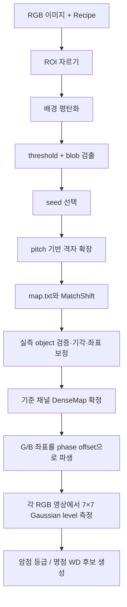

# DenseMap 검사 이해 가이드 — 표준맵 없이 RGB 암점·명점 검사하기

> 대상: 표준맵을 사용하지 않는 RGB display pixel 검사  
> 목적: DenseMap의 수학적 흐름과 RecipeWindow의 **기본 설정 / 검사 패턴** 값이 검사 결과에 미치는 영향을 이해한다.  
> 범위: 좌표 확정, RGB level, 암점 등급, 명점(WD). line·cluster의 최종 셀 판정은 별도 cell-judgment 정책의 범위다.

## 1. 이 검사를 한 문장으로 이해하기

표준맵을 사용하지 않는 DenseMap 검사는 **현재 RGB 영상에서 밝은 dot들을 검출해 격자 좌표를 새로 만들고, 그 격자에서 각 채널의 밝기를 측정해 암점·명점을 찾는 검사**다.

```text
R/G/B 이미지
  → 밝은 dot 검출
  → 현재 셀의 dot 격자(DenseMap) 생성
  → 격자 index와 카메라 좌표 확정
  → RGB 각 이미지에서 같은 격자 위치의 level 측정
  → 낮은 level = 암점 후보
  → 다른 채널 위치에서 밝은 level = 명점(WD) 후보
```

표준맵 검사와 가장 큰 차이는 다음이다.

| 구분 | 표준맵 미사용 DenseMap | 표준맵 사용 |
|---|---|---|
| 좌표 기준 | 현재 검사 셀에서 새로 만든 격자 | 양품 셀에서 만든 고정 좌표표 |
| 장점 | 현재 셀의 실제 국소 형상을 직접 반영한다. | 불량 셀에서도 좌표가 더 안정적이고 빠르다. |
| 약점 | 결손·미점등이 심하면 격자 생성이 불안정할 수 있다. | 기준 자산 생성·관리 필요 |
| 주 용도 | 표준맵 생성, 과도기 검사, 자동정합 재료 | 운영 본검사 |

**핵심 요약:** DenseMap은 “현재 보이는 dot으로 좌표를 만든 뒤 검사”하는 방식이다.

## 2. 검사에 필요한 입력

DenseMap은 단순히 RGB 이미지 세 장만으로 동작하지 않는다. 영상의 밝은 점을 어떤 논리 dot index로 해석할지 알려 주는 Recipe 정보가 필요하다.

```text
RGB pattern 이미지
  + ROI                         : 검사할 카메라 영역
  + dot count / map.txt         : 논리 격자의 크기와 유효 dot 위치
  + camera pitch X/Y            : 이웃 dot의 예상 간격
  + phase offset G/B from R     : 채널 간 sub dot 상대 위치
  + pattern별 검출·level 기준   : threshold, blob 크기, 등급 기준
```

여기서 `map.txt`는 단순 그림이 아니다. 실제로 존재해야 하는 dot index의 mask다.

```text
# = 유효한 논리 dot
. = 검사 대상이 아닌 위치

map.txt의 비주기적 결손/형상
  → 현재 영상에서 만든 격자의 절대 index를 맞추는 anchor 역할
```

## 3. 전체 DenseMap 알고리즘 흐름



### 3.1 기준 채널 선택

표준맵이 꺼져 있으면 R → G → B 순서로 DenseMap 생성을 시도한다.

```text
R에서 DenseMap 성공  → R이 기준 map
R 실패, G 성공       → G가 기준 map
R/G 실패, B 성공     → B가 기준 map
모두 실패            → ROI 중심의 이상 격자 배치
```

기준 채널의 좌표는 실제 검출 결과와 보정 결과를 사용한다. 형제 채널은 다시 전체 격자를 검출하지 않고, 기준 좌표에 phase offset을 더해 사용한다.

```text
pR(i, j) = (xR, yR)
pG(i, j) = pR(i, j) + Δ(G from R)
pB(i, j) = pR(i, j) + Δ(B from R)
```

여기서 `i, j`는 dot index, `Δ`는 Recipe의 `GFromR`, `BFromR` offset이다.

> NOTE: 같은 cell의 R/G/B grab 사이에는 stage가 정지한다는 전제가 있다. 따라서 채널 간 전체 위치 차이를 매번 새로 추정하기보다, 고정 phase offset을 적용한다.

## 4. 1단계 — 밝은 dot(object) 검출

### 4.1 배경 평탄화

조명·광학계 때문에 배경 밝기가 화면 위치마다 다를 수 있다. 원본 영상 `I`에 white top-hat을 적용해 배경보다 밝은 국소 신호를 강조한다.

```text
I_flat = I - opening(I, K)
```

- `opening`: morphology opening
- `K`: 타원형 kernel
- kernel 크기: 대략 `0.7 × max(pitchX, pitchY)`를 사용하고, 5~31 px 범위의 홀수로 제한한다.

의미는 “dot보다 큰 완만한 배경 변화는 빼고, dot 크기의 밝은 덩어리는 남긴다”이다.

### 4.2 threshold와 connected component

평탄화 영상에서 threshold `T` 이상인 pixel을 foreground로 만든다.

```text
B(x, y) = 1,  when I_flat(x, y) >= T
B(x, y) = 0,  otherwise
```

그 뒤 8-연결 connected component를 구한다. 각 component는 dot 후보 object가 된다.

object는 다음 조건을 모두 통과해야 한다.

```text
MinArea ≤ area ≤ MaxArea
BlobMinWidth ≤ width ≤ BlobMaxWidth
BlobMinHeight ≤ height ≤ BlobMaxHeight
```

통과한 object의 무게중심이 실측 centroid다.

```text
cx = Σ(xk) / N
cy = Σ(yk) / N
```

### 4.3 multi-threshold의 의미

pattern의 threshold에 `30, 50, 80`처럼 여러 값을 입력할 수 있다. 각 threshold로 검출을 수행한 뒤 가장 좋은 후보를 고른다.

```text
score(T) = valid_object_count(T)
           - oversized_blob_area(T) / (pitchX × pitchY)
```

- `N_valid`: 크기 필터를 통과한 object 수
- `A_oversized`: 너무 커서 병합된 것으로 본 blob들의 총 면적
- 두 값이 같으면 높은 threshold를 우선한다.

낮은 threshold는 어두운 dot도 찾을 수 있지만, 배경과 dot이 붙어 큰 blob이 될 수 있다. 높은 threshold는 노이즈와 병합을 줄이지만 약한 dot을 놓칠 수 있다. multi-threshold는 이 trade-off를 영상마다 자동 선택하는 방법이다.

**핵심 요약:** threshold는 암점을 직접 판정하는 값이 아니라, DenseMap을 만들기 위해 “정상적으로 점등된 dot 후보”를 찾는 값이다.

## 5. 2단계 — 검출 object에서 DenseMap 만들기

### 5.1 seed와 pitch

하나의 신뢰할 수 있는 object를 seed로 선택한다. seed 주변에 pitch 간격으로 이웃이 일관되게 존재하는지 확인해, 단일 노이즈가 격자 시작점이 되는 것을 막는다.

pitch는 Recipe의 카메라 pixel 단위 값이다.

```text
dx = (pitchX, 0)
dy = (0, pitchY)
```

실제 영상에서는 회전·왜곡이 있으므로 구현은 `x, y` 방향의 2D 벡터 형태로 pitch model을 다룬다.

### 5.2 chain 확장

seed에서 이웃 dot의 예상 위치를 계산한다.

```text
p_hat(i+1, j) = p(i, j) + dx
p_hat(i, j+1) = p(i, j) + dy
```

예상 위치 주변 `ObjectSearchRadius` 안에서 가장 가까운 미사용 object를 찾는다.

```text
object를 찾음     → 그 centroid를 격자 좌표로 사용
object를 못 찾음  → 예상 위치를 임시 좌표로 사용
```

따라서 암점처럼 실제로 꺼진 위치도 DenseMap에 빈칸으로 남지 않는다. 이후 그 예상 좌표에서 level을 측정할 수 있다.

### 5.3 MatchShift — local grid를 절대 index에 맞추기

seed에서 만든 격자는 “seed 기준의 local index”다. 이것을 `map.txt`의 절대 dot index에 맞춰야 한다.

검출된 object 존재 여부를 0/1 행렬 `O`, `map.txt`의 유효 dot mask를 `M`이라고 하면, 여러 shift 중 상관이 가장 큰 값을 고른다.

```text
(shiftX, shiftY) = argmax(u, v) Σ O(i, j) × M(i-u, j-v)
```

이 단계가 필요한 이유는 완전한 사각 격자는 한 pitch만큼 밀려도 똑같아 보이기 때문이다. `map.txt`의 결손·모양 같은 비주기적 패턴이 절대 위치를 구분하는 기준점이 된다.

**핵심 요약:** seed/chain은 격자를 만들고, MatchShift는 그 격자에 “몇 번째 row·column인가”라는 이름을 붙인다.

## 6. 3단계 — 잘못된 object를 기각하고 좌표를 보정하기

검출 object가 있다고 모두 믿을 수는 없다. noise, wrong-phase, 병합/분리 오류, 국소 이탈이 있을 수 있다.

### 6.1 전역 2차 fit은 심판 역할

검출된 object 좌표를 index `(u, v)`의 2차 다항식으로 근사한다.

```text
x = fx(u, v) = a0 + a1u + a2v + a3u² + a4v² + a5uv
y = fy(u, v) = b0 + b1u + b2v + b3u² + b4v² + b5uv
```

실측 centroid와 fit 예측값의 거리

```text
r = sqrt((x_measured - x_fit)² + (y_measured - y_fit)²)
```

가 `PositionTolerancePx`보다 크면 object를 기각한다.

### 6.2 기각된 위치는 왜 좌표를 다시 채우는가

기각됐다는 것은 “그 위치에 dot이 없다”가 아니라 “현재 검출 object가 그 dot의 올바른 중심이라고 믿을 수 없다”는 뜻이다.

그래서 좌표는 다음 우선순위로 보정한다.

```text
같은 row의 1차원 2차 fit
또는 같은 column의 1차원 2차 fit
→ 둘 다 불충분하면 이웃 좌표 기반 예측
```

전역 fit은 이상치 판별에는 좋지만, 스티치 계단 같은 국소 형상을 좌표 채우기에 충분히 표현하지 못한다. row/column fit은 해당 line의 실제 형태를 더 잘 따라가기 때문에 보정 좌표에 사용한다.

**핵심 요약:** object 기각은 결함을 지우는 것이 아니라, 잘못된 centroid가 검사 좌표를 오염시키지 않게 하는 과정이다.

## 7. 4단계 — level 측정과 암점 판정

DenseMap 좌표가 확정되면, RGB 각 이미지에서 해당 좌표의 gray level을 측정한다.

### 7.1 7×7 Gaussian 샘플링

중심 pixel 하나만 쓰면 센터 오차·노이즈에 민감하다. 중심 주변 7×7 영역을 binomial Gaussian kernel로 가중 평균한다.

1차 가중치:

```text
w = [1, 6, 15, 20, 15, 6, 1]
```

2차 가중치:

```text
W(m, n) = w[m] × w[n]
```

level:

```text
L(x, y) = ΣΣ W(m, n) × I(x+m, y+n) / 4096
          for m, n = -3 ... +3
```

기본 mode는 sub-pixel 좌표를 bilinear interpolation으로 읽은 뒤 가중 평균하는 방식이다. 따라서 map 좌표가 정수 pixel에 정확히 떨어지지 않아도 level 변화가 부드럽다.

### 7.2 normal level과 비율

ROI 안의 level 중 0보다 큰 값에서 pattern별 `NormalLevelPercentile`을 구한다.

```text
L_normal = percentile(L1, L2, ..., LN, q)
```

여기서 `q`는 예를 들어 90 percentile이다.

각 dot의 상대 level 비율은

```text
Ri = Li / L_normal × 100 (%)
```

이다.

### 7.3 등급과 암점

각 pattern은 다음과 같은 경계로 A/B/C/D grade를 만든다.

```text
R ≥ A 기준  → A
R ≥ B 기준  → B
R ≥ C 기준  → C
그 외       → D
```

일반적으로 낮은 ratio의 C/D가 암점 후보가 된다. 다만 현재 구조에서 “어느 grade를 실제 defect로 취급할지”는 grade-to-type 정책과 선택된 defect type이 결정한다.

```text
level ratio
  → grade (A/B/C/D)
  → defect type (예: OK/Repair/Reject)
  → 선택된 type만 defect 결과로 기록
```

> NOTE: IP는 모든 dot의 level과 grade를 먼저 산출한다. 미점등, 군집성 암점, 암선 같은 셀 수준 판정은 Console/Verifier의 cell-judgment 단계에서 추가로 해석될 수 있다.

## 8. 5단계 — RGB 명점(WD) 판정

암점은 “있어야 할 위치가 어둡다”는 검사다. 명점(WD)은 반대로 “현재 pattern에서 켜지면 안 되는 다른 채널 위치가 밝다”는 검사다.

### 8.1 교차 채널 샘플링

예를 들어 R pattern 이미지에서 G 위치와 B 위치를 샘플링한다.

```text
R pattern 영상
  → R dot 위치: 정상 R level 측정
  → G dot 위치: 밝으면 G phase 명점 후보
  → B dot 위치: 밝으면 B phase 명점 후보
```

G pattern, B pattern도 같은 방식으로 다른 두 채널 위치를 검사한다. 즉 RGB 세 영상에서 총 6개의 교차 조합을 본다.

교차 위치는 phase offset만으로 단순 예측하지 않는다. 다른 채널 DenseMap이 실제로 확정한 좌표를 anchor로 사용한다. 이는 실제 중심에서 측정하므로 level 저평가를 줄인다.

### 8.2 WD 비율

현재 pattern 이미지에서 다른 채널 anchor 위치의 level을 `L_cross`, anchor 채널의 normal level을 `L_normal_anchor`라고 하면,

```text
R_WD = L_cross / L_normal_anchor × 100 (%)
```

이다.

```text
R_WD >= ThresholdPercent
```

이면 WD 후보로 기록한다. 이 `ThresholdPercent`는 RecipeWindow의 **명점 검사(WD)** 탭 값이다.

### 8.3 격자에서 밀려난 밝은 object

DenseMap 검증에서 “격자에 속하지 않는 bright blob”으로 기각된 object도 WD 후보로 회수한다.

```text
정상 격자에 배정되지 못한 밝은 blob
  + WD threshold 이상
  → off-grid 명점 후보
```

단, 교차 채널 검사에서 이미 같은 물리 위치를 WD로 기록했다면 중복 기록하지 않는다.

**핵심 요약:** 암점은 맵 안에서 낮은 level을 찾고, 명점은 맵 밖 또는 다른 phase 위치에서 비정상적으로 높은 level을 찾는다.

## 9. RecipeWindow 값은 DenseMap에 어떻게 적용되는가

### 9.1 기본 설정 탭

| 화면 값 | DenseMap에서의 의미 | 영향 |
|---|---|---|
| Glass Size ID | 제품 기하 모델 연결 | ROI/cell 이동/좌표계의 상위 기준이다. DenseMap 수학값 자체는 아니지만 올바른 촬영 위치의 전제다. |
| Grab Rotation | IP 입력 이미지 회전 | 검출과 map 좌표의 이미지 방향을 맞춘다. |
| 화소 수 W/H | 논리 dot grid 크기 | DenseMap의 columns/rows와 map.txt 검증 기준이 된다. |
| 화소 크기 um | 물리 dot 크기 | 카메라 px↔um 파생, CellMap 보정 표시 등에 사용된다. |
| 화소 pitch X/Y (camera px) | 이웃 dot 간 예상 거리 | seed 검증, chain 확장, top-hat kernel 크기, shift/좌표 예측의 핵심 값이다. |
| 화소 맵 `map.txt` | 유효 dot mask | MatchShift로 final row/column index를 확정하는 기준이다. |
| 등급별 불량 종류 / 불량으로 취급할 종류 | grade-to-type policy | 같은 level grade라도 defect로 기록할지 결정한다. |
| 썸네일 폭 / Export Prefix | 결과물 생성 규칙 | DenseMap 수학에는 영향이 없고 artifact/export에만 영향이 있다. |

### 9.2 검사 패턴 탭 — pattern마다 따로 적용되는 값

R/G/B는 같은 DenseMap을 공유하더라도, 영상 밝기·노이즈·blob 크기가 다를 수 있다. 그래서 검출 기준은 pattern별로 가진다.

| 화면 값 | 알고리즘 적용 지점 | 조정할 때 생기는 효과 |
|---|---|---|
| Pattern type (R/G/B/W) | 채널 역할 지정 | RGB는 DenseMap/WD, W는 RGB 좌표를 이용한 별도 level 샘플링에 사용된다. |
| Threshold / 후보 목록 | binary object 검출 | 낮추면 약한 dot을 잡지만 배경·병합 위험이 커지고, 높이면 노이즈는 줄지만 약한 dot을 놓칠 수 있다. |
| 최소/최대 면적 | blob 필터 | noise fragment와 병합 blob을 제거한다. |
| 최소/최대 width/height | blob 형상 필터 | 면적만으로 구분하기 어려운 길쭉한 noise·합쳐진 dot을 제거한다. |
| Level metric | 7×7 level 샘플 방식 | 기본 bilinear는 sub-pixel 좌표 변화에 부드럽고, nearest는 정수 pixel 중심의 단순 샘플이다. |
| Normal level percentile | 기준 밝기 계산 | 너무 낮으면 어두운 dot을 정상 기준에 섞고, 너무 높으면 밝은 상위값에 기준이 치우칠 수 있다. |
| A/B/C 기준 | ratio → grade 경계 | 암점 등급의 민감도를 정한다. |
| Absolute level 사용 | 상대비 대신 절대 gray로 grade 판정 | 조명 기준이 고정돼 있고 절대 밝기로 관리할 때 사용한다. |
| White pattern 검사 | W pattern 포함 여부 | W pattern의 level/result 생성 여부를 결정한다. |

### 9.3 명점 검사(WD) 탭

| 화면 값 | 영향 |
|---|---|
| 명점 검사 사용 | RGB 교차 채널 WD 산출을 켜거나 끈다. |
| 명점 임계값(%) | 다른 phase 위치의 밝기를 WD로 기록하는 기준이다. |
| G-from-R / B-from-R offset | 기준 channel map에서 형제 채널 map을 만들 때 쓰는 phase 상대 위치다. |

> TIP: Pattern tab의 threshold와 WD tab의 threshold는 목적이 다르다. Pattern threshold는 “DenseMap을 만들 object 검출 기준”, WD threshold는 “다른 phase 위치의 빛을 명점으로 볼 기준”이다.

## 10. 값 조정의 올바른 순서

DenseMap이 흔들릴 때 암점 grade부터 바꾸면 원인을 가릴 수 있다. 장비/알고리즘 관점에서는 다음 순서가 안전하다.

1. **촬영 방향과 ROI 확인**: Grab rotation, point ROI가 맞는지 확인한다.
2. **grid 기하 확인**: dot count, pitch X/Y, map.txt가 실제 제품과 맞는지 확인한다.
3. **object 검출 확인**: threshold 후보, area, width, height를 조정해 정상 dot이 안정적으로 object가 되는지 확인한다.
4. **좌표 품질 확인**: MatchShift, rejected object, residual/기각 수를 확인한다.
5. **phase 확인**: G/B offset이 실제 sub dot 위치와 맞는지 확인한다.
6. **level 기준 조정**: normal percentile, A/B/C grade를 조정한다.
7. **WD 기준 조정**: 마지막으로 cross-channel WD threshold를 조정한다.

```text
좌표가 틀린 상태에서 level 기준을 조정하면
  → 정상 dot이 아닌 배경을 측정할 수 있다.

따라서
  기하/검출 → 좌표 → level → defect 기준
순서로 맞춰야 한다.
```

## 11. 최소 코드 확인 지점

개념을 이해한 뒤 코드로 검증하고 싶다면 아래 큰 단위만 보면 충분하다.

| 확인 목적 | 코드 영역 |
|---|---|
| 기본 설정·검사 패턴 UI binding | `RecipeWindow.xaml` |
| UI 값이 Recipe model에 저장되는 구조 | `RecipeModels.cs`, `ConsoleRecipeDocument.cs` |
| Recipe 값을 DenseMap 실행값으로 조립 | `PointGridInspectionAlgorithm` |
| object 검출·격자 생성·기각·MatchShift | `CorrectedDenseMapInspector` |
| 7×7 Gaussian level 수식 | `GaussianLevelSampler` |
| RGB 교차 WD 생성 | `PointGridInspectionAlgorithm`의 white defect 처리 |

## 12. 최종 정리

```text
DenseMap
  = 현재 영상에서 dot 격자를 재구성하는 좌표 알고리즘

암점
  = 확정된 맵 좌표에서 측정한 level이 정상 기준보다 낮은 dot

명점(WD)
  = 현재 pattern에서 꺼져야 할 다른 RGB phase 위치가 밝은 현상

기본 설정 탭
  = 격자의 크기·물리/카메라 기하·map 기준

검사 패턴 탭
  = 채널별 object 검출과 level/grade 기준

WD 탭
  = RGB phase 관계와 명점 판정 기준
```

**최종 요약:** 표준맵 미사용 DenseMap 검사의 정확도는 “암점 기준을 얼마나 엄격하게 두는가”보다 먼저, 현재 영상에서 dot 격자를 얼마나 정확히 재구성하는가에 달려 있다. 따라서 RecipeWindow 값도 pitch·map·blob 검출로 좌표를 먼저 맞추고, 그 다음 level grade와 WD threshold를 조정해야 한다.
