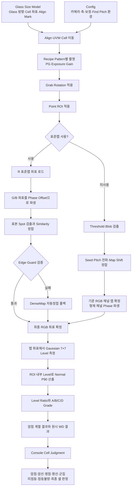

# Recipe·Glass Size Model·Config 검사 파라미터 영향 분석

## 1. 문서 목적

이 문서는 uLED 검사기의 설정값을 다음 관점에서 설명한다.

- 어떤 화면에 저장되는 값인지보다 검사 과정의 어느 단계에 들어가는가
- 표준맵 검사와 DenseMap 검사에서 의미가 어떻게 달라지는가
- 값을 잘못 설정했을 때 영상과 검사 결과에 어떤 증상이 나타나는가
- 장비 셋업 시 어떤 순서로 값을 확정해야 하는가
- 현재 코드에서 실제로 사용되는 값과 모델/UI에만 남아 있는 값을 어떻게 구분하는가

코드의 클래스와 함수는 검증 근거로만 사용하고, 본문은 장비 개발자가 검사 구조를 이해할 수 있도록 로직 중심으로 구성한다.

분석 기준은 다음과 같다.

- Camera 입력
- 자동 Glass 인식
- Test Runner 검사 옵션 활성
- 현재 선택 Recipe 사용
- `Pattern × Point` 실행
- R/G/B 검사 및 현재 Recipe의 W 패턴 설정

---

## 2. 가장 중요한 결론

표준맵 검사와 DenseMap 검사에 직접 영향을 주는 핵심 값은 대부분 Recipe에 있다.

역할을 나누면 다음과 같다.

| 설정 영역 | 주된 책임 | 검사에 미치는 방식 |
|---|---|---|
| Glass Size Model | Glass와 Cell의 물리 구조 | 어느 Cell로 이동하고 Align 결과를 어떻게 장비 좌표로 변환할지 결정 |
| Config | 장비·카메라·제어·분석 도구의 환경 | 영상을 제대로 취득할 수 있는 장비 조건과 보정 환경을 결정 |
| Recipe | 촬영 및 검사 기준 | 촬영 조건, 회전, ROI, Pitch, Phase, Threshold, Blob, 밝기 Grade를 결정 |
| Standard Map | 양품 기준 Dot 좌표 | 표준맵 검사에서 모든 Dot의 측정 좌표를 제공 |
| Cell Judgment Config | 셀 최종 결함 분류 | 개별 Dot 결과를 암선·명선·군집·점등불량 등으로 묶고 셀 판정을 결정 |

검사 알고리즘은 크게 두 단계다.

1. **좌표 확정**
   - 이 Dot을 카메라 영상의 어느 좌표에서 측정할지 결정한다.
   - ROI, Pitch, Phase Offset, Threshold, Blob, 표준맵이 관여한다.

2. **밝기 판정**
   - 확정된 좌표에서 밝기를 측정하고 정상 밝기와 비교한다.
   - Level Metric, Normal Percentile, Grade 기준, White Defect 기준이 관여한다.

따라서 Threshold와 불량 밝기 기준을 같은 값으로 이해하면 안 된다.

> Threshold는 주로 “Dot 위치를 찾을 수 있는 밝은 Blob인가”를 결정한다.
>
> 암점 판정은 확정된 좌표에서 다시 측정한 밝기 비율로 결정한다.

---

## 3. 전체 구조



---

## 4. 설정값이 적용되는 순서

같은 값이라도 검사 이전 단계가 틀리면 이후 단계가 정상적으로 동작할 수 없다.

```text
Glass/Cell 물리 좌표
→ Align 및 설비 이동
→ Pattern 점등
→ Camera Exposure/Gain으로 촬영
→ Grab Rotation
→ ROI 제한
→ 좌표 확정
→ Dot Level 측정
→ Grade
→ Defect 분류
```

예를 들어 ROI가 틀렸는데 Threshold만 조정하면 다음 문제가 생긴다.

- Threshold를 낮춰 더 많은 Blob을 찾을 수는 있다.
- 그러나 원래 검사해야 할 Dot이 ROI 밖에 있으면 올바른 좌표는 복구할 수 없다.
- 오히려 Cell 외부 반사광을 Dot으로 인식할 가능성이 커진다.

장비 셋업에서는 반드시 앞 단계부터 확정해야 한다.

---

## 5. 표준맵 검사와 DenseMap 검사의 파라미터 적용 차이

| 파라미터 | DenseMap 검사 | 표준맵 고정배치 | 표준맵 자동정합 폴백 |
|---|---|---|---|
| ROI | 검출·Seed·Level 범위 | Spot 검출·Level 범위 | 검출·정합·Level 범위 |
| Pitch X/Y | 인접 Dot 예상 간격 | Spot 탐색창, 전처리 커널 | DenseMap 생성과 정합 게이트 |
| RGB Phase Offset | 기준 채널에서 형제 채널 좌표 파생 | R 표준맵에서 G/B 좌표 파생 | 재정합 후 G/B 좌표 파생 |
| Threshold | 전체 Blob 검출 | 표본 Spot 검출 | 전체 Blob 검출 |
| Area·Blob Width/Height | DenseMap anchor 필터 | 표본 Spot 인정 필터 | DenseMap anchor 필터 |
| Object Search Radius | 인접 예상 위치의 Blob 탐색 | 사용하지 않음 | 사용 |
| Map Shift Margin | 결손 패턴 index 정합 | 사용하지 않음 | 사용 |
| Position Tolerance | 잘못 매칭된 Object 기각 | Similarity trim·이탈 통계 | Similarity trim·이탈 통계 |
| Standard Map Max Search Margin | 사용하지 않음 | 사용하지 않음 | Median offset 상한 |
| Normal Percentile·Grade | 최종 밝기 판정 | 최종 밝기 판정 | 최종 밝기 판정 |

표준맵 사용을 켰다고 Threshold와 Blob이 완전히 사라지는 것은 아니다.

- 표준맵 좌표가 Dot 측정 위치의 기준이 된다.
- Threshold와 Blob은 표준맵이 현재 영상에 올바르게 배치됐는지 확인하는 Spot 검출에 사용된다.
- 고정배치 검증이 실패하면 DenseMap 자동정합으로 들어가므로 Threshold·Blob·Search Radius·Map Shift Margin이 다시 모두 중요해진다.

---

## 6. ROI

### 6.1 ROI의 역할

ROI는 화면 표시용 사각형이 아니라 검사 좌표계의 유효 영역이다.

ROI는 다음 단계에 모두 적용된다.

- Threshold·Blob 검출
- Seed 후보 선택
- 표준맵 Spot 검출
- 최종 Level 포함 범위
- 정상 밝기 Percentile의 모집단
- RGB 교차 채널 명점 검사

현재 구조에서 Point는 Pattern에 종속되지 않는다. 모든 Pattern이 공통 Point 집합을 공유하므로 R/G/B/W는 같은 Point ROI를 사용한다.

### 6.2 현재 Recipe

```text
ROI 시작: X=610, Y=2194
ROI 크기: 9318 × 9294 px
Dot Count: 432 × 432
Pitch: 약 20.825 × 20.826 px
```

첫 Dot 중심부터 마지막 Dot 중심까지의 단순 Pitch 폭은 다음과 같다.

```text
X 중심 폭 = (432 - 1) × 20.825 ≈ 8975.6 px
Y 중심 폭 = (432 - 1) × 20.826 ≈ 8976.0 px
```

전체 맵이 ROI 중앙에 있다고 가정한 산술 여유는 대략 다음과 같다.

```text
X 한쪽 여유 ≈ 171 px
Y 한쪽 여유 ≈ 159 px
```

이 값은 실제 표준맵의 시작점과 끝점을 보장하는 값이 아니라 ROI와 명목 Pitch의 크기 관계를 확인하는 참고값이다.

### 6.3 ROI가 잘못됐을 때

ROI가 너무 작으면:

- 외곽 Dot이 ROI 밖으로 잘린다.
- 표준맵 Edge 검증이 실패할 수 있다.
- DenseMap Seed 또는 충분한 anchor를 얻기 어렵다.
- 정상 밝기 P90을 계산하는 모집단이 바뀐다.
- 한쪽 끝의 결함이 결과에서 누락될 수 있다.

ROI가 너무 크면:

- Cell 외부 반사광과 주변 구조가 Blob 후보가 된다.
- 잘못된 Seed 또는 자동정합 후보가 생길 수 있다.
- 배경 변화가 커지고 처리량이 증가한다.

ROI 위치가 틀리면:

- 크기가 충분해도 전체 Dot 배열이 한쪽으로 치우친다.
- 표준맵 고정배치가 실패하고 불필요한 자동정합이 반복될 수 있다.
- DenseMap이 다른 밝은 구조를 중심으로 시작할 수 있다.

### 6.4 장비 개발 관점

ROI는 알고리즘으로 Glass 이동 오차를 무한정 흡수하기 위한 값이 아니다.

적절한 책임 분리는 다음과 같다.

- 큰 위치 오차: Align·UVW·Cell 좌표 보정
- 반복되는 Cell별 위치 오차: Cell Map Correction
- 촬상 좌표계 방향: Grab Rotation
- 정상적인 잔여 영상 이동: 표준맵 정합 또는 DenseMap
- 최종 유효 영역 제한: ROI

---

## 7. Grab Rotation과 좌표계

현재 Recipe는 다음 값을 사용한다.

```text
GrabRotationDeg = 90
```

Camera 원본을 90도 회전한 후 검사하기 때문에 다음 값은 모두 회전된 검사 영상 기준이어야 한다.

- ROI X/Y/Width/Height
- Pitch X/Y
- G/B Phase Offset Dx/Dy
- `map.txt`의 행·열 방향
- `std_map.csv`의 카메라 좌표

회전 설정이 틀리면 단순한 Shift 문제가 아니다.

- X Pitch와 Y Pitch 방향이 바뀐다.
- Phase Offset 방향과 부호가 바뀐다.
- Display Pixel Map의 행·열 구조가 영상과 맞지 않는다.
- ROI 위치도 다른 영역을 가리킨다.

따라서 Rotation은 Pitch나 Threshold보다 먼저 확정해야 한다.

---

## 8. Pitch

### 8.1 물리적 의미

현재 Pitch는 다음과 같다.

```text
Pitch X = 20.825015 px
Pitch Y = 20.825882 px
```

이는 같은 색 채널의 인접한 논리 Dot 중심 사이가 카메라 영상에서 약 20.825픽셀이라는 뜻이다.

현재 Recipe의 논리 Dot 물리 크기 설정은 78µm다. Console은 다음 식으로 카메라 환산값을 파생한다.

```text
Camera pixel size = 78 µm ÷ 20.825 px
                  ≈ 3.746 µm/px
```

즉 카메라 영상 한 픽셀이 Glass 면에서 약 3.746µm를 나타낸다는 의미다.

이 환산값은 Cell Map 보정값을 px와 µm 사이에서 이해할 때도 사용된다.

### 8.2 DenseMap 검사

DenseMap은 Seed에서 다음 Dot 위치를 다음 개념으로 예측한다.

```text
다음 예상 위치 = 현재 확정 위치 + Pitch 벡터
```

주변 Object 표본이 충분하면 실제 인접 차이를 이용해 다음 2D 벡터를 추정한다.

```text
X Pitch Vector = (dxX, dyX)
Y Pitch Vector = (dxY, dyY)
```

이 구조는 영상이 조금 회전되거나 행·열 방향에 작은 기울기가 있어도 따라가기 위한 것이다. 축별 표본이 6개 미만이면 Recipe의 축 정렬 Pitch를 사용한다.

Pitch가 너무 작으면:

- 예측 위치가 실제 Dot보다 앞에 생긴다.
- 외곽으로 갈수록 위치 오차가 누적된다.

Pitch가 너무 크면:

- 실제 Dot을 지나친 위치에서 다음 Object를 찾는다.
- Search Radius 안에 정상 Dot이 들어오지 않을 수 있다.

Pitch가 불안정하면:

- 잘못된 인접 Object를 현재 index에 배정할 수 있다.
- 결손 행과 암점 구간의 Predicted 좌표가 실제 중심에서 벗어난다.
- Map Shift 결과가 한 칸 이상 어긋날 수 있다.

### 8.3 표준맵 검사

표준맵의 전체 좌표는 `std_map.csv`에서 가져오므로 Pitch로 좌표 전체를 새로 생성하지 않는다.

표준맵 고정배치에서 Pitch는 다음 용도로 사용된다.

- 예상 표준맵 좌표 주변 Spot 탐색창 크기
- 인접 같은 채널 Dot을 잘못 찾지 않기 위한 경계
- 배경 평탄화 커널 크기
- Similarity 및 자동정합 게이트의 공간 기준

표본 Spot 탐색 범위는 개념적으로 다음과 같다.

```text
탐색 반폭 = Pitch ÷ 2 × 0.8
현재 값 ≈ ±8.33 px
```

같은 채널의 다음 Dot은 약 20.825px 떨어져 있으므로 Pitch 절반보다 작은 탐색 범위로 옆 Dot 오인을 막는다.

### 8.4 Find Pitch와 본검사 구분

Config의 Find Pitch는 Recipe 작성 도구다.

- 현재 버퍼에서 Pitch·Phase·ROI 후보를 분석한다.
- 사용자가 결과를 Recipe에 적용한다.
- 본검사는 적용된 Recipe Pitch를 사용한다.
- 일반 검사 중 Config의 Find Pitch 범위를 매번 읽어 Pitch를 다시 계산하지 않는다.

---

## 9. R/G/B Phase Offset

### 9.1 의미

현재 Recipe는 다음 값을 사용한다.

```text
G From R = (+7.5557, -0.4419) px
B From R = (+14.6807, -0.8916) px
```

X Pitch 대비 위치는 다음과 같다.

```text
G Dx ≈ Pitch X의 36.3%
B Dx ≈ Pitch X의 70.5%
```

Phase Offset은 Glass 전체 Shift가 아니다. 하나의 논리 Dot 안에서 R/G/B sub dot 사이의 고정된 물리 관계다.

### 9.2 표준맵 검사

표준맵 파일은 R 좌표를 정본으로 가진다.

```text
G 좌표 = R 표준맵 좌표 + GFromR
B 좌표 = R 표준맵 좌표 + BFromR
```

R/G/B는 이 좌표를 기준으로 각각 표본 Spot을 확인하고 Level을 측정한다.

### 9.3 DenseMap 검사

표준맵을 사용하지 않으면 R → G → B 순으로 맵을 확정할 수 있는 기준 채널을 찾는다.

R이 기준이면:

```text
G 좌표 = R 확정 좌표 + G Phase
B 좌표 = R 확정 좌표 + B Phase
```

G가 기준이면:

```text
R 좌표 = G 확정 좌표 + Phase(R) - Phase(G)
B 좌표 = G 확정 좌표 + Phase(B) - Phase(G)
```

따라서 R이 어두워도 G 또는 B에서 맵을 확정할 수 있다.

### 9.4 다른 Cell의 G/B를 잘못 찾는 문제

Phase Offset을 적용한 예상 좌표에서 바로 전체 영상을 탐색하는 구조가 아니다.

표준맵 고정배치는 예상 위치 주변을 Pitch 절반보다 작은 창으로 제한한다. 이 때문에 인접 같은 채널 Dot 중심까지 검색창이 넘어가지 않도록 설계되어 있다.

DenseMap에서는 기준 채널 좌표가 먼저 확정되고 형제 채널은 Phase 차이만큼 좌표를 평행 이동한다. 형제 채널을 화면 전체에서 다시 찾아 연결하지 않는다.

### 9.5 Phase가 틀렸을 때

- Dot 중심이 아닌 가장자리나 배경을 7×7 샘플링한다.
- 정상 Dot의 측정 Level이 낮아져 암점 Grade로 내려갈 수 있다.
- 다른 sub dot 위치의 빛을 읽어 WD 명점 후보가 생길 수 있다.
- 표준맵 G/B Spot 검출 수가 줄어든다.
- 고정배치가 실패하고 자동정합으로 불필요하게 진입할 수 있다.

Phase Offset은 표준맵 생성 시 채널 독립 좌표에서 같은 index의 G−R, B−R 차이를 모아 median으로 산출하는 것이 현재 설계 의도다.

---

## 10. Threshold와 배경 평탄화

### 10.1 Threshold의 역할

검출 단계는 다음 순서다.

```text
ROI
→ 배경 평탄화
→ Threshold 이진화
→ 8-방향 Connected Component
→ Area 필터
→ Width/Height 필터
→ Object 중심 추출
```

Threshold는 주로 좌표 정합에 사용할 Object를 만드는 값이다.

최종 암점 판정은 Threshold가 아니라 확정된 좌표의 측정 Level과 Normal Level의 비율로 수행된다.

### 10.2 현재 배경 평탄화

현재 설정:

```text
DisplayPixelBackgroundFlattenEnabled = true
```

배경 평탄화가 활성화되면 원본에서 형태학적 Opening 결과를 뺀 White Top-hat 영상을 검출에 사용한다.

커널은 Pitch에서 자동 계산한다.

```text
Kernel ≈ 0.7 × max(Pitch X, Pitch Y)
현재 값 ≈ 14.58 → 홀수 보정 후 약 15 px
```

따라서 현재 Threshold는 원본 Gray 절대값 50보다는 지역 배경 위로 약 50만큼 돌출된 신호라는 의미에 가깝다.

### 10.3 Threshold를 높이면

- 어두운 정상 Dot이 Object로 검출되지 않을 수 있다.
- DenseMap Seed와 anchor 수가 감소한다.
- 표준맵 표본 대응쌍이 감소한다.
- 대응쌍이 20개 미만이면 `fixed-prior(detect-fail)`로 갈 수 있다.
- 이후 표준맵 자동정합 또는 DenseMap 폴백이 실행될 수 있다.

좌표가 이미 표준맵이나 형제 채널로 확정됐다면 검출되지 않은 Dot도 그 좌표에서 Level을 측정한다. 따라서 “Threshold보다 어두우면 측정 자체가 사라진다”는 의미는 아니다.

### 10.4 Threshold를 낮추면

- 어두운 Dot까지 Object로 검출될 가능성이 증가한다.
- 배경 노이즈와 반사광도 Object 후보가 된다.
- Dot과 배경 또는 이웃 Dot이 연결돼 큰 Blob이 될 수 있다.
- 큰 Blob은 MaxArea/MaxWidth/MaxHeight에서 탈락한다.
- 너무 많은 잘못된 Object는 Seed와 자동정합을 불안정하게 만들 수 있다.

### 10.5 Threshold Candidates

후보가 여러 개면 각 Threshold로 검출한 후 다음 개념으로 가장 좋은 후보를 선택한다.

```text
점수 = 유효 Object 수 - Oversized Blob이 삼킨 것으로 추정되는 Dot 수
```

동점이면 더 높은 Threshold를 선택한다.

현재 RGB의 `ThresholdCandidates`는 비어 있으므로 Threshold 50 하나만 사용한다.

---

## 11. Area와 Blob Width/Height

### 11.1 값의 의미

현재 RGB Pattern 설정:

```text
MinArea = 20 px²
MaxArea = 500 px²
Blob Width = 4~18 px
Blob Height = 4~18 px
```

세 기준은 서로 다르다.

| 값 | 의미 |
|---|---|
| Area | 연결된 밝은 픽셀의 총개수 |
| Width | 연결 성분 Bounding Box의 가로 길이 |
| Height | 연결 성분 Bounding Box의 세로 길이 |

### 11.2 무엇을 판정하는 값인가

Blob 크기는 최종 Defect의 물리 크기 판정값이 아니다.

> 이 밝은 연결 성분을 Dot 위치를 알려주는 정상적인 Object 후보로 인정할 것인가?

를 판정하는 값이다.

Object 중심은 좌표 정합에 사용되고, 최종 밝기는 확정된 맵 좌표에서 별도로 측정한다.

### 11.3 최소값 영향

MinArea 또는 MinWidth/Height가 너무 크면:

- 어두워서 작게 보이는 정상 Dot이 탈락한다.
- 초점이나 채널 특성 때문에 작은 Dot이 탈락한다.
- 표준맵 표본 대응쌍과 DenseMap anchor가 감소한다.

최소값이 너무 작으면:

- 단일 노이즈 픽셀과 작은 반사점이 Object 후보가 된다.
- DenseMap Seed 후보와 자동정합 대응쌍에 노이즈가 섞일 수 있다.

### 11.4 최대값 영향

MaxArea 또는 MaxWidth/Height가 너무 작으면:

- 노출이나 초점 때문에 커진 정상 Dot이 탈락한다.
- 주변 밝기와 조금 연결된 정상 Dot이 탈락한다.

최대값이 지나치게 크면:

- 인접 Dot이 합쳐진 Blob
- Cell 외부 반사광
- 선 형태의 밝은 구조

까지 Dot 후보가 될 수 있다.

### 11.5 표준맵과 DenseMap에서의 차이

표준맵 고정배치:

- Blob은 표본 Spot 위치가 맞는지 확인하는 데 사용된다.
- 최종 전체 좌표는 표준맵에서 나온다.
- Blob 필터가 너무 엄격하면 표준맵 자체가 없어지는 것이 아니라 배치 검증이 실패한다.

DenseMap:

- Blob 중심이 실제 DenseMap의 anchor가 된다.
- Blob 설정 오류가 좌표 생성 자체에 직접 영향을 준다.

---

## 12. Search Radius·Shift Margin·Position Tolerance

### 12.1 Object Search Radius

현재 값:

```text
DisplayPixelObjectSearchRadius = 10 px
```

DenseMap에서 다음 예상 위치 주변 10px 안의 아직 사용하지 않은 Object를 찾는다.

현재 Pitch 절반은 약 10.41px다. Search Radius 10px는 인접 같은 채널 Dot 중심까지 범위를 넓히지 않으면서 Pitch와 국부 위치 오차를 허용하려는 값으로 해석할 수 있다.

너무 작으면:

- 실제 Dot이 예상 위치에서 조금만 벗어나도 찾지 못한다.
- 많은 셀이 Predicted 좌표가 된다.

너무 크면:

- 옆 Dot이나 노이즈 Blob을 현재 index에 매칭할 위험이 증가한다.

표준맵 고정배치에는 이 값이 사용되지 않는다. 자동정합 폴백에 들어가면 다시 사용된다.

### 12.2 Map Shift Margin

현재 값:

```text
DisplayPixelMapShiftMargin = 30
```

이 값의 단위는 카메라 px가 아니라 격자 index 탐색 여유다.

DenseMap에서 생성한 국소 격자와 `map.txt`의 결손 패턴을 비교하여 어느 index Shift가 가장 잘 맞는지 찾는 범위를 결정한다.

너무 작으면:

- 실제 index Shift가 범위 밖에 있어 정답을 찾지 못한다.

지나치게 크면:

- 탐색량이 증가한다.
- 반복성이 강한 맵에서는 후보가 늘어날 수 있다.

표준맵 고정배치에는 사용하지 않고 자동정합 폴백에서 사용한다.

### 12.3 Position Tolerance

현재 값:

```text
DisplayPixelPositionTolerancePx = 1.5 px
```

경로에 따라 의미가 다르다.

DenseMap:

- 전역 격자 Fit 예상 위치에서 1.5px보다 많이 벗어난 Object를 잘못 매칭된 것으로 보고 기각한다.

표준맵:

- Similarity 계산의 잔차가 큰 대응쌍을 Trim한다.
- 최종 표준맵 위치에서 1.5px보다 크게 이탈한 Dot 개수를 `deviated` 통계로 남긴다.
- 표준맵 좌표 자체를 해당 Object 중심으로 교체하지 않는다.

### 12.4 Standard Map Max Search Margin

현재 값:

```text
StandardMapMaxSearchMarginPx = 100 px
```

표준맵 자동정합 폴백에서 대응쌍의 Median offset이 이 범위를 넘으면 ROI 이탈 수준의 비정상 배치로 보고 정합을 포기하는 상한이다.

표준맵 고정배치의 초기 Spot 탐색 범위를 100px로 만드는 값은 아니다.

---

## 13. Display Pixel Map과 Standard Map

두 Map은 목적이 다르다.

### 13.1 Display Pixel Map

`map.txt`는 어느 논리 Dot이 유효한지를 나타내는 결손 패턴이다.

주요 역할:

- 전체 432×432 격자 중 실제 유효 Dot index 정의
- DenseMap을 Glass의 올바른 row/column에 맞추는 비주기 anchor
- Pitch 정수배만큼 잘못 밀리는 alias를 결손 패턴으로 구분

현재 표준맵의 유효 Dot 수는 146,604개다.

### 13.2 Standard Map

`std_map.csv`는 양품 기준 Cell에서 얻은 유효 R Dot의 카메라 좌표다.

현재 Recipe:

```text
UseStandardDenseMap = true
Source Cell = F01
Dot Count = 146,604
```

표준맵 검사는 R 좌표를 정본으로 사용하고 G/B는 Phase Offset으로 파생한다.

### 13.3 표준맵 Calibration 계수

Recipe에는 표준맵 생성 시 사용한 2차 좌표 계수와 잔차가 저장된다.

운영 중 `std_map.csv`가 있으면 파일 좌표가 정본이다. Calibration 계수는 파일이 없을 때 표준맵을 재생성하는 경로와 생성 이력에 사용된다.

---

## 14. Level Metric·Normal Percentile·Grade

### 14.1 Level 측정

현재 값:

```text
LevelMetric = Gaussian7x7Bilinear
```

확정된 Dot 중심 주위 7×7 영역을 Gaussian 가중치로 샘플링한다.

이 방식의 목적:

- 중심 한 픽셀의 노이즈에 덜 민감
- sub pixel 좌표를 Bilinear 보간
- 작은 좌표 오차를 일부 완화

그러나 Phase나 표준맵 좌표가 크게 틀리면 7×7 샘플링만으로 복구할 수 없다.

### 14.2 Normal Level

현재 값:

```text
NormalLevelPercentile = 90
```

ROI 안에서 0보다 큰 Dot Level을 정렬한 뒤 P90 값을 정상 기준으로 사용한다.

평균이 아니다.

```text
Dot Ratio = Dot 측정 Level ÷ Normal Level × 100
```

Percentile을 높이면:

- 더 밝은 Dot이 정상 기준이 된다.
- 같은 Dot의 Ratio가 내려간다.
- 암점 민감도가 높아지는 방향이다.

Percentile을 낮추면:

- 정상 기준이 낮아진다.
- 같은 Dot의 Ratio가 올라간다.
- 암점 민감도가 낮아지는 방향이다.

### 14.3 Grade

현재 RGB 기준:

```text
A: Ratio ≥ 80%
B: Ratio ≥ 30%
C: Ratio ≥ 10%
D: Ratio < 10%
```

Grade는 Recipe의 `GradeDefectPolicy`로 OK/Repair/Reject Type에 매핑된다.

Grade 기준을 올리면 더 많은 Dot이 낮은 Grade로 내려가고, 내리면 불량 민감도가 낮아진다.

---

## 15. 명점과 White Defect 설정

현재 설정:

```text
WhiteDefect.Enabled = true
WhiteDefect.ThresholdPercent = 50
W Pattern InspectWhitePattern = false
```

현재 본검사의 명점은 RGB 교차 채널 방식이다.

예를 들어 R Pattern 영상에서는:

1. G와 B의 확정 좌표를 가져온다.
2. 해당 위치를 R 영상에서 Gaussian 7×7로 측정한다.
3. 다른 채널의 Normal Level 대비 50% 이상 밝으면 비정상 발광 후보로 본다.
4. 원시 WD 명점 결과를 생성한다.

현재 W Pattern의 독립 검사가 꺼져 있으므로 W Pattern에 설정된 다음 값은 W 독립 검사에 사용되지 않는다.

- W Threshold 30
- W Area 16~400
- W Blob Width/Height 1~1000
- W Grade 기준

White Defect와 W Pattern 검사는 같은 기능이 아니다.

---

## 16. Exposure·Gain·PG Pattern

Threshold보다 먼저 확인해야 할 값이다.

Pattern별 Exposure와 Gain은 촬영된 Dot의 크기와 밝기 자체를 바꾼다.

현재 Recipe:

| Pattern | Exposure | Gain | Threshold |
|---|---:|---:|---:|
| R | 560,000µs | 1 | 50 |
| G | 800,000µs | 1 | 50 |
| B | 800,000µs | 1 | 50 |
| W | 50,000µs | 1 | 30 |

Exposure가 증가하면 일반적으로:

- Dot Level이 올라간다.
- Blob Width/Height와 Area가 커질 수 있다.
- 포화되면 Dot 간 밝기 차이가 압축된다.
- 배경과 반사광도 증가할 수 있다.

Exposure가 감소하면:

- Dot Level과 Blob 크기가 작아질 수 있다.
- 정상 Dot이 Threshold 또는 Min Blob 조건을 통과하지 못할 수 있다.

따라서 Threshold·Blob을 조정하기 전에 다음을 먼저 확인해야 한다.

- PG Pattern이 올바른가
- 실제 R/G/B가 의도한 채널로 점등되는가
- 노출이 포화되거나 너무 어둡지 않은가
- 초점이 맞는가

---

## 17. 공통 Recipe 파라미터 우선순위

현재 Recipe는 R/G/B Pattern에 `UseCommonRecipe=true`, W에는 `false`를 사용한다.

IP로 Runtime Recipe를 만들 때:

- `UseCommonRecipe=true`인 Pattern은 개별 설정 대신 공통 Inspection Config의 복사본을 사용한다.
- `UseCommonRecipe=false`인 Pattern은 Pattern 개별 설정을 사용한다.

따라서 R/G/B가 공통 사용 상태일 때 개별 Pattern 화면의 값을 변경했더라도 공통 설정이 Runtime 값으로 덮어쓸 수 있다.

파라미터를 변경할 때는 반드시 다음을 확인해야 한다.

1. 해당 Pattern의 공통 사용 여부
2. 공통 설정 창의 값
3. 저장된 Recipe JSON
4. IP의 `Point 검사 시작 / Conditions=[...]` 로그

실제 적용 여부는 IP 로그의 조건 문자열이 가장 명확하다.

---

## 18. Glass Size Model의 영향

### 18.1 직접적으로 영상을 바꾸는 항목

Glass Size Model은 IP 밝기 공식에 직접 들어가지 않지만 촬영 위치를 결정한다.

- Glass Width/Height
- Panel Angle
- Axis Direction
- Cell 좌표와 크기
- Align Mark 위치
- Glass-to-Motor Calibration
- Align Camera Calibration
- Cell 중심 좌표

잘못 설정하면:

- 다른 Cell 또는 Cell 경계가 촬영된다.
- ROI에서 Dot 배열이 크게 이동한다.
- 표준맵 고정배치가 반복 실패한다.
- DenseMap이 잘못된 구조를 Seed로 잡을 수 있다.

### 18.2 Align·UVW·Cell Map Correction

역할을 구분하면 다음과 같다.

| 기능 | 보정 대상 |
|---|---|
| Align | Glass 전체의 기준 위치와 각도 |
| UVW | Glass 전체의 X/Y/회전 오차 |
| Cell 좌표 | 설계상 각 Cell의 촬영 위치 |
| Cell Map Correction | Cell 또는 행·열별 반복 위치 오차 |
| 표준맵 정합 | 촬영 후 영상에 남은 px 단위 잔차 |

장비 오차를 표준맵 자동정합만으로 계속 흡수하도록 설계하면 Cell마다 큰 자동정합이 반복되고 검사 신뢰도가 낮아질 수 있다.

### 18.3 결과 좌표에만 영향을 주는 항목

다음은 IP의 카메라 좌표 측정이 아니라 Console/Verifier의 표시·CSV 좌표 변환에 사용된다.

- DotIndexOrigin
- DotIndexBase
- DotIndexSwapXY

이 값이 틀리면 검사된 물리 Dot은 같더라도 사용자에게 보이는 row/column 번호가 뒤집히거나 교환될 수 있다.

---

## 19. Config의 영향

### 19.1 본검사에 간접 영향을 주는 Config

- 카메라 연결과 장비 endpoint
- Align 카메라 선택
- 검사 카메라와 Align 카메라 간 좌표 관계
- Stage/Unit/UVW 축 방향과 보정값
- 장비 이동 안전 조건

이 값들은 Dot Grade 계산식에 직접 들어가지는 않는다. 하지만 검사 영상의 위치·초점·방향을 바꾸므로 결과에 큰 간접 영향을 준다.

### 19.2 Find Pitch Config

현재 값:

```text
MinDistancePx = 8
MaxDistancePx = 50
SearchMarginPx = 500
ResultMarginPx = 200
```

이 값은 Recipe 편집기의 현재 버퍼 분석에 사용된다.

- Pitch 후보를 찾을 거리 범위
- 분석할 영상 여유
- 결과 ROI 여유

본검사 알고리즘이 Config의 이 값을 직접 사용하지는 않는다. 분석 결과를 Recipe에 적용한 후부터 본검사에 영향을 준다.

### 19.3 저장·산출물 관련 Config

다음은 검사 판정 자체가 아니라 산출물에 영향을 준다.

- SaveOriginalImages
- OriginalImageOutputRootFolder
- MaxInlineCropImageCount
- Thumbnail 관련 값

이 값을 바꿔도 Dot 좌표와 Grade 계산이 바뀌지는 않는다.

### 19.4 Cell Judgment Config

`cell-judgment.yaml`은 IP가 만든 개별 Dot 결과를 최종 결함으로 분류한다.

현재 주요 기준:

```text
Missing Lighting: valid pixel < 10%
Lighting Fail: average level < 100 또는 valid pixel < 50%
RGB Cluster: 10 pixels 이상
White Cluster: 5 pixels 이상
Line: 연속 20개, 결함 비율 50% 이상
Line absorb radius: 6
```

따라서 Recipe Grade가 같은 상태에서도 Cell Judgment의 연속 개수·비율·군집 기준을 변경하면 암선·명선·군집·점등불량 분류와 최종 셀 판정이 달라질 수 있다.

### 19.5 Test Runner 체크박스와 Recipe의 관계

Test Runner의 체크박스는 검사 수식을 바꾸기보다 Glass 검사 Flow의 어느 단계를 실행할지 결정한다.

| Test Runner 항목 | 주된 영향 |
|---|---|
| Source Camera | Folder/Buffer 이미지가 아니라 Camera Grab으로 Pattern별 영상을 확보 |
| Glass ID Auto | 검사할 Glass ID를 자동 판독 |
| Use Align | 검사 전 Align 및 좌표 보정 수행 |
| Contact / Release | 점등 검사 전후 Contact Flow 수행 |
| Contact 확인 | CAM3를 이용한 Contact 확인 수행 |
| Aging before Inspect | 본검사 전 Recipe Aging Plan 실행 |
| Use CA410 | CA410 측정 단계 수행 |
| Save Original Images | 원본 저장 여부만 변경 |
| Export after Inspect | 검사 후 산출물 Export 여부만 변경 |
| Unloading Flow | 검사 후 배출 Flow 수행 |

Camera 기준으로 검사 관련 체크박스를 모두 켜도 다음 Recipe 값이 Test Runner에서 다른 값으로 대체되지는 않는다.

- Pitch
- Phase Offset
- ROI
- Threshold
- Blob
- Normal Percentile
- Grade

표준맵 검사 여부도 Test Runner 체크박스가 아니라 Recipe의 `StandardMapPlan.UseStandardDenseMap`이 결정한다. Test Runner는 현재 Recipe를 Runtime Recipe로 만들어 IP에 전달하고, IP가 이 값으로 표준맵/DenseMap 경로를 선택한다.

따라서 모든 체크박스를 켠 Camera 검사는 다음처럼 이해하면 된다.

```text
Glass ID
→ Align
→ Contact 및 확인
→ 필요 시 Aging
→ Cell별 이동
→ Pattern별 PG·Camera Grab과 IP 입력
→ Recipe 기준 표준맵/DenseMap 검사
→ Recipe와 실행 옵션에 따른 CA410 측정
→ 저장·Export
→ Unloading
```

---

## 20. 현재 Recipe 해석

현재 운영 Recipe의 주요 값은 다음과 같다.

| 구분 | 현재 값 | 의미 |
|---|---|---|
| 표준맵 사용 | True | 고정배치 표준맵 검사로 시작 |
| 표준맵 Source | F01 | F01 양품 기준 좌표 |
| 유효 Dot 수 | 146,604 | std_map.csv의 유효 R 좌표 |
| Dot 배열 | 432×432 | 논리 격자 크기 |
| Pitch | 약 20.825×20.826px | 같은 채널 인접 Dot 간격 |
| ROI | 610,2194 / 9318×9294px | 공통 Point 검사 영역 |
| Rotation | 90° | 회전 후 좌표계를 Recipe 기준으로 사용 |
| G Phase | +7.556,-0.442px | R 기준 G 위치 |
| B Phase | +14.681,-0.892px | R 기준 B 위치 |
| RGB Threshold | 50 | 배경 평탄화 후 Spot/Object 검출 기준 |
| RGB Area | 20~500px² | Object 면적 필터 |
| RGB Blob | W/H 4~18px | Object Bounding Box 필터 |
| Search Radius | 10px | DenseMap 인접 Object 탐색 |
| Shift Margin | 30 index | 결손 맵 index 정합 여유 |
| Position Tolerance | 1.5px | Object/Similarity 잔차 기준 |
| Standard Max Margin | 100px | 자동정합 Median offset 상한 |
| Normal | P90 | 정상 밝기 기준 |
| Grade | 80/30/10% | A/B/C/D 경계 |
| White Defect | 50% | RGB 교차 채널 명점 기준 |

현재 설정의 구조적 해석:

1. 표준맵을 기준으로 빠르게 고정배치를 시도한다.
2. 약 192개 분산 표본 Spot을 현재 Threshold와 Blob 조건으로 확인한다.
3. 배치가 정상인지 Edge·Guard로 검증한다.
4. 실패한 Cell만 DenseMap 자동정합을 수행한다.
5. 전체 146,604개 유효 좌표에서 Level을 측정한다.
6. P90 대비 비율로 Grade를 산출한다.
7. Console이 점·선·군집·점등 상태를 최종 분류한다.

---

## 21. 파라미터 조정 시 예상 증상

| 증상 | 우선 확인 | 그다음 확인 |
|---|---|---|
| 모든 채널이 ROI 한쪽으로 밀림 | Align·Cell 좌표·Rotation·ROI | 표준맵 실제 offset |
| 한 Cell마다 Pitch 단위 자동정합 발생 | Cell Map Correction·이동 좌표 | Map Shift·표준맵 Guard |
| R만 Spot 검출 수가 매우 적음 | R Exposure·PG·Threshold | R Blob 최소값 |
| G/B Grade가 전체적으로 낮음 | Phase Offset·Exposure | Normal P90·표준맵 좌표 |
| 외곽에서만 암점이 증가 | ROI·표준맵 Edge·Pitch | 광학 왜곡·Position Tolerance |
| 노이즈 Blob이 많음 | Threshold가 너무 낮은지 | Blob 최소값·ROI 외부 반사 |
| 정상 Dot이 Object로 안 잡힘 | Exposure·Threshold | Blob 최소값과 최대값 |
| 암점 수는 맞지만 row/column이 반대 | DotIndexOrigin/SwapXY | Rotation·Map 행열 |
| W 설정을 바꿔도 결과가 동일 | InspectWhitePattern 여부 | RGB WhiteDefect 기준 |
| 개별 R/G/B 설정 변경이 반영되지 않음 | UseCommonRecipe | 공통 Recipe 설정 |

---

## 22. 장비 셋업 권장 순서

파라미터는 다음 순서로 확정하는 것이 구조적으로 안전하다.

### 1단계: 장비와 좌표계

- 카메라 설치 방향
- Glass Size와 Panel Angle
- Axis Direction
- Align Mark와 UVW
- 검사 카메라 위치
- Grab Rotation

### 2단계: 촬영 품질

- PG Pattern
- Exposure
- Gain
- 초점
- 포화 여부
- 배경 반사

### 3단계: 검사 영역

- Cell이 영상 중앙에 들어오는지
- ROI가 전체 유효 Dot을 포함하는지
- Cell 외부 구조를 과도하게 포함하지 않는지

### 4단계: 기하 파라미터

- Pitch X/Y
- R/G/B Phase Offset
- Display Pixel Map 방향
- Dot Count

### 5단계: Object 검출

- Background Flatten
- Threshold 또는 Threshold Candidates
- Min/Max Area
- Blob Width/Height
- Search Radius
- Position Tolerance

### 6단계: 표준맵

- 양품 Cell 선택
- 표준맵 생성
- Phase 권장값 반영
- Edge·Guard 검증
- Cell별 자동정합 offset 분포 확인

### 7단계: 밝기·Defect 기준

- Normal Percentile
- Grade 기준
- White Defect Threshold
- Cell Judgment의 점·선·군집·점등 기준

이 순서를 반대로 하면 장비 위치나 노출 문제를 Threshold·Grade로 억지 보정하게 된다.

---

## 23. 현재 구현에서 주의할 항목

### 23.1 전역 DisplayPixelBlob 값

Recipe 상위에는 다음 값이 존재한다.

```text
DisplayPixelBlobMinWidth
DisplayPixelBlobMaxWidth
DisplayPixelBlobMinHeight
DisplayPixelBlobMaxHeight
```

현재 실행 알고리즘에 실제 전달되는 값은 Pattern별 `InspectionConfig.Blob*`다.

상위 전역 Blob 값은 모델·UI·전송 구조에는 남아 있지만 현재 `CorrectedDenseMapRecipe`를 만드는 호출에서는 사용되지 않는다.

따라서 현재 Recipe 상위의 `1~1000` 값보다 RGB Pattern의 `4~18`이 실제 검사 기준이다.

### 23.2 DefectCutoffGrade

모델과 UI에는 `DefectCutoffGrade`가 있다.

현재 Camera/DenseMap 최종 불량 생성은 Grade 자체와 Recipe의 `GradeDefectPolicy`를 사용한다. 현재 본검사 경로에서 `DefectCutoffGrade`만 바꿔서는 불량 Grade 범위가 바뀌지 않는다.

### 23.3 UseAbsoluteLevel

DenseMap 내부 Grade 계산에는 Absolute 설정이 전달된다.

그러나 현재 Camera 본검사의 최종 ShotResult 조립 단계는 다시 다음 상대 비율로 Grade를 계산한다.

```text
Measured Level ÷ Normal Level × 100
```

따라서 현재 본검사 결과에서는 `UseAbsoluteLevel`이 UI 이름대로 완전한 절대값 판정으로 이어지지 않는다. 이 항목을 사용할 경우 별도 구현 검증이 필요하다.

### 23.4 W Pattern

현재 `InspectWhitePattern=false`다. W Pattern에 저장된 Threshold·Blob·Grade 값은 W 독립 검사 결과를 만들지 않는다.

현재 명점은 `WhiteDefect.Enabled=true`인 RGB 교차 채널 검사에서 나온다.

---

## 24. 실행 로그 확인 방법

본검사에 실제 적용된 값은 IP 로그의 다음 항목에서 확인한다.

```text
Point 검사 시작
Conditions=[
  Th=...
  Area=...
  BlobW=...
  BlobH=...
  Normal=P...
  Grade=...
  Search=...
  Shift=...
]
```

표준맵 결과:

```text
StdMap=[
  fixed 또는 fixed(realigned)
  theta
  scale
  shift
  pairs
  residual p50/p95
  deviated
  verify
]
```

해석:

| 로그 | 의미 |
|---|---|
| `fixed` | 고정배치 Spot 검출과 Similarity가 성립 |
| `fixed-prior(detect-fail)` | 대응 Spot이 부족해 prior 배치를 유지 |
| `fixed(realigned)` | 고정배치 검증 실패 후 자동정합 offset 채택 |
| `guard-hit` | Pitch 정수배 Shift 가능성을 Guard가 검출 |
| `pairs` | 정합에 사용한 대응쌍 |
| `res p50/p95` | 표준맵 좌표와 검출 위치의 잔차 |
| `deviated` | Position Tolerance 초과 위치 수 |

2026-07-30 실행 로그에서 현재 Recipe 값이 다음처럼 실제 반영된 것을 확인했다.

- Threshold 50
- Area 20~500
- Blob Width/Height 4~18
- Normal P90
- Grade 80/30/10
- Search Radius 10
- Shift Margin 30
- 표준맵 432×432 / 유효 146,604 Dot

또한 Cell별 고정배치 검증 실패 후 `-5.9px`, `-20.9px`, `-31.4px` 등의 자동정합 후보를 채택한 실행도 확인했다. 이 값의 원인을 로그만으로 특정할 수는 없지만, 표준맵 검사가 단순히 표준 좌표를 고정 사용하지 않고 배치 검증 후 필요 시 DenseMap 자동정합으로 넘어간다는 사실을 검증한다.

---

## 25. 2회 검증 결과

### 25.1 1차 검증: Docs → Code

문서에서 정의한 파라미터 역할을 실제 호출 경로와 대조했다.

| 검증 항목 | 결과 |
|---|---|
| 표준맵/DenseMap 분기 | `UseStandardDenseMap` 기준 분기 확인 |
| DenseMap 기준 채널 | R → G → B 순서 확인 |
| 형제 채널 Phase 파생 | 기준 채널 Phase와 대상 채널 Phase 차 적용 확인 |
| 표준맵 G/B 좌표 | R 표준맵에 Phase Offset 적용 확인 |
| ROI | 검출 및 최종 Level 필터 양쪽 적용 확인 |
| Threshold Candidates | 후보별 병렬 검출·점수 선택 확인 |
| Blob | Pattern InspectionConfig 값 사용 확인 |
| Background Flatten | Pitch 기반 Top-hat 커널 확인 |
| Grade | P90 Normal과 80/30/10 경계 확인 |
| White Defect | 다른 RGB 좌표를 현재 Pattern에서 측정하는 방식 확인 |

### 25.2 2차 검증: 현재 설정 → Runtime 로그

현재 Recipe·Glass Size·Config 값과 실제 2026-07-30 IP 로그를 대조했다.

| 검증 항목 | 결과 |
|---|---|
| 현재 표준맵 사용 | Runtime `StdMap` 결과 존재 |
| Threshold·Blob·Area | 로그 Conditions와 Recipe 일치 |
| P90·Grade | 로그 Conditions와 Recipe 일치 |
| Search·Shift | 로그 Conditions와 Recipe 일치 |
| 표준맵 고정배치 | `fixed` 결과 확인 |
| Detect 실패 | `fixed-prior(detect-fail)` 확인 |
| Guard 실패 | `guard-hit` 확인 |
| 자동정합 폴백 | `fixed(realigned)` 결과 확인 |

검증 과정에서 확인된 문서/UI와 구현의 차이는 다음 세 항목이다.

- 전역 `DisplayPixelBlob*`보다 Pattern별 `InspectionConfig.Blob*`가 실제 정본
- `DefectCutoffGrade`는 현재 본검사 최종 불량 생성에 사용되지 않음
- `UseAbsoluteLevel`은 현재 Camera 최종 결과 조립에서 상대 비율로 다시 계산됨

---

## 26. 최소 코드 확인 경로

전체 코드를 읽지 않고 파라미터 흐름만 확인하려면 다음 순서가 적절하다.

1. `uLed.Contracts/Models/RecipeModels.cs`
   - Recipe 파라미터 정의

2. `uLedAoiConsole/Recipes/ConsoleRecipeDocument.cs`
   - Console Recipe와 StandardMapPlan, 공통 파라미터

3. `uLedAoiConsole/Services/Ip/ULedIpConnection.cs`
   - 공통 파라미터 해석
   - map.txt 로드
   - 표준맵과 metadata 전달

4. `uLedIp/Inspection/PointGridInspectionAlgorithm.cs`
   - 표준맵/DenseMap 분기
   - Phase 파생
   - ROI·Level·Grade·White Defect

5. `uLedInspection.Algorithms/CorrectedDenseMapInspector.cs`
   - Threshold·Blob
   - Pitch 전파
   - MatchShift
   - 표준맵 Similarity와 자동정합

6. `uLed.Contracts/Judgment/CellJudgmentAnalyzer.cs`
   - 암선·명선·군집·점등불량 최종 분류

---

## 27. 관련 문서

- `docs/표준맵사용검사-technical-manual.md`
- `docs/dense-local-template-grid-indexer.md`
- `docs/console-recipe-document.md`
- `docs/gray-grid-camera-calibration-guide.md`
- `Docs_Analyze/표준맵-Shift와-Defect검출-상세분석.md`
- `Docs_Analyze/Threshold-해상도-DenseMap-Defect분석.md`
- `Docs_Analyze/Align-UVW-상세분석.md`

---

## 28. 최종 정리

검사 결과를 바꾸는 파라미터는 모두 같은 종류가 아니다.

```text
Glass Size·Config
    → 올바른 Cell을 올바른 위치에서 촬영하게 한다.

Exposure·Gain·PG
    → Dot이 영상에 어떤 밝기와 크기로 나타나는지 결정한다.

Rotation·ROI
    → 검사 좌표계와 유효 영역을 결정한다.

Pitch·Phase·Map
    → 각 R/G/B sub dot을 어디에서 측정할지 결정한다.

Threshold·Blob
    → 좌표 정합에 사용할 밝은 Object를 결정한다.

Normal·Grade
    → 확정 좌표의 밝기를 어느 등급으로 볼지 결정한다.

Cell Judgment
    → 개별 Dot 결과를 점·선·군집·점등불량으로 분류한다.
```

장비 개발자의 관점에서 이 구조를 채택한 의도는 물리 장비 오차, 영상 좌표 오차, Dot 위치 정합, 밝기 판정, 셀 최종 분류를 서로 분리하기 위한 것으로 볼 수 있다.

이 분리를 지키면 문제가 발생했을 때 다음처럼 원인을 좁힐 수 있다.

- 영상 위치 문제인지
- Dot 좌표 정합 문제인지
- Blob 검출 문제인지
- 밝기 기준 문제인지
- 최종 Defect 분류 문제인지

파라미터를 조정할 때도 반드시 이 책임 경계를 기준으로 판단해야 한다.
