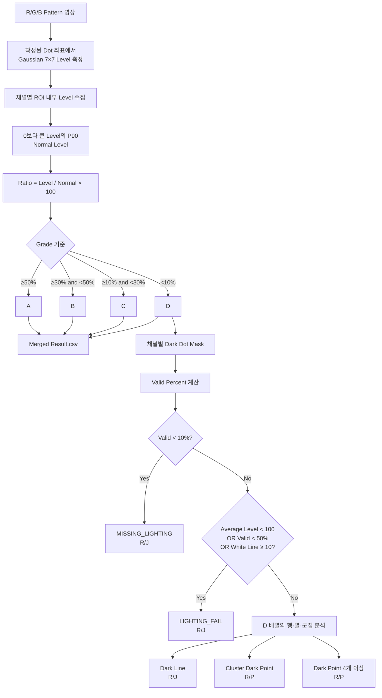

# 검사 등급 A/B/C/D와 Cell 판정 상세 분석

## 1. 문서 목적

이 문서는 uLED 암점 검사 결과의 A/B/C/D 등급과 Cell 최종 판정을 설명한다.

중점 분석 항목은 다음과 같다.

1. `Merged Result.csv`의 A/B/C/D가 어떤 값으로 결정되는가
2. Cell 전체 밝기가 낮을 때 상대 등급과 점등불량 판정이 어떻게 달라지는가
3. 암점이 Cell의 50%를 넘으면 어떤 규칙이 먼저 적용되는가
4. Recipe와 Config의 어떤 값이 등급과 최종 판정에 영향을 주는가

코드의 함수 이름을 나열하기보다 다음 책임을 구분해 이해하는 것이 목적이다.

- 개별 Dot의 밝기 측정
- 개별 Dot의 A/B/C/D 등급
- D Grade Dot의 공간적 분류
- Cell 전체의 점등 상태 판정
- 최종 Cell Judge 결정

분석 기준은 현재 Camera 검사, 현재 Recipe, 현재 `cell-judgment.yaml`, 현재 Export 구조다.

---

## 2. 가장 중요한 결론

A/B/C/D는 Cell 전체의 합격·불합격 등급이 아니다.

> A/B/C/D는 R/G/B 각 sub dot 하나의 측정 밝기가 해당 채널의 정상 기준 밝기에 비해 어느 정도인지를 나타내는 상대 밝기 등급이다.

Cell 최종 판정은 A/B/C/D를 그대로 합산하는 방식이 아니다.

현재 구조는 다음 두 단계로 분리된다.

```text
개별 Dot
Measured Level
→ Normal Level 대비 Ratio
→ A/B/C/D

Cell 전체
D Grade Dot + WD 명점
→ 점·선·군집·점등 상태 분석
→ 우선순위 규칙
→ OK / R/P / R/J
```

사용자 확정 운영 기준:

```text
A: Ratio ≥ 50%
B: 30% ≤ Ratio < 50%
C: 10% ≤ Ratio < 30%
D: Ratio < 10%
```

주의:

- 분석 시점의 저장 Recipe와 기존 F04 결과는 아직 `A=80%, B=30%, C=10%`다.
- 앞으로 적용해야 할 확정 기준은 `A=50%, B=30%, C=10%`다.
- 이 문서는 확정 기준을 본문 기준으로 사용하고, 기존 F04는 과거 A=80% 결과 검증 사례로 구분한다.

현재 Cell 판정에서 암점 마스크에 들어가는 Grade는 D다.

- A/B/C는 `DarkDots`에 포함되지 않는다.
- D 또는 missing 표시가 있는 Dot만 암점 후보로 사용한다.
- D가 많더라도 먼저 점등 비율과 평균 밝기를 검사한다.
- 점등 상태가 정상이면 D 배열을 암선·군집·개별 암점으로 분류한다.

---

## 3. 전체 판정 흐름



---

## 4. `Merged Result.csv`의 구조

현재 Export의 Header는 다음과 같다.

```text
Index,LED Type,Col,Row,Result,RepairType,Defect Code,
Xindex,level,referenceLevel,levelRatioPercent,cameraX,cameraY
```

등급을 이해할 때 중요한 열은 다음 네 개다.

| 열 | 의미 |
|---|---|
| `LED Type` | R/G/B 채널 |
| `level` | 확정된 카메라 좌표에서 측정한 Dot 밝기 |
| `referenceLevel` | 해당 채널의 정상 기준 밝기 |
| `levelRatioPercent` | `level ÷ referenceLevel × 100` |
| `Result` | Ratio로 계산한 A/B/C/D |

`RepairType`은 현재 Export에서 Grade를 다음처럼 표시한다.

| Result | RepairType |
|---|---|
| A | OK |
| B | OK |
| C | RP |
| D | RJ |

`RepairType`은 Merged Result 행의 표시값이다. 이것이 곧 Cell 전체의 최종 `R/P` 또는 `R/J` 판정이라는 뜻은 아니다.

Cell 최종 판정은 별도의 `CellJudgmentAnalyzer`가 전체 Dot의 분포를 다시 분석해서 결정한다.

---

## 5. Level은 어떻게 측정되는가

### 5.1 측정 위치

표준맵 또는 DenseMap이 각 Dot의 카메라 좌표를 먼저 확정한다.

- 표준맵 검사: 보정된 `std_map.csv` 좌표
- DenseMap 검사: 검출·Pitch 전파로 확정한 좌표
- G/B: R 기준 Phase Offset 또는 기준 채널과의 Phase 차이 적용

좌표가 틀리면 정상 Dot의 중심이 아니라 가장자리 또는 배경을 측정할 수 있으므로 낮은 Grade가 발생할 수 있다.

### 5.2 측정 방식

현재 RGB Pattern:

```text
LevelMetric = Gaussian7x7Bilinear
```

Dot 중심 주위 7×7 픽셀을 같은 비중으로 단순 평균하지 않고, 중심에 더 높은 가중치를 주는 Gaussian 방식으로 측정한다.

목적:

- 중심 한 픽셀 노이즈 감소
- sub pixel 좌표의 Bilinear 보간
- 작은 좌표 오차에 대한 안정성 확보

이 결과가 Merged Result의 `level`이다.

---

## 6. Normal Level

### 6.1 현재 기준

현재 RGB Recipe:

```text
NormalLevelPercentile = 90
Recipe UI 표시: Reference Top 10%
```

R/G/B 각 채널은 독립적으로 Normal Level을 계산한다.

현재 Recipe는 Point가 하나이므로 R, G, B 각각 하나의 Normal Level이 Merged Result의 해당 채널 전체 행에 사용된다.

### 6.2 계산 방법

1. ROI 안의 모든 유효 Dot Level을 수집한다.
2. Level이 0보다 큰 값만 Normal 후보로 사용한다.
3. 값을 오름차순 정렬한다.
4. 90% 위치의 값을 선형 보간한다.

개념식:

```text
Normal Level = Percentile(positive Dot Levels, 90)
```

P90은 다음 값이 아니다.

- 전체 평균
- 상위 10%의 평균
- Recipe에 저장된 고정 Gray 값
- 표준맵 생성 Cell의 밝기

현재 검사 Cell 자기 자신의 밝기 분포에서 구한 90 Percentile 값이다.

### 6.3 P90을 사용하는 이유

평균을 정상 기준으로 사용하면 암점이 많을수록 평균 자체가 내려간다. 그러면 암점 Ratio가 다시 올라가 불량이 축소될 수 있다.

P90은 비교적 밝은 정상 Dot 영역을 기준으로 삼아 일부 암점이 평균을 끌어내리는 영향을 줄이려는 구조다.

그러나 Cell 대부분이 균일하게 어두워지면 P90도 함께 낮아진다. 이 문제는 A/B/C/D가 아니라 별도의 Average Level 기반 `LIGHTING_FAIL`이 담당한다.

---

## 7. A/B/C/D 계산

### 7.1 기본 식

```text
Ratio Percent = Measured Level ÷ Normal Level × 100
```

사용자 확정 Grade:

```text
if Ratio ≥ 50 → A
else if Ratio ≥ 30 → B
else if Ratio ≥ 10 → C
else → D
```

경계값을 포함하는 방향에 주의해야 한다.

- 50.00%는 A
- 30.00%는 B
- 10.00%는 C
- 9.99%는 D

### 7.2 50%·30%는 무엇에 대한 비율인가

50%와 30%의 분모는 다음 값이다.

> 같은 Cell, 같은 Pattern, 같은 RGB 채널에서 계산한 Normal Level(P90)

따라서 A 50%는 다음 뜻이다.

```text
Measured Level이 그 Cell·그 채널의 Normal Level의 50% 이상
→ A
```

B 30%는 다음 뜻이다.

```text
Measured Level이 Normal Level의 30% 이상이지만 50% 미만
→ B
```

이 Percent는 다음 값의 비율이 아니다.

- 카메라 최대 Gray 255 대비 비율이 아님
- Threshold 50 대비 비율이 아님
- Cell 전체 평균 밝기 대비 비율이 아님
- 밝기 순위 상위 50%·30%의 Dot 개수 비율이 아님
- 전체 Dot 중 A 또는 B가 차지해야 하는 목표 비율이 아님
- R/G/B 세 채널을 합친 밝기 대비 비율이 아님
- 표준맵을 만든 기준 Cell의 밝기 대비 비율이 아님
- Recipe Exposure 값 대비 비율이 아님

R은 R 영상에서 계산한 R Normal을 사용하고, G와 B도 각자 자기 채널의 Normal을 사용한다.

```text
R Ratio = R Dot Level ÷ R Normal(P90) × 100
G Ratio = G Dot Level ÷ G Normal(P90) × 100
B Ratio = B Dot Level ÷ B Normal(P90) × 100
```

### 7.3 계산 예

Normal Level이 200인 경우:

| Measured Level | Ratio | Grade |
|---:|---:|---|
| 190 | 95% | A |
| 160 | 80% | A |
| 120 | 60% | A |
| 100 | 50% | A |
| 80 | 40% | B |
| 60 | 30% | B |
| 40 | 20% | C |
| 20 | 10% | C |
| 10 | 5% | D |

즉 Normal이 200이면 절대 Level 경계는 다음과 같다.

```text
A: Level ≥ 100
B: 60 ≤ Level < 100
C: 20 ≤ Level < 60
D: Level < 20
```

다른 Cell에서 Normal이 120으로 내려가면 같은 50%의 절대 Level 경계도 60으로 내려간다.

```text
Normal 120 × A 50% = Level 60
```

따라서 Grade Percent는 고정 Gray Level 기준이 아니라 Cell·채널마다 다시 계산되는 상대 기준이다.

현재 Merged Result는 `level`, `referenceLevel`, `levelRatioPercent`를 소수점 둘째 자리로 출력한다.

내부 계산은 더 높은 정밀도의 값으로 수행되므로 Grade 경계 부근에서는 CSV에 반올림되어 표시된 Ratio와 Result가 0.01% 정도 어긋나 보일 가능성이 있다.

---

## 8. 기존 F04 결과와 사용자 확정 기준 비교

검증 파일:

```text
D:\ELP\Project\01.SDC\A1\uLED\TEST_Result
\2026\07\30_BP_0110_LOCAL_RE1\F04
\VIS_1p33_BP_BP_0110_LOCAL_#F04_260730_RE1_Merged Result.csv
```

행 개수:

```text
R 146,604
G 146,604
B 146,604
합계 439,812
```

### 8.1 채널별 Reference와 Grade 분포

이 F04 파일은 저장 Recipe가 `A=80%, B=30%, C=10%`이던 시점에 생성된 기존 결과다.

| Channel | Reference | A | B | C | D |
|---|---:|---:|---:|---:|---:|
| R | 200.71 | 139,609 | 885 | 97 | 6,013 |
| G | 197.80 | 130,335 | 15,541 | 421 | 307 |
| B | 231.00 | 146,546 | 5 | 1 | 52 |

기존 A=80% 기준의 절대 Level 경계:

| Channel | A 최소 | B 최소 | C 최소 | D |
|---|---:|---:|---:|---:|
| R | 160.57 | 60.21 | 20.07 | 20.07 미만 |
| G | 158.24 | 59.34 | 19.78 | 19.78 미만 |
| B | 184.80 | 69.30 | 23.10 | 23.10 미만 |

실제 CSV의 Grade별 Ratio 범위는 이 파일을 생성한 기존 80/30/10 경계와 일치했다.

예:

```text
G A: 80.00% 이상
G B: 30.01~80.00% 부근
G C: 10.01~29.99%
G D: 9.59% 이하
```

표시값 반올림 때문에 80.00이 A와 B 양쪽 경계처럼 보일 수 있지만 이 기존 결과의 내부 판정은 `>= 80` 조건이었다.

### 8.2 사용자 확정 A=50% 기준으로 바뀌는 절대 Level 경계

동일한 F04 Reference에 사용자 확정 `A=50%, B=30%, C=10%`를 적용하면 경계는 다음과 같다.

| Channel | A 최소 | B 최소 | C 최소 | D |
|---|---:|---:|---:|---:|
| R | 100.36 | 60.21 | 20.07 | 20.07 미만 |
| G | 98.90 | 59.34 | 19.78 | 19.78 미만 |
| B | 115.50 | 69.30 | 23.10 | 23.10 미만 |

변화:

- 기존 Ratio 50~80%의 B Dot이 A로 이동한다.
- B/C 경계 30%는 그대로다.
- C/D 경계 10%도 그대로다.
- 따라서 D 개수와 암점 50%·90% 판정은 A만 80→50으로 변경하는 경우 변하지 않는다.

기존 CSV의 `Result` 열은 자동으로 다시 계산되지 않는다. 새 기준을 실제 검사에 적용하려면 Recipe 공통 A 기준을 50으로 저장하고 IP에 다시 업로드한 뒤 재검사해야 한다.

---

## 9. 전체 밝기가 낮을 때

### 9.1 균일하게 모두 어두운 경우

예를 들어 한 채널의 모든 Dot이 거의 80 Level이라고 가정한다.

```text
P90 Normal ≈ 80
각 Dot Ratio ≈ 80 ÷ 80 × 100 = 100%
개별 Grade ≈ A
```

즉 상대 등급만 보면 A가 많을 수 있다.

하지만 Cell Judgment는 채널 전체 평균을 별도로 확인한다.

현재 기준:

```text
Average Level = 채널의 모든 Dot Level 합 ÷ Total Dot Count

Average Level < 100
→ LIGHTING_FAIL
→ Cell R/J
```

Average에는 A/B/C/D Dot이 모두 들어간다. D만 제외하거나 정상 Dot만 평균내는 방식이 아니다.

따라서 전체가 균일하게 어두운 Cell을 상대 Grade만으로 정상 처리하지 않도록 별도의 절대 평균 밝기 안전망을 둔다.

### 9.2 전체가 어둡고 밝기 편차도 큰 경우

일부 Dot은 비교적 밝고 많은 Dot이 매우 어두우면:

- P90은 밝은 상위 영역을 Normal로 유지할 수 있다.
- 어두운 Dot의 Ratio가 10% 미만으로 내려가 D가 증가한다.
- 평균 Level도 내려갈 수 있다.

이때 다음 두 판정이 동시에 가능하다.

- D 증가에 따른 유효 픽셀 비율 저하
- Average Level 100 미만

Cell Judgment는 이 조건을 순서대로 검사하고 `MISSING_LIGHTING` 또는 `LIGHTING_FAIL`로 우선 분류한다.

### 9.3 거의 모든 Dot이 함께 낮아진 경우

P90은 검사 Cell 자신의 분포에서 구하므로 전체 분포가 낮아지면 Normal도 낮아진다.

이 경우 D Grade 비율이 예상보다 적을 수 있다. 그러나 Average Level은 절대 측정값이므로 100 미만이면 `LIGHTING_FAIL`이 된다.

이것이 현재 설계에서 상대 Grade와 절대 점등 상태를 분리한 이유다.

---

## 10. 암점 50%의 정확한 의미

### 10.1 Cell Judgment가 세는 암점

현재 Export 입력에서 다음 조건만 `DarkDots`가 된다.

```text
Grade == D
또는
missing == true
```

C Grade는 Merged Result에서 `RP`로 표시되지만 현재 Cell Judgment의 암점 개수에는 포함되지 않는다.

### 10.2 유효 픽셀 비율

채널별 계산식:

```text
Valid Percent
= (Total Dot Count - Dark Dot Count) ÷ Total Dot Count × 100
```

현재 채널당 Dot 수가 146,604개이므로:

```text
D 73,302개 = 정확히 50%
D 73,303개 이상 = 50% 초과
```

### 10.3 50%를 초과하면

현재 기준:

```text
Valid Percent < 50%
→ LIGHTING_FAIL
→ R/J
```

따라서 한 RGB 채널에서 D 또는 missing Dot이 50%를 초과하면 그 채널은 개별 암점이 많은 Cell로 처리되지 않고 Pattern/채널 전체의 점등불량으로 분류된다.

이 경우 해당 채널은 다음 상세 분석을 건너뛴다.

- 암선
- 군집성 암점
- 개별 암점

대표 원인을 수천 개의 개별 암점이 아니라 `LIGHTING_FAIL` 하나로 표현하려는 구조다.

### 10.4 정확히 50%이면

조건은 `< 50`이다.

```text
Valid Percent == 50%
```

이면 유효 비율 조건만으로는 `LIGHTING_FAIL`이 아니다.

하지만 다음 중 하나면 여전히 `LIGHTING_FAIL`이다.

- Average Level < 100
- White Line 개수 ≥ 10

이 조건도 모두 통과하면 D Dot의 배열을 암선·군집·개별 암점으로 분석한다.

### 10.5 90%를 초과하면

현재 미점등 기준:

```text
Valid Percent < 10%
→ MISSING_LIGHTING
→ R/J
```

이는 암점 비율로 바꾸면 90% 초과다.

현재 146,604개 기준:

```text
D 또는 missing 131,944개 이상
→ Valid Percent < 10%
→ MISSING_LIGHTING
```

미점등 검사가 점등불량 검사보다 먼저 실행되므로 90% 초과 구간은 `LIGHTING_FAIL`이 아니라 `MISSING_LIGHTING`이 대표 원인이 된다.

---

## 11. 50%라는 값은 두 곳에서 서로 다른 의미로 사용된다

현재 `cell-judgment.yaml`에는 50%가 두 번 나온다.

### 11.1 채널 전체 유효 픽셀 50%

```text
lightingFail.minValidPixelPercent = 50
```

대상:

- 한 R/G/B 채널의 전체 Dot

판정:

```text
유효 Dot < 50%
→ LIGHTING_FAIL
```

### 11.2 한 행 또는 한 열의 결함 비율 50%

```text
line.minDefectRatioPercent = 50
```

대상:

- 특정 행 하나
- 또는 특정 열 하나

판정:

```text
해당 행/열에서 D Dot 비율 ≥ 50%
→ DARK_LINE
```

현재 논리 행·열 길이는 432이므로 한 행 또는 열에 D가 216개 이상이면 비율 조건으로 Line이 된다.

Line은 비율 조건 외에도 다음 조건을 가진다.

```text
연속 D Dot ≥ 20개
→ DARK_LINE
```

따라서 Cell 전체 암점이 50% 미만이어도 특정 행에 20개가 연속되면 암선으로 판정될 수 있다.

---

## 12. 점·선·군집 분류

점등 상태 검사를 통과한 채널만 D Dot 배열을 분석한다.

### 12.1 암선

한 행 또는 열이 다음 중 하나를 만족하면 암선이다.

```text
연속 D Dot ≥ 20
또는
행/열 전체 길이 대비 D 비율 ≥ 50%
```

현재 Cell 최종 규칙:

```text
DARK_LINE 1개 이상
→ R/J
```

### 12.2 군집성 암점

암선을 제외한 D Dot 중 상하좌우와 대각선을 포함한 8방향으로 붙어 있는 Dot을 하나의 군집으로 묶는다.

현재 기준:

```text
RGB 채널별: 붙은 D Dot 10개 이상
W 공통 위치: 동일 Dot의 R/G/B가 모두 D이고 5개 이상 연결
```

W 공통 군집은 R/G/B 세 채널이 모두 `MISSING_LIGHTING`과 `LIGHTING_FAIL` 없이 상세 분석 단계까지 들어온 경우에만 계산한다.

현재 Cell 최종 규칙:

```text
CLUSTER_DARK_POINT 1개 이상
→ R/P
```

### 12.3 개별 암점

암선과 군집에 포함되지 않은 나머지 D Dot을 개별 암점으로 센다.

현재 Cell 최종 규칙:

```text
DARK_POINT 4개 이상
→ R/P

3개 이하
→ 암점 규칙만으로는 Cell NG 아님
```

---

## 13. Cell 최종 판정 우선순위

현재 규칙 순서는 다음과 같다.

| 우선순위 | 유형 | 발동 조건 | Cell Judge |
|---:|---|---:|---|
| 1 | MISSING_LIGHTING | 1채널 이상 | R/J |
| 2 | LIGHTING_FAIL | 1채널 이상 | R/J |
| 3 | BRIGHT_LINE | 1개 이상 | R/J |
| 4 | DARK_LINE | 1개 이상 | R/J |
| 5 | BRIGHT_POINT | 1개 이상 | R/J |
| 6 | CLUSTER_DARK_POINT | 1개 이상 | R/P |
| 7 | DARK_POINT | 4개 이상 | R/P |
| 마지막 | 해당 없음 | - | OK |

목록에서 먼저 만족한 규칙이 Cell 대표 판정과 대표 Defect Name이 된다.

예:

- 암선과 군집이 함께 있으면 `DARK_LINE / R/J`
- 점등불량과 암선이 함께 가능하면 `LIGHTING_FAIL / R/J`
- 군집 1개와 개별 암점 100개가 있으면 `CLUSTER_DARK_POINT / R/P`

하위 유형의 통계가 모두 사라진다는 뜻은 아니다. 대표 판정만 우선순위가 높은 유형으로 결정된다.

---

## 14. F04 실제 Cell 판정 검증

F04 Merged Result의 D 개수:

```text
R D = 6,013
G D =   307
B D =    52
총 D = 6,372
```

각 채널 D 비율:

```text
R = 4.102%
G = 0.209%
B = 0.035%
```

각 채널 평균:

```text
R = 181.13
G = 179.08
B = 226.62
```

판정 해석:

1. D 비율이 50%를 넘지 않는다.
2. 평균이 100 미만도 아니다.
3. 따라서 `LIGHTING_FAIL`이 아니다.
4. D 배열의 선·군집·개별 점 분석을 수행한다.
5. 2,214개의 D Dot이 67개 군집에 포함됐다.
6. 남은 개별 암점은 4,158개다.
7. 군집 규칙이 개별 암점 규칙보다 먼저이므로 대표 판정은 `Cluster Dark Point / R/P`다.

실제 Summary:

```text
Cell Judge = R/P
Defect Name = Cluster Dark Point
Black = 4,158
Cluster = 67
Light Fail = 0
Miss Light = 0
```

계산 관계:

```text
전체 D 6,372
- 군집에 포함된 D 2,214
= 개별 Black 4,158
```

실제 결과와 현재 코드의 분류 로직이 일치한다.

---

## 15. Recipe에서 A/B/C/D에 직접 영향을 주는 값

### 15.1 NormalLevelPercentile

현재:

```text
90
```

영향:

- 높이면 더 밝은 값을 Normal로 선택한다.
- 같은 Level의 Ratio가 낮아진다.
- B/C/D가 증가하는 방향이다.

- 낮추면 Normal이 낮아진다.
- 같은 Level의 Ratio가 높아진다.
- A/B가 증가하는 방향이다.

예:

```text
Measured = 100

Normal = 200 → Ratio 50% → A
Normal = 120 → Ratio 83.3% → A
```

### 15.2 Grade A/B/C 기준

사용자 확정 기준:

```text
A Min = 50
B Min = 30
C Min = 10
```

이 값은 Grade 경계를 직접 결정한다.

- A Min을 올리면 A 일부가 B로 이동한다.
- B Min을 올리면 B 일부가 C로 이동한다.
- C Min을 올리면 C 일부가 D로 이동한다.

Cell Judgment는 D만 암점으로 사용하므로 C Min 변경은 Cell 암점 개수와 점등 비율에 특히 직접적인 영향을 준다.

예:

```text
Ratio 15%

C Min 10 → C
C Min 20 → D
```

같은 영상인데 C Min만 바꿔도 D 비율이 증가하여 암점, 암선, 군집, 점등불량 판정까지 달라질 수 있다.

### 15.3 LevelMetric

현재:

```text
Gaussian7x7Bilinear
```

측정 Level 자체를 결정하므로 Grade에 직접 영향을 준다.

다른 측정 방식 또는 좌표 보간 방식이면 같은 영상·같은 좌표에서도 Level이 달라질 수 있다.

### 15.4 UseAbsoluteLevel

모델의 설계 의도는 `true`일 때 A/B/C 기준을 Ratio가 아니라 Gray 절대 Level과 직접 비교하는 것이다.

그러나 현재 Camera 결과 저장 및 `Merged Result.csv` 경로는 저장된 Ratio로 Grade를 다시 계산한다.

따라서 현재 Merged Result 기준으로는 `UseAbsoluteLevel=true`를 완전한 절대 Level 판정으로 신뢰할 수 없다.

현재 Recipe는 `false`이므로 실제 운영 결과는 상대 Ratio 방식이다.

### 15.5 공통 Recipe

현재 R/G/B:

```text
UseCommonRecipe = true
```

Runtime Recipe를 만들 때 R/G/B 개별 Inspection Config보다 공통 Inspection Config가 우선 적용된다.

현재 공통 값:

```text
Normal P90
A 80
B 30
C 10
Absolute false
```

이 값은 분석 시점의 저장 상태이며 사용자 확정 A=50과 불일치한다.

실제 적용을 위해 필요한 변경:

```text
공통 Inspection Config
A Min: 80 → 50
B Min: 30 유지
C Min: 10 유지
```

R/G/B가 공통 설정을 사용하므로 개별 Pattern의 A 값만 50으로 바꾸면 Runtime에서 공통 A=80으로 다시 덮어쓸 수 있다.

변경 후 다음 순서로 확인해야 한다.

1. Recipe 저장
2. IP Recipe 재업로드
3. IP `Point 검사 시작 / Conditions` 로그에서 `Grade=A>=50,B>=30,C>=10` 확인
4. 새 Merged Result의 Ratio 50~80% 행이 A로 기록되는지 확인

---

## 16. Grade에 간접 영향을 주는 Recipe 값

다음 값은 Grade 공식에 직접 들어가지는 않지만 `Measured Level` 또는 측정 좌표를 바꾸므로 결과에 영향을 준다.

### 16.1 Exposure와 Gain

- Exposure/Gain이 낮으면 Dot Level이 내려간다.
- 채널 전체가 함께 내려가면 P90도 내려가 상대 Grade는 유지될 수 있다.
- 그러나 Average Level 100 미만으로 `LIGHTING_FAIL`이 될 수 있다.
- 일부 Dot만 더 크게 내려가면 C/D가 증가한다.

### 16.2 ROI

- Normal 후보에 들어갈 Dot 범위를 결정한다.
- ROI가 잘리면 P90 모집단이 바뀐다.
- 표준맵 좌표가 ROI 밖이면 해당 Dot 결과가 제외될 수 있다.

### 16.3 Pitch·Phase Offset·표준맵

- Dot을 측정할 카메라 좌표를 결정한다.
- Phase가 틀리면 G/B Dot 중심 대신 주변 배경을 측정할 수 있다.
- 표준맵 정합이 틀리면 전체 채널의 Level이 낮아질 수 있다.
- Pitch 또는 DenseMap anchor가 틀리면 외곽으로 갈수록 좌표 오차가 커질 수 있다.

### 16.4 Threshold·Blob

현재 RGB 설정:

```text
Threshold = 50
ThresholdCandidates = 비어 있음
BackgroundFlattenEnabled = true
Area = 20~500 px²
Blob Width/Height = 4~18 px
```

#### 16.4.1 Threshold 50과 Grade A 50%는 완전히 다른 값이다

두 값이 모두 50이라도 계산 대상과 단위가 다르다.

```text
검출 Threshold 50
= 검출용 영상의 픽셀 값이 50보다 밝은가

Grade A 50%
= 최종 측정 Level이 Normal Level의 50% 이상인가
```

비교:

| 구분 | Threshold | Grade Percent |
|---|---|---|
| 적용 대상 | 검출용 영상의 개별 카메라 픽셀 | 한 Dot의 Gaussian 7×7 측정 Level |
| 기준값 | 현재 50 Gray/contrast level | 채널 Normal P90 |
| 목적 | Blob/Object와 Spot 검출 | A/B/C/D 등급 |
| 표준맵 검사 | 배치 확인용 표본 Spot에 사용 | 모든 최종 맵 좌표에 사용 |
| DenseMap 검사 | Seed·anchor·맵 생성에 사용 | 확정된 전체 맵 좌표에 사용 |

따라서 다음 식에는 Threshold가 들어가지 않는다.

```text
Ratio = Measured Level ÷ Normal Level × 100
```

Threshold를 50에서 30으로 바꿨다고 Grade A 기준이 30%로 바뀌지 않는다. Grade A는 Recipe의 `GradeAMinRatioPercent`가 결정한다.

#### 16.4.2 배경 평탄화가 켜진 현재 Threshold의 의미

현재는 검출 전에 White Top-hat 배경 평탄화를 수행한다.

```text
검출용 값 = 원본 영상 - 지역 배경 Opening
```

그러므로 현재 Threshold 50은 원본 Gray Level이 50 이상이라는 뜻보다 다음 의미에 가깝다.

> 주변 지역 배경보다 약 50 Level 이상 돌출된 밝은 구조를 Object 후보로 만든다.

최종 Grade의 `Measured Level`은 이 Top-hat 값을 사용하지 않는다. 원래 검사 Gray 영상의 확정 좌표에서 Gaussian 7×7로 측정한다.

#### 16.4.3 표준맵 검사에서 Threshold

표준맵 검사는 `std_map.csv` 좌표를 기준으로 시작한다.

Threshold의 역할:

1. 화면 전체에서 약 192개의 분산 표본 좌표를 선택한다.
2. 각 표준맵 예상 좌표 주변의 작은 탐색창에서 밝은 Spot을 검출한다.
3. Spot 중심과 표준맵 좌표의 대응쌍으로 이동·회전·배율을 계산한다.
4. Edge·Guard 위치가 올바른지 검증한다.

중요:

- Threshold를 통과하지 못한 Dot도 표준맵 좌표가 확정되면 최종 Level을 측정한다.
- 개별 암점이 Threshold를 통과해야만 D Grade가 되는 구조가 아니다.
- Threshold는 표준맵 좌표의 배치 신뢰도를 확인하는 역할이다.

Threshold가 너무 높으면:

- 정상 Spot도 작아지거나 사라진다.
- 표본 대응쌍이 감소한다.
- 20쌍 미만이면 `fixed-prior(detect-fail)`이 될 수 있다.
- Edge·Guard 검증이 실패하여 DenseMap 자동정합으로 넘어갈 수 있다.

Threshold가 너무 낮으면:

- 배경 노이즈와 반사광이 Spot 후보가 된다.
- Spot이 주변 배경 또는 다른 구조와 합쳐질 수 있다.
- Blob 최대 크기를 초과해 탈락하거나 잘못된 중심이 계산될 수 있다.
- 잘못된 Similarity 또는 자동정합 후보를 만들 수 있다.

표준맵 배치가 같은 좌표로 정상 확정된다면 Threshold 변경만으로 최종 A/B/C/D 수식은 변하지 않는다.

#### 16.4.4 DenseMap 검사에서 Threshold

DenseMap은 영상에서 검출한 Object로 기준 맵을 만든다.

```text
Threshold
→ Connected Component
→ Area/Blob 필터
→ Object 중심
→ Seed
→ Pitch chain
→ DenseMap 좌표
```

Threshold가 너무 높으면:

- 정상 Dot Object 수가 감소한다.
- R 채널 맵 확정이 실패하고 G 또는 B를 기준 채널로 시도할 수 있다.
- 세 채널 모두 실패하면 ROI 중심 예상 배치로 Level을 측정한다.
- 실제 Dot과 예상 좌표가 다르면 Level이 낮아져 오검이 발생할 수 있다.

Threshold가 너무 낮으면:

- 배경 노이즈가 Object가 된다.
- 여러 Dot이 하나의 큰 Blob으로 합쳐질 수 있다.
- 잘못된 Object가 Seed 또는 인접 anchor가 될 수 있다.
- 좌표가 한 칸 밀리거나 실제 중심에서 벗어날 수 있다.

DenseMap에서도 최종 Grade는 Threshold Blob의 밝기를 등급화하는 것이 아니다. DenseMap으로 확정한 모든 좌표에서 Level을 다시 측정한다.

#### 16.4.5 Threshold를 올리거나 내릴 때 영상에서 보이는 변화

Threshold 50 → 70:

```text
Binary에서 흰색으로 남는 영역 감소
→ Blob 면적·폭·높이 감소
→ 어두운 Dot Object 누락 증가
→ 좌표 정합 anchor 감소
```

Threshold 50 → 30:

```text
Binary에서 흰색으로 남는 영역 증가
→ Blob 면적·폭·높이 증가
→ 어두운 Dot 검출 가능성 증가
→ 배경·노이즈·Blob 병합 위험 증가
```

따라서 Threshold는 낮을수록 무조건 좋은 값도, 높을수록 엄격해서 좋은 값도 아니다. 실제 정상 Dot의 Blob 크기와 배경 분리 상태가 Area·Width·Height 조건 안에 안정적으로 들어오는 값을 선택해야 한다.

#### 16.4.6 Threshold가 Grade에 간접 영향을 주는 경우

Threshold가 Grade를 간접적으로 바꾸는 경로:

```text
Threshold 변경
→ 검출 Object 변경
→ 표준맵 정합 또는 DenseMap 좌표 변경
→ Gaussian 7×7 측정 위치 변경
→ Measured Level·Normal 분포 변경
→ Ratio·Grade 변경
```

반대로 다음 조건이면 Grade는 원칙적으로 유지된다.

```text
Threshold를 변경했지만
→ 최종 확정 좌표가 동일하고
→ 원본 검사 영상도 동일하다면
→ Measured Level과 Normal이 동일
→ A/B/C/D도 동일
```

즉 Threshold의 Grade 영향은 **등급 공식에 직접 들어가는 영향이 아니라 좌표 확정의 변화로 발생하는 간접 영향**이다.

#### 16.4.7 Blob과의 결합

Threshold 후 생성된 연결 성분이 다음 조건을 모두 통과해야 Object가 된다.

```text
Area 20~500
Width 4~18
Height 4~18
```

Threshold를 낮추면 Blob이 커지므로 MaxArea/MaxWidth/MaxHeight에서 탈락할 수 있고, Threshold를 높이면 Blob이 작아져 MinArea/MinWidth/MinHeight에서 탈락할 수 있다.

따라서 Threshold는 Blob 필터와 함께 조정해야 한다.

### 16.5 Background Flatten

배경 평탄화는 Threshold 검출용 영상에 적용된다. 최종 Level 측정값을 Top-hat 값으로 바꾸는 설정은 아니다.

따라서 Grade에 직접 적용되지는 않지만 표준맵/DenseMap 좌표 정합에 간접 영향을 준다.

---

## 17. Grade와 Defect Type에 영향을 주지만 서로 다른 값

### 17.1 GradeDefectPolicy

현재 Recipe:

```text
A → OK
B → OK
C → Repair
D → Reject

Selected Defect Type = Reject
```

의미:

- Grade 자체는 사용자 확정 기준 50/30/10으로 계산해야 한다.
- 분석 시점 저장 Recipe는 아직 80/30/10이므로 공통 A 값을 50으로 변경해야 한다.
- Grade를 운영자용 Type으로 변환하는 규칙은 별도다.
- 현재 선택된 Defect Type은 `Reject`이므로 D가 IP Defect 목록의 주 대상이다.

Merged Result에는 모든 A/B/C/D가 기록된다.

Cell Judgment의 `DarkDots`도 Grade D를 직접 사용하므로 현재 C는 암점 개수에 포함되지 않는다.

### 17.2 DefectCutoffGrade

Recipe와 UI에 `DefectCutoffGrade=D`가 존재한다.

현재 본검사와 Merged Result의 Grade 판정은 이 값을 사용하지 않는다.

현재 기준은 다음 두 항목이다.

- `GradeSpec`의 A/B/C 하한
- `GradeDefectPolicy`의 Grade → Type 및 선택 Type

`DefectCutoffGrade`만 변경해서 암점 범위를 바꿀 수 없다.

### 17.3 White Defect Threshold

`WhiteDefect.ThresholdPercent=50`은 다른 RGB 위상 위치에서 비정상 발광을 찾는 명점 기준이다.

A/B/C/D 암점 Grade 경계와는 별개다.

---

## 18. Cell Judgment Config에서 영향을 주는 값

현재 파일:

```text
C:\elp\uLedAoi\Config\cell-judgment.yaml
```

### 18.1 미점등

```text
missingLighting.minValidPixelPercent = 10
```

- 낮추면 더 심하게 꺼져야 미점등이 된다.
- 높이면 더 적은 암점 비율에서도 미점등이 된다.

### 18.2 점등불량

```text
lightingFail.minAverageLevel = 100
lightingFail.minValidPixelPercent = 50
lightingFail.minWhiteLineCount = 10
```

세 조건은 OR다.

하나만 만족해도 해당 채널은 `LIGHTING_FAIL`이다.

### 18.3 암선

```text
line.minConsecutiveDefects = 20
line.minDefectRatioPercent = 50
```

두 조건도 OR다.

- 연속 기준을 낮추면 짧은 선도 암선이 된다.
- 비율 기준을 낮추면 행·열에 분산된 D도 암선이 되기 쉽다.

### 18.4 군집

```text
cluster.rgb.minPixels = 10
cluster.white.minPixels = 5
```

- RGB는 한 채널의 연결된 D Dot
- White는 같은 논리 Dot 위치에서 R/G/B가 모두 D인 연결 군집

### 18.5 최종 규칙

```text
DARK_POINT minCount = 4
CLUSTER_DARK_POINT minCount = 1
DARK_LINE minCount = 1
```

이 값들은 A/B/C/D를 바꾸지 않는다. A/B/C/D 결과를 Cell 최종 판정으로 변환하는 단계에 영향을 준다.

---

## 19. 영향을 주지 않는 설정

다음 값은 A/B/C/D 계산이나 Cell 판정에 영향을 주지 않는다.

- Save Original Images
- Export after Inspect
- Thumbnail Width
- Crop 생성 개수
- 결과 폴더명
- DotIndexOrigin
- DotIndexBase
- DotIndexSwapXY

Dot index 관련 값은 표시·CSV의 row/column 변환에는 영향을 주지만 측정 Level과 Grade 자체는 바꾸지 않는다.

---

## 20. 자주 혼동하는 항목

### 20.1 Threshold 50과 Grade 50%

서로 관계없는 값이다.

```text
Threshold 50
→ 밝은 Object 검출 기준

Ratio 50%
→ Measured / Normal의 상대 밝기
→ 사용자 확정 기준 Grade A
```

### 20.2 Reference Top 10%와 상위 10% 평균

현재 UI의 Reference Top 10%는 내부 `NormalLevelPercentile=90`으로 저장된다.

이는 상위 10% 평균이 아니라 전체 정렬 분포의 P90 한 위치 값이다.

### 20.3 D Grade 개수와 Summary Black

Summary Black은 전체 D 개수와 같지 않을 수 있다.

처리 순서:

```text
전체 D
→ 암선에 포함된 D 분리
→ 군집에 포함된 D 분리
→ 남은 D만 개별 Black
```

F04:

```text
전체 D 6,372
군집 소속 2,214
개별 Black 4,158
```

### 20.4 C Grade와 Cell 암점

현재 Merged Result:

```text
C → RepairType RP
```

현재 Cell Judgment:

```text
DarkDots → D만 포함
```

따라서 C가 많이 존재해도 현재 암점 개수 50% 계산에는 포함되지 않는다.

---

## 21. 장비 개발자의 관점에서 본 설계 의도

현재 구조는 다음 문제를 서로 분리하려는 설계다.

### 21.1 개별 Dot 상대 불량

같은 채널 안에서 정상 Dot보다 얼마나 어두운지를 A/B/C/D로 표현한다.

촬영마다 광량이 조금 달라도 Normal P90으로 정규화하여 상대 불량을 비교하려는 목적이다.

### 21.2 채널 전체 점등 문제

전체가 함께 어두워지면 상대 Ratio만으로는 정상처럼 보일 수 있다.

이를 Average Level과 Valid Percent로 별도 검출한다.

### 21.3 공간적 불량 형태

같은 D 개수라도 의미가 다르다.

- 흩어진 10개
- 한 줄로 연속된 10개
- 8방향으로 붙은 10개
- 전체의 50%를 넘는 D

따라서 개수만 세지 않고 점·선·군집·점등 상태로 다시 분류한다.

### 21.4 대표 판정

여러 불량이 동시에 있어도 설비와 운영자가 가장 먼저 확인해야 할 원인을 하나로 제시하기 위해 우선순위 규칙을 사용한다.

---

## 22. 판정 확인 절차

`Merged Result.csv`에서 결과를 검증하려면 다음 순서로 본다.

### 1단계: 채널별 Reference 확인

```text
R/G/B의 referenceLevel이 각각 얼마인가?
```

Reference가 지나치게 낮으면 전체 저휘도 가능성을 확인한다.

### 2단계: 개별 행 계산

```text
level ÷ referenceLevel × 100
```

새 검사 결과는 50/30/10 경계와 맞는지 확인한다.

기존 F04처럼 A=80으로 생성된 과거 결과는 해당 실행 Recipe의 80/30/10 경계로 확인한다.

### 3단계: 채널별 D 개수

```text
D Count ÷ Total Count × 100
```

- 50% 초과: Lighting Fail 후보
- 90% 초과: Missing Lighting 후보

### 4단계: 평균 Level

Summary의 Channel Mean을 확인한다.

```text
Mean < 100
→ Lighting Fail
```

### 5단계: 공간 분류

`defects.csv`와 Summary에서 다음을 확인한다.

- BVL/BHL: 암선
- Cluster: 군집
- Black: 선·군집 제외 후 개별 암점

### 6단계: 대표 우선순위

Summary의 Defect Name이 현재 `cell-judgment.yaml`의 첫 번째 만족 규칙과 일치하는지 확인한다.

---

## 23. 2회 검증 결과

### 23.1 1차 검증: Docs → 현재 코드

검증한 내용:

| 항목 | 검증 결과 |
|---|---|
| Normal 기준 | ROI 내부 positive Level의 P90 |
| Ratio | Measured / Normal × 100 |
| Grade | A/B/C 하한 순차 비교, 나머지 D |
| Merged Result | Pixel data Grade를 Result로 기록 |
| DarkDots | D 또는 missing만 포함 |
| Valid Percent | `(Total-Dark)/Total×100` |
| Missing Lighting | Valid < 10% |
| Lighting Fail | Average < 100 OR Valid < 50% OR White Line ≥ 10 |
| Dark Line | 연속 20 OR 행·열 비율 ≥ 50% |
| Cluster | RGB 10개, White 5개 |
| 최종 판정 | 설정 목록의 첫 만족 규칙 |

문서 불일치도 확인했다.

`docs/rgb-level-inspection-algorithm.md` 일부 구간에는 과거 기본값인 A 90, B 50, C 30 등의 설명이 남아 있다.

현재 코드의 판정 구조는 Recipe의 A/B/C 하한을 그대로 사용한다.

사용자 확정 운영값:

```text
A 50
B 30
C 10
D < 10
```

분석 시점 저장 Recipe의 미적용 상태:

```text
A 80
B 30
C 10
D < 10
```

따라서 공통 A 값을 50으로 변경·저장·업로드하기 전까지는 기존 80 기준이 Runtime에 들어간다. 문서의 확정값만 수정한다고 검사 결과가 바뀌지는 않는다.

### 23.2 2차 검증: 기존 Recipe → 실제 CSV·Summary

검증 대상:

- 기존 저장 Recipe의 P90, 80/30/10
- 최신 F04 Merged Result 439,812행
- F04 Summary
- F04 defects.csv

검증 결과:

| 항목 | 결과 |
|---|---|
| 채널당 행 수 | 146,604로 일치 |
| Ratio와 Grade 경계 | 80/30/10과 일치 |
| 전체 D | 6,372 |
| Cluster 수 | 67 |
| Cluster 소속 D | 2,214 |
| 남은 Black | 4,158 |
| 산술 검증 | 6,372 - 2,214 = 4,158 |
| 평균 Level | R/G/B 모두 100 이상 |
| D 비율 | 모든 채널 50% 미만 |
| 최종 판정 | Cluster Dark Point / R/P |

기존 설정, 코드, 실제 산출물 세 경로가 F04 결과에서 일치했다.

사용자 확정 A=50은 아직 실제 재검사 산출물로 검증된 값이 아니다. 적용 후 새 CSV에서 Ratio 50~80% 구간이 A로 이동하는지 확인해야 한다.

---

## 24. 최소 코드 확인 경로

전체 코드를 읽지 않고 등급과 Cell 판정만 확인하려면 다음 순서가 적절하다.

1. `uLed.Contracts/Models/RecipeModels.cs`
   - `InspectionConfigModel`
   - `GradeSpecModel`
   - `GradeDefectPolicyModel`

2. `uLedIp/Inspection/PointGridInspectionAlgorithm.cs`
   - ROI Level 수집
   - Normal Percentile
   - Ratio와 Grade

3. `uLedAoiConsole/Services/InspectionReplay/GlassInspectionOutputWriter.cs`
   - Pixel block을 CSV로 복원
   - Ratio 기반 Grade 기록

4. `uLed.Export/Services/CustomerExportService.cs`
   - `Merged Result.csv`
   - Channel Summary
   - Cell Judgment 입력 구성

5. `uLed.Contracts/Judgment/CellJudgmentAnalyzer.cs`
   - Missing Lighting
   - Lighting Fail
   - 선·군집·개별 점 분석

6. `uLed.Contracts/Judgment/CellJudgeEvaluator.cs`
   - 최종 우선순위 판정

7. `C:\elp\uLedAoi\Config\cell-judgment.yaml`
   - 현재 운영 판정 수치

---

## 25. 관련 분석 문서

- `Docs_Analyze/Recipe-GlassSize-Config-검사파라미터-영향분석.md`
- `Docs_Analyze/Threshold-해상도-DenseMap-Defect분석.md`
- `Docs_Analyze/표준맵-Shift와-Defect검출-상세분석.md`
- `docs/dense-local-template-grid-indexer.md`
- `docs/rgb-level-inspection-algorithm.md`
- `docs/cell-judgment-config-draft.yaml`

---

## 26. 최종 정리

```text
A/B/C/D
= 개별 sub dot의 상대 밝기 등급

Normal
= 해당 Cell·채널의 positive Level P90

A 50%
= Measured Level이 해당 채널 Normal P90의 50% 이상

B 30%
= Measured Level이 Normal의 30% 이상 50% 미만

D
= 현재 Cell Judgment의 암점 후보

D > 50%
= Valid < 50%
= LIGHTING_FAIL / R/J

D > 90%
= Valid < 10%
= MISSING_LIGHTING / R/J

전체가 균일하게 어두움
= 상대 Grade는 높을 수 있음
하지만 Average < 100이면 LIGHTING_FAIL

점등 상태 정상
= D 배열을 암선·군집·개별 암점으로 분류
```

`Merged Result.csv`의 A/B/C/D만 보고 Cell 최종 판정을 해석하면 안 된다.

정확한 해석 순서는 다음과 같다.

```text
Merged Result의 Level·Reference·Ratio·Grade
→ 채널별 D 비율과 평균 Level
→ defects.csv의 선·군집 결과
→ cell-judgment.yaml 우선순위
→ Summary의 Cell Judge와 Defect Name
```
