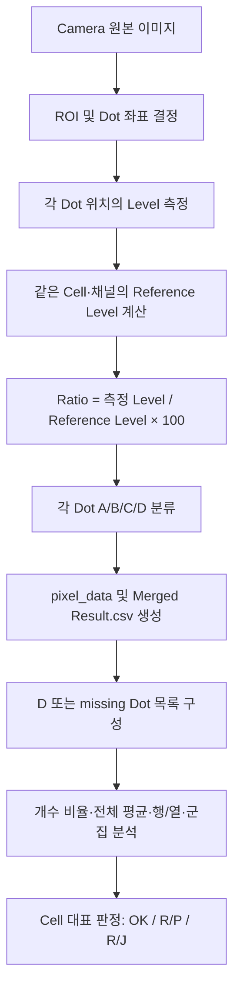

# 검사 등급 A/B/C/D와 Cell 판정 상세 분석

> 작성 기준: 2026-07-31 로컬 소스, 운영 Config, 저장 Recipe, 실제 검사 산출물
>
> 분석 범위: Camera 검사에서 생성되는 Dot Level, Reference Level, A/B/C/D, `Merged Result.csv`, Cell 판정
>
> 검증 방법: 1차 Docs ↔ 코드, 2차 Recipe ↔ 실제 CSV/summary 교차검증 후 문서 자체 재검증

---

## 1. 먼저 알아야 할 결론

검사에는 서로 다른 두 종류의 퍼센트가 있다.

1. **Dot 밝기 등급 퍼센트**
   - 한 Dot의 측정 Level을 같은 Cell·같은 채널의 Reference Level로 나눈 밝기 비율이다.
   - 이 비율로 각 Dot을 A/B/C/D로 분류한다.
   - `A 50%, B 30%, C 10%`는 Dot 개수의 50%·30%·10%가 아니다.

2. **Cell 판정용 개수 퍼센트**
   - 전체 Dot 중 D 또는 missing이 아닌 Dot의 개수 비율이다.
   - 점등불량과 미점등 판정에 사용한다.
   - 행 또는 열에서 D Dot이 차지하는 개수 비율은 암선 판정에도 사용한다.

즉, 다음 두 문장은 동시에 맞다.

- **A/B/C/D 자체는 각 Dot의 측정 밝기 ÷ Reference Level로 결정된다.**
- **최종 Cell 판정에는 D Dot의 개수, 평균 Level, D Dot의 공간적 배열도 영향을 준다.**

현재 사용자가 제시한 등급값 `A 50 / B 30 / C 10`을 적용하면 Dot 등급은 다음과 같다.

| 등급 | 정확한 조건 | `Merged Result.csv`의 `RepairType` |
|---|---:|---|
| A | Ratio ≥ 50% | OK |
| B | 30% ≤ Ratio < 50% | OK |
| C | 10% ≤ Ratio < 30% | RP |
| D | Ratio < 10% | RJ |

경계값은 `>=` 비교다. Ratio가 정확히 50이면 A, 30이면 B, 10이면 C다.

---

## 2. 전체 검사 구조



이 구조에서 중요한 책임 경계는 다음과 같다.

- **Recipe의 Grade A/B/C 값**: 개별 Dot 밝기 등급을 결정한다.
- **Recipe의 Threshold·Blob·ROI·Pitch·Map 설정**: Dot을 어느 위치에서 측정할지 결정한다.
- **`cell-judgment.yaml`**: 측정이 끝난 뒤 D/missing의 개수와 배치, 평균 Level로 Cell을 판정한다.
- **`Merged Result.csv`**: Dot별 측정 결과다. Cell 대표 판정 결과 자체는 Glass summary에 기록된다.

---

## 3. 용어 정의

### 3.1 측정 Level

각 Dot 좌표에서 `Gaussian7x7Bilinear` 방식으로 샘플링한 밝기값이다. 정수 한 픽셀값을 그대로 읽는 것이 아니므로 CSV에는 소수값이 기록될 수 있다.

이 문서에서 `L`은 한 Dot의 측정 Level이다.

### 3.2 Reference Level

Reference Level은 표준맵 파일의 밝기값이나 고정 마스터 Cell의 밝기값이 아니다.

현재 최종 Camera 결과 경로에서는 다음과 같이 구한다.

1. 현재 Cell의 현재 채널 ROI 안에 있는 전체 Dot Level을 모은다.
2. Level이 0보다 큰 값만 Reference 후보로 사용한다.
3. 후보를 오름차순 정렬한다.
4. Recipe의 `NormalLevelPercentile` 위치값을 선형 보간한다.

현재 Recipe의 일반적인 값은 `NormalLevelPercentile = 90`이므로 Reference Level은 **P90 한 점의 값**이다.

```text
Reference Level R = Percentile(non-zero Dot Levels, 90)
```

P90은 다음과 다르다.

- 전체 평균이 아니다.
- 상위 10%의 평균이 아니다.
- 외부 기준 이미지의 Level이 아니다.
- Glass 전체에서 공통으로 고정된 값이 아니다.

현재 구현에서는 Cell별·채널별로 다시 계산된다. R/G/B는 각각 다른 Reference Level을 가질 수 있다.

### 3.3 Level Ratio

한 Dot의 등급 판정에 사용하는 값이다.

```text
Ratio(%) = L / R × 100
```

- `L`: 해당 Dot 측정 Level
- `R`: 해당 Cell·해당 채널의 Reference Level

Reference Level이 0이면 Ratio는 0으로 처리된다.

### 3.4 Dot 등급과 Cell 판정의 차이

| 구분 | 판단 단위 | 주요 입력 | 결과 |
|---|---|---|---|
| Dot 등급 | 개별 Dot | Level, Reference Level, Grade A/B/C | A/B/C/D |
| Repair 표기 | 개별 Dot | A/B/C/D | OK/RP/RJ |
| Cell 상태 분석 | 채널·Cell | D/missing 개수, 평균 Level, 공간 분포, 명점 목록 | 불량 유형별 개수 |
| Cell 대표 판정 | Cell | 불량 유형별 개수와 규칙 우선순위 | OK/R/P/R/J |

`A/B/C/D`를 Cell의 A등급·B등급으로 해석하면 안 된다. 현재 Cell 대표 판정 코드는 `OK`, `R/P`, `R/J`다.

---

## 4. A 50%, B 30%, C 10%의 정확한 의미

사용자가 확정한 기준을 수식으로 쓰면 다음과 같다.

```text
L / R × 100 ≥ 50                  → A
30 ≤ L / R × 100 < 50             → B
10 ≤ L / R × 100 < 30             → C
L / R × 100 < 10                  → D
```

측정 Level의 절대 경계로 바꾸면 다음과 같다.

```text
L ≥ 0.50 × R                       → A
0.30 × R ≤ L < 0.50 × R           → B
0.10 × R ≤ L < 0.30 × R           → C
L < 0.10 × R                       → D
```

예를 들어 Reference Level이 200이면 다음과 같다.

| 측정 Level | Ratio | 등급 |
|---:|---:|---|
| 120 | 60% | A |
| 100 | 50% | A |
| 80 | 40% | B |
| 60 | 30% | B |
| 40 | 20% | C |
| 20 | 10% | C |
| 19 | 9.5% | D |

여기서 50%, 30%, 10%는 **Dot의 개수 비율이 아니라 Reference Level에 대한 한 Dot의 상대 밝기**다.

---

## 5. 코드·문서·실제 Recipe 값이 다른 이유

### 5.1 현재 계약 모델 기본값

현재 `GradeSpecModel`의 코드 기본값은 다음과 같다.

| 항목 | 기본값 |
|---|---:|
| A 최소 Ratio | 50 |
| B 최소 Ratio | 30 |
| C 최소 Ratio | 10 |

근거: `uLed.Contracts/Models/RecipeModels.cs:254-265`

### 5.2 현재 저장된 운영 Recipe 전수 확인

`C:\elp\uLedAoi\Data\Recipes` 아래의 `recipe.json` 11개, Pattern 44개를 전수 확인한 결과는 다음과 같다.

| A/B/C 조합 | Pattern 수 |
|---|---:|
| 50 / 30 / 10 | 32 |
| 80 / 30 / 10 | 4 |
| 90 / 50 / 30 | 4 |
| 90 / 50 / 10 | 4 |

따라서 “프로그램의 등급값은 항상 하나로 고정되어 있다”는 해석은 틀리다. 실제 실행에는 **현재 선택하여 IP에 전달된 Recipe의 Pattern별 값**이 사용된다.

### 5.3 현재 CycleTest Recipe의 실제 값

확인 파일:

`C:\elp\uLedAoi\Data\Recipes\370x470_1.33_Model\1_33_370x470_CycleTest\recipe.json`

| Pattern | A | B | C | P | Threshold |
|---|---:|---:|---:|---:|---:|
| R | 80 | 30 | 10 | 90 | 50 |
| G | 80 | 30 | 10 | 90 | 50 |
| B | 80 | 30 | 10 | 90 | 50 |
| W | 50 | 30 | 10 | 90 | 30 |

즉, **계약 모델 기본값은 50/30/10이지만 현재 CycleTest의 R/G/B 저장 실값은 80/30/10**이다.

### 5.4 오래된 Docs와 샘플

`docs/rgb-level-inspection-algorithm.md`와 `Data/IpRecipes/DisplaySplitSample/1.0.0/recipe.json`에는 90/50/30 계열의 과거 예시가 남아 있다.

이번 전수 검사에서는 `A 80 / B 50` 조합은 발견되지 않았다. 확인된 것은 다음과 같다.

- CycleTest R/G/B: 80/30/10
- 오래된 Default 또는 Sample: 90/50/30
- 현재 계약 모델 기본값 및 저장 Recipe 다수: 50/30/10

따라서 UI나 기존 문서에서 본 `80/50`을 현재 실값이라고 간주하면 안 된다. 실행 전에는 저장된 Recipe의 각 Pattern 값을 확인해야 한다.

### 5.5 사용자 요구값 50/30/10을 실제로 적용하려면

문서에서 기준을 50/30/10으로 정의하는 것과 현재 CycleTest 파일이 자동으로 바뀌는 것은 별개다.

CycleTest로 실행할 경우 R/G/B가 아직 80/30/10이므로 A/B 분류는 80 기준으로 수행된다. 50/30/10으로 검사하려면 실제 선택 Recipe의 R/G/B 저장값도 50/30/10인지 확인한 뒤 새로 Run해야 한다.

과거 `Merged Result.csv`는 Recipe를 바꿔도 자동으로 재등급화되지 않는다.

---

## 6. `Merged Result.csv`에서 A/B/C/D가 만들어지는 과정

### 6.1 주요 컬럼

현재 Header는 다음과 같다.

```text
Index,LED Type,Col,Row,Result,RepairType,Defect Code,Xindex,
level,referenceLevel,levelRatioPercent,cameraX,cameraY
```

| 컬럼                   | 의미                             |
| -------------------- | ------------------------------ |
| `LED Type`           | R/G/B 채널                       |
| `Result`             | 해당 Dot의 A/B/C/D                |
| `RepairType`         | A/B=OK, C=RP, D=RJ             |
| `level`              | 해당 Dot의 측정 Level               |
| `referenceLevel`     | 해당 Cell·채널의 Reference Level    |
| `levelRatioPercent`  | `level / referenceLevel × 100` |
| `cameraX`, `cameraY` | 실제 Level을 샘플링한 Camera 좌표       |

### 6.2 실제 생성 순서

1. IP가 각 Dot의 Level, Ratio, Normal Level을 Pixel Result Block으로 보낸다.
2. Console이 Block을 풀 때 현재 선택 Recipe의 Pattern별 A/B/C 값을 이용하여 등급을 계산한다.
3. missing flag가 있으면 Ratio와 무관하게 D로 둔다.
4. pixel data 파일에 Level, Ratio, Grade를 기록한다.
5. Export가 `Merged Result.csv`를 만들 때 pixel data의 Grade를 `Result`에 그대로 기록한다.
6. `levelRatioPercent`는 `level / referenceLevel × 100`으로 다시 계산해 기록한다.

근거:

- `uLedAoiConsole/Services/InspectionReplay/GlassInspectionOutputWriter.cs:941-982`
- `uLedAoiConsole/Services/InspectionReplay/GlassInspectionOutputWriter.cs:1183-1197`
- `uLed.Export/Services/CustomerExportService.cs:397-423`
- `uLed.Export/Services/CustomerExportService.cs:603-625`
- `uLed.Export/Services/CustomerExportService.cs:1041-1060`

### 6.3 경계값 확인 시 주의

등급 판정에는 내부 실수값이 사용되지만 CSV의 `level`, `referenceLevel`, `levelRatioPercent`는 소수 둘째 자리로 출력된다.

따라서 CSV 화면상 Ratio가 `80.00`인 두 Dot이 경계에서 서로 다른 등급처럼 보일 가능성이 있다. 이는 출력 반올림 때문이며, 판정이 문자열 `80.00`을 다시 읽어서 수행되는 것은 아니다.

---

## 7. Reference Level과 실제 측정 Level 비교 여부

결론은 **예**다. 현재 `UseAbsoluteLevel = false`인 정상 운영 경로에서는 실제 측정 Level을 Reference Level과 나눈 상대 Ratio로 A/B/C/D를 정한다.

다만 Reference Level의 의미를 정확히 구분해야 한다.

- 외부 Master의 절대 기준 Level이 아니다.
- 표준맵이 보관한 밝기값이 아니다.
- 현재 Cell·현재 채널의 Dot 분포에서 계산한 자체 기준값이다.

따라서 이 알고리즘은 “이 Cell의 밝기가 기준 장비값 200 이상인가?”보다 “이 Cell 내부의 정상적으로 밝은 Dot에 비해 이 Dot이 얼마나 어두운가?”를 찾는 데 적합하다.

전체 Cell이 균일하게 어두운 경우에는 상대 Ratio만으로 이상을 놓칠 수 있으므로, 뒤 단계에서 전체 Dot의 절대 평균 Level을 별도로 확인한다.

---

## 8. Dot 개수는 A/B/C/D와 정말 상관없는가

### 8.1 개별 Dot 등급 단계

개별 Dot 하나의 A/B/C/D를 계산할 때 다른 Dot의 “개수”를 직접 세어 등급을 정하지는 않는다.

그러나 다른 Dot들의 Level 분포는 P90 Reference Level을 만들기 때문에 **간접적으로는 전체 분포의 영향을 받는다**.

예를 들어 밝은 Dot이 충분히 남아 있으면 P90이 밝은 쪽에 유지되어 어두운 Dot이 C/D로 잘 분리된다. 반대로 Cell 전체가 비슷하게 어두우면 P90도 함께 낮아져 많은 Dot이 다시 A에 가까운 Ratio를 가질 수 있다.

### 8.2 Cell 판정 단계

Cell 판정에서는 개수가 직접 사용된다.

```text
DarkDots = Grade D 또는 missing인 Dot
ValidPercent = (전체 Dot 수 - DarkDots 수) / 전체 Dot 수 × 100
```

현재 Cell 판정에서는 **C는 RP로 표시되더라도 DarkDots에 포함되지 않고 D만 포함된다.**

근거:

- `uLed.Export/Services/CustomerExportService.cs:408-423`
- `uLed.Export/Services/CustomerExportService.cs:679-682`
- `uLed.Contracts/Judgment/CellJudgmentAnalyzer.cs:131-150`

---

## 9. 현저히 낮은 Dot이 50%를 넘을 때

“현저히 낮은 Dot”이 어떤 등급인지에 따라 결과가 달라진다.

### 9.1 D 또는 missing이 50%를 초과한 경우

현재 설정:

```text
missingLighting.minValidPixelPercent = 10
lightingFail.minValidPixelPercent = 50
```

판정 순서:

1. ValidPercent < 10%이면 `MISSING_LIGHTING`
2. 그렇지 않고 ValidPercent < 50%이면 `LIGHTING_FAIL`
3. 위 조건을 통과한 채널만 암선·군집·개별 암점 분석을 계속한다.

따라서 D/missing이 전체의 50%를 **초과**하면 ValidPercent가 50% 미만이므로 점등불량이다.

| D/missing 비율 | ValidPercent | 개수 비율에 의한 상태 |
|---:|---:|---|
| 정확히 50% | 50% | 이 조건만으로는 점등불량 아님 |
| 50% 초과, 90% 이하 | 50% 미만, 10% 이상 | LIGHTING_FAIL |
| 90% 초과 | 10% 미만 | MISSING_LIGHTING |

비교 연산은 `<`이므로 정확히 50% 유효는 통과하고, 정확히 10% 유효도 미점등 조건은 통과한다. 다만 평균 Level 또는 명선 개수 조건 때문에 별도로 점등불량이 될 수 있다.

### 9.2 C가 50%를 초과한 경우

C는 개별 CSV에서 `RP`지만 현재 Cell 분석의 DarkDots에는 포함되지 않는다.

따라서 C가 50%를 넘었다는 이유만으로 `ValidPercent < 50`이 되지는 않는다. 다만 다음 영향은 남는다.

- C Level이 낮아 전체 평균 Level이 100 미만이 되면 `LIGHTING_FAIL`
- Merged Result에는 C/RP가 다수 표시됨
- IP의 Grade Defect Policy에서 Repair가 선택된 Recipe라면 C가 IP defect 목록에 포함될 수 있음

현재 CycleTest의 `defect_type_names`에는 `Reject`만 선택되어 있어 C/Repair는 IP defect 선택 대상이 아니다. 그러나 Export의 Merged Result에는 C와 RP가 그대로 표시된다.

### 9.3 D가 행·열 또는 군집으로 모인 경우

전체 Cell에서 D 비율이 50% 미만이어도 공간적으로 모여 있으면 다음 불량이 될 수 있다.

- 한 행 또는 열에서 D 비율 50% 이상: 암선
- 한 행 또는 열에서 D가 20개 이상 연속: 암선
- D가 8방향으로 10개 이상 연결: RGB 군집성암점
- 라인·군집에서 제외된 D가 4개 이상: 개별 암점 기준으로 R/P

따라서 동일한 D 개수라도 흩어져 있는지, 선으로 이어지는지, 군집으로 붙어 있는지에 따라 Cell 대표 불량이 달라진다.

---

## 10. Cell 최종 판정 규칙

현재 운영 파일:

`C:\elp\uLedAoi\Config\cell-judgment.yaml`

### 10.1 채널 상태 판정값

| 조건 | 현재 값 | 의미 |
|---|---:|---|
| 미점등 최소 유효 비율 | 10% | 유효 비율이 10% 미만이면 미점등 |
| 점등불량 최소 평균 Level | 100 | 전체 Dot 평균이 100 미만이면 점등불량 |
| 점등불량 최소 유효 비율 | 50% | 유효 비율이 50% 미만이면 점등불량 |
| 점등불량 명선 수 | 10 | 검출된 WVL과 WHL의 총수가 기준 이상이면 점등불량 |

점등불량 세 조건은 OR 관계다.

```text
AverageLevel < 100
OR ValidPercent < 50
OR WhiteLineCount >= 10
```

### 10.2 불량 형태 분석값

| 항목 | 현재 값 |
|---|---:|
| RGB 암점 군집 최소 크기 | 10 Dot |
| R/G/B 공통 완전 꺼짐 군집 최소 크기 | 5 Dot |
| 암선/명선 최소 연속 길이 | 20 Dot |
| 행·열 불량 비율 | 50% |

### 10.3 Cell 대표 판정 우선순위

규칙은 위에서부터 처음 일치한 항목 하나가 대표 판정이 된다.

| 우선순위 | 불량 유형 | 최소 개수 | Cell 판정 |
|---:|---|---:|---|
| 1 | MISSING_LIGHTING | 1 | R/J |
| 2 | LIGHTING_FAIL | 1 | R/J |
| 3 | BRIGHT_LINE | 1 | R/J |
| 4 | DARK_LINE | 1 | R/J |
| 5 | BRIGHT_POINT | 1 | R/J |
| 6 | CLUSTER_DARK_POINT | 1 | R/P |
| 7 | DARK_POINT | 4 | R/P |
| 그 외 | NORMAL | - | OK |

근거:

- `uLed.Contracts/Models/CellJudgmentModels.cs:18-104`
- `uLed.Contracts/Judgment/CellJudgmentAnalyzer.cs:97-252`
- `uLed.Contracts/Judgment/CellJudgeEvaluator.cs:17-39`
- `docs/cell-judgment-config-draft.yaml`

문서 파일명에는 `draft`가 남아 있지만 현재 모델 기본값과 운영 Config가 같은 값으로 구성되어 있고 공용 분석 코드가 이를 실제 사용한다.

---

## 11. Threshold가 검사와 등급에 미치는 영향

### 11.1 Threshold와 Grade 50%는 전혀 다른 값

예를 들어 둘 다 숫자 50이어도 의미는 다르다.

| 값 | 적용 대상 | 의미 |
|---|---|---|
| `threshold = 50` | 검출용 이미지 | 이진화하여 Dot 후보 Blob을 찾는 밝기 또는 지역 대비 경계 |
| `grade_a_min_ratio_percent = 50` | 측정이 끝난 Dot | Reference Level의 50% 이상이면 A |

Threshold 50을 Grade A 50%로 사용하지 않는다.

### 11.2 현재 검출 과정

현재 CycleTest는 `display_pixel_background_flatten_enabled = true`다.

1. ROI 영상에 white top-hat을 적용하여 지역 배경을 제거한다.
2. Pitch의 약 0.7배로 커널 크기를 만들고 5~31 범위의 홀수로 제한한다.
3. 평탄화 영상에 Threshold를 적용한다.
4. Threshold보다 큰 픽셀을 전경으로 만든다.
5. 8방향 Connected Component를 구한다.
6. Area, Width, Height 범위를 통과한 객체만 Dot 후보로 사용한다.

따라서 배경 평탄화가 켜진 현재 조건에서 Threshold는 원본 gray의 단순 절대 밝기보다 **지역 배경 위로 돌출된 Dot의 대비 높이**에 가깝다.

근거:

- `uLedInspection.Algorithms/CorrectedDenseMapInspector.cs:1166-1196`
- `uLedInspection.Algorithms/CorrectedDenseMapInspector.cs:1200-1231`

### 11.3 Threshold를 올리면

- 어두운 Dot 후보가 줄어든다.
- 약한 신호가 Blob 검출에서 빠질 가능성이 커진다.
- 배경 노이즈와 불필요한 객체는 줄어든다.
- 너무 낮은 Threshold에서 발생하는 이웃 Dot 병합은 줄어들 수 있다.
- 기준점·Map 정합에 필요한 객체가 부족해지면 좌표 배치가 실패하거나 틀어질 수 있다.

### 11.4 Threshold를 내리면

- 어두운 Dot 후보가 더 많이 검출될 수 있다.
- 배경 노이즈와 작은 파편도 늘어날 수 있다.
- 이웃 Dot 또는 밝은 배경과 붙어 큰 Blob이 될 수 있다.
- 큰 Blob이 Max Area·Width·Height를 넘으면 오히려 후보에서 탈락한다.
- 잘못된 객체를 Dot으로 선택하면 좌표 정합과 최종 Level 측정 위치가 틀어질 수 있다.

### 11.5 Threshold가 A/B/C/D를 직접 바꾸는가

**직접 바꾸지 않는다.**

최종 A/B/C/D 수식에는 Threshold가 없다. 최종 수식은 `Level / Reference Level`과 Grade A/B/C 값만 사용한다.

다만 Threshold가 다음을 바꾸면 등급도 간접적으로 바뀔 수 있다.

- Map 배치
- Dot 중심 좌표
- ROI 안에 포함되는 측정점
- 잘못된 위치에서 샘플링된 Level
- 그 Level 분포로 다시 계산되는 Reference Level

반대로 Threshold만 바꿨더라도 최종 Dot 좌표, 원본 이미지, ROI가 모두 동일하다면 Level·Reference·A/B/C/D는 동일해야 한다.

---

## 12. Recipe와 다른 설정값이 미치는 영향

### 12.1 등급에 직접 영향을 주는 값

| 파라미터 | 영향 |
|---|---|
| `NormalLevelPercentile` | Reference Level의 분포 위치를 결정 |
| `GradeAMinRatioPercent` | A와 B 경계 |
| `GradeBMinRatioPercent` | B와 C 경계 |
| `GradeCMinRatioPercent` | C와 D 경계 |
| `LevelMetric` | 각 Dot의 측정 Level 산출 방식 |

`NormalLevelPercentile`을 높이면 일반적으로 Reference가 높아져 같은 Level의 Ratio가 낮아지는 방향이다. 낮추면 그 반대다. 단, 실제 변화량은 Level 분포에 따라 달라진다.

### 12.2 측정 위치를 통해 간접 영향을 주는 값

| 파라미터 | 영향 |
|---|---|
| Threshold, Threshold Candidates | Dot 후보 검출 |
| Min/Max Area | Blob 면적 필터 |
| Blob Min/Max Width/Height | Blob 형상 필터 |
| ROI | 검출·측정·Reference 계산 범위 |
| Pitch X/Y | 예상 Dot 격자 간격 |
| R/G/B Phase Offset | 논리 Dot별 R/G/B 측정 좌표 |
| Search Radius | 예상 좌표 주변 객체 매칭 범위 |
| Map Shift Margin | Map 이동 허용 범위 |
| Standard Map Offset/Search Margin | 표준맵을 실제 영상에 배치하는 범위 |
| Background Flatten | Threshold가 적용되는 검출용 영상 성격 |

이 값들은 Grade 수식에 들어가지는 않지만, 잘못 설정하면 다른 위치의 밝기를 측정하거나 ROI 일부가 빠져 Level과 Reference가 모두 달라질 수 있다.

### 12.3 Camera·Pattern 조건

| 조건 | 영향 |
|---|---|
| Exposure | 원본 Level과 포화 정도 변화 |
| Gain | 원본 Level과 노이즈 변화 |
| PG Pattern/전압/점등시간 | 실제 발광 밝기와 안정화 상태 변화 |
| Pattern별 개별 Recipe | R/G/B마다 Threshold와 Grade 기준이 달라질 수 있음 |

상대 Ratio 방식은 Exposure·Gain 변화에 일부 강하지만 완전히 독립적이지 않다. 노이즈, 포화, 배경 대비, Threshold 검출, 평균 Level이 함께 바뀌기 때문이다.

### 12.4 Grade Defect Policy

Grade 계산 후에는 다음 정책이 별도로 존재한다.

- 기본 Mapping: A/B → OK, C → Repair, D → Reject
- `defect_type_names`: 어떤 Type을 IP defect 목록으로 보낼지 선택

이 정책은 A/B/C/D 계산 수식을 바꾸지 않는다. 같은 C라도 Repair가 선택되어 있으면 defect 목록에 포함되고, 선택되어 있지 않으면 개별 IP defect 목록에서는 제외될 수 있다.

`Merged Result.csv`의 `Result`에는 여전히 C가 기록되고 `RepairType`은 RP로 출력된다.

### 12.5 Recipe가 아닌 Cell 판정 Config

다음 값은 현재 Recipe의 Grade 기준이 아니라 `cell-judgment.yaml` 소유다.

- 평균 Level 100
- 유효 Dot 비율 10%·50%
- 행·열 연속 20개
- 행·열 D 비율 50%
- RGB 군집 10개
- 공통 완전 꺼짐 군집 5개
- 불량 유형별 Cell 판정 우선순위와 최소 개수

---

## 13. 전체적으로 어두운 Cell과 밝은 Cell

### 13.1 모든 Dot이 비슷하게 어두운 Cell

예:

```text
대부분의 Dot Level ≈ 80
P90 Reference ≈ 80
각 Dot Ratio ≈ 100%
```

상대 Ratio만 보면 대부분 A가 될 수 있다. 하지만 전체 평균 Level이 약 80이므로 다음 조건에 걸린다.

```text
AverageLevel < 100 → LIGHTING_FAIL
```

이것이 상대 등급과 절대 평균 판정을 함께 둔 이유다.

### 13.2 모든 Dot이 정확히 Level 100인 Cell

```text
Reference = 100
Ratio = 100%
Dot Grade = A
AverageLevel = 100
```

평균 판정은 `< 100`이므로 평균값 조건만으로는 점등불량이 아니다. `<= 100`이 아님에 주의한다.

### 13.3 모든 Dot이 비슷하게 밝은 Cell

예:

```text
대부분의 Dot Level ≈ 230
P90 Reference ≈ 230
각 Dot Ratio ≈ 100%
AverageLevel ≈ 230
```

다른 불량이 없다면 A와 정상 Cell 판정이 가능하다.

### 13.4 일부만 어두운 Cell

밝은 Dot이 충분하면 P90 Reference는 밝은 집단에 가깝게 유지된다. 이때 어두운 Dot은 낮은 Ratio를 가져 C/D로 분리된다.

그 후 D Dot은 다음 순서로 분석된다.

1. 전체 개수 비율
2. 행·열 형태
3. 8방향 군집
4. 남은 개별 암점 개수

### 13.5 너무 밝아서 포화된 Cell

많은 Dot이 255 근처에서 포화되면 Reference도 255 근처가 되고 밝은 Dot의 Ratio는 100% 부근에 몰린다.

포화는 실제 밝기 차이를 영상에서 잘라내므로 미세한 밝기 편차가 줄어든 것처럼 보일 수 있다. 상대 Ratio 수식의 문제가 아니라 Camera 입력에서 정보가 소실된 상태다.

---

## 14. 절대값 판정과 평균값 판정

### 14.1 현재 실제로 사용되는 상대값

| 항목 | 방식 |
|---|---|
| Dot A/B/C/D | `Level / Reference × 100` |
| 명점 관련 WD Threshold | 해당 명점 알고리즘의 별도 상대 기준 |

### 14.2 현재 실제로 사용되는 절대값

| 항목 | 방식 |
|---|---|
| Camera 측정 Level | 영상에서 샘플링한 gray Level |
| Threshold | 검출용 영상에 적용되는 이진화 경계 |
| Cell 평균 Level 조건 | 전체 Dot Level 산술평균 `< 100` |
| Blob Area/Width/Height | 픽셀 단위 절대 범위 |

### 14.3 평균값이 사용되는 위치

현재 Cell 평균은 다음과 같이 계산된다.

```text
AverageLevel = 모든 pixel data row의 Level 산술평균
```

이 평균은 A/B/C/D를 정하는 Reference가 아니다. Cell 전체가 절대적으로 어두운지를 확인하는 별도 안전 조건이다.

근거:

- `uLedAoiConsole/Services/InspectionReplay/GlassInspectionOutputWriter.cs:1152-1173`
- `uLed.Export/Services/CustomerExportService.cs:408-435`
- `uLed.Contracts/Judgment/CellJudgmentAnalyzer.cs:148-150`

### 14.4 `UseAbsoluteLevel`의 현재 구현 상태

모델에는 `UseAbsoluteLevel = true`일 때 A/B/C 값을 gray 절대 Level로 해석한다는 설명이 있다.

알고리즘 하위 모듈에도 절대 Level 분기가 존재한다.

그러나 최종 Camera `ShotResult`를 조립하는 경로와 Console의 pixel data 재등급 경로는 `UseAbsoluteLevel`을 확인하지 않고 Ratio로 다시 A/B/C/D를 계산한다.

- 하위 모듈 분기: `uLedInspection.Algorithms/CorrectedDenseMapInspector.cs:188-202`
- 최종 IP 등급 재계산: `uLedIp/Inspection/PointGridInspectionAlgorithm.cs:1699-1700`
- Console 등급 재계산: `uLedAoiConsole/Services/InspectionReplay/GlassInspectionOutputWriter.cs:1183-1197`

따라서 **현재 Merged Result 기준으로 `UseAbsoluteLevel = true`가 끝까지 일관되게 적용된다고 볼 수 없다.**

현재 확인한 CycleTest는 `use_absolute_level = false`이므로 본 문서는 상대 Ratio 경로를 기준으로 작성했다. 절대 모드를 사용하려면 먼저 이 경로를 수정하고 전용 회귀검증을 해야 한다.

---

## 15. Reference Level이 낮거나 255에 가까울 때

### 15.1 Reference Level = 100, Grade 50/30/10

| 등급 | 측정 Level 범위 |
|---|---:|
| A | Level ≥ 50 |
| B | 30 ≤ Level < 50 |
| C | 10 ≤ Level < 30 |
| D | Level < 10 |

Reference가 낮아지면 각 등급의 절대 Level 경계도 함께 낮아진다.

따라서 Cell 전체가 어두워 Reference가 100 이하가 되어도 상대 Ratio만 보면 A가 많을 수 있다. Reference가 낮다는 사실 자체를 Reject하는 규칙은 없다. 대신 전체 평균 Level `< 100` 조건이 별도로 검사된다.

P90이 100 이하라고 해서 평균이 반드시 100 미만이라는 수학적 보장은 없다. 상위 일부 값이 매우 높으면 평균은 100 이상일 수도 있으므로 실제 `AverageLevel`을 따로 확인해야 한다.

### 15.2 Reference Level = 255, Grade 50/30/10

| 등급 | 측정 Level 범위 |
|---|---:|
| A | Level ≥ 127.5 |
| B | 76.5 ≤ Level < 127.5 |
| C | 25.5 ≤ Level < 76.5 |
| D | Level < 25.5 |

Reference가 255에 가까우면 절대 경계는 높아진다. 밝은 기준에 비해 현저히 낮은 Dot이 C/D로 분리된다.

Ratio에는 100% 상한 Clamp가 없다. P90보다 밝은 상위 Dot은 100%를 넘을 수 있으며 그대로 A다.

### 15.3 Reference Level = 0

최종 Reference 후보는 0보다 큰 Level만 사용한다. 모든 후보가 0이면 Reference는 0이다.

```text
Reference = 0
Ratio = 0
모든 Dot = D
AverageLevel = 0
ValidPercent = 0
```

Cell 분석은 미점등을 먼저 검사하므로 `MISSING_LIGHTING`과 R/J가 된다.

### 15.4 매우 작은 양수 Reference

Reference가 작은 양수이면 등급 절대 경계도 매우 낮아져 어두운 Dot이 상대적으로 A가 될 수 있다. 이 경우에도 평균 Level 안전 조건이 중요하다.

---

## 16. A를 80에서 50으로 바꿀 때 실제 영향

다른 값이 `B 30 / C 10`으로 동일하다고 가정한다.

| Ratio 구간 | A=80일 때 | A=50일 때 |
|---:|---|---|
| 80 이상 | A | A |
| 50 이상 80 미만 | B | A |
| 30 이상 50 미만 | B | B |
| 10 이상 30 미만 | C | C |
| 10 미만 | D | D |

따라서 A 기준만 80에서 50으로 내리면 다음과 같다.

- 50~80% Dot이 B에서 A로 바뀐다.
- C와 D 경계는 바뀌지 않는다.
- D 개수 기반의 점등불량·미점등·암선·군집·암점 판정은 원칙적으로 바뀌지 않는다.
- 전체 평균 Level도 바뀌지 않는다.

반대로 50에서 80으로 올리면 50~80% Dot이 A에서 B로 바뀐다.

현재 Cell 암점 분석은 D만 세므로 A/B 사이의 이동은 Cell 암점 개수 판정에 직접 영향을 주지 않는다. 다만 Merged Result의 A/B 통계는 크게 바뀔 수 있다.

---

## 17. 실제 `Merged Result.csv`로 수행한 2차 검증

검증 대상:

`D:\ELP\Project\01.SDC\A1\uLED\TEST_Result\2026\07\30_BP_0110_LOCAL_RE1\F04\VIS_1p33_BP_BP_0110_LOCAL_#F04_260730_RE1_Merged Result.csv`

이 결과는 현재 CycleTest R/G/B 값인 `80/30/10`으로 생성된 과거 산출물이다.

### 17.1 채널별 결과

| 채널 | Dot 수 | Reference | 평균 Level | A | B | C | D | D 비율 |
|---|---:|---:|---:|---:|---:|---:|---:|---:|
| R | 146,604 | 200.71 | 181.13 | 139,609 | 885 | 97 | 6,013 | 4.1015% |
| G | 146,604 | 197.80 | 179.08 | 130,335 | 15,541 | 421 | 307 | 0.2094% |
| B | 146,604 | 231.00 | 226.62 | 146,546 | 5 | 1 | 52 | 0.0355% |

각 채널의 A+B+C+D 합은 146,604로 일치했다.

### 17.2 실제 Ratio 경계 대조

CSV에 표시된 Ratio의 최소·최대값을 등급별로 확인했다.

| 채널-등급 | 최소 Ratio | 최대 Ratio |
|---|---:|---:|
| R-A | 80.00 | 110.92 |
| R-B | 30.10 | 79.99 |
| R-C | 10.29 | 30.00 |
| R-D | 0.50 | 9.99 |
| G-A | 80.00 | 109.77 |
| G-B | 30.01 | 80.00 |
| G-C | 10.01 | 29.99 |
| G-D | 0.51 | 9.59 |
| B-A | 80.59 | 103.89 |
| B-B | 39.91 | 78.44 |
| B-C | 16.52 | 16.52 |
| B-D | 0.43 | 3.48 |

B 채널의 빈 Ratio 구간은 검사 데이터 분포에 해당 값이 없었기 때문이며 등급 수식이 다른 것은 아니다.

G-B 최대가 출력상 80.00인 것은 소수 둘째 자리 반올림 효과다. 내부 판정값은 80보다 미세하게 작을 수 있다.

### 17.3 Cell summary 대조

같은 Run의 summary:

`D:\ELP\Project\01.SDC\A1\uLED\TEST_Result\2026\07\30_BP_0110_LOCAL_RE1\VIS_1p33_BP_BP_0110_LOCAL_260730_RE1_summary.csv`

F04 결과:

- Cell Judge: `R/P`
- 대표 불량: `Cluster Dark Point`
- 개별 Black: 4,158
- Cluster: 67개 군집
- Lighting Fail: 0
- Missing Lighting: 0

R/G/B의 D 합계는 6,372지만 summary의 Black은 4,158이다. 이는 군집에 포함된 D Dot을 개별 암점 개수에서 제외하고, Cluster는 Dot 개수가 아니라 연결된 군집의 개수를 세기 때문이다.

평균 Level은 R/G/B 모두 100 이상이고 D 비율도 50%보다 훨씬 작아 점등불량·미점등이 아니었다. 그 다음 공간 분석에서 군집성암점이 검출되어 우선순위 규칙에 따라 R/P가 된 결과와 코드가 일치했다.

---

## 18. 요청한 10개 질문에 대한 최종 답

### 1. Merged Result의 A/B/C/D는 어떤 기준인가

각 Dot의 `level / referenceLevel × 100`을 현재 선택 Recipe의 Pattern별 A/B/C 최소값과 비교한다. 사용자 요구값 50/30/10이면 A≥50, B≥30, C≥10, 나머지는 D다.

### 2. Reference Level과 실제 측정 Level을 비교하는가

그렇다. 다만 Reference는 외부 Master 값이 아니라 같은 Cell·같은 채널의 0보다 큰 Dot Level 분포에서 구한 P90이다.

### 3. A80/B50과 실제 50/30/10 중 무엇이 맞는가

현재 계약 모델 기본값과 저장 Recipe 다수는 50/30/10이다. 그러나 현재 CycleTest R/G/B 저장 실값은 80/30/10이며, 과거 Default/Sample에는 90/50/30도 남아 있다. 실행 당시 선택된 Recipe Pattern 값이 정답이다. 현재 전수 검사에서는 80/50 조합은 발견되지 않았다.

### 4. 이 퍼센트는 개수와 상관없는가

개별 Dot 등급에서는 Reference에 대한 밝기 비율이다. 개수 퍼센트가 아니다. 그러나 전체 Dot 분포가 Reference를 만들고, 등급 결정 후 D/missing 개수 퍼센트가 Cell 판정에 사용되므로 전체 검사에서 개수가 완전히 무관한 것은 아니다.

### 5. 낮은 Dot이 50%를 넘으면 어떻게 되는가

D/missing이 50%를 초과하면 ValidPercent가 50% 미만이 되어 LIGHTING_FAIL이다. 90%를 초과하면 ValidPercent가 10% 미만이 되어 먼저 MISSING_LIGHTING으로 판정된다. 낮은 Dot이 C일 뿐이면 이 개수 조건에는 포함되지 않지만 평균 Level 조건은 영향을 받을 수 있다.

### 6. Recipe와 다른 파라미터가 영향을 주는가

직접값은 Normal Percentile, Grade A/B/C, Level Metric이다. Threshold, Blob, ROI, Pitch, Phase Offset, Search Radius, Map Shift, Exposure, Gain 등은 좌표와 영상 Level을 바꾸어 간접적으로 영향을 준다. Cell 최종 기준은 별도의 `cell-judgment.yaml`이 결정한다.

### 7. Threshold는 등급과 검사에 어떻게 영향을 주는가

Threshold는 Dot 후보 검출용 이진화값이며 Grade 퍼센트가 아니다. A/B/C/D 수식에는 직접 들어가지 않는다. 하지만 검출·Map·좌표가 바뀌면 잘못된 위치의 Level을 측정하여 Reference와 Grade가 간접적으로 바뀔 수 있다.

### 8. 전체적으로 어둡거나 밝은 Cell은 어떻게 되는가

균일하게 어두우면 Reference도 낮아져 Dot Ratio는 A가 많을 수 있지만 전체 평균 Level이 100 미만이면 LIGHTING_FAIL이다. 균일하게 밝으면 Reference와 평균이 높고 Ratio가 약 100%라 정상 가능성이 높다. 포화된 경우에는 실제 밝기 차이가 영상에서 손실될 수 있다.

### 9. 절대값과 평균값 판정은 어디에 있는가

Dot Grade는 상대 Ratio다. Threshold는 검출용 절대·지역 대비값이고, Cell 점등불량에는 전체 Dot Level의 산술평균 `< 100`이라는 절대 기준이 있다. `UseAbsoluteLevel` 옵션은 모델과 하위 알고리즘에는 있지만 최종 Merged 경로가 Ratio로 재계산하므로 현재 일관되게 적용되지 않는다.

### 10. Reference가 100 이하 또는 255 근처면 어떻게 되는가

Reference에 비례해 절대 Level 경계가 함께 이동한다. R=100이면 A≥50, B≥30, C≥10이고, R=255이면 A≥127.5, B≥76.5, C≥25.5다. R=0이면 Ratio 0, 전부 D가 되어 미점등이다. Reference 자체의 상·하한 Reject 규칙은 없고 평균 Level과 D 개수 규칙이 별도로 보완한다.

---

## 19. 1차 검증: Docs와 코드 교차검증

### 19.1 검증 항목

| 검증 내용 | Docs | 실행 코드 | 결과 |
|---|---|---|---|
| Reference는 percentile 위치값 | `docs/dense-local-template-grid-indexer.md:252-256` | `PointGridInspectionAlgorithm.cs:1663-1672` | 일치 |
| Ratio는 Level/Reference×100 | 같은 문서 252-265 | 같은 코드 1699-1700 | 일치 |
| A→B→C→D 순서 | 같은 문서 263-265 | 같은 코드 2041-2046 | 일치 |
| 평균은 전체 Level 산술평균 | Cell Config 설명 | `GlassInspectionOutputWriter.cs:1152-1173` | 일치 |
| 유효 비율은 D/missing 제외 개수 | Cell Config 설명 | `CellJudgmentAnalyzer.cs:131-150` | 일치 |
| Cell 규칙은 첫 매칭 우선 | Cell Config 설명 | `CellJudgeEvaluator.cs:23-38` | 일치 |

### 19.2 발견된 문서 불일치

- `docs/rgb-level-inspection-algorithm.md`의 90/50/30 예시는 현재 계약 기본값 50/30/10과 다르다.
- 샘플 Recipe의 값도 현재 운영 Recipe 다수와 다르다.
- 따라서 알고리즘 설명은 사용할 수 있지만 그 문서의 숫자를 현재 실행값으로 사용하면 안 된다.

### 19.3 발견된 코드 경로 불일치

- 하위 DenseMap 모듈은 `UseAbsoluteLevel`을 확인한다.
- 최종 IP ShotResult와 Console pixel data 등급 재계산은 Ratio를 사용한다.
- 따라서 절대 Level 모드는 현재 최종 산출물 계약과 불일치한다.

---

## 20. 2차 검증: Recipe와 실제 산출물 교차검증

### 20.1 Recipe 전수검사

- 검사 대상: `C:\elp\uLedAoi\Data\Recipes`
- Recipe 파일: 11개
- Pattern: 44개
- 50/30/10: 32개 Pattern
- CycleTest R/G/B: 80/30/10

### 20.2 실제 CSV 수식검사

- 대상 Row: R/G/B 각 146,604개
- 전체 검사 Row: 439,812개
- 각 채널에서 A+B+C+D 합이 전체 Row 수와 일치
- A/B/C/D의 표시 Ratio 범위가 당시 CycleTest 80/30/10과 일치
- `levelRatioPercent ≈ level/referenceLevel×100` 관계 확인
- CSV F2 반올림 허용범위 0.02를 벗어난 등급 경계 위반: 0건
- 표시 Ratio와 표시 Level/Reference 재계산값의 최대 차이: 0.00991

### 20.3 실제 summary 판정검사

- 평균 Level 100 이상 → Lighting Fail 없음
- D 유효 비율 기준 통과 → Missing/Lighting Fail 없음
- 군집성암점 존재 → 우선순위에 따라 R/P
- 실제 F04 summary와 공용 Cell 판정 코드 결과가 일치

---

## 21. 이 문서를 기준으로 검사 결과를 확인하는 순서

1. Run에 사용된 Recipe 이름과 버전을 확인한다.
2. R/G/B 각 Pattern의 Grade A/B/C, Normal Percentile, Threshold를 확인한다.
3. `Merged Result.csv`에서 채널별 Reference Level을 확인한다.
4. 임의의 Row에 대해 `level/referenceLevel×100`을 계산한다.
5. `Result`가 해당 Pattern의 Grade 경계와 맞는지 확인한다.
6. 채널별 D와 missing 개수로 ValidPercent를 계산한다.
7. 전체 Level 평균이 100 미만인지 확인한다.
8. 암선·군집·개별 암점 분리를 확인한다.
9. summary의 대표 불량이 우선순위상 첫 매칭인지 확인한다.

검사 결과를 해석할 때 `A/B/C/D`, `RepairType`, `Cell Judge`를 한 종류의 등급으로 섞지 않는 것이 가장 중요하다.

---

## 22. 핵심 코드 읽기 순서

코드 전체를 읽기보다 다음 순서로 보면 검사 의도를 빠르게 이해할 수 있다.

1. `uLed.Contracts/Models/RecipeModels.cs:225-320`
   - Recipe의 Reference, Grade, Defect Policy 정의
2. `uLedInspection.Algorithms/CorrectedDenseMapInspector.cs:1166-1231`
   - Threshold와 Blob 검출
3. `uLedIp/Inspection/PointGridInspectionAlgorithm.cs:1646-1737`
   - 최종 Reference, Ratio, A/B/C/D 생성
4. `uLedAoiConsole/Services/InspectionReplay/GlassInspectionOutputWriter.cs:941-982`
   - Pixel Block 해석
5. `uLedAoiConsole/Services/InspectionReplay/GlassInspectionOutputWriter.cs:1152-1197`
   - 평균과 등급 통계
6. `uLed.Export/Services/CustomerExportService.cs:397-452`
   - Merged와 Cell 분석 연결
7. `uLed.Contracts/Judgment/CellJudgmentAnalyzer.cs:97-252`
   - 개수·평균·선·군집·점 분석
8. `uLed.Contracts/Judgment/CellJudgeEvaluator.cs:17-39`
   - Cell 대표 판정 우선순위

---

## 23. 최종 정리

검사 제작자의 구조적 의도는 다음과 같이 해석할 수 있다.

- 상대 Ratio로 Cell 내부의 국부적인 밝기 저하 Dot을 검출한다.
- P90을 사용해 평균보다 밝은 정상 집단을 Reference로 잡는다.
- 상대 Ratio만으로 놓칠 수 있는 전체 Cell의 균일한 저조도는 절대 평균 Level로 보완한다.
- D Dot의 단순 개수뿐 아니라 선·군집·개별점으로 형태를 분리한다.
- Dot 등급과 Cell 판정을 분리하여 Recipe 조정과 고객 판정 규칙을 독립적으로 관리한다.

단, 다음은 현재 상태에서 반드시 주의해야 한다.

1. 문서 예시값, 코드 기본값, 저장 Recipe 실값이 서로 다를 수 있다.
2. 현재 CycleTest R/G/B는 아직 80/30/10이다.
3. 50/30/10을 사용하려면 실제 실행 Recipe의 저장값을 확인해야 한다.
4. `UseAbsoluteLevel`은 최종 Merged 경로와 일관되지 않으므로 현재 상대 Ratio 경로만 신뢰해야 한다.
5. Threshold 50과 Grade A 50%는 숫자만 같을 뿐 전혀 다른 파라미터다.

---

## 24. 문서 최종 검증 기록

- 요청한 질문 1~10이 모두 독립 항목으로 답변되었는지 확인
- A/B/C/D 경계의 `>=`와 `<` 방향 확인
- A=50, B=30, C=10 수식과 예시 재계산
- Reference 100·200·255 예시 재계산
- D/missing 50%·90% 경계에서 strict `<` 조건 재확인
- 현재 CycleTest Recipe 80/30/10과 실제 F04 CSV 경계 재대조
- 실제 R/G/B 등급 합계와 전체 Row 수 재대조
- Dot 등급 퍼센트와 Cell 개수 퍼센트가 혼용되지 않았는지 확인
- Threshold의 직접 영향과 간접 영향 구분 확인
- 절대 모드의 코드 경로 불일치 명시 확인
- Markdown 표, 코드 블록, Mermaid 블록의 열림·닫힘 확인
