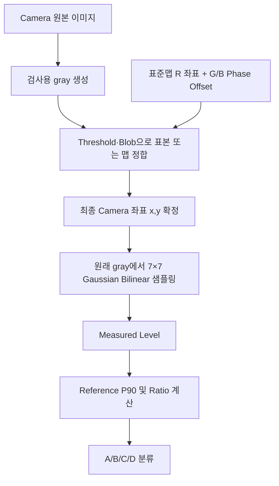

# Dot Level 측정, 7×7 Gaussian, Shift, Threshold, 표준맵 상세 분석

> 작성 기준: 2026-08-03 현재 로컬 Docs, 실행 코드, CycleTest Recipe, 실제 F04 검사 산출물
>
> 범위: Camera 검사에서 R/G/B sub dot 하나의 측정 좌표를 확정하고 Level을 계산하는 과정

---

## 1. 핵심 결론

현재 검사는 다음 두 단계를 명확히 분리한다.

1. **Dot 좌표를 찾고 맵을 배치하는 단계**
   - 표준맵, Pitch, RGB Phase Offset, Shift 정합, Threshold, Blob 조건을 사용한다.
2. **확정된 좌표에서 Level을 측정하는 단계**
   - 원래 검사 gray 영상에 `7×7 Gaussian + bilinear 보간`을 적용한다.

가장 중요한 사실은 다음과 같다.

- Threshold는 Dot의 Level을 계산하는 수식에 들어가지 않는다.
- Threshold 처리 영상과 top-hat 영상은 좌표 정합용 검출에만 사용된다.
- Level은 Threshold 처리 전의 검사 gray 영상에서 계산한다.
- Dot이 Blob으로 검출되지 않아도 표준맵에 유효 index가 있으면 그 좌표의 Level은 측정한다.
- 표준맵 사용 시 전체 Dot을 개별 검출해 중심을 따라가는 것이 아니다.
- 약 192개 표본으로 Cell 전체의 이동·회전·배율을 구한 뒤, 변환된 표준맵의 모든 좌표에서 Level을 측정한다.
- 개별 Dot만 국소적으로 Shift된 경우에는 그 Dot을 따라 좌표를 옮기지 않는다. 표준맵의 예상 위치에서 측정하므로 위치 이탈 자체가 낮은 Level 또는 위치 불량으로 드러난다.



---

## 2. 먼저 용어를 구분해야 한다

사용자가 말하는 “하나의 Dot 또는 픽셀”은 코드상 다음처럼 구분된다.

| 용어 | 의미 |
|---|---|
| Camera pixel | Camera 이미지 배열의 물리 화소 한 칸 |
| 논리 Dot | 한 Cell 안에서 R/G/B sub dot 한 세트를 포함하는 논리 단위 |
| sub dot | R, G, B 각각의 발광 Dot |
| 측정 좌표 | 한 sub dot의 Level을 읽는 Camera 실수 좌표 `(x, y)` |
| Level | 측정 좌표 주변 7×7 영역을 Gaussian 가중평균한 값 |

즉, Level 하나는 Camera pixel 하나의 값이 아니다. 한 sub dot의 중심으로 정한 실수 좌표 주변에서 49개 위치를 가중평균한 결과다.

R/G/B 각 Pattern은 같은 논리 Dot index를 공유하지만, 실제 Camera 측정 좌표는 RGB Phase Offset만큼 다르다.

---

## 3. 전체 Level 측정 과정

### 3.1 Camera 이미지를 검사 gray로 변환

현재 `InspectionImageConverter`는 다음처럼 동작한다.

- 1채널 이미지: 그대로 복제
- 3채널 이상 이미지: 각 Camera pixel에서 `max(B, G, R)` 사용
- 일반적인 가중 luminance 변환을 사용하지 않음

```text
Gray(x,y) = max(B(x,y), G(x,y), R(x,y))
```

근거: `uLedIp/Inspection/InspectionImageConverter.cs:8-40`

`GaussianLevelSampler`는 `CV_8UC1` 영상을 요구하므로 현재 Level 범위는 기본적으로 0~255 사이의 실수다. 가중평균이기 때문에 소수값이 나온다.

### 3.2 유효 Dot index 결정

Recipe의 display pixel map에서 유효한 논리 Dot index만 검사 대상이 된다. 현재 CycleTest 표준맵은 432×432 격자이지만 실제 유효 Dot은 146,604개다.

모든 432×432 칸을 검사하는 것이 아니라 map에서 활성화된 index에 대해서만 좌표와 Level을 만든다.

### 3.3 각 index의 Camera 좌표 확정

좌표를 정하는 방법은 표준맵 사용 여부에 따라 다르다.

| 검사 경로 | 좌표 확정 방법 |
|---|---|
| 표준맵 사용 | 표준맵 좌표에 Cell별 similarity 변환 적용 |
| 표준맵 미사용 | Blob 검출 → Seed → Pitch Chain → MatchShift로 DenseMap 생성 |
| 표준맵 정합 실패 | DenseMap 자동정합으로 offset 후보를 구한 뒤 표준맵 고정배치를 재검증 |

### 3.4 확정 좌표에서 Level 측정

최종 좌표가 `(x, y)`로 확정되면 다음 호출이 수행된다.

```text
GaussianLevelSampler.Sample7x7(gray, samplePoints, BilinearFloat)
```

근거:

- 표준맵 고정배치: `CorrectedDenseMapInspector.cs:749-797`
- 맵생성검사: `CorrectedDenseMapInspector.cs:350-375`
- 형제 채널 확정맵: `CorrectedDenseMapInspector.cs:134-158`

### 3.5 Level 이후 단계

Level 측정 후에야 다음 계산이 이어진다.

```text
Reference Level = 현재 Cell·채널의 유효 Level 분포 P90
Ratio = Measured Level / Reference Level × 100
Ratio와 Recipe A/B/C 기준 비교 → A/B/C/D
```

Level 측정과 등급 판정은 서로 다른 단계다.

### 3.6 W Pattern의 Level

W Pattern도 별도의 W Dot 좌표를 다시 검출하지 않는다. 앞서 R/G/B 검사에서 확정한 sub dot 좌표들을 W gray 영상에 그대로 적용하고 같은 `GaussianLevelSampler.Sample7x7`로 R/G/B 위치별 W 점등 Level을 측정한다.

근거: `PointGridInspectionAlgorithm.cs:1524-1557`, `1581-1605`

---

## 4. 7×7 Gaussian Level의 정확한 수학적 의미

### 4.1 1차원 Kernel

코드에 고정된 1차원 가중치는 다음과 같다.

```text
w = [1, 6, 15, 20, 15, 6, 1]
sum(w) = 64
```

근거: `uLedInspection.Algorithms/GaussianLevelSampler.cs:13-16`

2차원 가중치는 X와 Y 가중치의 외적이다.

```text
W(i,j) = w(i) × w(j)
전체 가중치 합 = 64 × 64 = 4096
```

### 4.2 실제 7×7 가중치 행렬

```text
    1    6   15   20   15    6    1
    6   36   90  120   90   36    6
   15   90  225  300  225   90   15
   20  120  300  400  300  120   20
   15   90  225  300  225   90   15
    6   36   90  120   90   36    6
    1    6   15   20   15    6    1
```

중앙 가중치는 400이고 모서리는 1이다. 중앙에 가까운 밝기를 강하게 보고, 멀어질수록 영향이 작아진다.

### 4.3 Level 수식

측정 중심을 실수 좌표 `(x, y)`라고 하면 현재 Level은 다음과 같다.

```text
Lv(x,y) = 1/4096 × Σ[j=-3..3] Σ[i=-3..3]
          w(i+3) × w(j+3) × BilinearGray(x+i, y+j)
```

근거: `GaussianLevelSampler.cs:141-155`

이 Kernel은 이항계수 기반의 Gaussian 근사이며 수학적으로 약 `σ = √1.5 ≈ 1.225 px`인 분포와 대응한다. `σ`는 별도 Recipe 파라미터가 아니라 고정 가중치에서 유도되는 값이다.

### 4.4 Bilinear의 의미

표준맵과 정합 결과의 좌표는 예를 들어 `(5035.583, 2357.151)`처럼 소수 좌표다. 정수 Camera pixel 하나로 반올림하면 최대 약 0.5 px 위치 오차가 생긴다.

Bilinear 방식은 소수 좌표 주위의 네 Camera pixel을 거리 비율로 섞는다.

```text
left   = floor(x)
right  = left + 1
top    = floor(y)
bottom = top + 1
fx = x - left
fy = y - top

TopValue    = TL + (TR - TL) × fx
BottomValue = BL + (BR - BL) × fx
Bilinear    = TopValue + (BottomValue - TopValue) × fy
```

이 Bilinear 값을 7×7의 49개 위치 각각에서 구하고 Gaussian 가중평균한다.

여기서 “7×7”은 소수 중심을 기준으로 한 49개 **샘플 위치**를 뜻한다. 중심이 소수 좌표이면 각 위치가 네 Camera pixel을 보간하므로 실제로 참조되는 원시 pixel 범위는 최대 8×8까지 걸칠 수 있다.

근거: `GaussianLevelSampler.cs:157-176`

### 4.5 영상 경계 처리

7×7 위치가 영상 바깥으로 나가면 Bilinear 좌표를 영상 경계로 Clamp한다.

근거: `GaussianLevelSampler.cs:157-191`

정상 ROI에서는 대부분 경계 처리에 도달하지 않지만, 잘못된 ROI나 Map 배치로 측정점이 영상 가장자리에 붙으면 같은 경계 pixel이 반복 반영될 수 있다.

---

## 5. 7×7 Gaussian을 적용하는 이유와 결과

### 5.1 단일 pixel 노이즈 억제

중앙 pixel 하나만 255이고 나머지가 0이면 Level은 255가 아니다.

```text
Lv = 255 × 400 / 4096 ≈ 24.90
```

따라서 단일 hot pixel이나 순간 노이즈가 Dot 밝기 255로 오인되는 것을 줄인다.

### 5.2 Dot 면적의 밝기를 안정적으로 반영

중앙 3×3이 모두 255이고 나머지가 0이라고 단순 가정하면 다음과 같다.

```text
Lv ≈ 155.64
```

중앙 5×5가 모두 255이면 다음과 같다.

```text
Lv ≈ 239.31
```

즉, 현재 Level은 Peak 한 점이 아니라 Dot 중심 주변에 밝기가 얼마나 안정적으로 분포하는지를 반영한다.

### 5.3 위치 오차에 대한 완화

Dot 중심이 소수 pixel만큼 이동해도 Bilinear와 Gaussian 분포가 연속적으로 반응한다. Nearest 방식처럼 1 pixel 경계에서 Level이 갑자기 바뀌는 현상을 줄인다.

### 5.4 Level이 단순 평균이나 합계가 아닌 이유

| 방식 | 문제 또는 특성 |
|---|---|
| 중앙 pixel 하나 | 노이즈와 sub-pixel 위치에 민감 |
| 7×7 단순 평균 | 배경 pixel 영향이 너무 커질 수 있음 |
| Blob 전체 평균 | Threshold와 Blob 모양에 따라 측정 영역이 바뀜 |
| 현재 Gaussian | 고정된 측정 면적에서 중심을 강조하고 Threshold와 Level 측정을 분리 |

코드 주석과 구조에서 확인되는 설계 의도는 “Blob을 밝기 측정 영역으로 사용하지 않고, Map으로 좌표만 확정한 뒤 항상 같은 Gaussian 측정기를 적용한다”는 것이다.

### 5.5 주의점

Gaussian Level은 Dot의 총 광량이 아니다. 다음 값에 영향을 받는다.

- Dot 중심과 Map 좌표의 일치 정도
- Dot의 영상상 크기
- 초점과 번짐
- Exposure와 Gain
- 배경 밝기
- 인접 sub dot의 광학적 번짐

따라서 Camera 조건과 Dot 크기가 바뀐 상태에서 Level 절대값만 직접 비교하면 안 된다.

---

## 6. Dot이 Shift되면 어떻게 찾는가

“Shift”는 하나로 묶으면 안 되고 다음 세 경우를 구분해야 한다.

### 6.1 Cell의 R/G/B 전체가 함께 이동한 전역 Shift

Stage 위치, Glass 안착, Camera 좌표 변화 등으로 Cell 전체가 이동한 경우다.

표준맵 검사에서는 다음처럼 찾는다.

1. 표준맵을 16×12 구역으로 나눈다.
2. 각 구역에서 대표 Dot 하나를 선택하여 약 192개 표본을 만든다.
3. 표준맵 예상 좌표 주변의 제한된 창에서 Threshold와 Blob 조건으로 실측 centroid를 찾는다.
4. `표준맵 좌표 S ↔ 실측 centroid T` 대응쌍을 만든다.
5. 대응쌍으로 회전 `θ`, 배율 `scale`, 평행이동 `tx, ty`를 구한다.
6. 채택한 변환을 중심으로 최대 2회 다시 검출하여 수렴시킨다.

```text
Px = scale × cosθ × Sx - scale × sinθ × Sy + tx
Py = scale × sinθ × Sx + scale × cosθ × Sy + ty
```

모든 유효 Dot의 최종 측정 좌표는 위 변환식으로 계산한다.

근거: `CorrectedDenseMapInspector.cs:648-797`

현재 CycleTest Pitch는 약 20.825 px다. 스팟 탐색 창 반폭은 다음과 같다.

```text
floor(Pitch / 2 × 0.8) = floor(8.33) = 8 px
```

따라서 현재 조건에서는 예상 위치 주위 약 17×17 창에서 표본 Dot을 찾는다.

### 6.2 R/G/B sub dot 간 Phase Shift

표준맵 파일에는 R 좌표만 저장한다. G/B 좌표는 Recipe Phase Offset으로 파생한다.

```text
G 좌표 = R 표준맵 좌표 + GFromR(Dx,Dy)
B 좌표 = R 표준맵 좌표 + BFromR(Dx,Dy)
```

현재 CycleTest 실값:

| 채널 | R 기준 Dx | R 기준 Dy |
|---|---:|---:|
| G | +7.5557 px | -0.4419 px |
| B | +14.6807 px | -0.8916 px |

근거:

- `PointGridInspectionAlgorithm.cs:825-854`
- `StandardDenseMap.cs:35-55`

G/B가 모두 R 위치에서 다시 독립적으로 검색되는 구조가 아니다. R 표준 좌표에 물리적인 채널 Phase Offset을 더한 G/B 표준 좌표를 사용한다.

### 6.3 한 개 Dot 또는 일부 행만 국소적으로 Shift

이 경우는 Cell 전체 전역 Shift와 다르다.

표준맵 고정배치의 similarity는 Cell 전체에 공통인 네 파라미터만 보정한다.

```text
θ, scale, tx, ty
```

한 개 Dot만 이동한 국소 오차는 전역 변환으로 따라가지 않는다.

- Shift된 Dot이 약 192개 표본 중 하나면 centroid와 표준맵 좌표의 잔차로 관찰될 수 있다.
- 다수의 정상 표본과 맞지 않는 국소점은 similarity trim 과정에서 영향이 줄어든다.
- 최종 Level 측정 좌표는 개별 centroid가 아니라 변환된 표준맵 좌표다.
- 표본이 아닌 Dot의 국소 Shift는 고정배치 정합 단계에서 개별 좌표로 직접 추적하지 않는다.

따라서 국소 Shift된 발광점이 예상 좌표에서 벗어나면 다음처럼 된다.

| 실제 발광 위치 | Level 결과 |
|---|---|
| 예상 좌표와 거의 일치 | Gaussian 중심에 들어와 정상 Level |
| 1~3 px 정도 이탈 | 7×7 안에 일부가 들어오지만 중심 가중치가 줄어 Level 저하 가능 |
| Gaussian 영역 밖으로 크게 이탈 | 예상 좌표는 어두워 낮은 Level 또는 D 가능 |

정확한 Level 감소량은 Dot의 실제 밝기 분포와 크기에 따라 달라지므로 Shift pixel 수만으로 고정 비율을 계산할 수는 없다.

### 6.4 Pitch 정수배만큼 잘못 배치된 경우

주기 격자는 한 Pitch 옆 Dot을 현재 Dot으로 잘못 대응시킬 수 있다. 이를 배치 검증에서 확인한다.

1. 변환된 표준맵의 상·하·좌·우 마지막 줄을 검출한다.
2. 네 변 모두 검출률 50% 이상이면 `edge-pass`다.
3. Edge가 실패하면 한 Pitch 바깥 Guard 영역을 확인한다.
4. Guard에서 Blob이 3개 이상이면 Pitch 정수배 Shift로 보고 `guard-hit` 처리한다.
5. DenseMap 자동정합으로 offset 후보를 다시 구한다.
6. 후보를 R/G/B에 재적용하여 한 채널이라도 검증되는 첫 후보를 전 채널에 채택한다.

근거:

- `CorrectedDenseMapInspector.cs:939-1052`
- `PointGridInspectionAlgorithm.cs:305-519`

---

## 7. Shift된 Dot의 Level을 실제로 어디서 측정하는가

### 7.1 표준맵 사용 시

최종 Level 좌표는 다음과 같다.

```text
FinalCoordinate = Similarity(StandardMapCoordinate + ChannelPhaseOffset)
Lv = Gaussian7x7(OriginalGray, FinalCoordinate)
```

실측 Blob centroid는 similarity를 구하고 배치를 검증하는 자료다. 최종 Level 좌표의 정본은 변환된 표준맵이다.

코드에도 다음 원칙이 명시되어 있다.

```text
측정 좌표는 무조건 변환된 표준 좌표를 사용한다.
실측 centroid는 정합 대응쌍과 이탈량 진단에만 사용한다.
```

근거: `CorrectedDenseMapInspector.cs:582-602`, `772-797`

### 7.2 표준맵 미사용 시

R→G→B 순으로 처음 맵 생성에 성공한 기준 채널이 DenseMap을 만든다.

- 허용되는 Object cell은 검출 centroid를 좌표로 사용할 수 있다.
- 전역 Fit에서 크게 벗어난 Object는 기각되고 행/열 Fit 또는 이웃 예측 좌표로 교체된다.
- 형제 채널은 확정된 기준 맵에 G/B Phase Offset만 더해 Level을 측정한다.
- 세 채널 모두 맵 생성에 실패해도 ROI 중심 이상 격자를 만들어 Level을 측정한다.

따라서 표준맵 미사용 경로에서는 작은 국소 Shift를 검출 centroid가 따라갈 수 있지만, 위치 허용치를 넘는 이상점은 그대로 추적하지 않고 격자 예측 좌표로 되돌릴 수 있다.

근거:

- `PointGridInspectionAlgorithm.cs:522` 이후 `InspectDenseWithConfirmedMap`
- `CorrectedDenseMapInspector.cs:95-158`, `263-375`
- `docs/표준맵사용검사-technical-manual.md` §3

---

## 8. Threshold가 Level 측정에 미치는 영향

### 8.1 직접 영향: 없음

최종 Level 수식은 다음 값만 사용한다.

- 원래 검사 gray 영상
- 최종 실수 좌표 `(x, y)`
- 고정 Gaussian Kernel
- Bilinear 보간

Threshold는 Level 수식에 포함되지 않는다.

또한 Threshold보다 낮은 pixel을 0으로 만든 뒤 Gaussian을 계산하지 않는다. Binary 영상이나 top-hat 영상에서 Level을 측정하지도 않는다.

### 8.2 간접 영향: 좌표 정합

Threshold는 다음 흐름에 영향을 준다.

```text
검출용 영상 → Binary → Connected Components → Blob centroid
→ 표준맵 similarity 또는 DenseMap → 최종 측정 좌표
```

따라서 Threshold 때문에 centroid 또는 Map 배치가 달라지면 Level도 간접적으로 달라질 수 있다.

### 8.3 현재 배경 평탄화

현재 CycleTest는 `BackgroundFlattenEnabled = true`다.

검출 전 white top-hat을 적용한다.

```text
DetectionSource = OriginalGray - MorphologicalOpening(OriginalGray)
```

Kernel 크기는 다음처럼 Pitch에서 자동 계산한다.

```text
kernel = clamp(round(0.7 × max(PitchX, PitchY)), 5, 31)
짝수면 다음 홀수로 변경
```

현재 Pitch 약 20.825 px이면 Kernel은 약 15×15다.

이 top-hat 결과는 검출에만 사용되고 Gaussian Level은 원래 gray에서 측정한다.

근거: `CorrectedDenseMapInspector.cs:1166-1196`

### 8.4 Threshold가 너무 높을 때

- 약한 Dot의 스팟 검출 실패 증가
- 고정배치 표본이 20쌍 미만이면 `fixed-prior(detect-fail)`
- 형제 채널의 검증된 배치 또는 자동정합 폴백에 의존
- DenseMap 경로에서는 Seed와 Chain을 만들 Object가 부족해짐
- 잘못된 Map 위치가 확정되면 Level이 간접적으로 낮아질 수 있음

그러나 배치 좌표가 동일하게 확정된다면 Threshold를 높여도 Gaussian Level은 동일해야 한다.

### 8.5 Threshold가 너무 낮을 때

- 배경 노이즈와 작은 파편 증가
- 이웃 Dot 또는 배경과 Blob 병합 가능
- Blob이 Max Area/Width/Height를 넘으면 검출에서 탈락
- Binary 모양 변화로 centroid가 이동할 수 있음
- 잘못된 대응쌍이 많아지면 similarity 또는 DenseMap 좌표에 간접 영향

### 8.6 표준맵 경로에서 Threshold Candidates 사용 차이

| 경로 | Threshold 적용 방식 |
|---|---|
| 표준맵 고정배치 스팟 검출 | Pattern의 단일 `Threshold` 사용 |
| 표준맵 자동정합 | `ThresholdCandidates`가 있으면 후보별 검출 후 최고 점수 선택 |
| 표준맵 미사용 DenseMap | `ThresholdCandidates`가 있으면 후보별 검출 후 최고 점수 선택 |

고정배치의 `TrySpotDetectDot`은 `_recipe.Threshold`만 사용한다. Threshold Candidates는 고정배치 표본 검출에서 순회하지 않는다.

근거:

- 고정배치: `CorrectedDenseMapInspector.cs:1091-1157`
- Dense 검출: `CorrectedDenseMapInspector.cs:263-315`

### 8.7 현재 CycleTest 실값

| Pattern | Threshold | Threshold Candidates | Level Metric |
|---|---:|---|---|
| R | 50 | 없음 | Gaussian7x7Bilinear |
| G | 50 | 없음 | Gaussian7x7Bilinear |
| B | 50 | 없음 | Gaussian7x7Bilinear |
| W | 30 | 없음 | Gaussian7x7Bilinear |

Threshold 50과 측정 Level 50은 같은 의미가 아니다. Threshold는 top-hat 검출 영상의 Binary 경계이고, Level은 원래 gray의 Gaussian 가중평균이다.

---

## 9. 표준맵은 어떻게 적용되는가

### 9.1 표준맵의 내용

`std_map.csv`는 유효 Dot index마다 R 채널의 Camera 좌표를 저장한다.

```text
final_x,final_y,x,y,measured
201,0,5066.624,2358.257,1
...
```

현재 CycleTest 표준맵:

| 항목 | 값 |
|---|---|
| Source Cell | F01 |
| Grid | 432×432 |
| 유효 Dot | 146,604 |
| Pitch X | 20.8250 px |
| Pitch Y | 20.8259 px |
| 생성 시 이웃 이상점 교체 | 22개 |

파일:

`C:\elp\uLedAoi\Data\Recipes\370x470_1.33_Model\1_33_370x470_CycleTest\std_map.csv`

### 9.2 표준맵 생성

표준맵은 양품 Source Cell을 표준맵 없이 먼저 검사해 만든다.

1. R/G/B를 채널 독립 검출한다.
2. R 채널의 final index와 Camera 좌표를 추출한다.
3. 상하좌우 이웃 평균에서 0.5 px 이상 벗어난 좌표를 보정한다.
4. 계단 구조 제거와 6항 2차 2D Fit으로 이상화한다.
5. R 좌표만 `std_map.csv`에 저장한다.
6. G−R, B−R median 차이를 Recipe Phase Offset 권장값으로 계산한다.

표준맵은 밝기 Reference가 아니다. 각 Dot index가 Camera 영상의 어디에 있어야 하는지를 저장한 **좌표 자산**이다.

### 9.3 Console에서 IP로 전달

현재 Console 기준 정본은 Recipe 옆 `std_map.csv`다.

1. `StandardMapPlan.UseStandardDenseMap = true` 확인
2. `std_map.csv` 로드
3. 파일이 없고 Recipe에 유효한 Calibration 계수가 있으면 좌표 파일 재생성
4. 원문을 `console.standardDenseMapData` metadata로 IP에 전달
5. IP는 내용을 Cache 파일로 저장하고 `UseStandardDenseMap = true`로 실행

근거:

- `uLedAoiConsole/Services/Ip/ULedIpConnection.cs:1803-1854`
- `uLedIp/Services/IpNodeRuntimeService.cs:1408-1457`

`docs/표준맵사용검사-technical-manual.md` 일부 표에는 `console.standardDenseMapPath`가 남아 있지만 현재 Console→IP 실행 코드는 `console.standardDenseMapData`를 사용한다.

### 9.4 R에서 G/B 표준맵 파생

IP는 R 표준맵을 한 번 로드하고 채널별 Phase Offset을 더한 G/B 채널 맵을 Cache한다.

```text
StandardMapR(index) = std_map.csv 좌표
StandardMapG(index) = StandardMapR(index) + GFromR
StandardMapB(index) = StandardMapR(index) + BFromR
```

### 9.5 Cell마다 고정배치 정합

각 Cell의 Camera 영상은 Source Cell 영상과 위치·회전·배율이 완전히 같다고 가정하지 않는다.

약 192개 표본으로 다음 변환을 Cell·채널별로 측정한다.

```text
P = scale × R(θ) × S + translation
```

그 후 R/G/B의 검증 결과를 모은다.

- 검증된 anchor 채널이 있으면 그 Cell의 대표 배치 변위를 다른 채널에도 적용해 재측정한다.
- 점등이 약해 표본을 못 찾는 채널도 형제 채널의 검증된 위치에서 Level을 측정할 수 있다.
- 전 채널 배치가 의심되면 DenseMap 자동정합 후보를 만들고 RGB 재검증한다.

### 9.6 최종 Level 측정

표준맵이 배치되면 유효 Dot 146,604개 모두에 변환식을 적용한다.

개별 Dot마다 Threshold Blob을 다시 찾아 그 centroid에서 Level을 재는 것이 아니다.

```text
for each valid index:
    P = Similarity(StandardMapChannel[index])
    Level[index] = Gaussian7x7Bilinear(OriginalGray, P)
```

이 구조 때문에 완전히 꺼진 Dot도 좌표가 사라지지 않고 Level 0에 가까운 값으로 측정될 수 있다.

---

## 10. 실제 검사 산출물 검증

검증 대상:

- Recipe: `1_33_370x470_CycleTest`
- Glass: `BP_0110_LOCAL`
- Cell: `F04`
- Pattern: R
- Alignment Mode: `fixed(realigned)`

### 10.1 표준맵 좌표 변환 검증

표준맵 index `(201,0)`:

```text
S = (5066.624, 2358.257)
```

실제 R Alignment:

```text
theta = -0.0002972773 deg
scale = 1.0001474122
tx = -31.8000592
ty = -1.4274422
```

코드의 similarity 수식으로 계산:

```text
Calculated P = (5035.583061, 2357.150902)
Pixel CSV P  = (5035.583008, 2357.150879)
차이          = (0.000053 px, 0.000023 px)
```

표준맵과 Alignment로 최종 Camera 좌표를 만들었다는 설명이 실제 pixel data와 일치한다.

검증 파일:

- `C:\elp\uLedAoi\Data\InspectionResults\Glass\LOT_260730\BP_0110_LOCAL_20260730_164502\cells\F04\standard_map_alignment.json`
- 같은 폴더의 `pixel_data\P000_PT000_R_pixels.csv`

### 10.2 Gaussian Level 재계산 검증

Export된 R 원본 영상에서 pixel CSV의 Camera 좌표를 읽고 코드와 동일하게 다음을 재계산했다.

- gray: 원본 1채널 사용
- Kernel: `[1,6,15,20,15,6,1]` 외적
- 좌표: CSV `camera_x`, `camera_y`
- 보간: Bilinear
- 정규화: 4096

첫 5개 결과:

| Dot index | CSV Level | 재계산 Level | 차이 |
|---|---:|---:|---:|
| (201,0) | 169.976440 | 169.976272 | -0.000168 |
| (202,0) | 152.267014 | 152.265320 | -0.001694 |
| (203,0) | 165.696106 | 165.696203 | +0.000097 |
| (204,0) | 169.089905 | 169.087391 | -0.002514 |
| (205,0) | 179.588394 | 179.590911 | +0.002517 |

최대 절대 차이는 약 0.002517 Level이었다. CSV Camera 좌표가 소수 6자리로 잘려 저장된 점을 고려하면 실행 산출물이 `Gaussian7x7Bilinear` 구현과 일치한다.

---

## 11. 질문별 최종 답변

### 11.1 Level은 어떻게 측정하는가

표준맵 또는 DenseMap으로 sub dot의 실수 Camera 좌표를 확정한 뒤, 원래 검사 gray에서 중심 ±3 위치의 7×7 값을 Bilinear로 읽고 Gaussian 가중평균한다.

Level은 중앙 pixel 값, Blob 평균, Blob 최대값, Threshold 통과 pixel 평균이 아니다.

### 11.2 7×7 Gaussian 필터 적용의 의미는 무엇인가

중심을 강하게 보고 주변으로 갈수록 낮은 가중치를 주는 49점 가중평균이다. 단일 pixel 노이즈를 줄이고, Dot 중심의 sub-pixel 이동에 Level이 연속적으로 반응하도록 한다.

### 11.3 Dot이 Shift되면 어떻게 찾고 Level을 측정하는가

- Cell 전체 Shift: 약 192개 표본으로 similarity를 구해 표준맵 전체를 이동한 뒤 Level 측정
- G/B Phase: R 표준맵에 Recipe GFromR/BFromR Offset 적용
- 개별 Dot Shift: 전역 Map이 개별 Dot을 따라가지 않고 예상 표준 위치에서 측정
- Pitch 정수배 Shift: Edge/Guard 검증 후 DenseMap 자동정합과 RGB 재검증

### 11.4 Threshold가 Level 측정에 미치는 영향은 무엇인가

Level 수식에는 직접 영향이 없다. Threshold는 표본 Blob과 centroid를 찾아 Map을 정합하므로 최종 좌표를 통해 간접 영향을 준다. 좌표와 원본 영상이 같다면 Threshold가 달라도 Level은 같아야 한다.

### 11.5 표준맵은 어떻게 적용되는가

양품 Cell에서 만든 R 좌표표를 로드하고, G/B Phase Offset을 더해 채널별 표준 좌표를 만든다. 대상 Cell의 표본 Dot으로 shift·rotation·scale을 측정하고 모든 표준 좌표에 변환을 적용한다. 그 좌표에서 7×7 Gaussian Level을 측정한다.

---

## 12. 장비 개발자 관점에서의 설계 의도

코드 주석과 실행 구조에서 확인되는 의도는 다음과 같다.

### 12.1 검출과 계측 분리

Threshold Blob의 크기나 모양을 Level 측정 영역으로 사용하면 Threshold 변경 때 Level까지 직접 바뀐다. 현재 구조는 Blob을 좌표 정합에만 사용하고, Level은 고정된 Gaussian 측정기로 계산해 검사 재현성을 높인다.

### 12.2 꺼진 Dot도 반드시 측정

꺼진 Dot은 Threshold로 찾을 수 없다. 개별 검출 성공한 Dot만 측정하면 가장 중요한 암점이 결과에서 사라진다.

표준맵의 모든 유효 index를 무조건 샘플링하면 검출되지 않는 Dot도 낮은 Level로 남는다.

### 12.3 전역 장비 오차와 국소 제품 불량 분리

- Cell 전체 이동·회전·배율: similarity로 보정해야 하는 장비·안착 오차
- 한 Dot 또는 일부 라인 이동: 보정해 숨기지 않고 결함으로 보여야 하는 국소 현상

그래서 전역 변환은 따라가지만 개별 Dot centroid로 최종 좌표를 계속 이동시키지는 않는다.

### 12.4 R 좌표 자산과 G/B Phase 분리

가장 안정적인 R 좌표 하나를 표준맵으로 보관하고 G/B는 물리 Phase Offset으로 파생해 채널별 검출 노이즈가 표준 좌표에 누적되는 것을 막는다.

---

## 13. 검사 결과를 볼 때 확인할 항목

1. Run에 실제 사용된 Recipe와 Pattern을 확인한다.
2. `LevelMetric = Gaussian7x7Bilinear`인지 확인한다.
3. Standard Map 사용 여부와 Source Cell을 확인한다.
4. `standard_map_alignment.json`에서 Mode, θ, scale, tx, ty를 확인한다.
5. `pixel_data`의 `camera_x/y`가 영상과 ROI 안에 있는지 확인한다.
6. Threshold, Blob Area/Width/Height, Background Flatten 값을 확인한다.
7. R/G/B Phase Offset이 현재 광학계와 맞는지 확인한다.
8. Level이 낮을 때 원본 영상에서 실제 발광점이 Map 좌표 중심에 있는지 확인한다.
9. 전체가 낮다면 Exposure·Gain·PG·초점·평균 Level을 함께 확인한다.
10. 특정 Dot만 낮다면 국소 Shift인지 실제 암점인지 grade/overlay와 함께 확인한다.

---

## 14. 코드와 Docs 읽기 순서

1. `docs/표준맵사용검사-technical-manual.md`
   - 좌표 확정과 표준맵 전체 흐름
2. `uLedIp/Inspection/InspectionImageConverter.cs`
   - 검사 gray 생성
3. `uLedInspection.Algorithms/GaussianLevelSampler.cs`
   - 7×7 Kernel과 Bilinear Level 수식
4. `uLedInspection.Algorithms/CorrectedDenseMapInspector.cs:648-900`
   - 표준맵 고정배치와 최종 Gaussian 샘플링
5. 같은 파일 `1091-1231`
   - Threshold, top-hat, Blob 검출
6. `uLedIp/Inspection/PointGridInspectionAlgorithm.cs:241-519`
   - RGB 표준맵 배치 일원화와 자동정합 폴백
7. 같은 파일 `825-898`
   - R 표준맵 로드, G/B Phase 파생, Recipe 연결
8. 같은 파일 `1644-1714`
   - Level → Reference → Ratio → Grade

---

## 15. 교차검증 결과

### 15.1 Docs ↔ 코드

| 검증 항목 | Docs 설명 | 현재 코드 | 결과 |
|---|---|---|---|
| Level은 확정 Map 좌표에서 측정 | Technical Manual §1·§5 | Gaussian samplePoints가 Map 좌표 | 일치 |
| 표준맵 고정배치 약 192 표본 | Technical Manual §5.2 | 16×12 zone sample | 일치 |
| similarity에 scale 포함 | Technical Manual §5.2 | `SolveSimilarity` | 일치 |
| R map + G/B Phase Offset | Technical Manual §4.2 | `WithOffset` | 일치 |
| Threshold는 검출에 사용 | Technical Manual §2·§5 | `TrySpotDetectDot`, `DetectObjects` | 일치 |
| Level이 Gaussian7x7Bilinear | RGB Level Docs | `GaussianLevelSampler.Sample7x7` | 일치 |

Docs의 표준맵 전달 키 일부는 Path로 적혀 있지만 현재 실행 코드는 Map 원문 Data 전달 방식이다. 본 문서는 현재 코드를 기준으로 정리했다.

### 15.2 Recipe ↔ 실제 산출물

| 검증 항목 | 결과 |
|---|---|
| CycleTest StandardMap 사용 | true |
| std_map Source Cell | F01 |
| 표준맵 유효 Dot | 146,604 |
| F04 Alignment | fixed(realigned) |
| std 좌표 변환값과 pixel CSV 좌표 | 약 0.00005 px 이내 일치 |
| 첫 5개 Gaussian 재계산과 CSV Level | 최대 약 0.00252 차이 |

---

## 16. 최종 정리

하나의 sub dot Level을 이해하는 가장 짧은 식은 다음이다.

```text
1. S = R 표준맵 index 좌표 + 채널 Phase Offset
2. P = Cell similarity 변환(S)
3. Lv = Gaussian7x7Bilinear(원래 검사 gray, P)
4. Ratio = Lv / P90 Reference × 100
5. Ratio로 A/B/C/D 판정
```

따라서 검사 튜닝 시에도 다음을 분리해야 한다.

- Dot을 못 찾는 문제: Threshold, Blob, Pitch, Phase, ROI, 표준맵 배치 확인
- 좌표는 맞지만 Level이 낮은 문제: 실제 밝기, 초점, Exposure, Gain, 국소 Shift 확인
- 전체 좌표가 틀린 문제: CellMap 물리 보정, similarity, Edge/Guard, 자동정합 확인
- Level 값 자체의 정의 문제: 7×7 Gaussian과 Bilinear를 기준으로 해석
