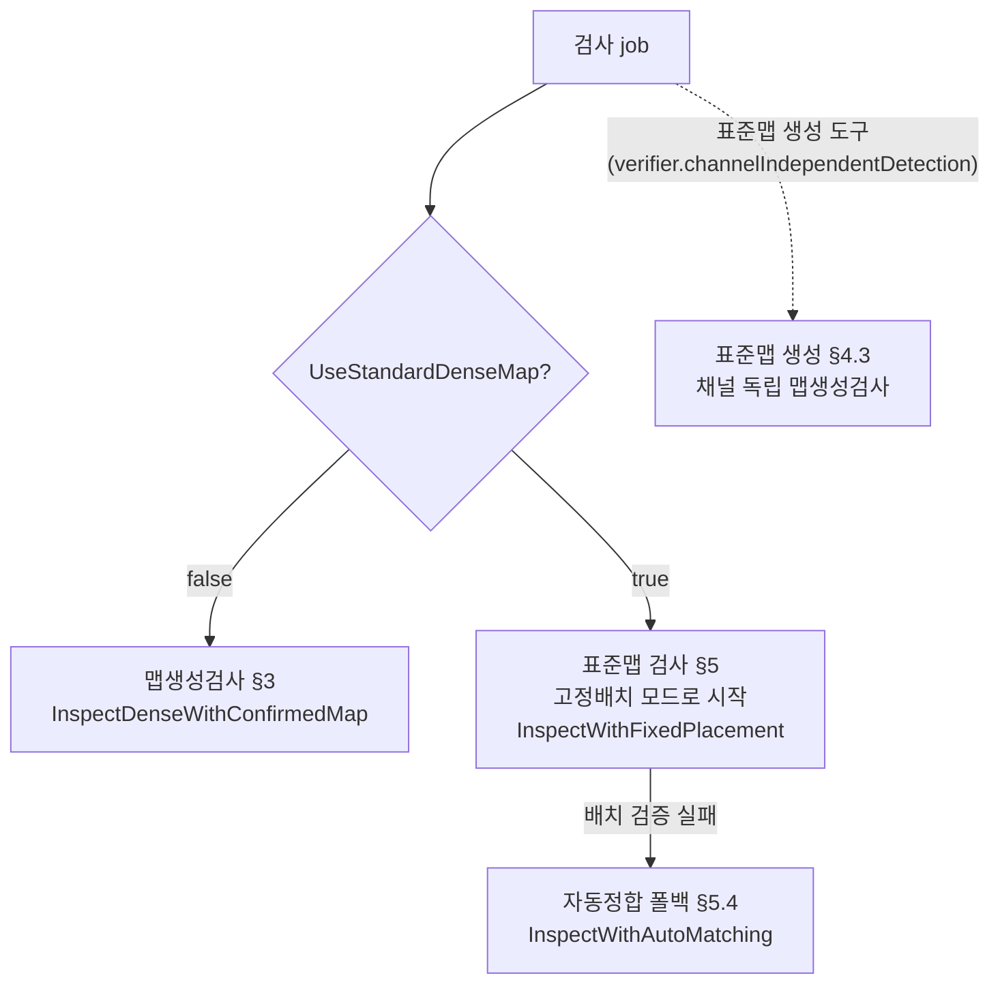
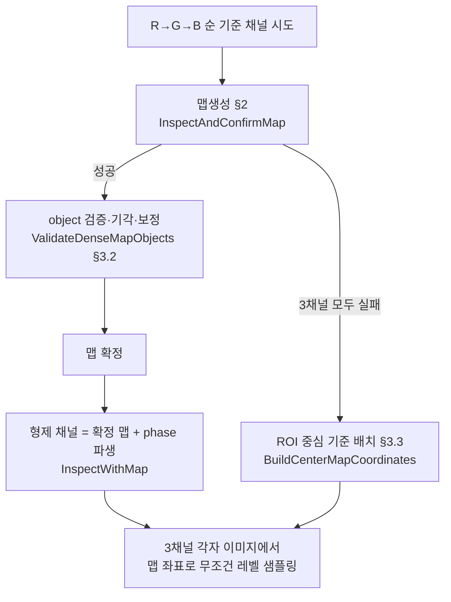
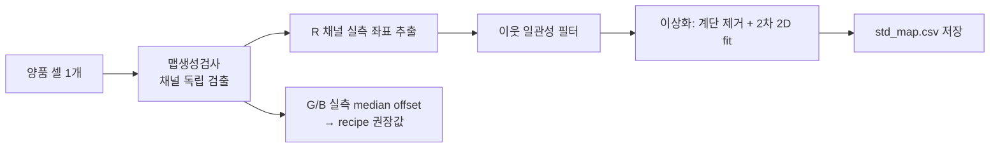
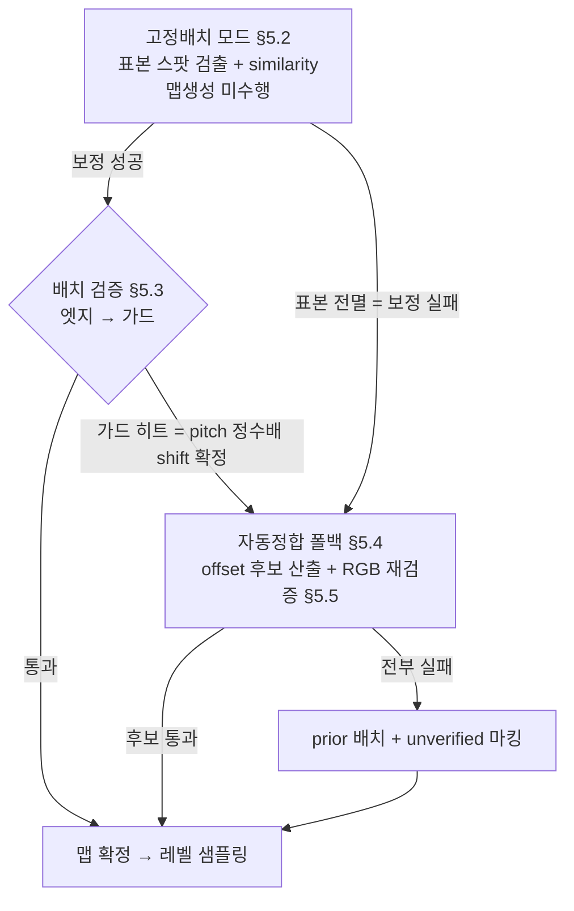

# 검사 좌표 확정 — Technical Manual (맵생성검사 · 표준맵 검사)

이 문서는 display pixel 검사의 **좌표 확정(맵)** 을 다룬다 — 셀 이미지에서 모든 dot의 검사 좌표가
어떻게 결정되는지를 검사 경로별로 설명하고, 각 단계에서 사용되는 recipe 파라미터와 구현 함수를 함께
표기한다. 이 문서만으로 알고리즘을 이해하고 해당 코드를 찾아갈 수 있어야 한다.

레벨 판정/결함 분류(명점·암점·명선 등)는 이 문서의 범위가 아니다 — 좌표가 확정된 뒤 "레벨은 맵
좌표에서 무조건 샘플링한다"는 공통 원칙까지만 다룬다.

---

## 1. 용어와 검사 경로 지도

### 1.1 용어

| 용어                | 정의                                                                                                                                       |
| ----------------- | ---------------------------------------------------------------------------------------------------------------------------------------- |
| **object**        | 검출 단계에서 이진화(threshold)된 이미지의 connected component(blob) 하나 — "점등 dot 1개"로 추정되는 밝은 덩어리. 크기 필터(면적·폭·높이)를 통과한 것만 object로 남는다                 |
| **실측 centroid**   | 검출된 object의 무게중심 카메라 좌표 — dot의 **실측 위치**다. 맵 확정(정합·검증)의 입력으로만 쓰이고, 최종 측정 좌표는 언제나 확정된 맵의 좌표다                                              |
| **맵 (dense map)** | 셀의 모든 dot index에 카메라 좌표를 부여한 좌표표. 확정된 맵의 좌표에서 레벨을 샘플링한다                                                                                  |
| **맵생성**           | 검출된 object들로부터 dense map을 구축하는 공통 파이프라인 (blob 검출 → seed → chain → MatchShift, §2)                                                        |
| **맵생성검사**         | 표준맵 없이, 맵생성(§2)으로 맵을 **생성·확정**하는 검사. 기준 채널 하나가 맵을 확정하고 형제 채널은 phase 파생으로 따라간다. 운영 본검사가 아니라 **표준맵의 부트스트랩·폴백 엔진 + 표준맵 확보 전 과도기 수단**이다 (§3) |
| **표준맵 검사**        | 양품 셀에서 실측한 **표준맵(std_map.csv)** 을 좌표 기준으로 쓰는 검사. 항상 **고정배치 모드**로 시작하고, 배치 검증 실패 시 **자동정합**이 폴백으로 실행된다 (§5)                               |
| **고정배치 모드**       | 표준맵 검사의 기본 경로. 맵생성 없이 소수 표본(~192개)만 스팟 검출해 similarity 변환을 재고, 전 셀 좌표를 표준맵에서 배치한다 (§5.2)                                                  |
| **자동정합**          | 표준맵 검사의 폴백 경로. 맵생성(§2)을 수행해 표준맵과의 대응쌍으로 offset을 재획득한다 (§5.4)                                                                             |
| **표준맵 생성**        | 양품 셀 1개를 맵생성검사(채널 독립 검출)로 검사해 R 채널 실측 좌표로 std_map.csv를 만드는 도구 흐름. 이상화(§4.3)는 이 경로에서만 적용된다                                                |
| **phase 파생**      | R 채널 맵 + recipe RGB phase offset(GFromR/BFromR)으로 G/B 맵을 평행이동 파생하는 것. 같은 셀 grab 사이 stage는 정지이므로 채널 간 그랩 위치는 항상 동일하다                      |

dot/sub dot/rx/ry/ip index 등 좌표 용어는 `AGENTS.md`의 "검사 좌표/인덱스 용어 기준"을 따른다.

### 1.2 전체 검사 경로 지도

경로 분기는 `PointGridInspectionAlgorithm`(uLedIp)이 job 파라미터로 결정한다.



**분기에서 사용되는 파라미터**

| 분기 | 파라미터 | 의미 |
|---|---|---|
| 표준맵 검사 여부 | `UseStandardDenseMap` + `StandardDenseMapPath` (Console recipe `StandardMapPlan.UseStandardDenseMap`, metadata `console.useStandardDenseMap`/`console.standardDenseMapPath`) | true이고 std_map.csv 로드 성공 시 표준맵 검사, 아니면 맵생성검사 |
| 표준맵 생성 도구 | metadata `verifier.channelIndependentDetection` (도구 전용 — 일반 검사 flow 사용 금지) | 채널별 독립 검출 강제. G/B phase offset을 실측해야 하므로 phase 파생을 쓰지 않는다 |
| Console에서 소스 셀 검사 | metadata `console.standardDenseMapDisabled` | 표준맵 생성의 소스 셀 검사에서 표준맵 사용을 일시 해제 (자기 자신을 기준으로 검사하는 순환 방지) |

**공통 원칙 (모든 경로)**
- 맵은 무조건 확정된다 — align fail 개념은 없다. 검출이 전멸해도 폴백 배치(중심 배치 §3.3,
  prior 배치 §5.5)로 좌표를 만든다. 미점등/점등불량 분류는 Console 셀 판정 레이어의 몫이다.
- 레벨은 3채널 모두 **확정된 맵 좌표에서 무조건 샘플링**한다. 검출 실패 채널도 레벨이 나온다
  (암점 = 사실).
- 검출된 object의 실측 centroid는 맵 확정(정합·검증)에만 쓰이고, 측정 좌표의 원천은 언제나 맵이다.
  실측과 맵의 차이는 `ResidualDistance`(이탈 통계)로 보존된다.

---

## 2. 공통 기반 — 맵생성 (검출 → dense map 구축)

맵생성검사의 기준 채널(§3.1), 표준맵 자동정합(§5.4), 표준맵 생성(§4.3)이 공유하는 파이프라인이다.
표준맵 고정배치 모드는 맵생성을 수행하지 않는다 (그래서 빠르다).

```
전처리(배경 평탄화) → blob 검출 → seed consensus → chain 확장 → MatchShift (결손 패턴 정렬)
```

| 단계 | 내용 | 사용 파라미터 | 구현 |
|---|---|---|---|
| 전처리 — 배경 평탄화 | `BackgroundFlattenEnabled=true`(기본)면 white top-hat(원본 − opening)으로 지역별 배경 밝기 차이를 제거해, threshold가 "배경 위 상대 높이"로 일관되게 동작한다. **top-hat 커널은 별도 파라미터가 아니라 pitch에서 자동 산출된다** — ellipse, 크기 `clamp(0.7 × max(pitchX, pitchY), 5..31)` 홀수 보정. dot보다 크고 pitch보다 작게 잡히는 설계다 | `DisplayPixelBackgroundFlattenEnabled`, `DisplayPixelPitchCameraPixelX/Y`(커널 크기 파생) | `BuildDetectionSource` |
| blob 검출 | 이진화(threshold) → connected components(8-연결) → 크기 필터를 통과한 blob이 object가 되고, 무게중심이 실측 centroid다. **threshold 후보가 여러 개면 각각 검출 후 채점이 가장 좋은 결과를 채택**한다. 배경 평탄화 활성 시 threshold 권장 범위는 15~30(상대 높이) | `Threshold` / `ThresholdCandidates`, `MinArea`/`MaxArea`(면적), `BlobMinWidth`/`MaxWidth`/`MinHeight`/`MaxHeight`(폭·높이) — 모두 **pattern별 검사 설정**(`InspectionConfigModel`)이 정본이고 recipe 전역 `DisplayPixelBlob*` 값이 기본으로 주입된다 | `DetectObjects` |
| seed consensus | ROI를 타일로 나눠 seed 후보를 뽑고, 후보 주변 window에서 pitch 간격으로 상호 일관된 이웃이 확인되는 시작점을 확정한다. 파라미터가 아니라 **고정 상수**로 동작한다: 후보 타일 5×5, consensus window 반경 2, 허용 오차 3.0px | (상수 — `SeedCandidateTileGridSize=5`, `SeedConsensusWindowRadius=2`, `SeedConsensusTolerancePx=3.0`) | `ResolveSeed` |
| chain 확장 | seed에서 pitch만큼 떨어진 이웃 위치를 예측하고, 예측 반경 안의 미사용 object를 매칭하는 것을 반복해 격자 index를 전 dot에 배정한다. 매칭 실패 칸은 예측 좌표로 남는다(chain fallback) | `DisplayPixelObjectSearchRadius`(예측→object 매칭 반경 px), `DisplayPixelPitchCameraPixelX/Y`(예측 간격) | `BuildFullDenseMap` / `AddDenseMapCellFromPrediction` / `FindNearestObject` |
| MatchShift | 결손 패턴(display pixel map의 `#`/`.` 배치 = 비주기 anchor)과 최대 상관 위치로 격자를 글래스 index에 정렬한다. 주기 격자의 pitch 배수 앨리어스를 결손 패턴이 끊어준다 | `DisplayPixelMapShiftMargin`(국소 격자를 known map보다 사방으로 확장하는 칸 수 — 탐색 여유), `DisplayPixelMapRows`(결손 패턴 원본) | `MatchShift` |

> pitch/phase offset의 실측·적용은 recipe 편집기의 "현재 버퍼 분석 (Pitch·Phase·표준맵)"으로
> 수행한다 — IP `FindPitch`가 현재 버퍼에서 pitch·phase offset·ROI 후보를 실측하고, 결과 창에서
> recipe 적용과 표준맵 생성(§4.3)까지 이어진다.

---

## 3. 맵생성검사 (표준맵 미사용)

맵 하나를 확정하고 레벨은 그 맵에서 무조건 뽑는다 — 표준맵 검사(§5)와 동형 구조다.
오케스트레이션: `PointGridInspectionAlgorithm.InspectDenseWithConfirmedMap`.

**위상 — 운영 본검사의 기본 경로는 표준맵 검사(§5)다.** 표준맵이 있는 셀에서 맵생성검사가
만드는 맵은 표준맵 배치 맵의 열화판이다 — 같은 좌표를 더 느리게(전체 검출), 더 취약하게
(결손·점등불량에서 fit 붕괴), 배치 검증 없이 만든다. 맵생성검사의 실제 역할은 셋이다:

1. **표준맵 부트스트랩**: 첫 맵은 반드시 검출에서 나와야 하므로(표준맵 없이 표준맵을 만들 수
   없다), 표준맵 생성의 소스 셀 검사(§4.3)가 이 경로를 쓴다. G/B phase offset 실측도 여기서만
   가능하다 (채널 독립 검출).
2. **자동정합 폴백의 엔진**: 표준맵 검사가 배치를 잃었을 때 offset을 재획득하는 수단 (§5.4).
3. **과도기 검사**: 표준맵이 아직 없는 상황(신규 GlassSize 셋업, 광학계 교체 직후 재생성 전)의
   임시 검사.



### 3.1 기준 채널 확정과 phase 파생

- R→G→B 순으로 첫 성공한 채널이 기준 채널이 된다. 기준 채널은 맵생성(§2)으로 맵을 확정한다.
- 확정 맵은 **실측 기반 그대로**다 — 표준맵 생성의 이상화(계단 제거 + 2차 2D fit, §4.3)는
  맵생성검사에 적용되지 않는다. 맵을 곡면으로 평활화하고 싶다면 그것이 곧 표준맵이다 (§4.4).
- 형제 채널 맵 = 확정 맵 + recipe RGB phase offset(`RgbPhaseOffsets.GFromR/BFromR`) 평행이동.
  채널별 재실측은 하지 않는다 — 같은 셀 grab 사이 stage가 정지이므로 채널 간 그랩 위치는 동일하다.
- 로그: `[ConfirmedMap] 단일 맵 확정 — 기준 채널 좌표 + phase 파생 / 기준=R / 파생 offset=[...]`,
  파생 채널 결과 행 `Threshold=[confirmed_map:R]`.
- 함수: `InspectAndConfirmMap`(기준) / `InspectWithMap`(파생·중심 배치).

### 3.2 object 검증·기각·보정 — ValidateDenseMapObjects

검출 기반 맵은 개별 object의 위치 오류(wrong-phase blob, 노이즈, 국소 이탈)를 포함할 수 있어
전역 격자 적합(global fit)과 비교해 걸러낸다. **맵생성검사 전용이다** — 표준맵 검사에서는 좌표
기준이 fit이 아니라 표준맵이므로 이 단계 자체가 실행되지 않는다.

1. **기각 gate**: 전역 fit 예측 대비 object 중심 이탈이 `PositionTolerancePx` 초과면 그 object를
   기각한다 (`GateObjectCellsByGlobalFit`). 기각 칸은 좌표를 보정값으로 대체한다. 전역 fit(6항
   2차)은 여기서 **심판**으로만 쓰이고 좌표를 채우지는 않는다 — 곡면 하나는 스티치 계단을 표현하지
   못해 채우기용으로는 계단만큼 틀리기 때문이다.
2. **기각 칸 보정 좌표 — 행/열 라인 fit (항상 적용)**: 각 행·열별 독립 1차원 2차식
   (`BuildLineFits`/`TryEvaluateLineFits`)으로 계산한다. 라인 fit은 그 라인의 실측을 따라가므로
   계단·국소 구조를 담는다. 평가 시 외삽(표본 범위 밖) 정도가 작은 쪽(행 vs 열)을 신뢰하고 둘 다
   보간일 때만 평균하며, 라인이 부실하면(표본 부족·기각 과다) 이웃 평균
   (`BuildValidatedNeighborPrediction`)으로 폴백한다. chain fallback 칸도 라인 fit으로 재예측한다
   (`RepredictChainFallbackCells`).

### 3.3 폴백 — ROI 중심 기준 배치

3채널 모두 맵 확정 실패(검출/seed 없음)면 ROI 중심 기준으로 이상 격자를 배치해 무조건 샘플링한다
(`BuildCenterMapCoordinates`). 로그: `[ConfirmedMap] 3채널 모두 맵 확정 실패`. 미점등/점등불량
분류는 Console 셀 판정(cell-judgment) 레이어가 담당한다.

### 3.4 맵생성검사 파라미터 모음

| 파라미터 | 적용 지점 | 역할 |
|---|---|---|
| §2 맵생성 파라미터 전부 | 기준 채널 맵생성 | 배경 평탄화·threshold·blob 필터·chain 매칭·MatchShift |
| `DisplayPixelPositionTolerancePx` | §3.2 기각 gate | 전역 fit 대비 허용 이탈(px) |
| `RgbPhaseOffsets.GFromR/BFromR` | §3.1 phase 파생 | 형제 채널 맵 평행이동량 |

---

## 4. 표준맵 — 개념·구성·생성

### 4.1 동기 — 셀별 fit 방식의 한계

검출 기반 fit은 세 상황에서 무너진다 (실측 확인):

| 문제 | 결과 |
|---|---|
| 결손이 많으면 fit 표본이 편향되어 가장자리에서 발산 (실측 +1.6px) | 정상 dot 기각 → 명점/명선 오검 |
| 결손이 극심하면 grid 인덱싱이 pitch 단위로 밀림 | 전 좌표 라벨 오류 |
| 점등불량 셀은 fit 자체가 불가능 | 좌표 없음 (오차 ~1,770px) |

**핵심 아이디어**: 이 디스플레이는 완전한 matrix가 아니라 국소 오차(스티치 블록 계단 ±0.3~0.5px,
국소 변형)가 있는 기하다. 이를 셀마다 fit으로 추정하지 말고, **양품 셀에서 한 번 실측한 표준
좌표를 자산으로 관리**하고, 각 셀에는 similarity(shift/rotate/scale) 변환만 추정해 적용한다.
실측 근거 — 셀 간 dot 좌표는 similarity 변환 후 서로 sub-pixel로 일치한다:


*그림 1. 셀 간 dx 잔차. 중앙 세로 경계의 블록 구조(±0.2px)는 실제 패널 스티치 기하이고,
표준맵은 이를 그대로 담는다 — 2차 fit이 원리적으로 표현 못 하는 부분.*

### 4.2 구성 — R 하나 + phase offset

- 파일에는 **R 채널 좌표만** 저장한다. G/B는 검사 시 `R + recipe RGB phase offset`으로 파생한다.
  채널별 실측맵을 모두 저장하면 어두운 G/B 채널의 측정 노이즈가 표준맵에 박제되기 때문이다.
  sub dot의 상대 배치는 리소그래피로 고정이므로 상수 offset으로 충분하다.
- **파일 형식 — `std_map.csv`** (recipe.json 옆, 고정 이름. verifier는 recipe.yaml 옆):

```
#source_cell=D02
#columns=432
#rows=432
#pitch_x=20.8200
#pitch_y=20.8200
#created_at_utc=2026-07-12T08:29:00Z
#note=...
final_x,final_y,x,y,measured
201,0,5088.000,2357.000,1
...
```

  `final_x/final_y`=글래스 기준 dot index, `x/y`=표준 셀 촬영 영상의 카메라 좌표,
  `measured`=1 실측 / 0 grid 보간(결손 칸).
- 유효 범위: glass 종류(GlassSize)별 별도 표준맵이 필요하고, 장비 광학계 변경(교체/재정렬) 시
  재생성한다.
- 로드/파생: `PointGridInspectionAlgorithm.ResolveStandardMapChannel` (프로세스 캐시,
  `StandardDenseMapChannel.WithOffset`으로 G/B 파생).

### 4.2.1 물리 offset의 정본 — Console CellMap 보정

셀별 촬상 위치 offset의 뿌리는 이미지가 아니라 **장비 기하**이므로, 물리 보정은 Console recipe의
**CellMap 보정**이 담당한다:

- recipe 편집기 "CellMap 보정" 탭에서 StageX는 XIndex 그룹(A, B, C…)별, UnitY는 YIndex 그룹
  (01, 02…)별 축 보정값(um)을 입력한다. 셀 이동 축 target에 그대로 더해진다.
- 저장 정본은 um 소수점 1자리(`ConsoleCellMapCorrectionPlan`). px 표시는 파생 보기/입력 편의다.
- 적용 지점: 편집기 셀 목록 표시(`RecipeEditorViewModel.ApplyCellMapCorrection`)와 검사/CA410
  셀 이동(`GlassInspectionStepPreparationService.ApplyCellMapCorrection`).
- 따라서 검사의 표준맵 prior offset은 **항상 0**이다 — 물리 offset은 촬상 좌표에서 이미 흡수됐고,
  잔차는 배치 검증(§5.3)과 자동정합 폴백(§5.4)이 담당한다. "0은 0이다": prior 0은 "모른다"가
  아니라 "표준맵 원좌표 그대로 확인하라"는 선언이고, 틀렸다면 배치 검증이 잡는다.
- verifier의 `standard_map_offset_columns_px/rows_px`는 **테스트 전용** prior다 — 배치 검증/폴백
  사다리를 시험하려고 prior를 인위로 흔드는 knob이며 장비 값이 아니다.
- Test Runner의 "표준맵 Offset" 창은 실측 offset(px) 조회 전용이다 — CellMap 보정값 입력의 참고
  자료이며, 실측 px → 보정 um 부호/축 매핑은 장비 설치 방향에 의존하므로 자동 반영하지 않는다.

### 4.3 표준맵 생성

Console 통합 흐름(권장)과 verifier CLI 두 경로가 있고, 알고리즘 코어는 공통이다.

**Console**: recipe 편집기 → 양품 셀 이미지를 현재 버퍼에 적재 → "현재 버퍼 분석" 실행 →
결과 창에서 pitch/phase/ROI를 recipe에 적용 → "표준맵 생성" 버튼. 기준 셀 표기는 버퍼에 적재된
셀(편집기 선택 셀)로 자동 결정된다. 생성 후 실측 G/B phase offset의 recipe 적용과 "표준맵 사용"
활성화를 확인 다이얼로그로 제안한다. → `RecipeEditorViewModel.CreateStandardMapForCellAsync`

**verifier CLI**: `uLedVerifier --create-standard-map --cell D02 --config recipe.yaml`
→ `Program.RunCreateStandardMap`



| 단계 | 내용 | 구현 |
|---|---|---|
| 소스 셀 검사 | 표준맵 없이 맵생성검사로 검사하되, **채널 독립 검출**을 강제한다 (`verifier.channelIndependentDetection`) — 단일 맵 flow로 G/B offset을 재면 recipe 값이 그대로 나오는 순환이 되기 때문 | verifier `RunCreateStandardMap` / Console `RunSelectedCellInputFlowAsync` + `console.standardDenseMapDisabled` |
| R 좌표 추출 | R 채널 pixel 결과(final index + camera 좌표)를 표준맵 채널로 변환 | `LoadStandardMapChannelFromPixelCsv` / `StandardMapBuilder.Build` |
| 이웃 일관성 필터 | 각 dot을 상하좌우 이웃 평균과 비교, 0.5px 초과 이탈 dot은 이웃 평균으로 대체 | `StandardDenseMapFile.FilterOutliersByNeighborConsistency` |
| G/B offset 실측 | 같은 index dot의 G−R, B−R 좌표 차 median → recipe `RgbPhaseOffsets` 권장값. **이상화 전(원시 격자) 기준** — phase offset은 물리 관계이므로 계단 제거의 영향을 받으면 안 된다 | `ComputeChannelMedianOffset` / `StandardMapBuilder` |
| **이상화 (생성 시 무조건 적용 — 표준맵 생성 전용)** | ① 열/행 mean 좌표 프로파일에서 pitch 대비 ±0.4px 초과 간격(계단)을 감지해 이후 index 전체에서 초과분 차감 — 계단은 마더글라스 스티치 경계의 공정 오차로 셀마다 걸리는 위치가 달라 기준에 남기면 다른 셀 검사에서 이중 계단 잔차를 만든다. ② 6항 2차 2D fit으로 전 dot 좌표를 적합값으로 교체 — 소스 셀 측정 노이즈·국소 구조 제거. 남는 것은 설계 격자 + 광학 왜곡의 매끈한 성분이고, 각 셀의 실제 계단/국소 변형은 검사 잔차로 드러난다 | `StandardDenseMapIdealizer.Idealize` |
| 저장 | 주석 헤더(+이상화 진단 note) + R 좌표 행 | `StandardDenseMapFile.Save` |

> **이상화의 적용 범위**: 이상화는 **표준맵 생성에서만** 적용된다. 맵생성검사(§3)와 표준맵 검사
> runtime에는 이상화가 없다 — 각 셀의 실제 계단/국소 변형은 검사 잔차(`ResidualDistance`)로
> 드러나 결함·줄 shift 레이어가 평가한다.

### 4.4 이상맵의 수학 구조 — 완벽 격자 + 2D 캘리브레이션

이상화를 거친 표준맵(이하 이상맵)의 좌표는 정의상 dot index (u, v)의 다항식 평가값이다:

```
x = fx(u, v),  y = fy(u, v)     (fx, fy = 6항 2차 다항식: 1, u, v, u², v², uv)
```

즉 이상맵은 **"pitch가 일정한 완벽한 index 격자에 2차 캘리브레이션 곡면 하나를 적용한 상"**이다.
파일에는 146k개 좌표가 나열되지만 정보량은 **계수 12개(x·y 각 6) + 계단 목록 + 격자 크기**뿐이며,
캘리브 곡면을 역변환하면 정확히 균일 격자가 복원된다 (잔차 0 — 구성상 항등).

계단 차감(①)이 이 등가의 전제다 — 계단이 남아 있으면 단일 2차 변환으로 표현되지 않으므로,
이상화 ①은 "맵을 격자 + 2D 캘리브 형태로 만들기 위한 불연속 제거"라고 볼 수 있다.

**실측 검증** (TESTGLASS A04 실측 표준맵 146,604 dots, meta pitch 19.61px):

| 항목 | 결과 |
|---|---|
| raw 인접 pitch 분포 | mean 19.613, **std 0.195px** (측정 노이즈 + 계단 + 국소 구조 포함) |
| 감지된 계단 | x방향 열 25→26 **+0.85px**, 열 346→347 **+0.75px** (321열 주기 — 스티치 블록 폭), y방향 없음 |
| 계단 차감 + 2D fit 잔차 | p50 **0.31px**, p95 0.63px, max 1.20px — 소스 셀 측정 노이즈·국소 구조 = 이상화가 버리는 성분 |
| 이상맵의 카메라 공간 pitch | **상수가 아니다** — x 19.574 ~ 19.646px, y 19.589 ~ 19.630px로 전면에 걸쳐 선형 변화 (±0.18% 배율 기울기 = 광학 성분) |
| 캘리브(역변환) 후 격자 | 완전 균일 (잔차 0.0000px — 구성상 정확) |

→ 분석 스크립트: 격자 재구성 → 열/행 mean 프로파일 robust 추세 대비 ±0.4px 초과 점프 감지·차감
→ 6항 2차 최소제곱 → 곡면 기울기(∂x/∂u, ∂y/∂v)로 국소 pitch 산출.

**함의**:

- 카메라 공간에서 "모든 pitch가 정확히 같은 격자"는 아니다 — 광학 배율이 시야에 걸쳐 ~0.36%
  변하므로 pitch도 그만큼 흐른다. 캘리브 곡면을 걷어낸 **index 공간에서는** 정확히 균일 격자다.
- 이상맵은 **계수 12개**(축당 6, 계단은 이상화가 차감하므로 불포함)로 완전 재현된다.
  이 계수는 recipe(`ConsoleStandardMapPlan.Calibration*`)에 **병행 기록**된다 — 순서
  `[u², v², uv, u, v, c]`, dot index (0,0) 기준 전개. std_map.csv가 정본이고, 파일이 없으면
  검사 준비 시 계수 + display pixel map으로 파일을 재생성한다
  (`StandardDenseMapCalibration.BuildChannel`, measured=0). 파일-계수 불일치 검증은 하지 않는다.
- 곡면 성분에는 광학 왜곡과 **패널 자체의 완만한 제조 변형이 함께** 흡수돼 있고, 셀 촬영
  한 장으로는 분리할 수 없다. 검사 목적에는 분리가 불필요하다 — 필요한 것은 "이 카메라·이
  광학으로 본 dot들의 자리"이고 이상맵이 정확히 그것이다. 광학계 변경 시 재생성이 필수인 이유.
- "검사 셀 자신의 데이터로 매번 곡면(계수 12개)을 재추정"하는 접근은 양품 셀에서는 이상맵과
  거의 등가지만, 결손·점등불량 셀에서 fit이 무너지고 배치 검증도 없다 — 정확히 §4.1의 한계다.
  **"곡면 추정을 양품에서 한 번만 하고 자산으로 고정한 뒤, 각 셀에서는 similarity 4개만 잰다"**가
  표준맵 방식의 본질이다. (과거 recipe 옵션 `DisplayPixelMap2dFitEnabled`가 셀별 곡면 재추정을
  제공했으나 이 이유로 제거됐다 — 맵 평활화가 필요하면 표준맵을 만든다.)

---

## 5. 표준맵 검사

### 5.1 전체 흐름 — 고정배치 모드가 유일한 진입점

표준맵 검사는 **항상 고정배치 모드로 시작하는 단일 flow**다. prior는 항상 0이고(§4.2.1),
배치가 실제 점등 영역과 일치하는지는 **배치 검증**(§5.3)이 확인한다. 검증 실패 시 자동정합
(§5.4)이 offset 재획득 폴백으로 호출되고, 그마저 실패하면 마킹으로 드러난다 — 검증되지 않은
배치가 정상 결과처럼 나가지 않는다. 어떤 방식으로 검사됐는지는 사전 설정이 아니라 **결과 mode**
(§5.6)로 보고된다.



표준맵 검사에서는 맵생성검사의 object 검증·기각(`ValidateDenseMapObjects`)을 **수행하지 않는다**
— 좌표 기준이 fit이 아니라 표준맵이며, 위치이탈 dot도 기각 없이 이탈량만 통계로 남긴다.

### 5.2 고정배치 모드 — 경량 정합

맵생성(§2) 전체를 생략하고 소수 표본으로 배치 변환만 잰다.
→ `CorrectedDenseMapInspector.InspectWithFixedPlacement`

1. **표본 선정**: 표준맵 격자를 16×12 구역으로 나눠 구역 중심에 가장 가까운 유효 dot을 하나씩
   선정 (≈192개). θ 분해능은 외곽 표본이 결정하므로 전면에 고르게 분포시킨다.
   → `SelectFixedPlacementSamples`
2. **스팟 검출**: 예상 위치(표준맵 + 채택 offset) 주변 `±(pitch/2×0.8)` 창에서 본검출과 동일한
   top-hat + threshold + blob 크기 필터로 centroid를 찾는다. 창 반폭이 pitch/2 미만이라 창 안의
   참 dot은 최대 1개 — 이웃 dot 오인이 원천 차단되고, 국소 wrong-phase(≈6px)도 검출 실패가 아니라
   측정된 변위로 잡힌다. → `TrySpotDetectDot`
3. **similarity 정합 + 수렴 재실측**: 표본 대응쌍으로 similarity(θ/scale/tx/ty, §5.4.2와 동일
   Umeyama+trim)를 추정해 **측정값을 그대로 채택**한다. scale 항은 그랩별 배율 차(±0.1% 수준)
   흡수용으로 필수다 — rigid로 두면 가장자리 ~±5px 틀어져 오검이 폭증한다. θ/scale 크기 clamp는
   두지 않는다 — 탐색창이 관측 가능한 회전/배율을 구조적으로 제한하므로, 창을 넘는 기하 차이는
   표본 전멸(detect-fail)로 자연 차단된다. 창 경계에 걸친 셀은 1차 median이 편향되므로 채택값
   중심으로 재실측해 수렴시킨다 (최대 2회, 변화 ≤0.5px면 종료). 수렴 후 배치는 격자에 sub-pixel로
   붙어 남는 오류가 pitch 정수배로 양자화된다 — 이것이 배치 검증(§5.3)이 성립하는 전제다.
   → `SolvePlacementTransform`
4. **배치와 샘플링**: 전 셀 좌표 = rot(θ)·scale·표준맵 + (tx,ty). 레벨은 맵 좌표에서만 뽑고,
   object 실측은 offset 측정과 이탈 통계에만 쓰인다. 셀 Source는 `Standard`(검출 미수행 —
   `Predicted`(미검출)와 구분).

**측정 사다리**

| 조건 | 모드 | 동작 |
|---|---|---|
| 표본 검출 ≥ 20 | `fixed` | 측정된 similarity 채택 + 수렴 재실측 |
| 표본 검출 < 20 (암화면 또는 창 밖 이탈 = 보정 실패) | `fixed-prior(detect-fail)` | 엣지/가드 생략, §5.5 폴백 직행 |

**이 단계의 파라미터**: `DisplayPixelPitchCameraPixelX/Y`(탐색창 크기·격자 배치),
`DisplayPixelPositionTolerancePx`(similarity trim 임계 `max(1.0, tolerance)` + 이탈(deviated) 통계),
스팟 검출은 본검출과 동일 기준(`BackgroundFlattenEnabled` top-hat, `Threshold`, blob 크기 필터).
`SearchRadius`/`MapShiftMargin`은 사용하지 않는다 (chain 매칭·MatchShift가 없으므로).

**wrong-phase에 대한 관점**: 전체 패턴이 이동하는 wrong-phase는 존재하지 않는다 — 전역 이동은
언제나 배치 offset이고, wrong-phase는 dot나 일부 라인의 **국소 현상**이다. 국소 현상은 ~192개
표본의 median/trim 정합을 흔들지 못하고, 배치가 맞으면 맵 위 무광(암점) + 맵 밖 빛(명점)으로
결함 레이어가 보고한다.

### 5.3 배치 검증 — 엣지·가드

§5.2의 표본 실측은 격자 위상만 측정하므로 **pitch 정수배 shift에 원리적으로 눈이 먼다** —
측정 offset이 pitch 배수로 접혀(aliasing) 통과할 수 있다. 주기 격자에서 절대 배치를 검증할
유일한 비주기 기준은 패널이 유한하다는 것이고, 배치 검증은 이를 두 단계로 쓴다.
→ `VerifyFixedPlacement`

1. **엣지 검사** (빛이 *있어야 할* 곳): 배치된 표준맵의 상하좌우 마지막 줄 dot들을 스팟 검출
   (§5.2와 동일 기준·탐색창)로 확인한다. 변별 검출률 ≥ 50%면 그 변 통과, 4변 모두 통과 →
   배치 확정. 진짜 shift에서는 비워진 쪽 엣지 줄이 배경에 떨어져 검출률이 사실상 0%가 되므로,
   50% 문턱은 정확성이 아니라 엣지 불량 내성용이다.
2. **가드 검사** (엣지 실패 시 — 빛이 *없어야 할* 곳): 4변 바깥 1 pitch 위치에 테두리 표본을
   놓고 같은 검출 기준·같은 탐색창으로 확인한다.
   - object < 3개 → 빛이 맵 밖에 없음 = 점등 영역 ⊆ 배치 맵 → 엣지 실패를 엣지 줄 불량(암선 등)
     으로 간주하고 배치 확정 (`guard-clear`).
   - object ≥ 3개 → 점등 영역이 맵 밖으로 넘침 = **pitch 정수배 shift 확정** → §5.5 폴백.

두 검사가 상보적인 이유: 엣지 검사는 엣지 불량에 오염되지만, 가드 검사는 불량이 빛을 없애는
방향이라 오염될 수 없다. 좁은 단일 창으로 충분한 이유: 여기 도달하는 배치는 보정 성공 배치라
오류가 정확히 pitch 정수배이므로(§5.2 ③ 수렴), k pitch 밀림의 넘친 줄은 가드 창 정중앙에 온다.
정렬된 셀에서 가드 오경보는 구조적으로 불가능하다 — 배경에 빛이 없고 최근접 점등 dot은 1 pitch
밖이라 창에 닿지 않는다. **가드 히트는 언제나 진짜 이탈**이다.

잔여 사각지대: shift + 하필 넘친 끝줄 전체가 암선인 이중 사건은 가드도 침묵한다. 이때는 반대쪽
첫 줄 전체가 암점 판정으로 남아 흔적이 보이므로 수용한다.

### 5.4 자동정합 (폴백 전용)

독립 진입점이 아니다 — 발동 경로는 **가드 히트**(pitch 정수배 shift 확정)와 **detect-fail 직행**
(보정 실패) 둘뿐이다. 맵생성(§2)을 수행한 뒤 표준맵과 정합한다.
→ `CorrectedDenseMapInspector.ApplyStandardMap` (경로 진입은 `InspectWithAutoMatching`)

#### 5.4.1 대응쌍 수집과 median 자동 게이트

MatchShift가 준 dot 정렬 위에서 각 final index의 (표준맵 좌표, 검출 object 실측 좌표) 쌍을 만들고,
**전체 쌍 dx/dy의 median을 중심으로** `±min(pitch/2, StandardMapMaxSearchMarginPx)` 게이트를
통과한 쌍만 정합에 쓴다.

- 글로벌 안착 offset은 median이 자동 추종한다 — 사용자 튜닝 마진이 필요 없다.
- 1 pitch 밀린 index 대응(≈pitch px)·wrong-phase blob(≈6px)·노이즈는 median 대비 상대 이탈
  > pitch/2로 차단된다.
- `|median| > StandardMapMaxSearchMarginPx`면 ROI 이탈 수준의 배치 이상으로 보고 정합을 포기한다
  (`identity(margin-exceeded)`).
- median은 과반이 정상 대응일 때 유효하다. 과반이 밀린 상황은 검출 자체의 붕괴다.

#### 5.4.2 similarity 추정 (Umeyama 2D + trim)

대응쌍 {(s_i, t_i)}에 대해 `t ≈ s·R(θ)·scale + T`를 최소제곱으로 푼다:

```
θ = atan2( Σ(u×v), Σ(u·v) ),  scale = |Σ(u·v), Σ(u×v)| / Σ|u|²   (u,v = 중심화 좌표)
```

잔차 `PositionTolerancePx` 초과 쌍을 제거하고 2회 재추정(trim)한다. scale 항은 그랩 위치별 배율
차를 흡수한다 — perspective/affine은 실측상 불필요(개선 0.05px 미만).
→ `StandardDenseMapMatcher.SolveSimilarity` / `SolveTranslation`

#### 5.4.3 정합 사다리

| 조건 | 모드 | 동작 |
|---|---|---|
| median offset > 최대 탐색 마진 | `identity(margin-exceeded)` | 정합 포기 — 배치 이상 알람 |
| 게이트 통과쌍 ≥ 500 | `similarity` | 4-파라미터 추정 |
| ≥ 3 | `translation` | median 평행이동 |
| < 3 | `identity` | 표준맵 원위치 |

**이 단계의 파라미터**: §2 맵생성 파라미터 전부(검출·chain·MatchShift — `SearchRadius` 포함),
`StandardMapMaxSearchMarginPx`(median 게이트 상한, verifier 기본 300 / Console 기본 100),
`DisplayPixelPositionTolerancePx`(similarity trim + deviated 통계).

### 5.5 검증 실패 시 결정 트리 — RGB 교차 검증

buffered flow에서 셀 단위로 검사하므로 3채널 이미지가 모두 확보돼 있고, 같은 셀 grab 사이 stage는
정지이므로 **glass-level shift는 3채널 공통**이다.
→ `PointGridInspectionAlgorithm.ApplyStandardMapPlacementLadder`

```
고정배치(§5.2) + 배치 검증(§5.3)을 R/G/B 각각 수행
├─ anchor 존재 (측정 채택 + 검증 통과 채널)
│   → anchor의 채택 offset = 셀 대표 offset
│   → 대표와 일치(≤1px)하는 채택 채널은 유지, 나머지는 대표 offset으로 재배치 후 확정
└─ anchor 없음 (detect-fail/가드 히트뿐) → 폴백:
   ① 자동정합(§5.4)으로 채널별 offset 후보 산출 (R→G→B)
   ② 후보를 3채널 고정배치 + 배치 검증 재실행, 1채널 통과 첫 후보 채택 → fixed(realigned)
      (후보 크기에 따른 사전 배제 없음 — 엉터리 후보는 형제 채널 재검증에서 자연 탈락)
   ③ 전 후보 실패 → prior 배치 + fixed-prior(unverified) 마킹
      (사실상 점등불량 — 빛이 있는데 3채널 모두 정합 불가는 비현실적. 고정배치 판정이
       대량 암점 = 사실이므로 결과는 유효하고, 마킹으로 신뢰도만 표시한다)
```

- 셀 대표 offset 일원화는 **배치 일관성 장치**다 — 측정이 부실한 채널(점등불량·표본 부족)을
  형제 anchor 채널의 검증된 배치로 받쳐준다.
- 측정을 채택했던 채널을 대표 offset으로 재배치했는데 표본이 전멸하면, 정상 flow에서 발생 불가한
  조합(stage 정지)이므로 데이터/촬상 이상 신호로 보고 `fixed-prior(unverified)`로 마킹한다.
- 두 후보 이상이 통과하는데 서로 1 pitch 이상 다르면 모순이므로 채택하지 않고 ③으로 처리한다.

### 5.6 결과 mode와 로그 해석

```
StdMap=[similarity theta=-0.0012deg scale=0.999938 shift=(9.4,1.0) measured=(9.4,1.0)
        pairs=145880/145890(gated 2) res p50=0.33 p95=0.71px deviated=12(max 4.27px)]
```

| 필드 | 의미 |
|---|---|
| 모드 | 아래 mode 표 참조 |
| theta/scale/shift | 채택된 변환 파라미터 |
| measured | 측정된 median offset — 채택값과 별개로 항상 기록. CellMap 보정(§4.2.1) 입력의 참고 자료 |
| pairs=사용/수집(gated n) | 자동정합: gated=median 게이트 제외 쌍 / 고정배치: gated=스팟 검출 실패 표본 |
| res p50/p95 | 검출 dot의 배치 좌표 대비 잔차 분포 |
| deviated(max) | `PositionTolerancePx` 초과 위치이탈 dot 수(최대 이탈량) |

| 검사 경위 | 최종 mode |
|---|---|
| 고정배치 → 엣지 4변 통과 | `fixed` |
| 고정배치 → 엣지 실패 + 가드 깨끗 | `fixed` + `guard-clear` 표기 |
| 가드 히트 → 자동정합 폴백 후보 통과 | `fixed(realigned)` |
| detect-fail → 폴백 후보 통과 | `fixed(realigned)` |
| 폴백까지 실패 | `fixed-prior(unverified)` |
| (자동정합 자체 모드) | `similarity` / `translation` / `identity` / `identity(margin-exceeded)` |

### 5.7 효과

1. **검사 시간**: 검출/dense map 구축이 통째로 생략된다 (표본 ~192개 창 검출만 수행, 실측
   채널당 ~0.4초 수준)
2. **점등불량 셀도 배치 좌표 확보** → 미점등/점등불량 판정 데이터의 신뢰성
3. 전역 이동은 측정 채택이 흡수하고, 국소 wrong-phase는 명점/암점으로 정직하게 보고된다
4. **pitch 정수배 shift(장비 틀어짐·티칭 노후)가 배치 검증으로 감지**되고, 자동정합 폴백으로
   재획득되거나 마킹으로 드러난다

---

## 6. 파라미터 레퍼런스

### 6.1 경로별 적용 매트릭스

| 파라미터 | 맵생성검사 | 표준맵 고정배치 | 표준맵 자동정합(폴백) | 표준맵 생성 |
|---|---|---|---|---|
| `DisplayPixelBackgroundFlattenEnabled` | ● 전처리 | ● 스팟 검출 | ● 전처리 | ● 전처리 |
| `Threshold` / `ThresholdCandidates` (pattern 검사 설정) | ● 검출 | ● 스팟 검출 | ● 검출 | ● 검출 |
| `MinArea`/`MaxArea`, `DisplayPixelBlobMin/MaxWidth/Height` | ● 검출 | ● 스팟 검출 | ● 검출 | ● 검출 |
| `DisplayPixelObjectSearchRadius` | ● chain 매칭 | — | ● chain 매칭 | ● chain 매칭 |
| `DisplayPixelMapShiftMargin` | ● MatchShift | — | ● MatchShift | ● MatchShift |
| `DisplayPixelPositionTolerancePx` | ● 기각 gate | ● trim·deviated 통계 | ● trim·deviated 통계 | ● 기각 gate |
| `DisplayPixelPitchCameraPixelX/Y` | ● 격자 예측 | ● 탐색창·배치 | ● 격자 예측·게이트 | ● 격자 예측 |
| `RgbPhaseOffsets.GFromR/BFromR` | ● phase 파생 | ● G/B 맵 파생 | ● G/B 맵 파생 | (실측 출력) |
| `StandardMapMaxSearchMarginPx` | — | — | ● median 게이트 상한 | — |
| `UseStandardDenseMap` / `StandardDenseMapPath` | 분기 | 분기 | 분기 | — |

● = 항상 적용, ○ = 옵션(켰을 때만), — = 해당 경로에서 미적용.

### 6.2 항목별 상세

| 파라미터                                    | 기본값                        | 설명                                                                                                                                       |
| --------------------------------------- | -------------------------- | ---------------------------------------------------------------------------------------------------------------------------------------- |
| `DisplayPixelObjectSearchRadius`        | 10.0                       | chain 확장 시 예측 위치에서 object를 찾는 탐색 반경(px). 검출 기반 dense map을 구축하는 경로에서만 사용 — 표준맵 고정배치에는 무관                                                  |
| `DisplayPixelPositionTolerancePx`       | 1.5                        | object 위치 허용 이탈량(px). **경로별 의미가 다르다** — 맵생성검사: 전역 fit 대비 기각 gate / 표준맵 검사: similarity trim(`max(1.0, tol)`) + deviated 통계(기각 없음). 하한 0.5 |
| `DisplayPixelMapShiftMargin`            | 30                         | MatchShift 국소 격자 확장 칸 수                                                                                                                  |
| `DisplayPixelBackgroundFlattenEnabled`  | true                       | 검출 전 white top-hat 배경 평탄화. 활성 시 threshold는 배경 위 상대 높이(권장 15~30)로 해석. 커널은 pitch에서 자동 산출(별도 파라미터 없음)                                       |
| `Threshold` / `ThresholdCandidates`     | pattern별 검사 설정             | 검출 이진화 임계. 후보 여러 개면 각각 검출 후 채점 최고 결과 채택                                                                                                  |
| `DisplayPixelBlobMin/MaxWidth/Height`   | 1 / 1000 (px)              | blob 검출 크기 필터. pattern별 검사 설정(`InspectionConfig.Blob*`)이 정본, recipe 전역값은 기본 주입                                                           |
| `StandardMapMaxSearchMarginPx`          | Console 100 / verifier 300 | 자동정합 median offset 최대 탐색 마진(±px). 초과 시 `identity(margin-exceeded)`                                                                       |
| `RgbPhaseOffsets.GFromR/BFromR (Dx,Dy)` | 표준맵 생성 시 실측 권장값            | G/B 맵 파생 offset. 물리 관계라 셀과 무관한 상수                                                                                                        |

metadata 규약 (Console/IP/verifier 공통): `console.useStandardDenseMap`,
`console.standardDenseMapPath`, `console.displayPixel*` 스칼라 키, `console.standardDenseMapDisabled`
(생성 소스 셀 검사용), `verifier.channelIndependentDetection`(생성 도구용).

---

## 7. 함수 색인

| 기능 | 함수 | 파일 |
|---|---|---|
| 경로 분기 오케스트레이션 | `PointGridInspectionAlgorithm.InspectDensePattern` / `InspectDenseWithConfirmedMap` | `uLedIp/Inspection/PointGridInspectionAlgorithm.cs` |
| recipe → 알고리즘 파라미터 | `PointGridInspectionAlgorithm.BuildCorrectedDenseMapRecipe` → `CorrectedDenseMapRecipe` | 〃 / `uLedInspection.Algorithms/CorrectedDenseMapInspector.cs` |
| 표준맵 채널 로드/파생 | `PointGridInspectionAlgorithm.ResolveStandardMapChannel` / `StandardDenseMapChannel.WithOffset` | 〃 / `uLedInspection.Algorithms/StandardDenseMap.cs` |
| 맵생성검사 기준 채널 | `CorrectedDenseMapInspector.InspectAndConfirmMap` / `InspectWithDetection` | `uLedInspection.Algorithms/CorrectedDenseMapInspector.cs` |
| 맵생성검사 파생/중심 배치 | `InspectWithMap` / `BuildCenterMapCoordinates` | 〃 |
| object 검증·기각·보정 | `ValidateDenseMapObjects` / `GateObjectCellsByGlobalFit` / `BuildLineFits` / `RepredictChainFallbackCells` | 〃 |
| 고정배치 모드 | `InspectWithFixedPlacement` / `SelectFixedPlacementSamples` / `TrySpotDetectDot` / `SolvePlacementTransform` | 〃 |
| 배치 검증 | `VerifyFixedPlacement` | 〃 |
| 자동정합 | `ApplyStandardMap` (진입 `InspectWithAutoMatching`) | 〃 |
| similarity/translation 추정 | `StandardDenseMapMatcher.SolveSimilarity` / `SolveTranslation` | `uLedInspection.Algorithms/StandardDenseMap.cs` |
| RGB 교차 검증 사다리 | `PointGridInspectionAlgorithm.ApplyStandardMapPlacementLadder` | `uLedIp/Inspection/PointGridInspectionAlgorithm.cs` |
| 표준맵 파일 저장/로드 | `StandardDenseMapFile.Save` / `Load` | `uLedInspection.Algorithms/StandardDenseMap.cs` |
| 이웃 일관성 필터 | `StandardDenseMapFile.FilterOutliersByNeighborConsistency` | 〃 |
| 이상화 | `StandardDenseMapIdealizer.Idealize` | 〃 |
| Console 표준맵 생성 | `RecipeEditorViewModel.CreateStandardMapForCellAsync` / `StandardMapBuilder.Build` | `uLedAoiConsole/ViewModels/RecipeEditorViewModel.cs` |
| verifier 표준맵 생성 | `Program.RunCreateStandardMap` / `LoadStandardMapChannelFromPixelCsv` / `ComputeChannelMedianOffset` | `uLedAlgoVerifier/Program.cs` |
| CellMap 보정 | `ConsoleCellMapCorrectionPlan` / `RecipeEditorViewModel.ApplyCellMapCorrection` / `GlassInspectionStepPreparationService.ApplyCellMapCorrection` | Console |
| job 필드 | `PanelInspectionJobModel.UseStandardDenseMap/StandardDenseMapPath` | `uLed.Contracts/Models/InspectionModels.cs` |
